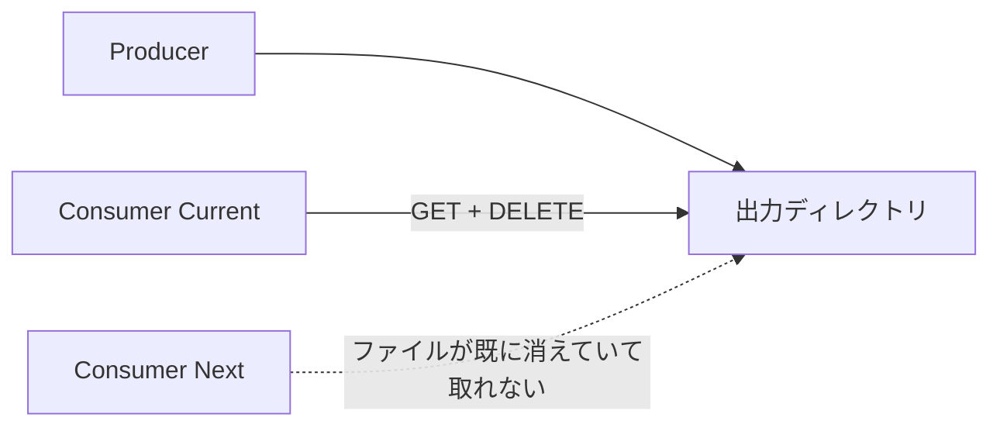
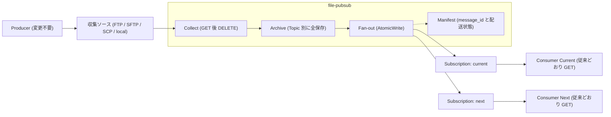

# file-pubsub

FTP GET/DELETE 型のレガシーファイル IF を Pub/Sub 風の配信モデルへ変換する軽量ブリッジ。

Go 実装のシングルバイナリ (Linux 主対象 + macOS、Docker イメージあり) で、Producer・Consumer とも改修不要。MIT ライセンス。

## 課題と解決

Producer がニアリアルタイムにファイルを出力し、Consumer が FTP GET → DELETE で取り込むレガシーファイル IF では、**先に取得した側がファイルを消すため、複数 Consumer の並行稼働ができません**。システム更改 (Current/Next 並行稼働) や Consumer 追加 (DWH / BI / AI への展開) の障害になります。



file-pubsub は収集ソースと Consumer の間に入り、**Collect → Archive → Fan-out** で同じファイルを全 Subscription へ独立に配信します。Producer は変更不要、Consumer も従来どおり自分の Subscription ディレクトリからファイルを GET するだけです。



## 基本モデル

| 概念 | 説明 |
|---|---|
| **Topic** | Producer が出力する論理的なファイル種別 (orders / customers / invoices 等)。Topic ごとに収集ソースを設定する |
| **Subscription** | Consumer ごとの配送先ディレクトリ (current / next / test 等)。配送は Subscription ごとに独立し、一方の取り込み・削除が他方に影響しない |
| **Archive** | 収集した全ファイルを Topic 別に必ず保存する。再送 (Replay)・監査・障害復旧・差分比較の基盤。配送が決着 (delivered / dlq) したメッセージの Archive を保持期間 (retention) 超過時に削除する。未決着 (failed / delivering / retrying) 分は削除しない |
| **Fan-out** | Archive から各 Subscription ディレクトリへ複製する。一時名で書き込んでから rename する (Consumer が途中状態を読まない) |
| **Manifest** | メッセージ (収集ファイル) ごとの message_id / topic / Subscription 別配送状態 (delivered / failed / dlq) の履歴。message_id は収集時刻 + Topic + 元ファイル名から採番し、同名ファイルの再出力も履歴を失わない。同名ファイルが別メッセージとして収集される条件: delete モードは収集ソースに存在するファイルを常に新メッセージとして収集する / copy モードは mtime またはサイズの変化が必要 (処理済みキーはファイル名 + mtime + サイズ) |

Fan-out 配信は **at-least-once** です。クラッシュ後の再開などで同一ファイルが Subscription ディレクトリへ再配置されることがあるため、Consumer は同名ファイルの再取得を許容してください (従来の FTP 再送と同じ前提)。

配信失敗はリトライし、規定回数を超えたら DLQ へ隔離して Manifest に記録します。メッセージの順序保証はしません (従来の FTP GET と同じく取り込み順序は Consumer の責任)。

## Quick Start

### インストール

ビルド済みバイナリ ([GitHub Releases](https://github.com/suwa-sh/file-pubsub/releases)。linux/darwin × amd64/arm64):

```bash
curl -fsSL https://github.com/suwa-sh/file-pubsub/releases/latest/download/file-pubsub_<version>_linux_amd64.tar.gz | tar xz
```

コンテナイメージ (ghcr.io):

```bash
docker pull ghcr.io/suwa-sh/file-pubsub:latest
```

ソースからビルドする場合 (Go 1.26+):

```bash
go build -o file-pubsub ./cmd/file-pubsub
```

`config.yaml` を用意します (最小例):

```yaml
polling_interval: 60     # 秒
archive_retention: 90    # 日
retry_max_count: 5
metrics_port: 9090

topics:
  - name: orders
    source:
      type: sftp
      host: legacy-host01
      directory: /out/orders
      auth:
        username: producer
        password: ${SFTP_PASSWORD}   # 環境変数参照を推奨
      stability_check:
        interval: 10                 # 秒 (書き込み完了の安定待ち)
      exclude_patterns:
        - "*.tmp"
    subscriptions:
      - name: current
        directory: /data/subscriptions/orders/current
      - name: next
        directory: /data/subscriptions/orders/next
```

検証して起動します:

```bash
./file-pubsub config validate --config config.yaml
./file-pubsub serve --config config.yaml
```

### Docker (動作確認環境)

file-pubsub + 収集元 SFTP/FTP サーバの一式を docker compose で起動できます。Windows (Docker Desktop) での確認手順を含む詳細は [examples/docker-compose/README.md](examples/docker-compose/README.md) を参照してください。

```bash
cd examples/docker-compose
docker compose up -d --build
echo "id,qty" > sources/sftp/orders_20260612.csv   # producer 役: ファイル投入
ls data/subscriptions/orders/current                # 15 秒ほどで複製される
docker compose down
```

## CLI リファレンス

単一バイナリのサブコマンドとして提供します (Web UI・HTTP API はありません)。

| コマンド | 説明 |
|---|---|
| `serve --config <path>` | 常駐デーモンを起動。ポーリング収集 → Archive → Fan-out → リトライ/DLQ → retention を周期実行し、`/metrics`・`/healthz` を公開する。二重起動は Lock で防止 (stale lock からは自動回復)。SIGTERM/SIGINT で graceful shutdown (処理中サイクルを完了してから停止) |
| `status --config <path> [--topic T] [--subscription S] [--status delivered\|failed\|dlq]` | Manifest から配送状況を一覧表示する。`--status dlq` (subscription 指定なし) は DLQ 隔離一覧 (隔離理由・失敗回数) を表示する |
| `replay --config <path> --topic T (--from YYYY-MM-DD --to YYYY-MM-DD \| --message-id ID) --subscription S` | Archive から期間またはメッセージ指定で宛先 Subscription へ再送する。Replay も Manifest に記録される。**serve 停止中に実行する**: serve と同じ Lock を取得して Manifest への二重書き込みを防止するため、serve 稼働中はエラー (終了コード 3) になる |
| `config validate --config <path>` | 設定 YAML を検証し、全違反を「キーパス + 原因 + 対処」で報告する |

終了コード:

| コード | 意味 |
|---|---|
| 0 | 正常終了 |
| 1 | 実行時エラー |
| 2 | 設定・引数エラー (validate 失敗を含む) |
| 3 | 二重起動 (既に serve が動作中) |

## 設定リファレンス

単一 YAML ファイルで全設定を行います。文字列値の中の `${ENV_VAR}` は起動時に環境変数で展開されます (未定義ならエラー)。

| キー | 必須 | 説明 |
|---|---|---|
| `polling_interval` | ✓ | ポーリング間隔 (秒)。前回サイクル完了を待ち多重実行しない |
| `archive_retention` | ✓ | Archive 保持日数。配送が決着 (delivered / dlq) したメッセージのみ、超過分が削除される (未決着分は削除されず、スキップがログに記録される) |
| `retry_max_count` | ✓ | 配信リトライ上限。超えたメッセージは DLQ へ隔離 |
| `metrics_port` | ✓ | `/metrics`・`/healthz` の HTTP ポート |
| `data_dir` | - | archive / manifest / work / dlq 等のデータルート。省略時は config.yaml のあるディレクトリ |
| `topics[].name` | ✓ | Topic 名 (一意) |
| `topics[].description` | - | 説明 |
| `topics[].source.type` | ✓ | `local` / `ftp` / `sftp` / `scp` |
| `topics[].source.host` | リモート時 ✓ | 収集元ホスト |
| `topics[].source.port` | - | ポート。省略 (0) はプロトコル既定 (ftp 21 / sftp・scp 22) |
| `topics[].source.directory` | ✓ | 収集元ディレクトリ |
| `topics[].source.original_file_handling` | - | `delete` (GET 後 DELETE、既定) / `copy` (残す。処理済み管理で重複収集を防ぐ) |
| `topics[].source.stability_check.interval` | ✓ | 安定待ち間隔 (秒)。サイズ・更新時刻がこの間隔で不変になるまで収集しない (書き込み中ファイルの保護) |
| `topics[].source.exclude_patterns` | - | 除外 glob パターン (例 `*.tmp`) |
| `topics[].source.auth.username` | リモート時 ✓ | 接続ユーザ |
| `topics[].source.auth.password` | - | パスワード。**`${ENV_VAR}` 参照を推奨** (YAML 平文も可)。sftp/scp で鍵がパスフレーズ付きの場合はパスフレーズとしても使われる |
| `topics[].source.auth.key_file` | - | SSH 秘密鍵ファイルパス (sftp / scp)。**パスワードより鍵ファイルを推奨**。password / key_file のどちらかが必須 (リモート時) |
| `topics[].subscriptions[].name` | ✓ | Subscription 名 (Topic 内で一意) |
| `topics[].subscriptions[].directory` | ✓ | 配送先ディレクトリ (file-pubsub 稼働サーバ上のローカルパス) |

## 観測 (/metrics・/healthz)

`serve` は `metrics_port` で Prometheus 形式の `/metrics` と死活監視用 `/healthz` (常に `200 ok`) を公開します。しきい値判定・アラート発報は Prometheus / Grafana 等の外部監視基盤の責務です。

| メトリクス | 型 | ラベル | 説明 |
|---|---|---|---|
| `file_pubsub_last_collect_timestamp_seconds` | gauge | topic | 最後に収集サイクルが成功した Unix 時刻 |
| `file_pubsub_processed_total` | counter | topic | 処理 (収集) したメッセージ数 |
| `file_pubsub_delivery_failure_total` | counter | topic | Subscription 配信の失敗回数 |
| `file_pubsub_dlq_count` | gauge | topic | DLQ に隔離中のメッセージ数 |
| `file_pubsub_backlog_count` | gauge | topic | 未配送 (滞留) のメッセージ数 |

値はメモリ保持のみで、再起動でリセットされます (履歴は監視基盤側で保持)。Grafana / Prometheus のアラートルール例:

```yaml
groups:
  - name: file-pubsub
    rules:
      - alert: FilePubsubCollectStalled
        expr: time() - file_pubsub_last_collect_timestamp_seconds > 3600
        for: 5m
        annotations:
          summary: "topic {{ $labels.topic }} の収集が 1 時間以上止まっている"
      - alert: FilePubsubDLQ
        expr: file_pubsub_dlq_count > 0
        annotations:
          summary: "topic {{ $labels.topic }} に DLQ 隔離メッセージがある (replay での再送を検討)"
      - alert: FilePubsubDeliveryFailing
        expr: increase(file_pubsub_delivery_failure_total[15m]) > 0
        annotations:
          summary: "topic {{ $labels.topic }} で配信失敗が発生している"
```

## セキュリティ注記

- **FTP は平文です。** 認証情報もファイル内容も暗号化されずにネットワークを流れます。信頼できるネットワークセグメント内に限定し、サーバが対応していれば sftp を選んでください。
- **SSH ホストキー検証は行いません (sftp / scp)。** 設定スキーマにホストキー情報を持たないため、接続時は `InsecureIgnoreHostKey` 相当で受け入れます。経路上の中間者が収集元サーバになりすませるリスクがあるため、file-pubsub は収集元と同じ信頼できるネットワーク内で稼働させてください。
- **SCP コネクタの前提。** SCP はリモートでシェルコマンド (find / stat / cat / rm) を実行するため、接続ユーザにシェルが必要で、サーバ側に GNU coreutils の `stat` (`stat -c`。BSD 系非互換) を要求します。改行を含むファイル名には対応しません。サーバが対応していれば SFTP を推奨します。
- **認証情報は `${ENV_VAR}` 参照と鍵ファイルを推奨します。** YAML への平文記述は許容されますが、設定ファイルの取り扱いに注意してください。
- **ファイル内容は pass-through です。** file-pubsub は内容を解釈・変換・暗号化しません。個人情報等を含むファイルの暗号化・マスキング・規制対応は導入先の責務です。
- アクセス制御は OS のファイル権限・実行ユーザに依存します。データディレクトリと Subscription ディレクトリの権限を適切に設定してください。

## ユースケース

### 1. システム更改 (Current/Next 並行稼働)

同じ Topic に current / next の Subscription を並べ、新旧 Consumer を同時稼働して切替リスクを下げます。

```yaml
topics:
  - name: orders
    source:
      type: sftp
      host: legacy-host01
      directory: /out/orders
      auth: { username: producer, key_file: /etc/file-pubsub/orders.key }
      stability_check: { interval: 10 }
    subscriptions:
      - { name: current, directory: /data/subscriptions/orders/current }  # 現行システム
      - { name: next,    directory: /data/subscriptions/orders/next }     # 更改後システム
```

```bash
# next を追加した設定を検証してデーモンを再起動 (graceful: 処理中メッセージを完了してから停止)
./file-pubsub config validate --config config.yaml
systemctl restart file-pubsub   # または kill -TERM <pid> → serve 再実行

# 並行稼働中: 両系へ配信されていることを確認
./file-pubsub status --config config.yaml --topic orders
```

切替完了後は `next` を `current` に読み替えて旧側の Subscription を設定から削除するだけです。Producer は一切変更しません。

### 2. Consumer 追加 (会計 / DWH / BI / AI への展開)

新しい取り込み先は Subscription を 1 行足すだけです。追加した Subscription には**追加以降に収集されたメッセージ**が配信されます (過去分が必要なら次の Replay を併用)。

```yaml
    subscriptions:
      - { name: current, directory: /data/subscriptions/orders/current }
      - { name: dwh,     directory: /data/subscriptions/orders/dwh }      # 追加
```

```bash
./file-pubsub config validate --config config.yaml && systemctl restart file-pubsub

# 過去 30 日分を新 Subscription へ流し込む場合 (serve 停止中に実行)
systemctl stop file-pubsub
./file-pubsub replay --config config.yaml --topic orders \
  --from 2026-05-13 --to 2026-06-12 --subscription dwh
systemctl start file-pubsub
```

### 3. 再送 (Replay)

「先月分を再投入したい」「DLQ に落ちた 1 件をやり直したい」を Archive から行います。replay は manifest を書くため **serve 停止中に実行**します (稼働中は lock により exit 3)。

```bash
systemctl stop file-pubsub

# 期間指定: 先月分を current へ再投入
./file-pubsub replay --config config.yaml --topic orders \
  --from 2026-05-01 --to 2026-05-31 --subscription current

# メッセージ指定: DLQ 隔離分を確認してから 1 件だけ再送
./file-pubsub status --config config.yaml --status dlq
./file-pubsub replay --config config.yaml --topic orders \
  --message-id 20260601T091500_orders_orders_20260601.csv --subscription current

systemctl start file-pubsub

# 再送結果は Manifest に記録される (REPLAY 列が replay になる)
./file-pubsub status --config config.yaml --topic orders
```

### 4. 処理速度差の吸収 (即時取り込みと夜間バッチの同居)

設定はユースケース 2 と同じです。Subscription ごとに配送が独立しているため、current が数分おきにファイルを取得・削除しても、dwh のファイルは夜間バッチが取りに来るまでそのまま残ります。追加の設定は不要で、滞留はメトリクスで観測できます:

```bash
curl -s http://localhost:9090/metrics | grep file_pubsub_backlog_count
# file_pubsub_backlog_count{topic="orders"} 0   ← 全 Subscription 配信済み
```

### 5. Messaging 移行の橋渡し

Topic / Subscription / Replay / DLQ の概念は Kafka / RabbitMQ / Google Pub/Sub と一致します。将来メッセージング基盤へ移行するとき、運用の語彙と手順 (購読の追加 = Subscription 追加、障害時の再投入 = Replay、毒メッセージの隔離 = DLQ) を先にファイルベースで組織に定着させておけます。

| file-pubsub | Kafka | Google Pub/Sub |
|---|---|---|
| Topic | topic | topic |
| Subscription | consumer group | subscription |
| Replay (Archive から再送) | offset 巻き戻し | seek / replay |
| DLQ (`dlq/{topic}/`) | DLQ topic | dead-letter topic |

### 補足: 複数システム (複数 Topic) をまとめて扱う

Topic は収集ソースを個別に持てるため、別システム・別サーバの IF を 1 デーモンに束ねられます。topic 間は独立しており、一方の収集元サーバ障害は他方に波及しません (メトリクス・status・replay も topic 単位)。

```yaml
topics:
  - name: sales-orders        # システムA: SFTP で回収
    source: { type: sftp, host: sales-host01, directory: /out/orders,
              auth: { username: producer, key_file: /etc/file-pubsub/sales.key },
              stability_check: { interval: 10 } }
    subscriptions:
      - { name: current, directory: /data/subscriptions/sales-orders/current }
  - name: billing-invoices    # システムB: FTP・元ファイルは残す
    source: { type: ftp, host: billing-host01, directory: /export/invoices,
              auth: { username: producer, password: "${BILLING_FTP_PASSWORD}" },
              original_file_handling: copy, stability_check: { interval: 30 } }
    subscriptions:
      - { name: current, directory: /data/subscriptions/billing-invoices/current }
      - { name: dwh,     directory: /data/subscriptions/billing-invoices/dwh }
```

ポーリング間隔・retention・運用主体をシステムごとに分けたい場合は、config / `data_dir` / `metrics_port` を分けて複数デーモンを並走させます (Lock は `data_dir` 単位)。

## 設計ドキュメント

| ドキュメント | 内容 |
|---|---|
| [docs/usdm](docs/usdm) | 要求仕様 (USDM) |
| [docs/rdra](docs/rdra) | 要件定義モデル (RDRA) |
| [docs/nfr](docs/nfr) | 非機能要求 |
| [docs/arch](docs/arch) | アーキテクチャ設計 |
| [docs/specs](docs/specs) | 機能仕様 (ユースケース別 tier 仕様) |

## License

[MIT](LICENSE) — Copyright (c) 2026 suwa-sh
