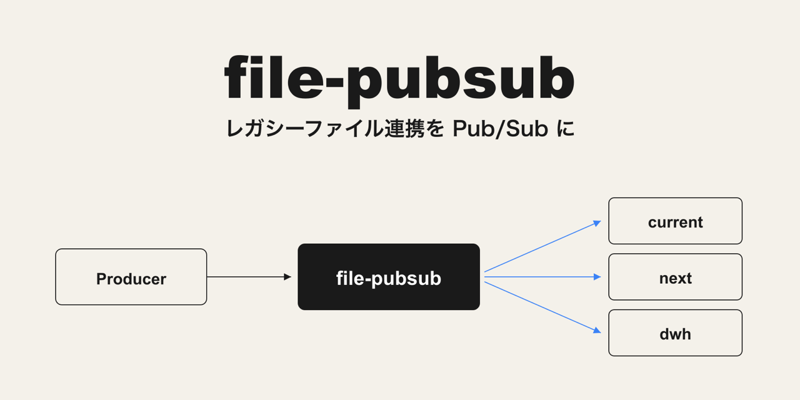
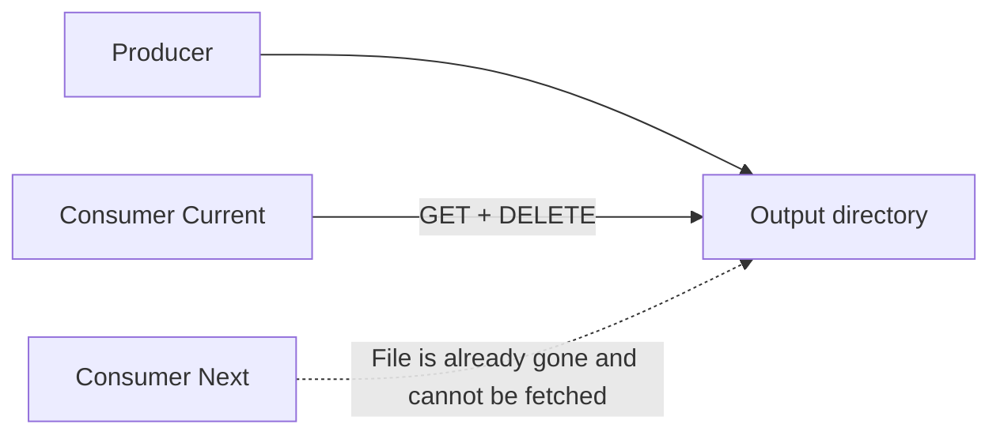
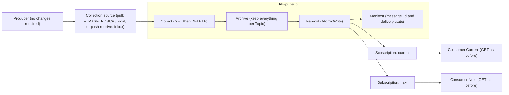

# file-pubsub

[](https://github.com/suwa-sh/file-pubsub/actions/workflows/ci.yml)
[](https://github.com/suwa-sh/file-pubsub/releases)
[](go.mod)
[](https://github.com/suwa-sh/file-pubsub/pkgs/container/file-pubsub)
[](LICENSE)

**English** | [日本語](README.ja.md)



A lightweight bridge that turns legacy FTP GET/DELETE-style file interfaces into a Pub/Sub-like delivery model.

Implemented in Go as a single binary (primarily targeting Linux, plus macOS; a Docker image is available). No changes are required to either Producers or Consumers. MIT licensed.

## Problem and Solution

In a legacy file interface where a Producer writes files in near real time and a Consumer ingests them via FTP GET → DELETE, **whichever side fetches a file first deletes it, so multiple Consumers cannot run in parallel**. This becomes a blocker for system migrations (running Current/Next in parallel) and for adding new Consumers (feeding a DWH, BI, or AI pipeline).



file-pubsub sits between the collection source and the Consumers, and delivers the same file to every Subscription independently via **Collect → Archive → Fan-out**. The Producer needs no changes, and each Consumer keeps doing what it always did: GET files from its own Subscription directory.



## Core Model

| Concept | Description |
|---|---|
| **Topic** | A logical file type produced by the Producer (orders / customers / invoices, etc.). Each Topic has its own collection source configuration |
| **Subscription** | A delivery directory per Consumer (current / next / test, etc.). Delivery is independent per Subscription: one Consumer ingesting and deleting files never affects another |
| **Archive** | Every collected file is always stored per Topic. It is the foundation for resends (Replay), auditing, disaster recovery, and diffing. Archived copies of messages whose delivery is settled (delivered / dlq) are deleted once they exceed the retention period; unsettled ones (failed / delivering / retrying) are never deleted |
| **Fan-out** | Copies files from the Archive into each Subscription directory. Files are written under a temporary name and then renamed, so Consumers never see a partially written file |
| **Manifest** | Per-message (per collected file) history of message_id / topic / delivery state per Subscription (delivered / failed / dlq). The message_id is derived from the collection time + Topic + original file name, so re-emitting a file with the same name never loses history. Conditions under which a same-named file is collected as a new message: in delete mode, any file present at the collection source is always collected as a new message; in copy mode, the mtime or size must have changed (the processed-file key is file name + mtime + size) |

Fan-out delivery is **at-least-once**. After a crash and restart, the same file may be placed into a Subscription directory again, so Consumers must tolerate re-fetching a file with the same name (the same assumption as a conventional FTP resend).

Failed deliveries are retried; once the retry limit is exceeded, the message is quarantined in the DLQ and recorded in the Manifest. Message ordering is not guaranteed (as with conventional FTP GET, ingestion order is the Consumer's responsibility).

## Quick Start

### Installation

Prebuilt binaries ([GitHub Releases](https://github.com/suwa-sh/file-pubsub/releases); linux/darwin × amd64/arm64):

```bash
curl -fsSL https://github.com/suwa-sh/file-pubsub/releases/latest/download/file-pubsub_<version>_linux_amd64.tar.gz | tar xz
```

Container image (ghcr.io):

```bash
docker pull ghcr.io/suwa-sh/file-pubsub:latest
```

Go users can also install with `go install`:

```bash
go install github.com/suwa-sh/file-pubsub/cmd/file-pubsub@latest
```

To build from source (Go 1.26+):

```bash
go build -o file-pubsub ./cmd/file-pubsub
```

Prepare a `config.yaml` (minimal example):

```yaml
polling_interval: 60     # seconds
archive_retention: 90    # days
retry_max_count: 5
metrics_port: 9090

topics:
  - name: orders
    source:
      type: sftp
      host: legacy-host01
      directory: /out/orders
      auth:
        username: producer
        password: ${SFTP_PASSWORD}   # environment variable reference recommended
      stability_check:
        interval: 10                 # seconds (wait for writes to settle)
      exclude_patterns:
        - "*.tmp"
    subscriptions:
      - name: current
        directory: /data/subscriptions/orders/current
      - name: next
        directory: /data/subscriptions/orders/next
```

Validate and start:

```bash
./file-pubsub config validate --config config.yaml
./file-pubsub serve --config config.yaml
```

For running as a long-lived service (systemd), see the sample unit file at [examples/systemd/file-pubsub.service](examples/systemd/file-pubsub.service) (includes `TimeoutStopSec` for graceful shutdown, how to pass environment variables, and hardening settings).

### Docker (trial environment)

You can spin up file-pubsub together with source SFTP/FTP servers via docker compose. For details, including verification steps on Windows (Docker Desktop), see [examples/docker-compose/README.md](examples/docker-compose/README.md).

```bash
cd examples/docker-compose
docker compose up -d --build
echo "id,qty" > sources/sftp/orders_20260612.csv   # acting as the producer: drop a file
ls data/subscriptions/orders/current                # replicated within ~15 seconds
docker compose down
```

## CLI Reference

Provided as subcommands of a single binary (there is no Web UI or HTTP API).

| Command | Description |
|---|---|
| `serve --config <path>` | Starts the resident daemon. Periodically runs polling collection → Archive → Fan-out → retry/DLQ → retention, and exposes `/metrics` and `/healthz`. Duplicate startup is prevented by a Lock (recovers automatically from a stale lock). SIGTERM/SIGINT triggers graceful shutdown (the in-flight cycle completes before stopping) |
| `status --config <path> [--topic T] [--subscription S] [--status delivered\|failed\|dlq]` | Lists delivery status from the Manifest. `--status dlq` (without a subscription) shows the DLQ quarantine list (quarantine reason and failure count) |
| `replay --config <path> --topic T (--from YYYY-MM-DD --to YYYY-MM-DD \| --message-id ID) --subscription S` | Resends from the Archive, by date range or by message, to the target Subscription. Replays are also recorded in the Manifest. **Run while serve is stopped**: it acquires the same Lock as serve to prevent concurrent writes to the Manifest, so it fails (exit code 3) while serve is running |
| `config validate --config <path>` | Validates the configuration YAML and reports all violations as "key path + cause + remedy" |

Exit codes:

| Code | Meaning |
|---|---|
| 0 | Success |
| 1 | Runtime error |
| 2 | Configuration / argument error (including validate failures) |
| 3 | Duplicate startup (serve is already running) |

## Configuration Reference

All configuration lives in a single YAML file. `${ENV_VAR}` inside string values is expanded from environment variables at startup (an undefined variable is an error).

| Key | Required | Description |
|---|---|---|
| `polling_interval` | ✓ | Polling interval in seconds. Waits for the previous cycle to complete; cycles never overlap |
| `archive_retention` | ✓ | Archive retention in days. Only messages whose delivery is settled (delivered / dlq) are deleted once they exceed the retention period (unsettled messages are kept, and the skip is logged) |
| `retry_max_count` | ✓ | Delivery retry limit. Messages exceeding it are quarantined in the DLQ |
| `metrics_port` | ✓ | HTTP port for `/metrics` and `/healthz` |
| `data_dir` | - | Data root for archive / manifest / work / dlq, etc. Defaults to the directory containing config.yaml |
| `topics[].name` | ✓ | Topic name (unique) |
| `topics[].description` | - | Description |
| `topics[].source.type` | ✓ | Pull: `local` / `ftp` / `sftp` / `scp` (file-pubsub fetches with List → Fetch → Delete). Push receive: `inbox` (the Producer puts files directly into a receive directory; see [Collection modes](#collection-modes-pull-vs-push-receive)) |
| `topics[].source.host` | ✓ for remote | Source host (remote pull only; not used by `local` / `inbox`) |
| `topics[].source.port` | - | Port. Omitted (0) means the protocol default (ftp 21 / sftp and scp 22) |
| `topics[].source.directory` | ✓ | Source directory. For `inbox`, the receive directory the Producer puts files into |
| `topics[].source.original_file_handling` | - | `delete` (DELETE / remove from the receive directory after archiving, default) / `copy` (keep originals; processed-file tracking prevents duplicate collection) |
| `topics[].source.stability_check.interval` | ✓ for pull / inbox stability | Stability-wait interval in seconds. A file is not collected until its size and mtime stay unchanged for this interval (protects files still being written). Not required for `inbox` with `completion.mode` rename / marker |
| `topics[].source.exclude_patterns` | - | Exclusion glob patterns (e.g. `*.tmp`) |
| `topics[].source.completion.mode` | - | **`inbox` only.** Write-completion detection: `stability` (default; same size/mtime wait as pull) / `rename` (collect once the final name appears) / `marker` (collect once the done marker appears) |
| `topics[].source.completion.suffix` | - | **`inbox` only.** Suffix used by `rename` (temp extension) / `marker` (marker extension), matched to the Producer's convention. Default `.tmp` for rename, `.done` for marker; unused for stability |
| `topics[].source.fallback_poll_interval` | - | **`inbox` only.** Fallback polling interval in seconds for when fsnotify events are missed (NFS/SMB). Defaults to `polling_interval` |
| `topics[].source.auth.username` | ✓ for remote | Connection user |
| `topics[].source.auth.password` | - | Password. **`${ENV_VAR}` reference recommended** (plain text in YAML is allowed). For sftp/scp, it is also used as the passphrase when the key is passphrase-protected |
| `topics[].source.auth.key_file` | - | SSH private key file path (sftp / scp). **A key file is recommended over a password**. Either password or key_file is required (for remote sources) |
| `topics[].subscriptions[].name` | ✓ | Subscription name (unique within a Topic) |
| `topics[].subscriptions[].directory` | ✓ | Delivery directory (a local path on the server running file-pubsub) |
| `high_availability` | - | Block that enables a redundant (active/standby auto-failover) deployment. **When omitted, the conventional single-instance mode applies** (PID-based double-start prevention only). See [High Availability](#high-availability-activestandby-auto-failover) |
| `high_availability.uniqueness_method` | - | Uniqueness guarantee: `lease` (default; file-pubsub alone, a standby auto-promotes on TTL expiry) / `external_cluster` (delegated to an external cluster's fencing, e.g. Pacemaker/keepalived) |
| `high_availability.lease_ttl` | - | Lease validity (seconds). Default `90`. A lease past `renewed_at + ttl` is treated as stale and is eligible for takeover. **Set it well above the NFS attribute cache (actimeo, up to 60s by default)** |
| `high_availability.heartbeat_interval` | - | Interval (seconds) at which the active renews `renewed_at`. Default `lease_ttl / 3`. Must be below `lease_ttl` |

### Collection modes: pull vs push receive

Each Topic chooses one of two collection modes (the downstream Archive / Fan-out / Manifest / Retry / Retention is identical regardless of mode):

- **Pull** (`type: local | ftp | sftp | scp`): file-pubsub fetches from the source every `polling_interval` (List → Fetch → Delete).
- **Push receive** (`type: inbox`): the Producer puts files directly into `directory`, and file-pubsub ingests them with an **fsnotify event-driven + low-frequency fallback polling** hybrid (works regardless of the underlying FS — local disk / NFS / SMB; no `trigger` key, always hybrid). Write-completion is detected by `completion.mode`:
  - `stability` — wait until size/mtime stop changing (default).
  - `rename` — the Producer writes `xxx.csv.tmp` then renames to `xxx.csv`; the final name triggers collection (the temp name is ignored). The temp suffix is `completion.suffix` (default `.tmp`).
  - `marker` — the Producer puts `xxx.csv` then a marker `xxx.csv.done`; the marker triggers collection of `xxx.csv` (the marker itself is never delivered, and is cleaned up with the body). The marker suffix is `completion.suffix` (default `.done`).

`completion.suffix` lets you match an existing Producer's convention (e.g. `.part`, `.ok`) **without changing the Producer** — so you can switch a feed to file-pubsub just by repointing it.

```yaml
topics:
  - name: receipts
    source:
      type: inbox
      directory: /inbox/receipts
      completion:
        mode: marker      # stability (default) / rename / marker
        suffix: .done      # default .done for marker; set to your Producer's convention (e.g. .ok)
      # fallback_poll_interval: 30   # omit to reuse polling_interval
    subscriptions:
      - name: current
        directory: /pub/receipts/current
```

## Observability (/metrics and /healthz)

`serve` exposes Prometheus-format `/metrics` and a liveness endpoint `/healthz` (always `200 ok`) on `metrics_port`. Threshold evaluation and alerting are the responsibility of an external monitoring stack such as Prometheus / Grafana.

| Metric | Type | Labels | Description |
|---|---|---|---|
| `file_pubsub_last_collect_timestamp_seconds` | gauge | topic | Unix time of the last successful collection cycle |
| `file_pubsub_processed_total` | counter | topic | Number of messages processed (collected) |
| `file_pubsub_delivery_failure_total` | counter | topic | Number of failed Subscription deliveries |
| `file_pubsub_dlq_count` | gauge | topic | Number of messages currently quarantined in the DLQ |
| `file_pubsub_backlog_count` | gauge | topic | Number of undelivered (backlogged) messages |

Values are held in memory only and reset on restart (history is kept on the monitoring side). Example Grafana / Prometheus alert rules:

```yaml
groups:
  - name: file-pubsub
    rules:
      - alert: FilePubsubCollectStalled
        expr: time() - file_pubsub_last_collect_timestamp_seconds > 3600
        for: 5m
        annotations:
          summary: "Collection for topic {{ $labels.topic }} has been stalled for over an hour"
      - alert: FilePubsubDLQ
        expr: file_pubsub_dlq_count > 0
        annotations:
          summary: "Topic {{ $labels.topic }} has messages quarantined in the DLQ (consider resending with replay)"
      - alert: FilePubsubDeliveryFailing
        expr: increase(file_pubsub_delivery_failure_total[15m]) > 0
        annotations:
          summary: "Delivery failures are occurring for topic {{ $labels.topic }}"
```

## High Availability (active/standby auto-failover)

Configure `high_availability` to run an active/standby deployment across multiple hosts; a standby auto-promotes when the active fails. **Omit the block to keep the conventional single-instance mode** (PID-based double-start prevention only).

### Topology prerequisites

- **Multiple hosts fronted by a VIP, sharing the same `data_dir` over NFS (v4 recommended).** Exactly one file-operating `serve` process runs at a time (single-writer is preserved).
- **NTP time synchronization.** Lease expiry decisions depend on the clock.
- **Set `lease_ttl` well above the NFS attribute cache** (actimeo, up to 60s by default); too small a TTL risks a false stale takeover through stale cached attributes (a warning is logged for `lease_ttl <= 60`).

### Two uniqueness methods (same binary)

| | Method B: `lease` (default) | Method A: `external_cluster` |
|---|---|---|
| Uniqueness guarantee | file-pubsub alone. The lock becomes a lease record (hostname / boot_id / renewed_at / ttl / generation); the active renews `renewed_at` every `heartbeat_interval`. A standby takes over a lease past `renewed_at + ttl` and auto-promotes | Delegated to an external cluster's **fencing** (Pacemaker / keepalived, etc.). Bundle the VIP and `serve` into the **same resource group** so the cluster runs exactly one node at a time |
| Startup behavior | No lock → acquire and become active. Another host's valid lease → standby (watch for TTL expiry). Stale → take over and promote. Same-host double start → exit code 3 | Always starts active by forcibly taking over any residual lease; no standby polling. After demotion it exits without re-promoting (the cluster drives promotion) |
| Best for | Keeping everything within file-pubsub / avoiding an external cluster | Environments already managing a VIP with Pacemaker / keepalived |

### Split-brain handling

NFS cannot fully implement distributed consensus, so a brief window where the old and new active overlap remains inherent at failover. file-pubsub introduces no heavy consensus machinery (it stays a lightweight single binary) and instead bounds the damage to **"at most one duplicated message (no corruption, no loss)"**, which is within the existing at-least-once tolerance. This is enforced by:

- **Message-boundary lease checks** — before each persistence point (collect / archive / fan-out placement / manifest record / source delete / processed record / resuming an interrupted archive promotion) the active re-checks that it still holds the lease, and if not, stops at that single in-flight message and demotes (fail-closed on check I/O failure too).
- **Per-message_id manifest lock + generation CAS + merge precedence** — delivery-state updates are serialized per message_id and never roll back a settled state (delivered / dlq).

### Configuration examples

```yaml
# Method B: lease auto-takeover (file-pubsub alone)
high_availability:
  uniqueness_method: lease   # default
  lease_ttl: 90              # seconds; well above the NFS actimeo (default 90)
  heartbeat_interval: 30     # seconds; default lease_ttl/3

# Method A: external cluster delegation (Pacemaker / keepalived)
high_availability:
  uniqueness_method: external_cluster
  lease_ttl: 90              # recorded for observability; the cluster drives promotion
```

For Method A, configure the external cluster to start/stop the VIP and `serve` as one resource group (e.g. make the systemd unit a cluster resource).

### Notes by collection mode

- **Pull (sftp / ftp / scp / local)**: whichever node is active pulls from the same source, so it is independent of the VIP and stays simple. Only the lease holder collects and archives.
- **Push receive (inbox)**: producers put to the VIP, so either **bundle the VIP and `serve` into one resource (Method A)** or make every node's inbox directory point at the same NFS. Mind the window where the VIP lands on a node without `serve`. Since fsnotify does not work over NFS, operation relies on fallback polling (`fallback_poll_interval`).

### Examples

- **Long-lived deployment (systemd)**: [examples/ha-systemd](examples/ha-systemd) — units, configs, and a Pacemaker resource definition for both Method B (lease) and Method A (Pacemaker), with setup steps.
- **Local trial (docker compose)**: [examples/ha-docker-compose](examples/ha-docker-compose) — start two nodes on a shared volume and watch Method B failover (stop the active → the standby auto-promotes) on your machine.

## Security Notes

- **FTP is plaintext.** Both credentials and file contents travel over the network unencrypted. Restrict it to trusted network segments, and prefer sftp if the server supports it.
- **SSH host key verification is not performed (sftp / scp).** The configuration schema has no place for host key information, so connections are accepted with the equivalent of `InsecureIgnoreHostKey`. Since an on-path attacker could impersonate the source server, run file-pubsub inside the same trusted network as the collection sources.
- **SCP connector assumptions.** SCP executes shell commands on the remote side (find / stat / cat / rm), so the connection user needs a shell, and the server must provide GNU coreutils `stat` (`stat -c`; incompatible with BSD variants). File names containing newlines are not supported. SFTP is recommended whenever the server supports it.
- **Use `${ENV_VAR}` references and key files for credentials.** Plain text in YAML is tolerated, but handle the configuration file with care.
- **File contents are passed through as-is.** file-pubsub does not interpret, transform, or encrypt contents. Encryption, masking, and regulatory compliance for files containing personal data, etc. are the adopting organization's responsibility.
- Access control relies on OS file permissions and the executing user. Set appropriate permissions on the data directory and Subscription directories.

## Use Cases

### 1. System migration (running Current/Next in parallel)

Put current and next Subscriptions side by side on the same Topic, and run the old and new Consumers simultaneously to reduce cutover risk.

```yaml
topics:
  - name: orders
    source:
      type: sftp
      host: legacy-host01
      directory: /out/orders
      auth: { username: producer, key_file: /etc/file-pubsub/orders.key }
      stability_check: { interval: 10 }
    subscriptions:
      - { name: current, directory: /data/subscriptions/orders/current }  # current system
      - { name: next,    directory: /data/subscriptions/orders/next }     # post-migration system
```

```bash
# validate the config with next added, then restart the daemon (graceful: in-flight messages complete before stopping)
./file-pubsub config validate --config config.yaml
systemctl restart file-pubsub   # or kill -TERM <pid> then rerun serve

# while running in parallel: confirm delivery to both systems
./file-pubsub status --config config.yaml --topic orders
```

Once the cutover is complete, just treat `next` as the new `current` and remove the old Subscription from the configuration. The Producer never changes.

### 2. Adding Consumers (feeding accounting / DWH / BI / AI)

A new ingestion target is just one extra Subscription line. The added Subscription receives **messages collected after it was added** (use Replay below if you need historical data).

```yaml
    subscriptions:
      - { name: current, directory: /data/subscriptions/orders/current }
      - { name: dwh,     directory: /data/subscriptions/orders/dwh }      # added
```

```bash
./file-pubsub config validate --config config.yaml && systemctl restart file-pubsub

# to backfill the last 30 days into the new Subscription (run while serve is stopped)
systemctl stop file-pubsub
./file-pubsub replay --config config.yaml --topic orders \
  --from 2026-05-13 --to 2026-06-12 --subscription dwh
systemctl start file-pubsub
```

### 3. Resending (Replay)

"Re-feed last month's data" or "retry that one message that landed in the DLQ" — both are done from the Archive. Because replay writes to the manifest, **run it while serve is stopped** (while serve is running, the lock makes it exit with code 3).

```bash
systemctl stop file-pubsub

# by date range: re-feed last month into current
./file-pubsub replay --config config.yaml --topic orders \
  --from 2026-05-01 --to 2026-05-31 --subscription current

# by message: inspect the DLQ quarantine first, then resend just one message
./file-pubsub status --config config.yaml --status dlq
./file-pubsub replay --config config.yaml --topic orders \
  --message-id 20260601T091500_orders_orders_20260601.csv --subscription current

systemctl start file-pubsub

# the replay result is recorded in the Manifest (the REPLAY column becomes replay)
./file-pubsub status --config config.yaml --topic orders
```

### 4. Absorbing speed differences (immediate ingestion alongside nightly batches)

The configuration is the same as use case 2. Because delivery is independent per Subscription, even if current fetches and deletes files every few minutes, the files for dwh stay in place until the nightly batch comes to pick them up. No extra configuration is needed, and the backlog is observable via metrics:

```bash
curl -s http://localhost:9090/metrics | grep file_pubsub_backlog_count
# file_pubsub_backlog_count{topic="orders"} 0   <- delivered to all Subscriptions
```

### 5. Stepping stone toward messaging platforms

The Topic / Subscription / Replay / DLQ concepts map directly to Kafka / RabbitMQ / Google Pub/Sub. When you eventually migrate to a messaging platform, you can establish the operational vocabulary and procedures in your organization first, on a file basis: adding a subscriber = adding a Subscription, re-feeding after an incident = Replay, isolating poison messages = DLQ.

| file-pubsub | Kafka | Google Pub/Sub |
|---|---|---|
| Topic | topic | topic |
| Subscription | consumer group | subscription |
| Replay (resend from Archive) | offset rewind | seek / replay |
| DLQ (`dlq/{topic}/`) | DLQ topic | dead-letter topic |

### Bonus: Handling multiple systems (multiple Topics) together

Each Topic can have its own collection source, so interfaces from different systems on different servers can be bundled into a single daemon. Topics are isolated from each other: an outage of one source server never spills over to another (metrics, status, and replay are all per topic).

```yaml
topics:
  - name: sales-orders        # System A: collected via SFTP
    source: { type: sftp, host: sales-host01, directory: /out/orders,
              auth: { username: producer, key_file: /etc/file-pubsub/sales.key },
              stability_check: { interval: 10 } }
    subscriptions:
      - { name: current, directory: /data/subscriptions/sales-orders/current }
  - name: billing-invoices    # System B: FTP, keep original files
    source: { type: ftp, host: billing-host01, directory: /export/invoices,
              auth: { username: producer, password: "${BILLING_FTP_PASSWORD}" },
              original_file_handling: copy, stability_check: { interval: 30 } }
    subscriptions:
      - { name: current, directory: /data/subscriptions/billing-invoices/current }
      - { name: dwh,     directory: /data/subscriptions/billing-invoices/dwh }
```

If you want separate polling intervals, retention, or operational ownership per system, run multiple daemons with separate configs / `data_dir` / `metrics_port` (the Lock is per `data_dir`).

## Design Documents

Internal documentation (docs/ and code comments) is primarily written in Japanese.

| Document | Contents |
|---|---|
| [docs/README.md](docs/README.md) | Overall navigation of design artifacts (statistics, diagrams, ADRs, event history) |
| [docs/usdm](docs/usdm) | Requirements specification (USDM) |
| [docs/rdra](docs/rdra) | Requirements definition model (RDRA) |
| [docs/nfr](docs/nfr) | Non-functional requirements |
| [docs/arch](docs/arch) | Architecture design |
| [docs/specs](docs/specs) | Functional specifications (per-use-case tier specs) |

## License

[MIT](LICENSE) — Copyright (c) 2026 suwa-sh
