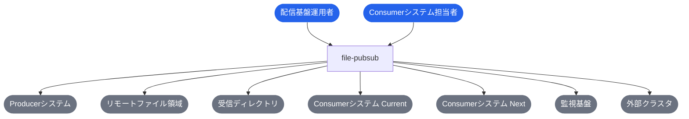
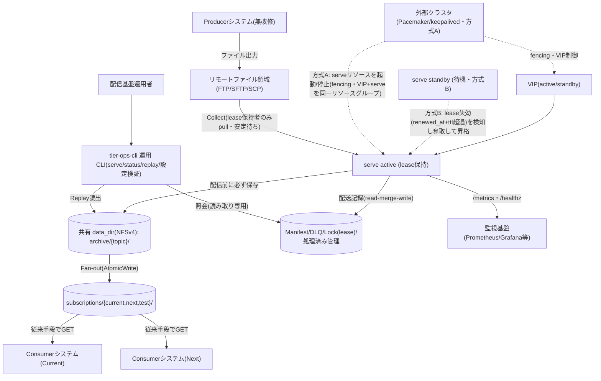
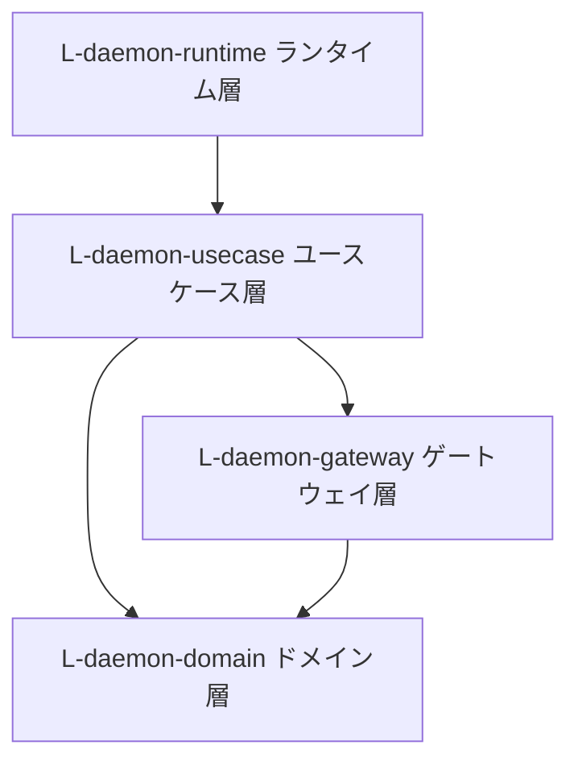
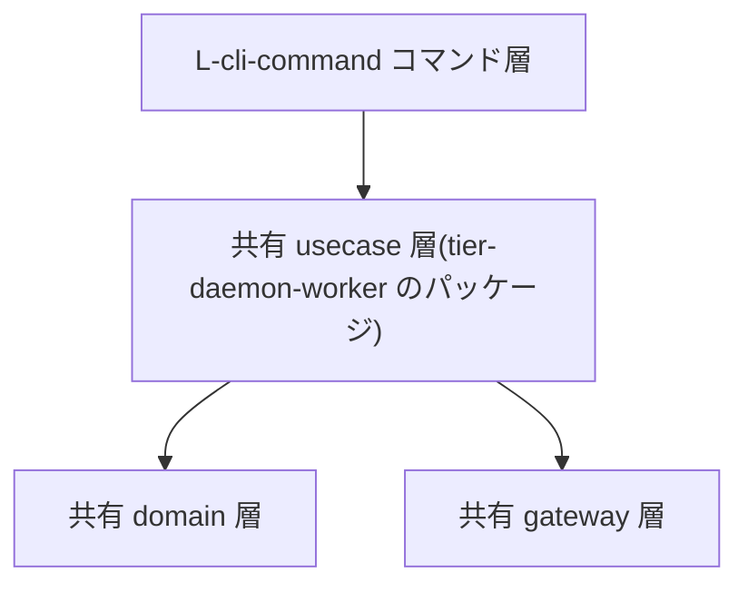

# file-pubsub

> FTP GET/DELETE 型のレガシーファイル IF を、Producer を変更せずに Pub/Sub 風の配信モデル(Topic / Subscription / Archive / Fan-out / Manifest)へ変換する軽量ブリッジ

**最終更新**: 2026-06-20 22:22:15 arch refine failover atomicity (arch)

## 成果物一覧

| ドメイン | 最新 | イベント数 |
|---------|------|-----------:|
| [USDM（要求分解）](#usdm要求分解) | [usdm/latest/](usdm/latest/) | 5 |
| [RDRA（要件定義）](#rdra要件定義) | [rdra/latest/](rdra/latest/) | 5 |
| [NFR（非機能要求）](#nfr非機能要求) | [nfr/latest/](nfr/latest/) | 2 |
| [Arch（アーキテクチャ）](#archアーキテクチャ) | [arch/latest/](arch/latest/) | 4 |
| [Infra（インフラ設計）](#infraインフラ設計) | - | 0 |
| [Design（デザイン）](#designデザイン) | - | 0 |
| [Specs（詳細仕様）](#specs詳細仕様) | [specs/latest/](specs/latest/) | 5 |

## USDM（要求分解）

### 主要な成果物

- [requirements.md](usdm/latest/requirements.md)
- [requirements.yaml](usdm/latest/requirements.yaml)

| 項目 | 値 |
|------|-----|
| 要求数 | 18 |
| 仕様数 | 38 |

## RDRA（要件定義）

### 主要な成果物

- [アクター.tsv](rdra/latest/アクター.tsv)
- [外部システム.tsv](rdra/latest/外部システム.tsv)
- [情報.tsv](rdra/latest/情報.tsv)
- [状態.tsv](rdra/latest/状態.tsv)
- [条件.tsv](rdra/latest/条件.tsv)
- [バリエーション.tsv](rdra/latest/バリエーション.tsv)
- [BUC.tsv](rdra/latest/BUC.tsv)
- [関連データ.txt](rdra/latest/関連データ.txt)
- [ZeroOne.txt](rdra/latest/ZeroOne.txt)
- [システム概要.json](rdra/latest/システム概要.json)

| 項目 | 値 |
|------|-----|
| アクター | 2 |
| 外部システム | 7 |
| 情報 | 13 |
| 状態モデル | 5 |
| 条件 | 13 |
| バリエーション | 10 |
| 業務 | 2 |
| BUC | 5 |
| UC | 19 |

### 外部ツール連携

| ツール | データファイル | 手順 |
|--------|-------------|------|
| [RDRA Graph](https://vsa.co.jp/rdratool/graph/v0.94/) | [関連データ.txt](rdra/latest/関連データ.txt) | ファイル内容をコピーし、RDRA Graph に貼り付け |
| [RDRA Sheet](https://docs.google.com/spreadsheets/d/1h7J70l6DyXcuG0FKYqIpXXfdvsaqjdVFwc6jQXSh9fM/) | [ZeroOne.txt](rdra/latest/ZeroOne.txt) | ファイル内容をコピーし、テンプレートに貼り付け |

### システムコンテキスト図

## NFR（非機能要求）

### 主要な成果物

- [nfr-grade.md](nfr/latest/nfr-grade.md)
- [nfr-grade.yaml](nfr/latest/nfr-grade.yaml)

| 項目 | 値 |
|------|-----|
| モデルシステム | model1 |
| カテゴリ | 6 |
| 重要項目 | 46 |

## Arch（アーキテクチャ）

### 主要な成果物

- [arch-design.md](arch/latest/arch-design.md)
- [arch-design.yaml](arch/latest/arch-design.yaml)
- [coverage-report.md](arch/latest/coverage-report.md)

| 項目 | 値 |
|------|-----|
| 言語 | Go |
| ティア | 2 |
| ポリシー | 8 |
| ルール | 9 |
| エンティティ | 13 |

### コンテナ図（システム構成）

### コンポーネント図（レイヤー依存）

**tier-daemon-worker**

**tier-ops-cli**

## Infra（インフラ設計）

### 主要な成果物

## Design（デザイン）

### 主要な成果物

## Specs（詳細仕様）

### 主要な成果物

- [spec-event.md](specs/latest/spec-event.md)
- [spec-event.yaml](specs/latest/spec-event.yaml)

| 項目 | 値 |
|------|-----|
| UC | 19 |
| API | 2 |

### 横断設計

| 仕様 | ファイル |
|------|---------|
| UX デザイン仕様 | [ux-ui/ux-design.md](specs/latest/_cross-cutting/ux-ui/ux-design.md) |
| UI デザイン仕様 | [ux-ui/ui-design.md](specs/latest/_cross-cutting/ux-ui/ui-design.md) |
| データ可視化仕様 | [ux-ui/data-visualization.md](specs/latest/_cross-cutting/ux-ui/data-visualization.md) |
| 共通コンポーネント設計 | [ux-ui/common-components.md](specs/latest/_cross-cutting/ux-ui/common-components.md) |
| OpenAPI 3.1 | [api/openapi.yaml](specs/latest/_cross-cutting/api/openapi.yaml) |
| トレーサビリティマトリクス | [traceability-matrix.md](specs/latest/_cross-cutting/traceability-matrix.md) |

### ファイル配信業務

**ファイルを収集して配信するフロー**

- [Topic・Subscriptionを設定する](specs/latest/ファイル配信業務/ファイルを収集して配信するフロー/Topic・Subscriptionを設定する/spec.md)
- [ファイルを収集する(Collect)](specs/latest/ファイル配信業務/ファイルを収集して配信するフロー/ファイルを収集する(Collect)/spec.md)
- [Archiveに保存する](specs/latest/ファイル配信業務/ファイルを収集して配信するフロー/Archiveに保存する/spec.md)
- [Subscriptionへ複製配信する(Fan-out)](specs/latest/ファイル配信業務/ファイルを収集して配信するフロー/Subscriptionへ複製配信する(Fan-out)/spec.md)
- [配信失敗をリトライしDLQへ隔離する](specs/latest/ファイル配信業務/ファイルを収集して配信するフロー/配信失敗をリトライしDLQへ隔離する/spec.md)
- [Subscriptionディレクトリからファイルを取得する](specs/latest/ファイル配信業務/ファイルを収集して配信するフロー/Subscriptionディレクトリからファイルを取得する/spec.md)

**ファイルを再送するフロー**

- [配送履歴から再送対象を確認する](specs/latest/ファイル配信業務/ファイルを再送するフロー/配送履歴から再送対象を確認する/spec.md)
- [再送(Replay)を実行する](specs/latest/ファイル配信業務/ファイルを再送するフロー/再送(Replay)を実行する/spec.md)
- [Subscriptionディレクトリから再送ファイルを取得する](specs/latest/ファイル配信業務/ファイルを再送するフロー/Subscriptionディレクトリから再送ファイルを取得する/spec.md)

### 配信基盤運用業務

**配信基盤を運用するフロー**

- シングルバイナリ/Dockerイメージを配置する
- [デーモンを起動する](specs/latest/配信基盤運用業務/配信基盤を運用するフロー/デーモンを起動する/spec.md)
- [デーモンをgraceful shutdownで停止する](specs/latest/配信基盤運用業務/配信基盤を運用するフロー/デーモンをgraceful shutdownで停止する/spec.md)
- [保持期間超過のArchiveを削除する](specs/latest/配信基盤運用業務/配信基盤を運用するフロー/保持期間超過のArchiveを削除する/spec.md)
- [冪等に処理を再開する](specs/latest/配信基盤運用業務/配信基盤を運用するフロー/冪等に処理を再開する/spec.md)

**配送状況を確認するフロー**

- [statusコマンドで配送状態を確認する](specs/latest/配信基盤運用業務/配送状況を確認するフロー/statusコマンドで配送状態を確認する/spec.md)
- [DLQ隔離メッセージを確認する](specs/latest/配信基盤運用業務/配送状況を確認するフロー/DLQ隔離メッセージを確認する/spec.md)
- [構造化ログを調査する](specs/latest/配信基盤運用業務/配送状況を確認するフロー/構造化ログを調査する/spec.md)

**配信基盤を監視するフロー**

- /healthzと/metricsをHTTPで公開する
- [外部監視基盤でTopic別メトリクスを観測する](specs/latest/配信基盤運用業務/配信基盤を監視するフロー/外部監視基盤でTopic別メトリクスを観測する/spec.md)

> 2 業務 / 5 BUC / 19 UC

## ADRs（設計判断記録）

| # | ドメイン | 判断 | ステータス |
|---|---------|------|----------|
| 1 | Arch | [ストレージ戦略: 外部 DB を使わずローカルファイルシステムのみ(Manifest=JSON)](arch/events/20260612_154833_arch_initial_build/decisions/arch-decision-001.yaml) | approved |
| 2 | Arch | [実行モデル: 単一バイナリ 2 ティア(常駐デーモン + 運用 CLI)](arch/events/20260612_154833_arch_initial_build/decisions/arch-decision-002.yaml) | approved |
| 3 | Arch | [レイヤリング: runtime/usecase/domain/gateway の 4 層直接依存、IF は収集コネクタのみ](arch/events/20260612_154833_arch_initial_build/decisions/arch-decision-003.yaml) | approved |
| 4 | Arch | [観測戦略: Prometheus pull 型(/metrics + /healthz)、しきい値判定は外部監視基盤の責務](arch/events/20260612_154833_arch_initial_build/decisions/arch-decision-004.yaml) | approved |
| 5 | Arch | [唯一性保証の二方式併用(方式B lease 自動奪取 + 方式A 外部クラスタ fencing 委譲)を同一バイナリで提供](arch/events/20260620_203907_arch_update_for_redundant_failover/decisions/arch-decision-005.yaml) | approved |
| 6 | Arch | [split-brain 被害を冪等 I/O + メッセージ境界 lease 確認で高々1メッセージ重複に限定し、重い分散ロックを持たない](arch/events/20260620_203907_arch_update_for_redundant_failover/decisions/arch-decision-006.yaml) | approved |
| 7 | Specs | [API スタイル選定: HTTP API は観測専用 2 エンドポイント(Prometheus pull)のみとし、REST CRUD API を設けない](specs/events/20260612_160204_spec_generation/decisions/spec-decision-001.yaml) | approved |
| 8 | Specs | [非同期境界: メッセージング基盤(MQ)を使わず、ディレクトリ + Manifest によるファイルベース Pub/Sub を採用する](specs/events/20260612_160204_spec_generation/decisions/spec-decision-002.yaml) | approved |
| 9 | Specs | [データ永続化: RDB 正規化をせず、ファイルレイアウト + メッセージ別 JSON Manifest を採用する](specs/events/20260612_160204_spec_generation/decisions/spec-decision-003.yaml) | approved |
| 10 | Specs | [push 受信モードの選定: source.type に独立値 inbox を追加し、既存 local を拡張しない](specs/events/20260617_020637_spec_generation/decisions/spec-decision-004.yaml) | approved |
| 11 | Specs | [push 受信モードの取り込みトリガー: fsnotify イベント駆動 + 低頻度フォールバックポーリングのハイブリッド](specs/events/20260617_020637_spec_generation/decisions/spec-decision-005.yaml) | approved |
| 12 | Specs | [完了検知方式を設定で選択(安定判定 / rename / done マーカー)し、既定は安定判定とする](specs/events/20260617_020637_spec_generation/decisions/spec-decision-006.yaml) | approved |
| 13 | Specs | [completion を {mode, suffix} のネスト構造にし、rename/marker のサフィックスを設定可能にする](specs/events/20260617_081425_configurable_completion_suffix/decisions/spec-decision-007.yaml) | approved |
| 14 | Specs | [message_id の同一秒衝突を連番付与で回避し、marker+copy の残存マーカーは新契機にしない](specs/events/20260617_121332_harden_idempotency/decisions/spec-decision-008.yaml) | approved |
| 15 | Specs | [唯一性保証を方式B(lease 自動奪取)と方式A(外部クラスタ委譲/fencing)の二方式併用とし、同一バイナリで両環境をカバーする](specs/events/20260620_171535_add_redundant_failover/decisions/spec-decision-009.yaml) | approved |
| 16 | Specs | [lease 方式の split-brain 被害を、既存の冪等 I/O(AtomicWrite + at-least-once 冪等再開 + fail-closed 照合)で受動的に限定する(被害なし=破損・喪失なし。上限「高々1メッセージ」の能動担保は spec-decision-011)](specs/events/20260620_171535_add_redundant_failover/decisions/spec-decision-010.yaml) | approved |
| 17 | Specs | [split-brain の重複上限「高々1メッセージ」(REQ-016)を、メッセージ境界 lease 確認と Manifest の read-merge-write で実装上維持する(案A)](specs/events/20260620_171535_add_redundant_failover/decisions/spec-decision-011.yaml) | approved |

## イベント履歴

| 日時 | ドメイン | イベントID |
|------|---------|-----------|
| 2026-06-12 15:04:25 | USDM（要求分解） | [20260612_150425_initial_build](usdm/events/20260612_150425_initial_build) |
| 2026-06-12 15:04:25 | RDRA（要件定義） | [20260612_150425_initial_build](rdra/events/20260612_150425_initial_build) |
| 2026-06-12 15:33:53 | NFR（非機能要求） | [20260612_153353_nfr_initial_build](nfr/events/20260612_153353_nfr_initial_build) |
| 2026-06-12 15:48:33 | Arch（アーキテクチャ） | [20260612_154833_arch_initial_build](arch/events/20260612_154833_arch_initial_build) |
| 2026-06-12 16:02:04 | Specs（詳細仕様） | [20260612_160204_spec_generation](specs/events/20260612_160204_spec_generation) |
| 2026-06-17 01:46:53 | USDM（要求分解） | [20260617_014653_add_push_receive_mode](usdm/events/20260617_014653_add_push_receive_mode) |
| 2026-06-17 01:46:53 | RDRA（要件定義） | [20260617_014653_add_push_receive_mode](rdra/events/20260617_014653_add_push_receive_mode) |
| 2026-06-17 02:06:37 | Specs（詳細仕様） | [20260617_020637_spec_generation](specs/events/20260617_020637_spec_generation) |
| 2026-06-17 08:14:25 | USDM（要求分解） | [20260617_081425_configurable_completion_suffix](usdm/events/20260617_081425_configurable_completion_suffix) |
| 2026-06-17 08:14:25 | RDRA（要件定義） | [20260617_081425_configurable_completion_suffix](rdra/events/20260617_081425_configurable_completion_suffix) |
| 2026-06-17 08:14:25 | Specs（詳細仕様） | [20260617_081425_configurable_completion_suffix](specs/events/20260617_081425_configurable_completion_suffix) |
| 2026-06-17 12:13:32 | USDM（要求分解） | [20260617_121332_harden_idempotency](usdm/events/20260617_121332_harden_idempotency) |
| 2026-06-17 12:13:32 | RDRA（要件定義） | [20260617_121332_harden_idempotency](rdra/events/20260617_121332_harden_idempotency) |
| 2026-06-17 12:13:32 | Specs（詳細仕様） | [20260617_121332_harden_idempotency](specs/events/20260617_121332_harden_idempotency) |
| 2026-06-20 17:15:35 | USDM（要求分解） | [20260620_171535_add_redundant_failover](usdm/events/20260620_171535_add_redundant_failover) |
| 2026-06-20 17:15:35 | RDRA（要件定義） | [20260620_171535_add_redundant_failover](rdra/events/20260620_171535_add_redundant_failover) |
| 2026-06-20 17:15:35 | Specs（詳細仕様） | [20260620_171535_add_redundant_failover](specs/events/20260620_171535_add_redundant_failover) |
| 2026-06-20 19:41:14 | NFR（非機能要求） | [20260620_194114_nfr_redundant_failover](nfr/events/20260620_194114_nfr_redundant_failover) |
| 2026-06-20 20:39:07 | Arch（アーキテクチャ） | [20260620_203907_arch_update_for_redundant_failover](arch/events/20260620_203907_arch_update_for_redundant_failover) |
| 2026-06-20 21:36:04 | Arch（アーキテクチャ） | [20260620_213604_arch_refine_redundant_failover](arch/events/20260620_213604_arch_refine_redundant_failover) |
| 2026-06-20 22:22:15 | Arch（アーキテクチャ） | [20260620_222215_arch_refine_failover_atomicity](arch/events/20260620_222215_arch_refine_failover_atomicity) |

---

*このファイルは `generateReadme.js` により自動生成されています。手動編集しないでください。*
