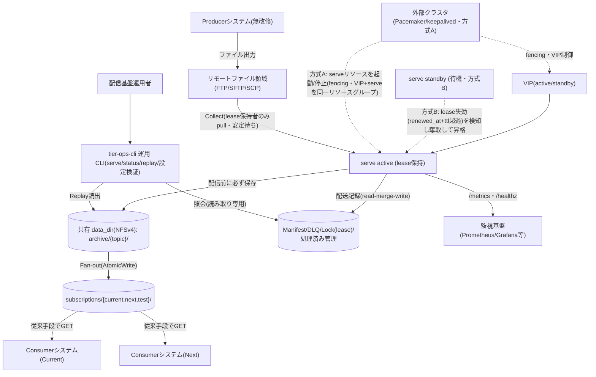
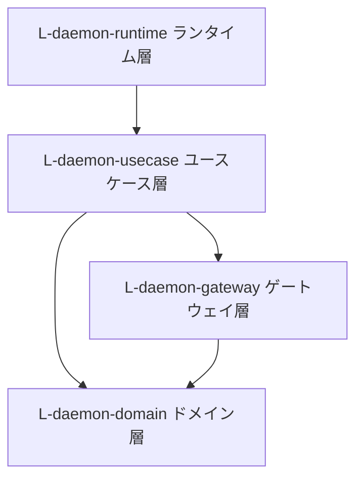
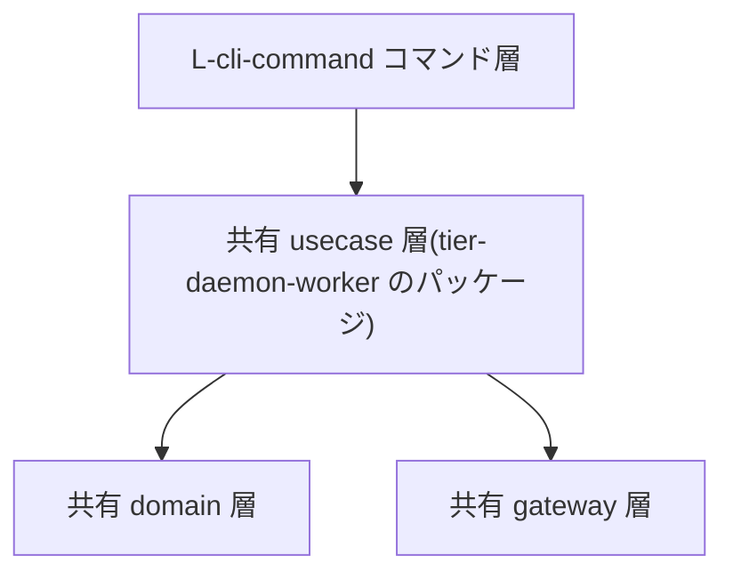
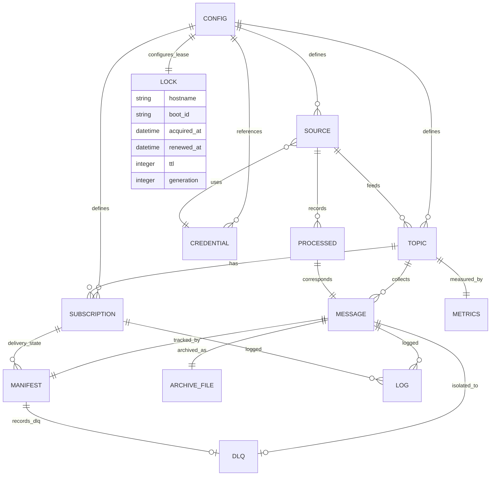

# アーキテクチャ設計書

## 概要

| 項目 | 内容 |
|------|------|
| イベントID | 20260620_203907_arch_update_for_redundant_failover |
| 作成日時 | 2026-06-20T20:39:07 |
| ソース | RDRA 差分 20260620_171535_add_redundant_failover / NFR 変更 20260620_194114_nfr_redundant_failover に基づく冗長構成 active/standby 対応 (trigger_event rdra:20260620_171535_add_redundant_failover, nfr:20260620_194114_nfr_redundant_failover) + arch 差分 20260620_222215_arch_refine_failover_atomicity(codex 3巡目: CTP-010 split-brain に message_id ロック直列化 + lease generation CAS + NFS 既知制約を追記・E-011 Lock に generation 追加・system 図 ACT->STBY を方式B/方式A の 2 経路に分離) |
| 言語 | Go |
| フレームワーク | Go 標準ライブラリ, Prometheus クライアントライブラリ, CLI フレームワーク(サブコマンド), YAML パーサ |
| 技術的制約 | シングルバイナリ配布(追加ランタイム不要), active/standby 冗長構成(VIP + 共有 data_dir。lease 自動奪取 or 外部クラスタ委譲で唯一性を保証), 外部 DB を使わない(ローカル/共有ファイルシステムのみ。共有 data_dir は NFSv4 推奨), オンプレ単一サイト 2 ノード(active/standby)+ Docker(Windows 開発 PC は docker compose で動作確認), Producer・Consumer 無改修(Consumer は従来手段でファイル GET), NTP による時刻同期前提(lease の renewed_at + ttl による stale 判定がノード間時刻に依存) |

## システムアーキテクチャ

### システム構成図

### ティア構成

| ID | ティア名 | 説明 | テクノロジー候補 |
|-----|---------|------|----------------|
| tier-daemon-worker | 常駐デーモン | ポーリングサイクル(Collect→Archive 保存→Fan-out→リトライ/DLQ→retention 削除)を自動実行し、内蔵 HTTP エンドポイント(/metrics Prometheus 形式・/healthz)を公開する常駐プロセス。Lock による二重起動防止・stale lock 回復・graceful shutdown を備える | 常駐プロセス(daemon), ポーリングスケジューラ, 組込 HTTP サーバ |
| tier-ops-cli | 運用 CLI | serve / status / replay / 設定検証のサブコマンドを提供する運用インターフェース。常駐デーモンと同一バイナリで usecase 層を共有する | CLI(サブコマンド) |

### 常駐デーモン (tier-daemon-worker) の方針・ルール

#### 方針

| ID | 方針名 | 内容 | 根拠 | RDRA/NFR 要素 | 確信度 |
|-----|---------|------|------|--------------|:------:|
| SP-001 | Archive 保存必須 | 収集したファイルは配信(Fan-out)の前に必ず archive/ 配下へ Topic 別に保存する。Archive 保存が完了するまで配信を開始しない。Archive への収集時即時保存を実質バックアップとする | 条件「Archive保存必須」が配信前保全を要求しており、NFR A.4.1.1 RPO(Lv4 データ損失なし)・C.1.2.1 バックアップ方式(Lv1 Archive 即時保存)への対応 | 条件: Archive保存必須 / 情報: Archiveファイル / 状態モデル「メッセージ配送状態」 / BUC: ファイルを収集して配信するフロー / NFR A.4.1.1, NFR C.1.2.1 | ユーザー指定 |
| SP-002 | 全 Subscription 同報配信(配送独立) | Topic に収集されたファイルは Topic 配下の全 Subscription ディレクトリへ同一内容で複製する。Subscription ごとに配送は独立し、一方の取得・削除は他方に影響しない。Consumer 更改時の Current/Next 並行稼働・切り戻しを Subscription 並行稼働で実現する | 条件「全Subscription同報配信」と Consumer 更改の並行稼働要件のため。NFR D.2.1.1 移行方式(Lv1 Consumer 切替は Subscription 並行稼働で実施)・D.5.1.1 移行リハーサル(Lv0 並行稼働で代替)への対応 | 条件: 全Subscription同報配信 / 情報: Subscription / 外部システム: Consumerシステム(Current) / 外部システム: Consumerシステム(Next) / NFR D.2.1.1, NFR D.5.1.1 | ユーザー指定 |
| SP-003 | 書き込み完了判定(安定待ち収集) | Producer が書き込み中のファイルは収集しない。サイズ・更新時刻が安定するまで待ち、除外パターンに該当するファイルは対象外とする。リモート GET 中も一時名でダウンロードし完了後に rename する | 条件「書き込み完了判定」が途中状態ファイルの排除を要求し、無改修の Producer 出力(リモートファイル領域)を安全に収集するため | 条件: 書き込み完了判定 / 情報: 収集ソース / 状態モデル「元ファイル収集状態」 / 外部システム: Producerシステム / 外部システム: リモートファイル領域 | ユーザー指定 |
| SP-004 | 元ファイル処理判定(DELETE 既定/copy+処理済み管理) | 収集後の元ファイルは GET 後 DELETE(回収)が既定。Topic 設定で「残す(copy)」を選択した場合は処理済み管理と照合し、処理済みのファイルは再収集しない | 条件「元ファイル処理判定」が回収/残置の 2 方式と重複収集防止を要求するため | 条件: 元ファイル処理判定 / 情報: 処理済み管理 / 情報: 収集ソース / バリエーション: 元ファイル処理方式 | ユーザー指定 |
| SP-005 | Topic 別メトリクス公開 | Topic 別の最終収集時刻・処理件数・配信失敗数・DLQ 件数・滞留数を Prometheus 形式の /metrics で、死活監視用の /healthz を HTTP で公開する。しきい値判定・アラート発報は外部監視基盤の責務とする。HTTP アクセスは監視ポーリングのみでオンライン応答系は対象外 | 情報「メトリクス」と監視基盤連携のため。NFR C.1.1.1 運用監視時間(Lv5 24h 自動監視)・C.1.3.1 監視範囲(Lv3 アプリケーション監視)・C.3.1.1 障害検知方式(Lv2 監視ツール検知)・B.1.1.1 同時アクセス数(Lv1 監視ポーリングのみ)・B.1.1.3 オンラインリクエスト件数(Lv1)・B.2.1.1 レスポンスタイム(Lv2)・B.2.1.2 スループット(Lv1) への対応 | 情報: メトリクス / 情報: Topic / 外部システム: 監視基盤 / BUC: 配信基盤を監視するフロー / NFR C.1.1.1, NFR C.1.3.1, NFR C.3.1.1, NFR B.1.1.1, NFR B.1.1.3, NFR B.2.1.1, NFR B.2.1.2 | ユーザー指定 |
| SP-006 | Archive 保持期間(retention) | Archive の保持期間(retention)を設定でき、retention 処理では期間を超過した Archive ファイルだけを安全に削除する。長期運用でのディスク枯渇を防ぎつつ、再送・監査に必要な期間のデータは確実に残す | 条件「Archive保持期間」が retention 制御を要求するため(保持目安 〜90 日・〜数十 GB) | 条件: Archive保持期間 / 情報: Archiveファイル / 状態モデル「Archiveファイル保持状態」 / 情報: 設定 | ユーザー指定 |

#### ルール

| ID | ルール名 | 内容 | 根拠 | RDRA/NFR 要素 | 確信度 |
|-----|---------|------|------|--------------|:------:|
| SR-001 | AtomicWrite 配置 | Subscription ディレクトリへの配置は一時名(file.csv.tmp)で書き込んでから正式名(file.csv)へ rename する。正式名のファイルは常に完全な内容であることを保証する | 条件「AtomicWrite配置」により Consumer が不完全ファイルを取得しないことを保証するため | 条件: AtomicWrite配置 / BUC: ファイルを収集して配信するフロー / バリエーション: 配信方式 | ユーザー指定 |
| SR-002 | message_id 採番 | message_id は収集時刻 + Topic + 元ファイル名から採番する。同名ファイルの再出力は別 message_id の新しいメッセージとして扱い、上書きで履歴を失わない | 条件「message_id採番」が監査・追跡可能性の維持を要求するため。NFR E.7.1.1 監査ログ(Lv2 Manifest による配送記録)への対応 | 条件: message_id採番 / 情報: メッセージ / NFR E.7.1.1 | ユーザー指定 |
| SR-003 | 二重配信防止(Manifest 参照の冪等再開) | デーモンの再起動・処理中断後の再開では、Manifest の配送状態を参照し未配信の Subscription にのみ配信する。配信済みの Subscription へは重複配置しない冪等処理とする | 条件「二重配信防止」と再起動復旧要件のため。NFR A.2.1.1 サーバ内冗長化(Lv1 再起動で復旧)・A.4.1.2 RTO(Lv2 再起動 + 追いつき配信で数時間以内)への対応 | 条件: 二重配信防止 / 情報: Manifest / 状態モデル「メッセージ配送状態」 / BUC: 配信基盤を運用するフロー / NFR A.2.1.1, NFR A.4.1.2 | ユーザー指定 |
| SR-004 | リトライ上限と DLQ 隔離 | 配信失敗はリトライし、規定回数以内に成功すれば delivered とする。規定回数を超えたメッセージは dlq/ へ隔離し Manifest に dlq として記録する。恒久的な失敗を滞留させず運用者の対処判断(再送/破棄)に委ねる | 条件「リトライ上限」が一時障害の自動回復と恒久障害の隔離を要求するため | 条件: リトライ上限 / 情報: DLQ / 情報: Manifest / アクター: 配信基盤運用者 | ユーザー指定 |
| SR-005 | Fan-out 処理順序(順序保証なし) | メッセージの順序保証はせず、Fan-out 配置はファイル名昇順で処理する。取り込み順序の制御は Consumer の責任とする | 条件「Fan-out処理順序」がスコープ境界(順序制御は Consumer 責務)を定めているため | 条件: Fan-out処理順序 / アクター: Consumerシステム担当者 | ユーザー指定 |
| SR-006 | 二重起動防止(Lock) | デーモンは起動時に Lock を取得し、同じ構成で 2 つ目のデーモンは起動せず終了する。異常終了で残った stale lock からはプロセス生存確認等で安全に回復して処理を開始する | 条件「二重起動防止」が単一インスタンスでの安全な継続運用を要求するため | 条件: 二重起動防止 / 情報: Lock / 状態モデル「Lock状態」 | ユーザー指定 |
| SR-007 | graceful shutdown | 停止シグナルを受けたら新規処理を止め、処理中のメッセージを完了してから停止する。中途半端な状態を残さない。計画停止を許容する 24 時間運用を支える | 条件「graceful shutdown」のため。NFR A.1.1.1 運用時間(Lv4 計画停止ありの 24 時間運用)・A.1.1.3 計画停止の有無(Lv1 定期計画停止あり)への対応 | 条件: graceful shutdown / 状態モデル「デーモン稼働状態」 / NFR A.1.1.1, NFR A.1.1.3 | ユーザー指定 |

### 運用 CLI (tier-ops-cli) の方針・ルール

#### 方針

| ID | 方針名 | 内容 | 根拠 | RDRA/NFR 要素 | 確信度 |
|-----|---------|------|------|--------------|:------:|
| SP-101 | status による配送状態照会 | status サブコマンドは Manifest を読み、message_id・topic・Subscription 別の配送状態(delivered / failed / dlq)を表示する。並行稼働中の障害調査・再送判断・監査・DLQ 対処判断に使う | BUC「配送状況を確認するフロー」で運用者が単独で状況把握できる必要があるため。NFR E.7.1.1 監査ログ(Lv2)・C.6.1.1 ログ保管期間(Lv2 Manifest 保管 90 日目安)への対応 | 情報: Manifest / 情報: DLQ / アクター: 配信基盤運用者 / BUC: 配送状況を確認するフロー / NFR E.7.1.1, NFR C.6.1.1 | ユーザー指定 |
| SP-102 | replay による Archive 再配置 | replay サブコマンドは Topic・期間(またはメッセージ指定)・宛先 Subscription を指定して Archive から再配置し、再送の配送履歴も Manifest に記録する。指定した Subscription にのみ再配置し他 Subscription の配送に影響しない | 条件「Replay記録」と遡及再投入・障害復旧要件のため。NFR A.3.1.1 災害対策の範囲(Lv0 復旧は Archive + Replay で代替)・A.3.1.2 業務継続の要否(Lv0)・A.4.1.2 RTO(Lv2 再起動 + Replay で数時間以内)への対応 | 条件: Replay記録 / 情報: Archiveファイル / 情報: Manifest / BUC: ファイルを再送するフロー / NFR A.3.1.1, NFR A.3.1.2, NFR A.4.1.2 | ユーザー指定 |

#### ルール

| ID | ルール名 | 内容 | 根拠 | RDRA/NFR 要素 | 確信度 |
|-----|---------|------|------|--------------|:------:|
| SR-101 | 設定検証サブコマンド | 単一 YAML 設定の構文・参照整合(Topic↔Subscription↔収集ソース↔認証情報参照)を起動前に検証するサブコマンドを提供する | 情報「設定」が配信構成管理の起点であり、設定ミスをデーモン起動前に検出するため | 情報: 設定 / BUC: 配信基盤を運用するフロー | ユーザー指定 |
| SR-102 | 同一バイナリのサブコマンド構成 | serve(デーモン起動)/ status / replay / 設定検証を単一バイナリのサブコマンドとして提供し、usecase 層のコードを共有する | ユーザー指定: シングルバイナリ配布の制約下で運用機能を追加コンポーネントなしに提供する | UC: statusコマンドで配送状態を確認する / UC: 再送(Replay)を実行する / UC: デーモンを起動する | ユーザー指定 |

### ティア共通の方針

| ID | 方針名 | 内容 | 根拠 | RDRA/NFR 要素 | 確信度 |
|-----|---------|------|------|--------------|:------:|
| CTP-001 | 構造化ログ | message_id・Topic・Subscription・イベント種別を含む JSON 構造化ログを出力する。どのメッセージのどの Subscription 配信が失敗したかを特定でき、運用者が外部の助けなしに障害調査を完結できる粒度とする。ログ・Manifest の保管は 90 日目安 | 情報「ログ」の要求粒度のため。NFR C.6.1.1 ログ保管期間(Lv2 3ヶ月)・E.7.1.1 監査ログ(Lv2 配送記録 + 構造化ログ)への対応 | 情報: ログ / 情報: メッセージ / アクター: 配信基盤運用者 / BUC: 配送状況を確認するフロー / NFR C.6.1.1, NFR E.7.1.1 | ユーザー指定 |
| CTP-002 | 認証情報の扱い | 収集ソース接続の認証情報は YAML 平文記述を許容しつつ、環境変数参照(${ENV_VAR})と鍵ファイルパス指定を推奨とし README で案内する | 情報「認証情報」の記述方式要件のため。NFR E.5.1.1 認証方式(Lv1 鍵/環境変数推奨・平文許容)・E.1.1.1 セキュリティポリシー(Lv1 OSS 既定の簡易ガイドライン)への対応 | 情報: 認証情報 / バリエーション: 認証方式 / NFR E.5.1.1, NFR E.1.1.1 | ユーザー指定 |
| CTP-003 | 単一 YAML 設定 | topics / 収集ソース / subscriptions / ポーリング間隔 / retention / リトライ / メトリクスポート / 認証情報参照を単一 YAML で定義する。Producer を変更せずに配信構成を増減・変更できる | 情報「設定」が配信構成管理の起点であり、Topic/Subscription は設定追加のみで拡張できるため | 情報: 設定 / 情報: Topic / 情報: Subscription / 情報: 収集ソース / BUC: ファイルを収集して配信するフロー | ユーザー指定 |
| CTP-004 | ファイル内容に関知しない pass-through | ファイル内容の変換・解釈は行わず pass-through で配送する。保管時暗号化は行わず、通信暗号化は SFTP/SCP で可・FTP はレガシー互換で平文許容。規制対応・データ秘匿は導入先責務とする | ユーザー指定: pass-through 配信。NFR E.6.1.1 保管時暗号化(Lv0 なし)・E.6.1.2 通信時暗号化(Lv1 SFTP/SCP のみ)・E.1.1.1 セキュリティポリシー(Lv1 導入先責務)への対応 | 情報: 収集ソース / 外部システム: リモートファイル領域 / NFR E.6.1.1, NFR E.6.1.2, NFR E.1.1.1 | ユーザー指定 |
| CTP-005 | シングルバイナリ + Docker 配布 | Go シングルバイナリ(追加ランタイム不要・Linux 主対象 + macOS)と Docker コンテナイメージの 2 形態で配布する。Windows 開発 PC では docker compose の動作確認環境で収集〜配信を事前確認できる。Web UI は持たない(ブラウザ要件なし)。新規構築のためデータ移行はない | バリエーション「配布形態」とレガシー現場への導入容易性のため。NFR F.1.1.1 対応OS(Lv2)・F.1.1.2 対応ブラウザ(Lv0 Web UI なし)・C.4.1.1 テスト環境(Lv2 docker compose)・D.4.1.1 データ移行量(Lv1 移行データなし)への対応 | バリエーション: 配布形態 / BUC: 配信基盤を運用するフロー / NFR F.1.1.1, NFR F.1.1.2, NFR C.4.1.1, NFR D.4.1.1 | ユーザー指定 |
| CTP-006 | active/standby 冗長化(lease 自動奪取 / 外部クラスタ委譲) | 単一インスタンス前提を改め、VIP + 共有 data_dir(NFSv4 推奨)の active/standby 2 ノードで運用する。serve プロセスは常に 1 つ(single-writer)で、唯一性保証は二方式併用・同一バイナリ: 方式B(lease 自動奪取。file-pubsub 単体で lease の renewed_at + ttl 失効を検知し standby が自動昇格)/ 方式A(外部クラスタ委譲。Pacemaker/keepalived 等の fencing が serve リソースの起動/停止を制御し、VIP + serve を同一リソースグループで束ねる。file-pubsub は TTL 失効による自動奪取を行わず外部クラスタに委ねる)。設定で切替・併用できる。lease レコードは hostname/boot-id/acquired_at/renewed_at/ttl/generation を持ち、active が heartbeat で renewed_at を更新する(generation CAS で旧 active の lease 奪い返し TOCTOU を検出する。E-011 参照)。重い分散合意機構(Raft/Paxos 等)は導入せず軽量シングルバイナリを維持する。ネットワーク機器・ストレージ・電源のインフラ層冗長化は本体スコープ外で導入先サーバ/サイトに委譲する(共有 data_dir のストレージ冗長性も導入先委譲) | ユーザー指定(REQ-018/SPEC-018-01): 単一インスタンス前提を active/standby 冗長化前提へ更新。NFR A.2.1.1 サーバ内冗長化(Lv4 完全冗長化・自動切替)・A.1.2.1 サービス切替時間(Lv4 自動フェイルオーバー)・A.4.1.2 RTO(Lv4 10分以内)・A.4.1.3 RLO(Lv3 平常時同等水準で復旧)への対応。A.2.3.1 ネットワーク機器冗長化(Lv1)・A.2.5.1 ストレージ冗長化(Lv0)・A.2.6.2 電源冗長化(Lv1)はインフラ層として導入先サーバ/サイトに委譲 | バリエーション: 唯一性保証方式 / 外部システム: 外部クラスタ / 情報: Lock / 情報: 設定 / 条件: 二重起動防止 / NFR A.2.1.1, NFR A.1.2.1, NFR A.4.1.2, NFR A.4.1.3, NFR A.2.3.1, NFR A.2.5.1, NFR A.2.6.2 | ユーザー指定 |
| CTP-010 | split-brain 被害の限定(冪等 I/O + メッセージ境界 lease 確認) | 自動フェイルオーバー時に active が 2 つ存在しうる窓(split-brain)でも被害をデータ喪失・破損なし・高々 1 メッセージの重複配信に限定する。(1) Subscription 配置・Manifest 更新は AtomicWrite(一時名 + rename)で正式名に途中状態を露出しない、(2) 冪等照合 I/O(Manifest.Exists / Processed.IsProcessed / message_id 採番)は fail-closed で安全側に倒す、(3) メッセージ境界(収集 / Archive 保存 / Fan-out 配置 / Manifest 記録 / 原本 delete / 処理済み MarkProcessed の前)で lease 保持を確認し旧 active を高々1メッセージで停止、(4) Manifest 更新は message_id 単位の更新ロック(manifest/{message_id}.json.lock を O_CREATE\|O_EXCL で取得)で直列化し、ロック下の read-merge-write + 世代 CAS(merge precedence: delivered/dlq は決着で上書き不可・failed は delivered へ昇格可)で配送記録の取りこぼしを防ぐ、(5) lease の heartbeat は所有者検証 + generation CAS で旧 active の lease 奪い返し TOCTOU を検出する。これにより split-brain でも at-least-once 冪等再開の許容範囲(高々 1 メッセージ重複)に被害を収める。重い分散ロック/合意は導入しない。**既知の制約**: NFS 共有 FS では O_CREATE\|O_EXCL・read/write の原子性が実装・バージョン依存で、完全な分散 CAS / 分散排他は原理的に保証できない。本方針は実務上の原子性(message_id ロック + generation CAS)+ 被害限定(破損なし・決着状態は retention 保護・被害は重複配信に限定)であり exactly-once は保証しない(spec-decision-009/010/011) | ユーザー指定(REQ-016/SPEC-016-01): split-brain 被害を高々 1 メッセージ重複に限定。NFR A.4.1.1 RPO(Lv4 データ損失なし)維持・C.3.3.1 障害復旧方式(standby 自動昇格で配信継続)への対応 | 条件: 二重配信防止 / 条件: AtomicWrite配置 / 条件: message_id採番 / 情報: Manifest / 情報: 処理済み管理 / NFR A.4.1.1, NFR C.3.3.1 | ユーザー指定 |
| CTP-007 | セキュリティ統制は最小実装 + 導入先責務 | アプリは攻撃面を最小化(Web UI なし・HTTP は監視エンドポイントのみ・WAF 不要)し、アクセス制御は OS のファイル権限・実行ユーザに依存する。リスク分析は簡易チェックリスト、セキュリティ診断なし、FW/マルウェア対策/インシデント連絡体制・パッチ適用は導入先サーバの標準運用に委ねる(セキュリティパッチのみ随時) | ユーザー指定: 規制対応なし・OSS 既定。NFR E.1.1.1 セキュリティポリシー(Lv1)・E.2.1.1 リスク分析(Lv1)・E.3.1.1 診断(Lv0)・E.5.2.1 アクセス制御(Lv1 OS 権限)・E.8.1.1 FW(Lv1)・E.9.1.1 マルウェア対策(Lv1)・E.10.1.1 WAF(Lv0 Web UI なし)・E.11.1.1 インシデント対応(Lv1)・C.2.1.2 パッチ適用方針(Lv1)への対応 | NFR E.1.1.1, NFR E.2.1.1, NFR E.3.1.1, NFR E.5.2.1, NFR E.8.1.1, NFR E.9.1.1, NFR E.10.1.1, NFR E.11.1.1, NFR C.2.1.2 | ユーザー指定 |
| CTP-008 | 性能設計方針(ポーリング逐次処理 + スケールアップ) | オンライン応答系は持たず、ポーリング周期ごとの逐次処理で数千ファイル/日(〜50 topic、数十 MB 中心・最大 500MB、ピーク 1.5 倍)を処理する。性能拡張はスケールアップ(設定チューニング・リソース増強)で対応し、性能テストは単体で実施する | ユーザー指定: バッチ/常駐処理中心の処理量。NFR B.1.1.1 同時アクセス数(Lv1)・B.1.1.3 オンラインリクエスト件数(Lv1)・B.1.2.1 ピーク時同時アクセス数(Lv1)・B.2.1.1 レスポンスタイム(Lv2)・B.2.1.2 スループット(Lv1)・B.2.2.1 バッチ処理時間(Lv1)・B.3.1.1 CPU拡張性(Lv1)・B.4.1.1 性能テスト(Lv1)への対応 | BUC: ファイルを収集して配信するフロー / 情報: メッセージ / NFR B.1.1.1, NFR B.1.1.3, NFR B.1.2.1, NFR B.2.1.1, NFR B.2.1.2, NFR B.2.2.1, NFR B.3.1.1, NFR B.4.1.1 | ユーザー指定 |
| CTP-009 | 運用体制(24h 自動監視 + 営業時間内人対応) | 監視は外部監視基盤による /healthz・/metrics の 24 時間自動監視とし、しきい値判定・アラート発報は外部監視基盤の責務。人による対応(障害調査・再送判断)は営業時間内・兼務の配信基盤運用者が行う | ユーザー指定: 24h 自動監視 + 営業時間内人対応。NFR C.1.1.1 運用監視時間(Lv5 24時間自動監視)・C.5.1.1 サポート時間(Lv1 営業時間内)・C.3.1.1 障害検知方式(Lv2 監視ツール検知)への対応 | アクター: 配信基盤運用者 / 外部システム: 監視基盤 / BUC: 配信基盤を監視するフロー / NFR C.1.1.1, NFR C.5.1.1, NFR C.3.1.1 | ユーザー指定 |

### ティア共通のルール

| ID | ルール名 | 内容 | 根拠 | RDRA/NFR 要素 | 確信度 |
|-----|---------|------|------|--------------|:------:|
| CTR-001 | ベンダーニュートラル | 特定クラウドベンダーのサービスに依存しない。OS とローカルファイルシステム、標準プロトコル(FTP/SFTP/SCP/HTTP)のみを前提とする | 一般的なベストプラクティスとして適用(オンプレのレガシー現場へ導入するため環境非依存が必須) | なし | デフォルト |
| CTR-002 | エラーは終了コードと構造化ログで表現 | デーモン・CLI ともエラーは終了コード(正常/異常の判別)と JSON 構造化ログで表現する。スタックトレースの標準エラー出力垂れ流しを利用者向けの結果にしない | 情報「ログ」の障害調査要件と CLI の運用自動化(スクリプト連携)のため | 情報: ログ | ユーザー指定 |
| CTR-003 | 全配送操作は Manifest に記録 | 通常配信(Fan-out)・再送(Replay)のいずれの配送も message_id・topic・Subscription 単位で Manifest に記録する。配送状態の正は常に Manifest とする | 情報「Manifest」が配送管理の単一の真実であり、監査・冪等再開・再送判断の基盤となるため。NFR E.7.1.1 監査ログ(Lv2)への対応 | 情報: Manifest / 条件: Replay記録 / バリエーション: 配信方式 / NFR E.7.1.1 | ユーザー指定 |
| CTR-004 | single-writer は lease 保持者(active)のみ | data_dir(archive / subscriptions / manifest / lock / dlq / processed)への書き込みは lease を保持する active な serve のみが行う。standby は lease を保持せず書き込まない。status は読み取り専用で lease 不要。pull 型収集(sftp/ftp/local)も lease 保持者だけが pull/archive し二重収集しない。push(put)受信ディレクトリ取り込みは active な serve(方式A では VIP と同居)が行う | 情報「Lock」を lease レコード化し active/standby でも single-writer を維持するため。NFR A.2.1.1 への対応 | 情報: Lock / 情報: 設定 / 外部システム: リモートファイル領域 / 外部システム: 受信ディレクトリ / 外部システム: 外部クラスタ / 条件: 二重起動防止 / NFR A.2.1.1 | ユーザー指定 |

## アプリケーションアーキテクチャ

### tier-daemon-worker のレイヤー構成

#### レイヤー依存図

| ID | レイヤー名 | 責務 | 依存許可先 |
|-----|---------|------|----------|
| L-daemon-runtime | ランタイム層 | エントリポイント、シグナルハンドリング(graceful shutdown)、ポーリングスケジューラ、組込 HTTP サーバ(/metrics・/healthz)の起動と停止 | L-daemon-usecase |
| L-daemon-usecase | ユースケース層 | 収集配信サイクル(collect→archive→fanout)、リトライ/DLQ 処理、retention 削除、Replay、status 照会のフロー制御。トランザクション境界はメッセージ単位の処理進行と Manifest 更新 | L-daemon-domain, L-daemon-gateway |
| L-daemon-domain | ドメイン層 | Topic/Subscription/メッセージ/Manifest のモデル、メッセージ配送状態遷移、message_id 採番規則、書き込み完了判定(安定判定)ルール、二重配信防止(冪等)判定、リトライ上限判定 | - |
| L-daemon-gateway | ゲートウェイ層 | 収集コネクタ(local/FTP/SFTP/SCP)、ファイルストア(archive/subscriptions/manifest/lock/dlq/processed の読み書き、AtomicWrite 実装)、メトリクスエクスポータ | L-daemon-domain |

#### ランタイム層 (L-daemon-runtime) の方針・ルール

**方針**

| ID | 方針名 | 内容 | 根拠 | RDRA/NFR 要素 | 確信度 |
|-----|---------|------|------|--------------|:------:|
| LP-001 | graceful shutdown のシグナル制御 | 停止シグナル受信時は新規サイクルの起動を止め、処理中のメッセージ完了を待ってから Lock を解放して終了する | 条件「graceful shutdown」とデーモン稼働状態の遷移(稼働中→停止処理中→停止済)を runtime 層で制御するため | 条件: graceful shutdown / 状態モデル「デーモン稼働状態」 | ユーザー指定 |

**ルール**

| ID | ルール名 | 内容 | 根拠 | RDRA/NFR 要素 | 確信度 |
|-----|---------|------|------|--------------|:------:|
| LR-001 | ポーリングスケジューラ | 設定のポーリング間隔ごとに usecase の収集配信サイクルを起動する。サイクルの多重起動はしない(前回サイクル完了を待つ) | 情報「設定」のポーリング間隔に基づく常駐実行のため | 情報: 設定 / BUC: ファイルを収集して配信するフロー | ユーザー指定 |
| LR-002 | 起動時 Lock 取得と stale 回復 | 起動時に Lock 取得を試み、取得できない場合は二重起動として終了する。stale lock はプロセス生存確認で判定して安全に回復する | 条件「二重起動防止」の Lock 状態遷移(取得済/stale→取得済)を起動シーケンスで実装するため | 条件: 二重起動防止 / 情報: Lock / 状態モデル「Lock状態」 | ユーザー指定 |

#### ユースケース層 (L-daemon-usecase) の方針・ルール

**方針**

| ID | 方針名 | 内容 | 根拠 | RDRA/NFR 要素 | 確信度 |
|-----|---------|------|------|--------------|:------:|
| LP-101 | メッセージ単位のトランザクション境界 | 1 メッセージの処理進行(収集→Archive 保存→Subscription 別配信)と Manifest 更新を単位として進め、中断してもメッセージ単位で冪等に再開できる構造とする | 条件「二重配信防止」の冪等再開を usecase の処理単位設計で保証するため | 条件: 二重配信防止 / 情報: Manifest / 状態モデル「メッセージ配送状態」 | ユーザー指定 |

**ルール**

| ID | ルール名 | 内容 | 根拠 | RDRA/NFR 要素 | 確信度 |
|-----|---------|------|------|--------------|:------:|
| LR-101 | Archive 保存完了前の配信禁止 | collect→archive→fanout の順序を固定し、Archive 保存の完了を確認してから Fan-out を開始する | 条件「Archive保存必須」の順序保証を usecase のフロー制御で実装するため | 条件: Archive保存必須 | ユーザー指定 |
| LR-102 | エラーのリトライ可否分類 | 配信エラーを一時的(リトライ対象)と恒久的(リトライ上限超過で DLQ 隔離)に分類し、リトライ回数を Manifest に記録する | 条件「リトライ上限」の自動回復と DLQ 隔離の判断を usecase に集約するため | 条件: リトライ上限 / 情報: DLQ | ユーザー指定 |

#### ドメイン層 (L-daemon-domain) の方針・ルール

**方針**

| ID | 方針名 | 内容 | 根拠 | RDRA/NFR 要素 | 確信度 |
|-----|---------|------|------|--------------|:------:|
| LP-201 | ドメイン層は I/O を持たない | ドメイン層はファイル・ネットワーク I/O を行わず、判定・採番・状態遷移の純粋ロジックのみを持つ。テスト容易性を確保する | 一般的なベストプラクティスとして適用(配送判定ロジックの単体テスト容易性) | なし | デフォルト |

**ルール**

| ID | ルール名 | 内容 | 根拠 | RDRA/NFR 要素 | 確信度 |
|-----|---------|------|------|--------------|:------:|
| LR-201 | メッセージ配送状態遷移の集約 | 収集済→Archive保存済→配信中→配信済(delivered)/配信失敗(failed)→リトライ中→DLQ隔離(dlq)の状態遷移ルールをドメイン層に集約する | 状態モデル「メッセージ配送状態」の遷移を一箇所で管理し、配送進行の整合を保つため | 状態モデル「メッセージ配送状態」 / 情報: メッセージ | ユーザー指定 |
| LR-202 | message_id 採番規則のドメイン実装 | 収集時刻 + Topic + 元ファイル名からの message_id 採番をドメイン層の純粋関数として実装する | 条件「message_id採番」の規則を一意の実装に集約するため | 条件: message_id採番 | ユーザー指定 |
| LR-203 | 安定判定ルールのドメイン実装 | サイズ・更新時刻の安定待ち判定と除外パターン判定をドメイン層のルールとして実装し、収集コネクタの種別に依存させない | 条件「書き込み完了判定」をソース種別非依存の共通ルールにするため | 条件: 書き込み完了判定 / 状態モデル「元ファイル収集状態」 | ユーザー指定 |

#### ゲートウェイ層 (L-daemon-gateway) の方針・ルール

**方針**

| ID | 方針名 | 内容 | 根拠 | RDRA/NFR 要素 | 確信度 |
|-----|---------|------|------|--------------|:------:|
| LP-301 | 収集コネクタの共通インターフェース | 収集コネクタ(local/FTP/SFTP/SCP)は共通インターフェース経由で差し替え可能とする。IF 導入はここのみで、後段(Archive/Fan-out/Manifest)をソース種別に依存させない | 情報「収集ソース」がソース種別の差し替え可能性を要求しており、変動点が収集プロトコルに限定されるため | 情報: 収集ソース / バリエーション: 収集ソース種別 / 外部システム: リモートファイル領域 | ユーザー指定 |

**ルール**

| ID | ルール名 | 内容 | 根拠 | RDRA/NFR 要素 | 確信度 |
|-----|---------|------|------|--------------|:------:|
| LR-301 | AtomicWrite のファイルストア実装 | Subscription 配置・Manifest 更新等の書き込みは一時名で書いてから rename する AtomicWrite をファイルストアの共通実装として提供する | 条件「AtomicWrite配置」を全ファイル書き込みの共通機構として実装するため | 条件: AtomicWrite配置 | ユーザー指定 |
| LR-302 | メトリクスエクスポータ | Topic 別の最終収集時刻・処理件数・配信失敗数・DLQ 件数・滞留数をインメモリで集計し、Prometheus 形式で公開するエクスポータを gateway 層に置く | 情報「メトリクス」の公開を I/O 境界である gateway 層に集約するため | 情報: メトリクス / 外部システム: 監視基盤 | ユーザー指定 |
| LR-303 | 一時名ダウンロード | リモート GET 中は一時名でダウンロードし、完了後に rename する。GET 後 DELETE は Archive 保存の成功を確認してから行う | 条件「書き込み完了判定」「元ファイル処理判定」の安全な収集手順を収集コネクタの共通規約とするため | 条件: 書き込み完了判定 / 条件: 元ファイル処理判定 / 情報: 処理済み管理 | ユーザー指定 |

#### レイヤー共通の方針

| ID | 方針名 | 内容 | 根拠 | RDRA/NFR 要素 | 確信度 |
|-----|---------|------|------|--------------|:------:|
| CLP-001 | IF なし(直接依存)、IF は収集コネクタのみ | レイヤー間は直接依存とし開発スピードを優先する。インターフェースを導入するのは差し替え要件が明確な収集コネクタ(gateway 層内)のみ。前提が崩れた場合に IF 導入で依存を内側に向ける | 新規構築で疎結合化は過剰。変動点はソース種別(FTP/SFTP/SCP/local)に限定されるため | バリエーション: 収集ソース種別 | ユーザー指定 |

#### レイヤー共通のルール

| ID | ルール名 | 内容 | 根拠 | RDRA/NFR 要素 | 確信度 |
|-----|---------|------|------|--------------|:------:|
| CLR-001 | エラーは usecase で分類し runtime で変換 | ドメイン・gateway のエラーは usecase でリトライ可否を分類し、runtime(および CLI)で終了コードと構造化ログに変換する | レイヤー責務の分離(判断は usecase、表現は外殻)のため | 情報: ログ / 条件: リトライ上限 | ユーザー指定 |

### tier-ops-cli のレイヤー構成

#### レイヤー依存図

| ID | レイヤー名 | 責務 | 依存許可先 |
|-----|---------|------|----------|
| L-cli-command | コマンド層 | サブコマンドの引数解析・バリデーション・出力整形(status のテーブル表示等)。処理本体は同一バイナリ内で共有する daemon ティアの usecase 層に委譲する | - |

#### コマンド層 (L-cli-command) の方針・ルール

**方針**

| ID | 方針名 | 内容 | 根拠 | RDRA/NFR 要素 | 確信度 |
|-----|---------|------|------|--------------|:------:|
| LP-401 | status の出力整形 | Manifest の配送状態を topic / Subscription 別に集計し、運用者が再送判断・DLQ 対処判断に使えるテーブル形式で表示する | BUC「配送状況を確認するフロー」で運用者が単独で判断できる表示が必要なため | 情報: Manifest / アクター: 配信基盤運用者 / BUC: 配送状況を確認するフロー | ユーザー指定 |

**ルール**

| ID | ルール名 | 内容 | 根拠 | RDRA/NFR 要素 | 確信度 |
|-----|---------|------|------|--------------|:------:|
| LR-401 | 引数バリデーション | replay の Topic・期間(またはメッセージ指定)・宛先 Subscription 等の引数をコマンド層で検証し、不正な指定は実行前に終了コードで弾く | 条件「Replay記録」の指定パラメータを誤配置前に検証するため | 条件: Replay記録 / 情報: 設定 | ユーザー指定 |

#### レイヤー共通の方針

| ID | 方針名 | 内容 | 根拠 | RDRA/NFR 要素 | 確信度 |
|-----|---------|------|------|--------------|:------:|
| CLP-101 | daemon ティアのレイヤー共有 | usecase / domain / gateway は tier-daemon-worker のレイヤーを単一バイナリのパッケージ共有で利用する。CLI 専用のビジネスロジックは持たない | ユーザー指定: 同一バイナリで usecase 層を共有し、配送ロジックの二重実装を避ける | 情報: Manifest / 情報: Archiveファイル | ユーザー指定 |

#### レイヤー共通のルール

| ID | ルール名 | 内容 | 根拠 | RDRA/NFR 要素 | 確信度 |
|-----|---------|------|------|--------------|:------:|
| CLR-101 | CLI からのデータアクセスは共有 usecase 経由 | コマンド層は Manifest / Archive へ直接アクセスせず、共有する usecase 層(status 照会・Replay)を経由する | 配送状態の読み書き規約(AtomicWrite・Manifest 記録)を一箇所に保つため | なし | デフォルト |

## データアーキテクチャ

### ER 図

### エンティティ一覧

#### E-001: 設定

- **参照元**: 情報: 設定
- **モデル種別**: リソース

| 属性名 | 型 | 説明 | NULL | PK |
|--------|-----|------|:----:|:--:|
| polling_interval | integer | ポーリング間隔(秒) | No |  |
| archive_retention | integer | Archive 保持期間(retention、日数) | No |  |
| retry_max_count | integer | リトライ上限回数 | No |  |
| metrics_port | integer | メトリクス公開用 HTTP ポート | No |  |
| topic_definitions | text | Topic 定義一覧 | No |  |
| subscription_definitions | text | Subscription 定義一覧 | No |  |
| source_definitions | text | 収集ソース定義一覧 | No |  |
| credential_refs | text | 認証情報参照(環境変数参照/鍵ファイルパス) | Yes |  |
| high_availability.uniqueness_method | string | 唯一性保証方式(lease=方式B 自動奪取 / external_cluster=方式A 外部クラスタ委譲)。high_availability ブロック内。省略時=単一インスタンス運用。present 時の既定は lease。active/standby 冗長化での single-writer 維持方式 | Yes |  |
| high_availability.lease_ttl | integer | lease TTL(秒)。high_availability ブロック内。stale 判定境界(現在時刻 - renewed_at > ttl)。present 時の既定 90。NFS 属性キャッシュ最大(actimeo 既定 60s)より十分大きく取る。方式A でも観測用 lease に有効 | Yes |  |
| high_availability.heartbeat_interval | integer | heartbeat 間隔(秒)。high_availability ブロック内。active が lease の renewed_at を更新する周期。present 時の既定 lease_ttl/3。lease_ttl より十分小さく取る | Yes |  |
| fallback_polling_interval | integer | フォールバックポーリング間隔(秒)。NFS 等で fsnotify が効かない受信ディレクトリ取り込みの保険 | Yes |  |

**リレーション**

| 対象エンティティ | カーディナリティ | 説明 |
|-----------------|:---------------:|------|
| E-002 | 1:N | 設定が複数の Topic を定義する |
| E-003 | 1:N | 設定が複数の Subscription を定義する |
| E-004 | 1:N | 設定が複数の収集ソースを定義する |
| E-005 | 1:N | 設定が認証情報を参照する |
| E-011 | 1:1 | 設定の high_availability(uniqueness_method・lease_ttl・heartbeat_interval)が Lock(lease)の挙動を規定する。high_availability 省略時は単一インスタンス運用(lease 化しない) |

#### E-002: Topic

- **参照元**: 情報: Topic
- **モデル種別**: リソース

| 属性名 | 型 | 説明 | NULL | PK |
|--------|-----|------|:----:|:--:|
| topic_name | string | Topic 名(orders / customers / invoices 等の論理的なファイル種別) | No | Yes |
| description | string | Topic の説明 | Yes |  |

**リレーション**

| 対象エンティティ | カーディナリティ | 説明 |
|-----------------|:---------------:|------|
| E-004 | N:1 | Topic は 1 つの収集ソースから収集される(収集ソースは複数 Topic を持ちうる) |
| E-003 | 1:N | Topic 配下に複数の Subscription が定義される |
| E-006 | 1:N | Topic に複数のメッセージが収集される |
| E-010 | 1:N | Topic 別に Archive ファイルが保存される |
| E-012 | 1:1 | Topic ごとにメトリクスが集計される |

#### E-003: Subscription

- **参照元**: 情報: Subscription
- **モデル種別**: リソース

| 属性名 | 型 | 説明 | NULL | PK |
|--------|-----|------|:----:|:--:|
| topic_name | string | 所属 Topic | No | Yes |
| subscription_name | string | Subscription 名(current / next / test 等) | No | Yes |
| target_directory_path | string | 配置先ディレクトリパス | No |  |

**リレーション**

| 対象エンティティ | カーディナリティ | 説明 |
|-----------------|:---------------:|------|
| E-007 | 1:N | Subscription 別の配送状態が Manifest に記録される |

#### E-004: 収集ソース

- **参照元**: 情報: 収集ソース
- **モデル種別**: リソース

| 属性名 | 型 | 説明 | NULL | PK |
|--------|-----|------|:----:|:--:|
| source_type | string | ソース種別(FTP / SFTP / SCP / ローカルディレクトリ) | No |  |
| host | string | 接続先ホスト(ローカルディレクトリの場合は不要) | Yes |  |
| target_directory_path | string | 対象ディレクトリパス | No |  |
| original_file_handling | string | 元ファイル処理方式(回収 / 残す) | No |  |
| stability_check_config | text | 安定待ち判定設定(サイズ・更新時刻の安定待ち) | No |  |
| exclude_patterns | text | 除外パターン | Yes |  |

**リレーション**

| 対象エンティティ | カーディナリティ | 説明 |
|-----------------|:---------------:|------|
| E-005 | N:1 | 収集ソースが接続用の認証情報を使う |
| E-009 | 1:N | 収集ソースごとに処理済み管理の記録を持つ(copy 設定時) |

#### E-005: 認証情報

- **参照元**: 情報: 認証情報
- **モデル種別**: リソース

| 属性名 | 型 | 説明 | NULL | PK |
|--------|-----|------|:----:|:--:|
| description_method | string | 記述方式(平文 / 環境変数参照 / 鍵ファイルパス) | No |  |
| username | string | ユーザー名 | No |  |
| password_or_key_file_path | string | パスワードまたは鍵ファイルパス | No |  |

#### E-006: メッセージ

- **参照元**: 情報: メッセージ
- **モデル種別**: イベント

| 属性名 | 型 | 説明 | NULL | PK |
|--------|-----|------|:----:|:--:|
| message_id | string | message_id(収集時刻 + Topic + 元ファイル名から採番) | No | Yes |
| topic_name | string | Topic 名 | No |  |
| original_file_name | string | 元ファイル名 | No |  |
| collected_at | datetime | 収集時刻 | No |  |

**リレーション**

| 対象エンティティ | カーディナリティ | 説明 |
|-----------------|:---------------:|------|
| E-007 | 1:1 | メッセージごとに Manifest が配送状態を管理する |
| E-010 | 1:1 | メッセージは Archive ファイルとして保全される |
| E-008 | 1:1 | リトライ上限超過時に DLQ へ隔離される(0..1) |
| E-013 | 1:N | メッセージの処理イベントがログに記録される |

#### E-007: Manifest

- **参照元**: 情報: Manifest
- **モデル種別**: イベント+スナップショット

| 属性名 | 型 | 説明 | NULL | PK |
|--------|-----|------|:----:|:--:|
| message_id | string | 対象メッセージの message_id | No | Yes |
| topic_name | string | Topic 名 | No |  |
| subscription_delivery_status | text | Subscription 別配送状態(delivered / failed / dlq)。配送イベント追記 + Subscription 別現在状態 | No |  |
| retry_count | integer | リトライ回数 | No |  |
| delivered_at | datetime | 配送日時 | Yes |  |
| replay_records | text | 再送(Replay)記録 | Yes |  |

**リレーション**

| 対象エンティティ | カーディナリティ | 説明 |
|-----------------|:---------------:|------|
| E-008 | 1:1 | DLQ 隔離時に dlq として記録される(0..1) |

#### E-008: DLQ

- **参照元**: 情報: DLQ
- **モデル種別**: イベント

| 属性名 | 型 | 説明 | NULL | PK |
|--------|-----|------|:----:|:--:|
| message_id | string | 隔離メッセージ(message_id) | No | Yes |
| isolation_reason | string | 隔離理由 | No |  |
| failure_count | integer | 失敗回数 | No |  |
| isolated_at | datetime | 隔離日時 | No |  |

#### E-009: 処理済み管理

- **参照元**: 情報: 処理済み管理
- **モデル種別**: リソース

| 属性名 | 型 | 説明 | NULL | PK |
|--------|-----|------|:----:|:--:|
| source_file_identifier | string | 収集元ファイル識別子(ファイル名・収集元パス等) | No | Yes |
| processed_at | datetime | 処理済み判定日時 | No |  |

**リレーション**

| 対象エンティティ | カーディナリティ | 説明 |
|-----------------|:---------------:|------|
| E-006 | 1:1 | 処理済み記録は収集済みメッセージに対応する |

#### E-010: Archiveファイル

- **参照元**: 情報: Archiveファイル
- **モデル種別**: イベント

| 属性名 | 型 | 説明 | NULL | PK |
|--------|-----|------|:----:|:--:|
| archive_path | string | 保存先パス(Topic 別。archive/{topic}/ 配下) | No | Yes |
| topic_name | string | Topic 名 | No |  |
| message_id | string | 対応するメッセージの message_id | No |  |
| original_file_name | string | 元ファイル名 | No |  |
| file_content | text | ファイル内容(pass-through で保全) | No |  |
| saved_at | datetime | 保存日時 | No |  |
| retention_deadline | datetime | 保持期限 | No |  |

#### E-011: Lock

- **参照元**: 情報: Lock
- **モデル種別**: リソース

| 属性名 | 型 | 説明 | NULL | PK |
|--------|-----|------|:----:|:--:|
| hostname | string | lease 保持ノードのホスト名(マルチホスト識別)。旧スキーマの lock_holder_process_info(PID 文字列)は lease レコード化に伴い廃止し、所有者は hostname + boot_id で識別する。単一インスタンス運用(high_availability 省略)では lock ファイルの存在で二重起動を防ぐ(PID フィールドは持たない) | No |  |
| boot_id | string | 起動世代識別子(boot-id)。同一ホストの再起動を区別する | No |  |
| acquired_at | datetime | lease 取得日時 | No |  |
| renewed_at | datetime | lease 更新日時。active が heartbeat で更新する。stale 判定(renewed_at + ttl 超過)の基準。heartbeat は所有者検証 + generation CAS(hostname/boot_id が自分自身 かつ generation が自分の最終書込値と一致する場合のみ更新)で旧 active の lease 奪い返し TOCTOU を防ぐ | No |  |
| ttl | integer | lease 有効期間(秒)。renewed_at + ttl 超過で stale と判定し standby が奪取できる | No |  |
| generation | integer | lease 世代カウンタ。取得・奪取のたびに +1 し、奪取側は観測した generation を進める。heartbeat 更新は generation CAS(read した generation が自分の最終書込値と一致する場合のみ更新)で直列化し、旧 active が新 active の lease を check→update の隙に上書きで奪い返す TOCTOU を generation 不一致で検出する(spec-decision-009)。NFS の原子性は実装依存のため完全な分散排他は保証せず exactly-once は約束しない(既知の制約) | No |  |

**リレーション**

| 対象エンティティ | カーディナリティ | 説明 |
|-----------------|:---------------:|------|
| E-001 | N:1 | Lock(lease)の TTL・heartbeat・唯一性保証方式は設定で規定される |

#### E-012: メトリクス

- **参照元**: 情報: メトリクス
- **モデル種別**: リソース

| 属性名 | 型 | 説明 | NULL | PK |
|--------|-----|------|:----:|:--:|
| topic_name | string | Topic 名 | No | Yes |
| last_collected_at | datetime | Topic 別最終収集時刻 | Yes |  |
| processed_count | integer | 処理件数 | No |  |
| delivery_failure_count | integer | 配信失敗数 | No |  |
| dlq_count | integer | DLQ 件数 | No |  |
| backlog_count | integer | 滞留数 | No |  |

#### E-013: ログ

- **参照元**: 情報: ログ
- **モデル種別**: イベント

| 属性名 | 型 | 説明 | NULL | PK |
|--------|-----|------|:----:|:--:|
| logged_at | datetime | 出力日時 | No |  |
| message_id | string | 対象メッセージの message_id | Yes |  |
| topic_name | string | Topic 名 | Yes |  |
| subscription_name | string | Subscription 名 | Yes |  |
| event_type | string | イベント種別 | No |  |
| error_detail | text | エラー内容 | Yes |  |

**リレーション**

| 対象エンティティ | カーディナリティ | 説明 |
|-----------------|:---------------:|------|
| E-003 | N:1 | どの Subscription の配信イベントかを記録する |

### ストレージマッピング

| エンティティID | ストレージ種別 | 根拠 | 確信度 |
|---------------|:------------:|------|:------:|
| E-001 | ファイル | 単一 YAML 設定ファイル。外部 DB を使わない制約と導入容易性のため | ユーザー指定 |
| E-002 | ファイル | 設定 YAML 内の Topic 定義として保持する | ユーザー指定 |
| E-003 | ファイル | 設定 YAML 内の Subscription 定義として保持する | ユーザー指定 |
| E-004 | ファイル | 設定 YAML 内の収集ソース定義として保持する | ユーザー指定 |
| E-005 | ファイル | 設定 YAML 内の参照(環境変数参照 ${ENV_VAR} / 鍵ファイルパス)として保持する。平文も許容 | ユーザー指定 |
| E-006 | ファイル | Manifest と Archive のメタデータとして保持する(独立した永続ストアは持たない) | ユーザー指定 |
| E-007 | ファイル | メッセージ別 JSON ファイル。配送イベント追記 + Subscription 別現在状態。外部 DB なしで冪等再開・監査を実現する | ユーザー指定 |
| E-008 | ファイル | dlq/ ディレクトリへの隔離 + Manifest への dlq 記録 | ユーザー指定 |
| E-009 | ファイル | 処理済み記録ファイル。copy 設定時の重複収集防止と再起動後の冪等再開に使う | ユーザー指定 |
| E-010 | ファイル | archive/{topic}/ 配下のファイル。再送・監査・障害復旧・差分比較の基盤 | ユーザー指定 |
| E-011 | ファイル | 共有 data_dir(NFSv4 推奨)上の lease ファイル(hostname/boot-id/acquired_at/renewed_at/ttl/generation)。renewed_at + ttl 超過で stale 判定し active/standby の single-writer を維持する。PID 生存確認に依存せずマルチホストで判定できる。heartbeat は所有者検証 + generation CAS で TOCTOU を検出する。NFS では原子性が実装依存で完全な分散排他は保証できず exactly-once は約束しない(既知の制約、spec-decision-009/011) | ユーザー指定 |
| E-012 | キャッシュ | インメモリ集計。/metrics で公開し永続化しない(再起動でリセット、外部監視基盤側で蓄積) | ユーザー指定 |
| E-013 | ファイル | 構造化ログ(stdout/ファイル)。保管 90 日目安 | ユーザー指定 |

## 凡例

### 確信度

| 確信度 | 意味 |
|:------:|------|
| 高 | RDRA/NFR モデルから明確に推論 |
| 中 | RDRA/NFR モデルから間接推論 |
| 低 | 弱い根拠での推論 |
| デフォルト | 一般的なベストプラクティスを適用 |
| ユーザー指定 | 対話でユーザーが指定 |
