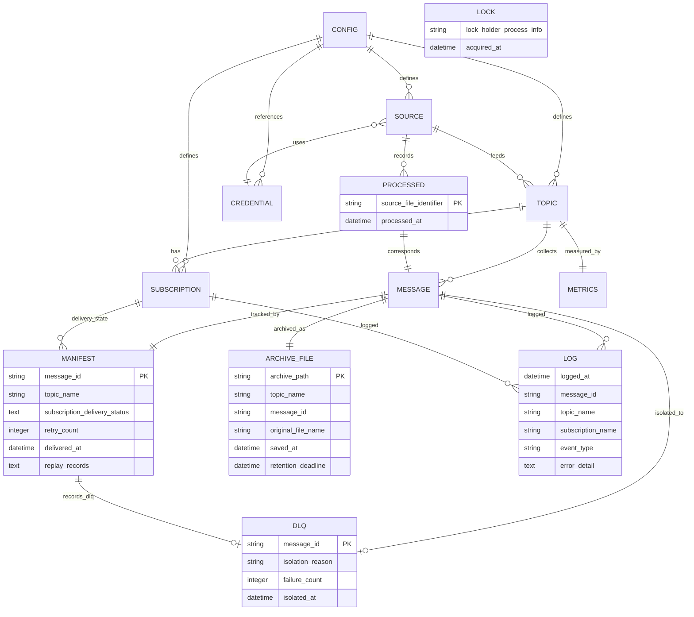

# データストア定義 (datastore-schema)

> **RDB/KVS 不使用。全永続化はローカルファイルシステム (arch-decision-001)。**
> arch-design.yaml の制約「外部 DB を使わない(ローカルファイルシステムのみ)」に基づき、rdb-schema.yaml / kvs-schema.yaml は生成しない。
> 本ドキュメントは [object-storage-schema.yaml](./object-storage-schema.yaml) の人間可読版で、全 19 UC の `_model-summary.yaml` の object_storage セクションを集約・重複排除したデータディレクトリレイアウト定義をまとめる。

共通規約:

- **AtomicWrite** — ファイル書き込みは一時名 `.tmp` で書き込んでから正式名へ rename する (SR-001 / LR-301)。正式名のファイルは常に完全な内容
- **配送状態の正は常に Manifest** (CTR-003)。通常配信(Fan-out)・再送(Replay)のいずれも `manifest/{message_id}.json` に記録する
- **message_id** は収集時刻 + Topic + 元ファイル名から採番 (SR-002)。同名ファイルの再出力も別 message_id として履歴を失わない

## ディレクトリツリー

```text
<データディレクトリ>/
├── config.yaml                          # 単一 YAML 設定 (配信構成の起点)
├── lock                                 # 二重起動防止 lock (稼働中のみ存在)
├── work/
│   └── collect/
│       └── {topic}/
│           ├── {message_id}.tmp         # 収集ダウンロード中の一時名
│           └── {message_id}             # 収集済み一時保管 (Archive 保存の入力)
├── archive/
│   └── {topic}/
│       └── {message_id}                 # 配信前必須保存 (retention 管理)
├── manifest/
│   └── {message_id}.json                # 配送管理レコード (配送状態の正)
├── dlq/
│   └── {topic}/
│       ├── {message_id}                 # リトライ上限超過の隔離ファイル
│       └── {message_id}.meta.json       # 隔離メタデータ
└── processed/
    └── {topic}.json                     # 処理済み管理 (copy 設定時の重複収集防止)

{subscription.directory}/                 # config.yaml で指定する配置先 (Consumer との外部 IF)
├── {original_file_name}.tmp              # AtomicWrite の一時名 (Consumer は取得対象外)
└── {original_file_name}                  # 配信ファイル (Consumer が従来手段で GET・削除)

構造化ログ出力先 (stdout またはログファイル)   # 1 イベント 1 行 JSON (NDJSON)
```

補足:

- シングルバイナリの配置先 (`/opt/file-pubsub/file-pubsub` 等) は配布物であり、データレイアウトの対象外
- メトリクス (E-012) はインメモリ集計で永続化しない (`/metrics` で公開、再起動でリセット)
- 認証情報 (E-005) は config.yaml 内の参照 (環境変数参照 `${ENV_VAR}` / 鍵ファイルパス) として保持し、独立ファイルを持たない (CTP-002)

## パス定義

### データディレクトリ (file-pubsub が所有・管理)

| パスパターン | content_type | 最大 | 用途 | 書き込み UC | 読み取り UC | ライフサイクル |
|---|---|---|---|---|---|---|
| `config.yaml` | application/yaml | 1MB | 配信構成定義の単一 YAML 設定 (CTP-003)。topics / subscriptions / 収集ソース / 認証情報参照 / polling_interval / archive_retention / retry_max_count / metrics_port | シングルバイナリ/Dockerイメージを配置する | デーモンを起動する / Topic・Subscriptionを設定する / ファイルを収集する(Collect) / 保持期間超過のArchiveを削除する / /healthzと/metricsをHTTPで公開する | 無期限 (運用者管理) |
| `lock` | text/plain | 4KB | 二重起動防止 (SR-006)。プロセス情報 + 取得日時で stale 判定 | デーモンを起動する (PUT) / デーモンをgraceful shutdownで停止する (DELETE) | デーモンを起動する | 稼働中のみ存在。shutdown で削除、stale lock は次回起動時に回復 (LR-002) |
| `work/collect/{topic}/{message_id}` | application/octet-stream | 500MB | 収集済みファイルの一時保管 (Collect → Archive 保存の受け渡し) | ファイルを収集する(Collect) | Archiveに保存する (GET, DELETE) | Archive 保存完了後に削除 |
| `work/collect/{topic}/{message_id}.tmp` | application/octet-stream | 500MB | 収集ダウンロード中の一時名 (LR-303)。完了後 rename | ファイルを収集する(Collect) | — | rename までの一時。中断残骸は再開時に破棄・再収集 |
| `archive/{topic}/{message_id}` | application/octet-stream | 500MB | 配信前必須保存の Topic 別 Archive (SP-001)。再送・監査・障害復旧・差分比較の基盤 | Archiveに保存する | Subscriptionへ複製配信する(Fan-out) / 配信失敗をリトライしDLQへ隔離する / 再送(Replay)を実行する / 冪等に処理を再開する / 保持期間超過のArchiveを削除する (GET, DELETE) | archive_retention 日 (SP-006。目安 〜90 日・〜数十 GB)。期限超過のみ削除 |
| `manifest/{message_id}.json` | application/json | 1MB | 配送管理レコード (配送状態の正。CTR-003)。冪等再開 (SR-003)・監査 (NFR E.7.1.1)・再送判断の基盤 | ファイルを収集する(Collect) / Archiveに保存する / Subscriptionへ複製配信する(Fan-out) / 配信失敗をリトライしDLQへ隔離する / 再送(Replay)を実行する / 冪等に処理を再開する / デーモンをgraceful shutdownで停止する | statusコマンドで配送状態を確認する / 配送履歴から再送対象を確認する / DLQ隔離メッセージを確認する | 保管 90 日目安 (NFR C.6.1.1) |
| `dlq/{topic}/{message_id}` | application/octet-stream | 500MB | リトライ上限超過メッセージの隔離ファイル (SR-004。Archive からの複製) | 配信失敗をリトライしDLQへ隔離する | DLQ隔離メッセージを確認する / 配送履歴から再送対象を確認する | 自動削除なし。運用者の対処判断 (再送/破棄) まで保持 |
| `dlq/{topic}/{message_id}.meta.json` | application/json | 1MB | 隔離メタデータ (隔離理由・失敗回数・隔離日時) | 配信失敗をリトライしDLQへ隔離する | DLQ隔離メッセージを確認する | 隔離ファイル本体と同一 |
| `processed/{topic}.json` | application/json | 10MB | 処理済み管理 (SP-004)。copy(残す) 設定の収集ソースで再収集を防止 | ファイルを収集する(Collect) | 冪等に処理を再開する | 自動削除なし (copy 設定の運用中は保持) |

### Subscription 配置先ディレクトリ (Consumer との外部 IF)

| パスパターン | content_type | 最大 | 用途 | 書き込み UC | 読み取り UC | ライフサイクル |
|---|---|---|---|---|---|---|
| `{subscription.directory}/{original_file_name}` | application/octet-stream | 500MB | Subscription への配信ファイル (外部 IF 契約)。正式名は常に完全な内容 (SR-001)。取得・削除は他 Subscription と Manifest に影響しない (SP-002) | Subscriptionへ複製配信する(Fan-out) / 配信失敗をリトライしDLQへ隔離する / 再送(Replay)を実行する / 冪等に処理を再開する / デーモンをgraceful shutdownで停止する | Subscriptionディレクトリからファイルを取得する / Subscriptionディレクトリから再送ファイルを取得する (いずれも操作主体は Consumer システム。GET, DELETE) | Consumer が取得後に削除 (外部責務)。システム側は配置後に削除しない |
| `{subscription.directory}/{original_file_name}.tmp` | application/octet-stream | 500MB | AtomicWrite の一時名 (SR-001)。**Consumer は取得対象にしないこと** (外部 IF 契約) | Subscriptionへ複製配信する(Fan-out) / 配信失敗をリトライしDLQへ隔離する / 再送(Replay)を実行する / 冪等に処理を再開する | — | rename までの一時。書込失敗時は削除 |

### 構造化ログ出力先

| パスパターン | content_type | 最大 | 用途 | 書き込み UC | 読み取り UC | ライフサイクル |
|---|---|---|---|---|---|---|
| 構造化ログ出力先 (stdout またはログファイル) | application/x-ndjson | 1KB/行 | 1 イベント 1 行 JSON の構造化ログ (CTP-001 / CTR-002)。message_id・Topic・Subscription・イベント種別を含み、配信失敗の特定粒度を保証 | (全 UC 共通) tier-daemon-worker / tier-ops-cli の全処理 | 構造化ログを調査する | 保管 90 日目安 (NFR C.6.1.1)。ローテーションは導入先運用 |

## JSON スキーマ

### manifest_json — `manifest/{message_id}.json`

RDRA 情報: Manifest (E-007) / メッセージ (E-006) / Archiveファイル (E-010 メタデータ)。配送イベント追記 + Subscription 別現在状態。

| フィールド | 型 | null | 説明 |
|---|---|---|---|
| `message_id` | string | 不可 | 収集時刻 + Topic + 元ファイル名から採番 (SR-002)。ファイル名と一致 |
| `topic` | string | 不可 | Topic 名 |
| `original_file_name` | string | 不可 | 元ファイル名 (Subscription 配置時のファイル名) |
| `collected_at` | datetime | 不可 | 収集時刻 |
| `status` | string (enum) | 不可 | メッセージ配送状態。値: collected / archived / delivering / delivered / failed / retrying / dlq |
| `archive_path` | string | 可 | Archive 保存先パス。Archive 保存時に付与 |
| `saved_at` | datetime | 可 | Archive 保存日時。Archive 保存時に付与 |
| `retention_deadline` | datetime | 可 | Archive 保持期限 (保存日時 + archive_retention 日) |
| `subscriptions` | array\<object\> | 不可 | Subscription 別配送状態。要素: `{ subscription, status: delivered/failed/dlq, delivered_at?, last_error? }`。冪等再開 (SR-003) の判定根拠 |
| `retry_count` | integer | 不可 | リトライ回数 (初期値 0。retry_max_count 超過で dlq 隔離) |
| `delivered_at` | datetime | 可 | 配送日時 (全 Subscription delivered 時の完了日時) |
| `replay_records` | array\<object\> | 可 | 再送 (Replay) 記録。要素: `{ replayed_at, target_subscriptions, result }` (条件「Replay記録」/ SP-102) |
| `delivery_events` | array\<object\> | 可 | 配送イベントの追記ログ。要素: `{ at, subscription?, event_type, detail? }`。監査 (NFR E.7.1.1) 用 |

### dlq_meta_json — `dlq/{topic}/{message_id}.meta.json`

RDRA 情報: DLQ (E-008)。運用者の対処判断 (再送/破棄) の根拠。

| フィールド | 型 | null | 説明 |
|---|---|---|---|
| `message_id` | string | 不可 | 隔離メッセージの message_id。隔離ファイル名と一致 |
| `topic` | string | 不可 | Topic 名 (隔離ディレクトリと一致) |
| `isolation_reason` | string | 不可 | 隔離理由 (リトライ上限超過の原因となった恒久的エラー内容) |
| `failure_count` | integer | 不可 | 失敗回数 (隔離時点のリトライ累計) |
| `isolated_at` | datetime | 不可 | 隔離日時 |

### processed_json — `processed/{topic}.json`

RDRA 情報: 処理済み管理 (E-009)。copy (残す) 設定の収集ソースで重複収集を防止。エントリ追記型。

| フィールド | 型 | null | 説明 |
|---|---|---|---|
| `topic` | string | 不可 | Topic 名 (ファイル名と一致) |
| `entries` | array\<object\> | 不可 | 処理済みエントリの一覧 |
| `entries[].source_file_identifier` | string | 不可 | 収集元ファイル識別子 (ファイル名・収集元パス等)。エントリ内で一意 |
| `entries[].processed_at` | datetime | 不可 | 処理済み判定日時 |

### log_line_json — 構造化ログ (1 行 = 1 JSON オブジェクト)

RDRA 情報: ログ (E-013)。どのメッセージのどの Subscription 配信が失敗したかを特定できる粒度 (CTP-001)。

| フィールド | 型 | null | 説明 |
|---|---|---|---|
| `logged_at` | datetime | 不可 | 出力日時 |
| `message_id` | string | 可 | 対象メッセージの message_id (メッセージに紐付かないイベントでは null) |
| `topic` | string | 可 | Topic 名 |
| `subscription` | string | 可 | Subscription 名 (どの Subscription の配信イベントか) |
| `event_type` | string | 不可 | イベント種別 (collect / archive / fanout / retry / dlq / replay / startup / shutdown 等) |
| `error_detail` | text | 可 | エラー内容 (エラーイベント時のみ) |

## エンティティ関連図 (arch-design.yaml data_architecture)

設定系エンティティ (CONFIG / TOPIC / SUBSCRIPTION / SOURCE / CREDENTIAL) は `config.yaml` に、配送系エンティティ (MESSAGE / MANIFEST / ARCHIVE_FILE / DLQ / PROCESSED / LOCK / LOG) は上記レイアウトの各ファイルに対応する。METRICS のみインメモリ (非永続)。



| エンティティ | 永続化先 |
|---|---|
| 設定 (E-001) / Topic (E-002) / Subscription (E-003) / 収集ソース (E-004) / 認証情報 (E-005) | `config.yaml` (単一 YAML 設定) |
| メッセージ (E-006) | `manifest/{message_id}.json` + `archive/{topic}/{message_id}` のメタデータ (独立ストアなし) |
| Manifest (E-007) | `manifest/{message_id}.json` |
| DLQ (E-008) | `dlq/{topic}/{message_id}` + `dlq/{topic}/{message_id}.meta.json` (+ Manifest への dlq 記録) |
| 処理済み管理 (E-009) | `processed/{topic}.json` |
| Archiveファイル (E-010) | `archive/{topic}/{message_id}` |
| Lock (E-011) | `lock` |
| メトリクス (E-012) | インメモリ (非永続。`/metrics` で公開) |
| ログ (E-013) | 構造化ログ出力先 (stdout / ログファイル) |
