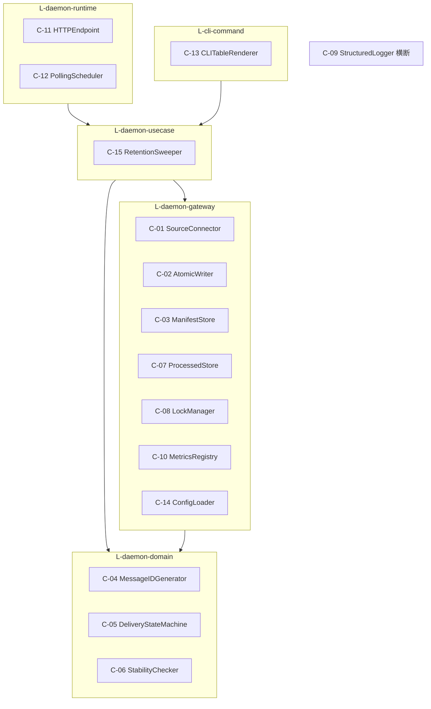

# 共通実装コンポーネント設計

> **位置づけ**: 全体横断 Spec テンプレートの「共通コンポーネント」節の翻案。file-pubsub は GUI を持たない Go デーモン + CLI(同一バイナリ)であるため、フロントエンドのデザインシステムコンポーネントの代わりに、**複数 UC で共通して使われる実装コンポーネント(Go パッケージ / モジュール候補)** を定義する。各 UC の `tier-*.md` 末尾「共通コンポーネント参照」節が本書のアンカーを参照する。

## 設計方針

- 配置レイヤーは [arch-design.yaml](../../../../../arch/latest/arch-design.yaml) の `L-daemon-runtime` / `L-daemon-usecase` / `L-daemon-domain` / `L-daemon-gateway` / `L-cli-command` に従う。tier-ops-cli は同一バイナリのパッケージ共有で daemon 側レイヤーを利用する(CLP-101)
- インターフェース(Go interface)を導入するのは差し替え要件が明確な収集コネクタのみ。他は具象型の直接依存とする(CLP-001)
- ドメイン層のコンポーネントは I/O を持たない純粋ロジックとする(LP-201)
- シグネチャは実装着手時の出発点となる「案」であり、確定仕様ではない

## コンポーネント一覧

| ID | コンポーネント | 配置レイヤー | 責務の要約 | 利用 UC 数 |
|----|--------------|------------|-----------|:---------:|
| [C-01](#c-01-sourceconnector) | SourceConnector | L-daemon-gateway | 収集コネクタ共通インターフェース(local / ftp / sftp / scp) | 2 |
| [C-02](#c-02-atomicwriter) | AtomicWriter | L-daemon-gateway | 一時名書き込み → rename の AtomicWrite ユーティリティ | 9 |
| [C-03](#c-03-manifeststore) | ManifestStore | L-daemon-gateway | Manifest(メッセージ別 JSON)の読み書き・配送状態更新・Replay 記録 | 12 |
| [C-04](#c-04-messageidgenerator) | MessageIDGenerator | L-daemon-domain | message_id 採番(収集時刻 + Topic + 元ファイル名) | 1 |
| [C-05](#c-05-deliverystatemachine) | DeliveryStateMachine | L-daemon-domain | メッセージ配送状態遷移・二重配信防止(冪等)判定・リトライ上限判定 | 7 |
| [C-06](#c-06-stabilitychecker) | StabilityChecker | L-daemon-domain | 安定待ち判定(書き込み完了判定)・除外パターン判定 | 1 |
| [C-07](#c-07-processedstore) | ProcessedStore | L-daemon-gateway | 処理済み管理(copy 設定時の重複収集防止)の記録・照合 | 2 |
| [C-08](#c-08-lockmanager) | LockManager | L-daemon-gateway | Lock の取得 / 解放 / stale 判定・回復 | 2 |
| [C-09](#c-09-structuredlogger) | StructuredLogger | 横断(全レイヤーから利用) | 1 イベント 1 行 JSON の構造化ログ出力 | 9 |
| [C-10](#c-10-metricsregistry) | MetricsRegistry | L-daemon-gateway | Topic 別 5 メトリクスのインメモリ集計・Prometheus 形式公開 | 6 |
| [C-11](#c-11-httpendpoint) | HTTPEndpoint | L-daemon-runtime | 組込 HTTP サーバ(/metrics・/healthz)の起動・停止 | 4 |
| [C-12](#c-12-pollingscheduler) | PollingScheduler | L-daemon-runtime | ポーリングスケジューラ(多重起動なしのサイクル起動) | 5 |
| [C-13](#c-13-clitablerenderer) | CLITableRenderer | L-cli-command | CLI の行指向テーブル・件数集計・結果サマリーの出力整形 | 4 |
| [C-14](#c-14-configloader) | ConfigLoader | L-daemon-gateway | 設定ローダ(YAML 読込 + 環境変数展開 + 構文・参照整合検証) | 12 |
| [C-15](#c-15-retentionsweeper) | RetentionSweeper | L-daemon-usecase | retention スイーパ(保持期限算出・超過 Archive の安全削除) | 3 |

## レイヤー配置図



---

## C-01 SourceConnector

**収集コネクタ共通インターフェース(local / ftp / sftp / scp)**

- **責務**: 収集ソースへの接続・ファイル一覧取得(名前・サイズ・更新時刻)・一時名ダウンロード + rename(LR-303)・元ファイル DELETE を、ソース種別非依存の共通インターフェースで提供する。IF 導入はシステム内でここのみ(LP-301、CLP-001)。認証情報の解決(環境変数参照 / 鍵ファイル / 平文)は ConfigLoader(C-14)の解決結果を受け取る
- **配置レイヤー**: `L-daemon-gateway`
- **利用する UC**:
  - [ファイルを収集する(Collect)](../../ファイル配信業務/ファイルを収集して配信するフロー/ファイルを収集する(Collect)/tier-daemon-worker.md) — 一覧取得・一時名ダウンロード・元ファイル DELETE
  - [冪等に処理を再開する](../../配信基盤運用業務/配信基盤を運用するフロー/冪等に処理を再開する/tier-daemon-worker.md) — 再開後の通常収集サイクルでの収集
- **主要インターフェース案**:

```go
// gateway/connector
type FileInfo struct {
    Name    string
    Size    int64
    ModTime time.Time
}

type SourceConnector interface {
    // List は対象ディレクトリのファイル一覧(名前・サイズ・更新時刻)を返す
    List(ctx context.Context) ([]FileInfo, error)
    // Fetch は一時名でローカルへダウンロードし、完了後 rename して確定パスを返す (LR-303)
    Fetch(ctx context.Context, name string, destDir string) (localPath string, err error)
    // Remove は GET 後 DELETE (回収) を行う。Archive 保存成功の確認後にのみ呼ぶ
    Remove(ctx context.Context, name string) error
    Close() error
}

// NewConnector は source.type (local / ftp / sftp / scp) に応じた実装を返す
func NewConnector(src config.Source, cred config.ResolvedCredential) (SourceConnector, error)
```

## C-02 AtomicWriter

**AtomicWrite ユーティリティ(.tmp → rename)**

- **責務**: 「一時名(`{name}.tmp`)で書き込み → fsync → 正式名へ rename」を全ファイル書き込みの共通機構として提供する(LR-301、SR-001)。正式名のファイルは常に完全な内容であることを保証し、Subscription 配置・Archive 保存・Manifest / JSON 更新が共用する。中断時に残る一時名ファイルの掃除も担う
- **配置レイヤー**: `L-daemon-gateway`
- **利用する UC**:
  - [ファイルを収集する(Collect)](../../ファイル配信業務/ファイルを収集して配信するフロー/ファイルを収集する(Collect)/tier-daemon-worker.md) — Manifest・処理済み管理の AtomicWrite 記録
  - [Archiveに保存する](../../ファイル配信業務/ファイルを収集して配信するフロー/Archiveに保存する/tier-daemon-worker.md) — archive/ への保存と Manifest 更新
  - [Subscriptionへ複製配信する(Fan-out)](../../ファイル配信業務/ファイルを収集して配信するフロー/Subscriptionへ複製配信する(Fan-out)/tier-daemon-worker.md) — Subscription ディレクトリへの配置
  - [Subscriptionディレクトリからファイルを取得する](../../ファイル配信業務/ファイルを収集して配信するフロー/Subscriptionディレクトリからファイルを取得する/tier-daemon-worker.md) — 配置保証契約(正式名 = 常に完全)の実装根拠
  - [配信失敗をリトライしDLQへ隔離する](../../ファイル配信業務/ファイルを収集して配信するフロー/配信失敗をリトライしDLQへ隔離する/tier-daemon-worker.md) — 再配置・DLQ 隔離書き込み
  - [再送(Replay)を実行する](../../ファイル配信業務/ファイルを再送するフロー/再送(Replay)を実行する/tier-ops-cli.md) — 宛先 Subscription への再配置
  - [Subscriptionディレクトリから再送ファイルを取得する](../../ファイル配信業務/ファイルを再送するフロー/Subscriptionディレクトリから再送ファイルを取得する/tier-daemon-worker.md) — 再送ファイル受け渡し契約の実装根拠
  - [デーモンをgraceful shutdownで停止する](../../配信基盤運用業務/配信基盤を運用するフロー/デーモンをgraceful shutdownで停止する/tier-daemon-worker.md) — 処理中配置の AtomicWrite 完了待ち
  - [冪等に処理を再開する](../../配信基盤運用業務/配信基盤を運用するフロー/冪等に処理を再開する/tier-daemon-worker.md) — 未配信 Subscription への再配置
- **主要インターフェース案**:

```go
// gateway/fsutil
// WriteFileAtomic は dst+".tmp" へ書き込み、fsync 後に dst へ rename する
func WriteFileAtomic(dst string, r io.Reader, perm os.FileMode) error

// CopyFileAtomic は src を dst へ AtomicWrite で複製する (Fan-out / Replay / DLQ 隔離用)
func CopyFileAtomic(src, dst string) error

// WriteJSONAtomic は v を JSON エンコードして AtomicWrite する (Manifest / meta.json 用)
func WriteJSONAtomic(dst string, v any) error

// CleanupTempFiles はディレクトリ配下の *.tmp を削除する (再起動後の冪等再開時)
func CleanupTempFiles(dir string) error
```

## C-03 ManifestStore

**Manifest ストア(読み書き・配送状態更新・Replay 記録)**

- **責務**: `manifest/{message_id}.json` の読み書き(AtomicWriter 利用)、Subscription 別配送状態(delivered / failed / dlq)・リトライ回数・配送日時の更新、配送イベント追記、Replay 記録の追記、状態・topic・subscription による検索を提供する。配送状態の正は常に Manifest(CTR-003)。状態遷移・冪等判定のロジック自体は DeliveryStateMachine(C-05)に委譲し、本コンポーネントは永続化と照会に徹する
- **配置レイヤー**: `L-daemon-gateway`
- **利用する UC**:
  - [ファイルを収集する(Collect)](../../ファイル配信業務/ファイルを収集して配信するフロー/ファイルを収集する(Collect)/tier-daemon-worker.md) — 収集済の初期レコード作成
  - [Archiveに保存する](../../ファイル配信業務/ファイルを収集して配信するフロー/Archiveに保存する/tier-daemon-worker.md) — Archive保存済への更新・保持期限記録
  - [Subscriptionへ複製配信する(Fan-out)](../../ファイル配信業務/ファイルを収集して配信するフロー/Subscriptionへ複製配信する(Fan-out)/tier-daemon-worker.md) — delivered / failed の配送結果記録
  - [Subscriptionディレクトリからファイルを取得する](../../ファイル配信業務/ファイルを収集して配信するフロー/Subscriptionディレクトリからファイルを取得する/tier-daemon-worker.md) — 「Consumer の取得・削除は配送状態に影響しない」契約の根拠(Manifest が正)
  - [配信失敗をリトライしDLQへ隔離する](../../ファイル配信業務/ファイルを収集して配信するフロー/配信失敗をリトライしDLQへ隔離する/tier-daemon-worker.md) — failed 検出・retry_count 加算・dlq 記録
  - [再送(Replay)を実行する](../../ファイル配信業務/ファイルを再送するフロー/再送(Replay)を実行する/tier-ops-cli.md) — Replay 記録の追記
  - [配送履歴から再送対象を確認する](../../ファイル配信業務/ファイルを再送するフロー/配送履歴から再送対象を確認する/tier-ops-cli.md) — 絞り込み照会・件数集計の読取
  - [Subscriptionディレクトリから再送ファイルを取得する](../../ファイル配信業務/ファイルを再送するフロー/Subscriptionディレクトリから再送ファイルを取得する/tier-daemon-worker.md) — 再送履歴(Replay 記録)参照契約の根拠
  - [デーモンをgraceful shutdownで停止する](../../配信基盤運用業務/配信基盤を運用するフロー/デーモンをgraceful shutdownで停止する/tier-daemon-worker.md) — 停止前の処理中メッセージの配送結果記録
  - [冪等に処理を再開する](../../配信基盤運用業務/配信基盤を運用するフロー/冪等に処理を再開する/tier-daemon-worker.md) — 中断時点の配送状態の参照・delivered 記録
  - [DLQ隔離メッセージを確認する](../../配信基盤運用業務/配送状況を確認するフロー/DLQ隔離メッセージを確認する/tier-ops-cli.md) — dlq 記録の照会(DLQ meta との突き合わせ)
  - [statusコマンドで配送状態を確認する](../../配信基盤運用業務/配送状況を確認するフロー/statusコマンドで配送状態を確認する/tier-ops-cli.md) — 配送状態テーブル・件数集計の読取
- **主要インターフェース案**:

```go
// gateway/manifest
type Manifest struct {
    MessageID     string                    `json:"message_id"`
    TopicName     string                    `json:"topic_name"`
    OriginalFile  string                    `json:"original_file_name"`
    CollectedAt   time.Time                 `json:"collected_at"`
    Status        domain.MessageStatus      `json:"status"`
    Subscriptions map[string]DeliveryRecord `json:"subscription_delivery_status"`
    RetryCount    int                       `json:"retry_count"`
    ArchivePath   string                    `json:"archive_path,omitempty"`
    SavedAt       *time.Time                `json:"saved_at,omitempty"`
    RetentionDeadline *time.Time            `json:"retention_deadline,omitempty"`
    ReplayRecords []ReplayRecord            `json:"replay_records,omitempty"`
}

type ManifestStore struct{ dir string }

func (s *ManifestStore) Get(messageID string) (*Manifest, error)
func (s *ManifestStore) Put(m *Manifest) error // AtomicWriter で書き込む
func (s *ManifestStore) Find(f Filter) ([]*Manifest, error) // topic / subscription / status 絞り込み
func (s *ManifestStore) RecordDelivery(messageID, subscription string, result domain.DeliveryResult) error
func (s *ManifestStore) AppendReplay(messageID string, rec ReplayRecord) error
```

## C-04 MessageIDGenerator

**message_id 採番**

- **責務**: 収集時刻 + Topic + 元ファイル名から message_id を採番する純粋関数(LR-202、SR-002)。同名ファイルの再出力は別 message_id の新メッセージとして扱い、上書きで履歴を失わない。Manifest・Archive・DLQ・構造化ログの共通キーの生成元
- **配置レイヤー**: `L-daemon-domain`
- **利用する UC**:
  - [ファイルを収集する(Collect)](../../ファイル配信業務/ファイルを収集して配信するフロー/ファイルを収集する(Collect)/tier-daemon-worker.md) — 収集時の message_id 採番
- **主要インターフェース案**:

```go
// domain/message
// NewMessageID は "20260612T093001_orders_orders_20260612.csv" 形式の ID を返す純粋関数
func NewMessageID(collectedAt time.Time, topic, originalFileName string) string
```

## C-05 DeliveryStateMachine

**メッセージ配送状態遷移・二重配信防止(冪等)判定・リトライ上限判定**

- **責務**: 収集済→Archive保存済→配信中→配信済(delivered)/配信失敗(failed)→リトライ中→DLQ隔離(dlq)の状態遷移ルールの集約(LR-201)、Manifest の Subscription 別配送状態から未配信 Subscription を抽出する二重配信防止(冪等)判定(SR-003)、retry_count と retry_max_count によるリトライ上限判定(SR-004)。I/O を持たない純粋ロジック(LP-201)
- **配置レイヤー**: `L-daemon-domain`
- **利用する UC**:
  - [ファイルを収集する(Collect)](../../ファイル配信業務/ファイルを収集して配信するフロー/ファイルを収集する(Collect)/tier-daemon-worker.md) — 「収集済」への初期遷移
  - [Archiveに保存する](../../ファイル配信業務/ファイルを収集して配信するフロー/Archiveに保存する/tier-daemon-worker.md) — 収集済→Archive保存済の遷移
  - [Subscriptionへ複製配信する(Fan-out)](../../ファイル配信業務/ファイルを収集して配信するフロー/Subscriptionへ複製配信する(Fan-out)/tier-daemon-worker.md) — 未配信 Subscription 抽出・配信中→delivered / failed 遷移
  - [配信失敗をリトライしDLQへ隔離する](../../ファイル配信業務/ファイルを収集して配信するフロー/配信失敗をリトライしDLQへ隔離する/tier-daemon-worker.md) — リトライ上限判定・failed→リトライ中→dlq 遷移
  - [再送(Replay)を実行する](../../ファイル配信業務/ファイルを再送するフロー/再送(Replay)を実行する/tier-ops-cli.md) — 再送による再配置(replayed)の状態記録
  - [デーモンをgraceful shutdownで停止する](../../配信基盤運用業務/配信基盤を運用するフロー/デーモンをgraceful shutdownで停止する/tier-daemon-worker.md) — 停止前の delivered / failed 確定
  - [冪等に処理を再開する](../../配信基盤運用業務/配信基盤を運用するフロー/冪等に処理を再開する/tier-daemon-worker.md) — delivered 済み除外の冪等再開判定
- **主要インターフェース案**:

```go
// domain/delivery
type MessageStatus string // collected / archived / delivering / delivered / failed / retrying / dlq

// Transition は遷移の妥当性を検証して次状態を返す。不正遷移は error
func Transition(current MessageStatus, event Event) (MessageStatus, error)

// PendingSubscriptions は delivered 記録のない Subscription のみを返す (二重配信防止 SR-003)
func PendingSubscriptions(subs map[string]DeliveryResult, all []string) []string

// ShouldIsolate はリトライ上限判定 (SR-004)。retryCount >= maxRetry で true
func ShouldIsolate(retryCount, maxRetry int) bool

// ClassifyError は配信エラーを一時的(リトライ対象)/恒久的に分類する入力を与える (LR-102 は usecase 集約)
func ClassifyError(err error) RetryClass
```

## C-06 StabilityChecker

**安定待ち判定(書き込み完了判定)・除外パターン判定**

- **責務**: サイズ・更新時刻が安定確認間隔で一致するかの安定待ち判定と、除外パターン該当判定を、収集ソース種別に依存しない純粋ロジックとして提供する(LR-203、SP-003)。Producer が書き込み中のファイルを収集対象から外す
- **配置レイヤー**: `L-daemon-domain`
- **利用する UC**:
  - [ファイルを収集する(Collect)](../../ファイル配信業務/ファイルを収集して配信するフロー/ファイルを収集する(Collect)/tier-daemon-worker.md) — 収集可否判定(安定待ち・除外パターン)
- **主要インターフェース案**:

```go
// domain/stability
type Observation struct {
    Name       string
    Size       int64
    ModTime    time.Time
    ObservedAt time.Time
}

// IsStable は前回観測と今回観測のサイズ・更新時刻が安定確認間隔で一致するかを判定する
func IsStable(prev, curr Observation, cfg StabilityConfig) bool

// IsExcluded は除外パターン (glob) 該当を判定する
func IsExcluded(name string, patterns []string) bool
```

## C-07 ProcessedStore

**処理済み管理ストア(copy 設定時の重複収集防止)**

- **責務**: `processed/{topic}.json` への収集元ファイル識別子・処理済み判定日時の記録と、再収集判定のための照合を提供する(SP-004)。書き込みは AtomicWriter(C-02)を利用し、記録成功までは元ファイルを未処理扱い(安全側)とする
- **配置レイヤー**: `L-daemon-gateway`
- **利用する UC**:
  - [ファイルを収集する(Collect)](../../ファイル配信業務/ファイルを収集して配信するフロー/ファイルを収集する(Collect)/tier-daemon-worker.md) — copy 設定時の照合と処理済み記録
  - [冪等に処理を再開する](../../配信基盤運用業務/配信基盤を運用するフロー/冪等に処理を再開する/tier-daemon-worker.md) — 再開時の処理済み照合(重複収集防止)
- **主要インターフェース案**:

```go
// gateway/processed
type ProcessedStore struct{ dir string }

// IsProcessed は収集元ファイル識別子が処理済みかを返す
func (s *ProcessedStore) IsProcessed(topic, sourceFileIdentifier string) (bool, error)
// MarkProcessed は処理済み記録を AtomicWrite で追記する
func (s *ProcessedStore) MarkProcessed(topic, sourceFileIdentifier string, at time.Time) error
```

## C-08 LockManager

**Lock マネージャ(取得 / 解放 / stale 回復)**

- **責務**: lock ファイル(ロック保持プロセス情報 + 取得日時)の取得・解放と、保持プロセスの生存確認による stale 判定・安全な回復を提供する(SR-006、LR-002)。二重起動時は取得失敗を返し、呼び出し元(runtime)が終了コード 3 で終了する
- **配置レイヤー**: `L-daemon-gateway`(lock ファイル I/O・stale 判定。利用は `L-daemon-runtime` の起動 / 停止シーケンス)
- **利用する UC**:
  - [デーモンを起動する](../../配信基盤運用業務/配信基盤を運用するフロー/デーモンを起動する/tier-daemon-worker.md) — 起動時の Lock 取得・stale 回復・二重起動検出
  - [デーモンをgraceful shutdownで停止する](../../配信基盤運用業務/配信基盤を運用するフロー/デーモンをgraceful shutdownで停止する/tier-daemon-worker.md) — 停止時の Lock 解放
- **主要インターフェース案**:

```go
// gateway/lock
var ErrAlreadyLocked = errors.New("lock held by a live process") // 二重起動 → 終了コード 3

type LockManager struct{ path string }

// Acquire は lock を取得する。stale lock (保持プロセス死亡) は安全に回復して再取得する
func (l *LockManager) Acquire(pid int, now time.Time) error
// Release は lock ファイルを削除して解放する (graceful shutdown 時)
func (l *LockManager) Release() error
// holderAlive はプロセス生存確認による stale 判定 (内部)
```

## C-09 StructuredLogger

**構造化ログ出力(JSON 1 行)**

- **責務**: logged_at / message_id / topic / subscription / event_type / error_detail を含む 1 イベント 1 行の JSON ログを stdout(またはログファイル)へ出力する(CTP-001)。Subscription 配信イベントには message_id + topic + subscription の 3 点を必ず含め、error_detail は「原因 + 対処」を 1 メッセージで記述する。event_type の値域・不変条件の正本は UC「構造化ログを調査する」のログ出力契約。ログ出力失敗で配送処理を止めない
- **配置レイヤー**: 横断ユーティリティ(全レイヤーから利用可。エラーの終了コード・ログへの変換責務は `L-daemon-runtime` / `L-cli-command` — CLR-001、CTR-002)
- **利用する UC**:
  - [ファイルを収集する(Collect)](../../ファイル配信業務/ファイルを収集して配信するフロー/ファイルを収集する(Collect)/tier-daemon-worker.md) — collected / 収集失敗イベント
  - [Archiveに保存する](../../ファイル配信業務/ファイルを収集して配信するフロー/Archiveに保存する/tier-daemon-worker.md) — archived / 保存失敗イベント
  - [Subscriptionへ複製配信する(Fan-out)](../../ファイル配信業務/ファイルを収集して配信するフロー/Subscriptionへ複製配信する(Fan-out)/tier-daemon-worker.md) — delivered / delivery_failed イベント
  - [配信失敗をリトライしDLQへ隔離する](../../ファイル配信業務/ファイルを収集して配信するフロー/配信失敗をリトライしDLQへ隔離する/tier-daemon-worker.md) — retry / dlq_isolated イベント
  - [デーモンを起動する](../../配信基盤運用業務/配信基盤を運用するフロー/デーモンを起動する/tier-daemon-worker.md) — daemon_started / config_error イベント
  - [デーモンをgraceful shutdownで停止する](../../配信基盤運用業務/配信基盤を運用するフロー/デーモンをgraceful shutdownで停止する/tier-daemon-worker.md) — daemon_stopped イベント
  - [保持期間超過のArchiveを削除する](../../配信基盤運用業務/配信基盤を運用するフロー/保持期間超過のArchiveを削除する/tier-daemon-worker.md) — retention_deleted / 削除失敗イベント
  - [冪等に処理を再開する](../../配信基盤運用業務/配信基盤を運用するフロー/冪等に処理を再開する/tier-daemon-worker.md) — 再開時の配信イベント
  - [構造化ログを調査する](../../配信基盤運用業務/配送状況を確認するフロー/構造化ログを調査する/tier-daemon-worker.md) — 出力契約の正本(フィールド規約・event_type 値域)
- **主要インターフェース案**:

```go
// log/structured
type Event struct {
    LoggedAt     time.Time `json:"logged_at"`
    MessageID    string    `json:"message_id,omitempty"`
    Topic        string    `json:"topic,omitempty"`
    Subscription string    `json:"subscription,omitempty"`
    EventType    string    `json:"event_type"` // collected / archived / delivered / delivery_failed / retry / dlq_isolated / replayed / retention_deleted / daemon_started / daemon_stopped / config_error
    ErrorDetail  string    `json:"error_detail,omitempty"` // 原因 + 対処を 1 メッセージで
}

type Logger struct{ w io.Writer }

// Emit は 1 行 JSON を追記する。出力失敗でも error を握りつぶし配送処理を止めない
func (l *Logger) Emit(e Event)
```

## C-10 MetricsRegistry

**メトリクスレジストリ(Topic 別 5 メトリクス)**

- **責務**: Topic 別の最終収集時刻・処理件数・配信失敗数・DLQ 件数・滞留数の 5 系列をインメモリで集計し(永続化なし・再起動でリセット)、Prometheus テキスト形式で公開する(LR-302、SP-005)。ラベルは `topic` のみ。メトリクス名は data-visualization.md の契約に従い、確定後は後方互換を維持する
- **配置レイヤー**: `L-daemon-gateway`
- **利用する UC**:
  - [ファイルを収集する(Collect)](../../ファイル配信業務/ファイルを収集して配信するフロー/ファイルを収集する(Collect)/tier-daemon-worker.md) — 最終収集時刻・処理件数の更新
  - [Archiveに保存する](../../ファイル配信業務/ファイルを収集して配信するフロー/Archiveに保存する/tier-daemon-worker.md) — 処理件数の更新
  - [Subscriptionへ複製配信する(Fan-out)](../../ファイル配信業務/ファイルを収集して配信するフロー/Subscriptionへ複製配信する(Fan-out)/tier-daemon-worker.md) — 処理件数・配信失敗数の更新
  - [配信失敗をリトライしDLQへ隔離する](../../ファイル配信業務/ファイルを収集して配信するフロー/配信失敗をリトライしDLQへ隔離する/tier-daemon-worker.md) — 配信失敗数・DLQ 件数の更新
  - [/healthzと/metricsをHTTPで公開する](../../配信基盤運用業務/配信基盤を監視するフロー/-healthzと-metricsをHTTPで公開する/tier-daemon-worker.md) — Prometheus 形式での公開(エクスポータ本体)
  - [外部監視基盤でTopic別メトリクスを観測する](../../配信基盤運用業務/配信基盤を監視するフロー/外部監視基盤でTopic別メトリクスを観測する/tier-daemon-worker.md) — 監視基盤が依存する 5 系列契約の提供元
- **主要インターフェース案**:

```go
// gateway/metrics
type Registry struct{ /* topic 別のインメモリ集計 (mutex 保護) */ }

func (r *Registry) SetLastCollected(topic string, t time.Time) // file_pubsub_last_collect_timestamp_seconds (gauge)
func (r *Registry) IncProcessed(topic string)                  // file_pubsub_processed_total (counter)
func (r *Registry) IncDeliveryFailure(topic string)            // file_pubsub_delivery_failure_total (counter)
func (r *Registry) SetDLQCount(topic string, n int)            // file_pubsub_dlq_count (gauge)
func (r *Registry) SetBacklogCount(topic string, n int)        // file_pubsub_backlog_count (gauge)

// Handler は Prometheus テキスト形式を返す http.Handler (/metrics)
func (r *Registry) Handler() http.Handler
```

## C-11 HTTPEndpoint

**組込 HTTP サーバ(/metrics・/healthz)**

- **責務**: 設定 `metrics_port` で組込 HTTP サーバを起動し、GET /healthz(死活: 200 固定)と GET /metrics(MetricsRegistry の Handler)の 2 エンドポイントのみを公開する(SP-005)。それ以外のパスは 404。デーモン起動時に開始、graceful shutdown 時に停止する。オンライン応答系・Web UI は持たない(CTP-007、CTP-008)
- **配置レイヤー**: `L-daemon-runtime`
- **利用する UC**:
  - [デーモンを起動する](../../配信基盤運用業務/配信基盤を運用するフロー/デーモンを起動する/tier-daemon-worker.md) — 起動シーケンスでのサーバ開始(起動失敗は終了コード 1)
  - [デーモンをgraceful shutdownで停止する](../../配信基盤運用業務/配信基盤を運用するフロー/デーモンをgraceful shutdownで停止する/tier-daemon-worker.md) — 停止シーケンスでのサーバ停止(監視基盤が DOWN 検知)
  - [/healthzと/metricsをHTTPで公開する](../../配信基盤運用業務/配信基盤を監視するフロー/-healthzと-metricsをHTTPで公開する/tier-daemon-worker.md) — エンドポイント仕様の本体
  - [外部監視基盤でTopic別メトリクスを観測する](../../配信基盤運用業務/配信基盤を監視するフロー/外部監視基盤でTopic別メトリクスを観測する/tier-daemon-worker.md) — 監視基盤が依存するエンドポイント契約
- **主要インターフェース案**:

```go
// runtime/httpserver
type Server struct{ srv *http.Server }

// NewServer は /healthz と /metrics のみを mux に登録する
func NewServer(port int, metricsHandler http.Handler) *Server

func (s *Server) Start() error                      // ポート使用中等は回復不能エラー (終了コード 1)
func (s *Server) Shutdown(ctx context.Context) error // graceful shutdown 時
```

## C-12 PollingScheduler

**ポーリングスケジューラ**

- **責務**: 設定 `polling_interval` 秒ごとにユースケース層の収集配信サイクル(collect→archive→fanout→リトライ/DLQ→retention 削除)を起動する(LR-001)。前回サイクル完了を待ち多重起動しない。停止シグナル受信後は新規サイクルの起動を止め、実行中サイクルの完了を待つ(LP-001)
- **配置レイヤー**: `L-daemon-runtime`
- **利用する UC**:
  - [ファイルを収集する(Collect)](../../ファイル配信業務/ファイルを収集して配信するフロー/ファイルを収集する(Collect)/tier-daemon-worker.md) — 収集サイクルのトリガー
  - [デーモンを起動する](../../配信基盤運用業務/配信基盤を運用するフロー/デーモンを起動する/tier-daemon-worker.md) — 起動シーケンスでのスケジューラ開始
  - [デーモンをgraceful shutdownで停止する](../../配信基盤運用業務/配信基盤を運用するフロー/デーモンをgraceful shutdownで停止する/tier-daemon-worker.md) — 新規サイクル起動の停止・実行中サイクル完了待ち
  - [保持期間超過のArchiveを削除する](../../配信基盤運用業務/配信基盤を運用するフロー/保持期間超過のArchiveを削除する/tier-daemon-worker.md) — retention 削除ステップを含むサイクルの周期起動
  - [冪等に処理を再開する](../../配信基盤運用業務/配信基盤を運用するフロー/冪等に処理を再開する/tier-daemon-worker.md) — 再起動後の最初のサイクル起動(専用再開モードなし)
- **主要インターフェース案**:

```go
// runtime/scheduler
type CycleFunc func(ctx context.Context) error // usecase の収集配信サイクル

type Scheduler struct{ interval time.Duration }

// Run は interval ごとに cycle を起動する。前回完了を待ち多重起動しない。
// ctx キャンセル (停止シグナル) 後は新規起動せず、実行中サイクルの完了を待って返る
func (s *Scheduler) Run(ctx context.Context, cycle CycleFunc) error
```

## C-13 CLITableRenderer

**CLI テーブル出力レンダラ**

- **責務**: status / replay の出力を ui-design.md の規約(1 行 1 レコードの行指向・罫線装飾なし・grep / awk 処理可能・日時 ISO 8601・未配送は `-`・状態語彙の言い換えなし・カラー非依存)で整形する。配送状態テーブル・DLQ 属性テーブル・topic / Subscription 別件数集計・replay 結果サマリーのレンダリングを共通化する。`--json` 等の機械可読出力オプションは発明しない
- **配置レイヤー**: `L-cli-command`
- **利用する UC**:
  - [再送(Replay)を実行する](../../ファイル配信業務/ファイルを再送するフロー/再送(Replay)を実行する/tier-ops-cli.md) — 再配置結果サマリーの整形
  - [配送履歴から再送対象を確認する](../../ファイル配信業務/ファイルを再送するフロー/配送履歴から再送対象を確認する/tier-ops-cli.md) — 配送状態テーブル + 件数集計の表示
  - [DLQ隔離メッセージを確認する](../../配信基盤運用業務/配送状況を確認するフロー/DLQ隔離メッセージを確認する/tier-ops-cli.md) — DLQ 属性テーブル(MESSAGE_ID / TOPIC / ISOLATION_REASON / FAILURES / ISOLATED_AT)の表示
  - [statusコマンドで配送状態を確認する](../../配信基盤運用業務/配送状況を確認するフロー/statusコマンドで配送状態を確認する/tier-ops-cli.md) — 配送状態テーブル(MESSAGE_ID〜REPLAY の 7 列) + 件数集計の表示
- **主要インターフェース案**:

```go
// cli/render
type Table struct {
    Header []string
    Rows   [][]string
}

// RenderTable は行指向 (1 行 1 レコード・空白区切り・罫線なし) で w へ出力する
func RenderTable(w io.Writer, t Table) error

// RenderSummary は topic / Subscription 別の件数集計 (delivered / failed / dlq 別) を出力する
func RenderSummary(w io.Writer, counts map[TopicSubscription]StatusCounts) error

// FormatTime は ISO 8601、ゼロ値は "-" を返す
func FormatTime(t *time.Time) string
```

## C-14 ConfigLoader

**設定ローダ(YAML + 環境変数展開 + 検証)**

- **責務**: 単一 YAML 設定(CTP-003)の読込・パース、認証情報の環境変数参照 `${ENV_VAR}` / 鍵ファイルパスの解決(CTP-002)、構文・必須キー・列挙値・参照整合(Topic↔Subscription↔収集ソース↔認証情報参照)・名前重複の検証(SR-101)を提供する。検証 NG は「YAML キーパス + 原因 + 対処」を持つエラーとして返し、呼び出し元が終了コード 2 に変換する。デーモン起動・CLI 全サブコマンドが共有する
- **配置レイヤー**: `L-daemon-gateway`
- **利用する UC**:
  - [ファイルを収集する(Collect)](../../ファイル配信業務/ファイルを収集して配信するフロー/ファイルを収集する(Collect)/tier-daemon-worker.md) — Topic / 収集ソース定義・認証情報・安定待ち設定の参照
  - [Archiveに保存する](../../ファイル配信業務/ファイルを収集して配信するフロー/Archiveに保存する/tier-daemon-worker.md) — archive_retention の参照
  - [Subscriptionへ複製配信する(Fan-out)](../../ファイル配信業務/ファイルを収集して配信するフロー/Subscriptionへ複製配信する(Fan-out)/tier-daemon-worker.md) — Subscription 配置先ディレクトリの参照
  - [配信失敗をリトライしDLQへ隔離する](../../ファイル配信業務/ファイルを収集して配信するフロー/配信失敗をリトライしDLQへ隔離する/tier-daemon-worker.md) — retry_max_count の参照
  - [Topic・Subscriptionを設定する](../../ファイル配信業務/ファイルを収集して配信するフロー/Topic・Subscriptionを設定する/tier-ops-cli.md) — config validate の検証本体
  - [再送(Replay)を実行する](../../ファイル配信業務/ファイルを再送するフロー/再送(Replay)を実行する/tier-ops-cli.md) — `--config` 解決(Archive / Subscription / Manifest 配置場所)
  - [配送履歴から再送対象を確認する](../../ファイル配信業務/ファイルを再送するフロー/配送履歴から再送対象を確認する/tier-ops-cli.md) — `--config` 解決(Manifest 配置場所)
  - [デーモンを起動する](../../配信基盤運用業務/配信基盤を運用するフロー/デーモンを起動する/tier-daemon-worker.md) — 起動時の読込・検証(NG は終了コード 2)
  - [保持期間超過のArchiveを削除する](../../配信基盤運用業務/配信基盤を運用するフロー/保持期間超過のArchiveを削除する/tier-daemon-worker.md) — archive_retention の参照
  - [/healthzと/metricsをHTTPで公開する](../../配信基盤運用業務/配信基盤を監視するフロー/-healthzと-metricsをHTTPで公開する/tier-daemon-worker.md) — metrics_port の参照
  - [DLQ隔離メッセージを確認する](../../配信基盤運用業務/配送状況を確認するフロー/DLQ隔離メッセージを確認する/tier-ops-cli.md) — `--config` 解決・topic 存在検証
  - [statusコマンドで配送状態を確認する](../../配信基盤運用業務/配送状況を確認するフロー/statusコマンドで配送状態を確認する/tier-ops-cli.md) — `--config` 解決・topic / subscription 存在検証
- **主要インターフェース案**:

```go
// gateway/config
type Config struct {
    PollingInterval  int     `yaml:"polling_interval"`  // 秒
    ArchiveRetention int     `yaml:"archive_retention"` // 日
    RetryMaxCount    int     `yaml:"retry_max_count"`
    MetricsPort      int     `yaml:"metrics_port"`
    Topics           []Topic `yaml:"topics"`
}

// Load は YAML を読込み、${ENV_VAR} を展開し、Validate を通して返す
func Load(path string) (*Config, error)

// Validate は構文・必須キー・列挙値・参照整合・名前重複を検証する
// 違反は ValidationError{KeyPath, Cause, Remedy} のリストで返す → 呼び出し元が終了コード 2 へ変換
func Validate(c *Config) []ValidationError

type ValidationError struct {
    KeyPath string // 例: topics[1].subscriptions[0].directory
    Cause   string
    Remedy  string
}
```

## C-15 RetentionSweeper

**retention スイーパ(保持期限算出・超過 Archive の安全削除)**

- **責務**: 保持期限(保存日時 + archive_retention 日)の算出と超過判定をドメイン純粋ロジックとして持ち、ポーリングサイクルの retention 削除ステップで期限超過の Archive ファイルだけを Topic 別に安全に削除する(SP-006)。期限内ファイルと Manifest の配送履歴(CTR-003)には触れない。個別削除失敗は構造化ログに記録して処理を継続する
- **配置レイヤー**: `L-daemon-usecase`(期限算出・超過判定の純粋関数は `L-daemon-domain` に置き、本コンポーネントが利用する)
- **利用する UC**:
  - [Archiveに保存する](../../ファイル配信業務/ファイルを収集して配信するフロー/Archiveに保存する/tier-daemon-worker.md) — 保持期限(retention_deadline)の算出(domain 純粋関数の共有)
  - [デーモンを起動する](../../配信基盤運用業務/配信基盤を運用するフロー/デーモンを起動する/tier-daemon-worker.md) — 収集配信サイクルの retention 削除ステップとして組み込み
  - [保持期間超過のArchiveを削除する](../../配信基盤運用業務/配信基盤を運用するフロー/保持期間超過のArchiveを削除する/tier-daemon-worker.md) — retention 削除処理の本体
- **主要インターフェース案**:

```go
// domain/retention (純粋ロジック)
// Deadline は保存日時 + retention 日の保持期限を返す
func Deadline(savedAt time.Time, retentionDays int) time.Time
// IsExpired は now が保持期限を超過しているかを返す
func IsExpired(deadline, now time.Time) bool

// usecase/retention
type Sweeper struct{ /* archive ストア・StructuredLogger 依存 */ }

// Sweep は Topic 別に期限超過 Archive のみを削除する。個別失敗はログに記録して継続する
func (s *Sweeper) Sweep(ctx context.Context, now time.Time) error
```

---

## UC × コンポーネント マトリクス

| UC(tier) | C-01 | C-02 | C-03 | C-04 | C-05 | C-06 | C-07 | C-08 | C-09 | C-10 | C-11 | C-12 | C-13 | C-14 | C-15 |
|----------|:--:|:--:|:--:|:--:|:--:|:--:|:--:|:--:|:--:|:--:|:--:|:--:|:--:|:--:|:--:|
| ファイルを収集する(Collect) [daemon] | ○ | ○ | ○ | ○ | ○ | ○ | ○ | - | ○ | ○ | - | ○ | - | ○ | - |
| Archiveに保存する [daemon] | - | ○ | ○ | - | ○ | - | - | - | ○ | ○ | - | - | - | ○ | ○ |
| Subscriptionへ複製配信する(Fan-out) [daemon] | - | ○ | ○ | - | ○ | - | - | - | ○ | ○ | - | - | - | ○ | - |
| Subscriptionディレクトリからファイルを取得する [daemon] | - | ○ | ○ | - | - | - | - | - | - | - | - | - | - | - | - |
| 配信失敗をリトライしDLQへ隔離する [daemon] | - | ○ | ○ | - | ○ | - | - | - | ○ | ○ | - | - | - | ○ | - |
| Topic・Subscriptionを設定する [cli] | - | - | - | - | - | - | - | - | - | - | - | - | - | ○ | - |
| 再送(Replay)を実行する [cli] | - | ○ | ○ | - | ○ | - | - | - | - | - | - | - | ○ | ○ | - |
| 配送履歴から再送対象を確認する [cli] | - | - | ○ | - | - | - | - | - | - | - | - | - | ○ | ○ | - |
| Subscriptionディレクトリから再送ファイルを取得する [daemon] | - | ○ | ○ | - | - | - | - | - | - | - | - | - | - | - | - |
| シングルバイナリ-Dockerイメージを配置する [cli] | - | - | - | - | - | - | - | - | - | - | - | - | - | - | - |
| デーモンを起動する [daemon/cli] | - | - | - | - | - | - | - | ○ | ○ | - | ○ | ○ | - | ○ | ○ |
| デーモンをgraceful shutdownで停止する [daemon] | - | ○ | ○ | - | ○ | - | - | ○ | ○ | - | ○ | ○ | - | - | - |
| 保持期間超過のArchiveを削除する [daemon] | - | - | - | - | - | - | - | - | ○ | - | - | ○ | - | ○ | ○ |
| 冪等に処理を再開する [daemon] | ○ | ○ | ○ | - | ○ | - | ○ | - | ○ | - | - | ○ | - | - | - |
| /healthzと/metricsをHTTPで公開する [daemon] | - | - | - | - | - | - | - | - | - | ○ | ○ | - | - | ○ | - |
| 外部監視基盤でTopic別メトリクスを観測する [daemon] | - | - | - | - | - | - | - | - | - | ○ | ○ | - | - | - | - |
| DLQ隔離メッセージを確認する [cli] | - | - | ○ | - | - | - | - | - | - | - | - | - | ○ | ○ | - |
| statusコマンドで配送状態を確認する [cli] | - | - | ○ | - | - | - | - | - | - | - | - | - | ○ | ○ | - |
| 構造化ログを調査する [daemon] | - | - | - | - | - | - | - | - | ○ | - | - | - | - | - | - |

※ 「シングルバイナリ-Dockerイメージを配置する」は導入手順仕様であり、実装コンポーネントを直接利用しない(全コンポーネントを内包した単一バイナリの配布形態を定める UC)。

## 注意事項

- 本書は「複数 UC で共通利用される実装単位」の抽出であり、各 UC 固有の処理フロー(collect→archive→fanout の usecase オーケストレーション等)は各 UC の tier Spec を正とする
- レイヤー間依存は arch-design.yaml の `allowed_dependencies` に従うこと(usecase→domain/gateway、gateway→domain、CLI→共有 usecase 経由 — CLR-101)
- Go シグネチャは「案」。実装時に確定し、メトリクス名・構造化ログのフィールド規約など外部契約化されたものは確定後に後方互換を維持する
