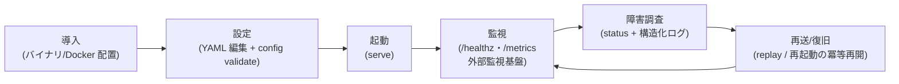
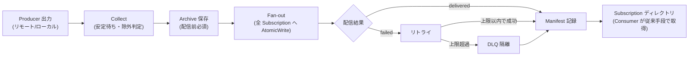
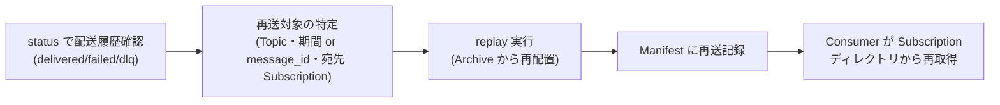
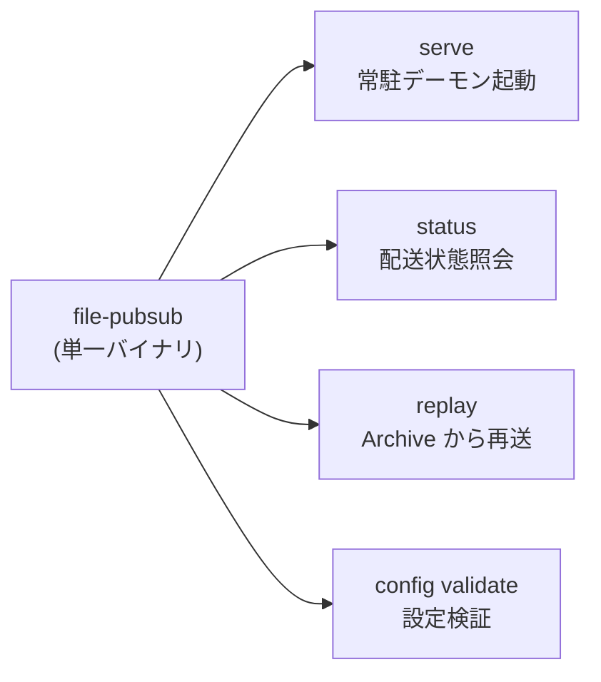

# UX デザイン仕様(運用者向け CLI/設定/観測 UX)

> 本システムは GUI を持たない Go 製常駐デーモン + 運用 CLI である(arch-design.yaml: tier-daemon-worker / tier-ops-cli)。
> 全体横断テンプレートの「画面・ポータル」前提は、_inference.md の方針に従い **運用者向け CLI / 設定 YAML / 観測エンドポイントの UX** として翻案する。
> RDRA に無い画面・機能(Web UI、対話モード等)は定義しない。

## 運用者ジャーニー

### 配信基盤運用業務: 導入から復旧までの全体ジャーニー

**アクター**: 配信基盤運用者
**ゴール**: Producer / Consumer を無改修のまま、ファイル配信を安定運用し、異常時は自力で調査・再送・復旧を完結する



**タッチポイント**:

| ステップ | 接点(画面の代替) | UC | 感情 | 改善機会 |
|---------|----------------|---|------|---------|
| 導入 | シングルバイナリ / Docker イメージ + docker compose 動作確認環境 | シングルバイナリ/Dockerイメージを配置する | ニュートラル | 追加ランタイム不要を README で明示し、レガシー現場でも迷わない導入手順にする |
| 設定 | 単一 YAML 設定ファイル + `config validate` | Topic・Subscriptionを設定する | ネガティブ(設定ミス不安) | 起動前に構文・参照整合エラーを検出し、エラー位置と修正方法を 1 メッセージで提示する |
| 起動 | `serve` サブコマンド + Lock | デーモンを起動する | ニュートラル | 二重起動・stale lock の判定結果を起動時メッセージで明示する |
| 監視 | /healthz・/metrics + 外部監視基盤(Prometheus/Grafana 等) | /healthzと/metricsをHTTPで公開する、外部監視基盤でTopic別メトリクスを観測する | ポジティブ(自動監視) | しきい値判定は外部監視基盤に委ね、本体はメトリクス契約の安定提供に徹する |
| 障害調査 | `status` サブコマンド + 構造化ログ | statusコマンドで配送状態を確認する、DLQ隔離メッセージを確認する、構造化ログを調査する | ネガティブ(障害対応) | message_id/topic/subscription で status とログを突き合わせ、外部の助けなしに原因特定を完結させる |
| 再送/復旧 | `replay` サブコマンド + 再起動(冪等再開) | 配送履歴から再送対象を確認する、再送(Replay)を実行する、冪等に処理を再開する | ニュートラル | 宛先 Subscription 指定で他 Consumer に影響なく遡及でき、再送履歴も Manifest に残る安心感を提供する |

### ファイル配信業務: 定常運転(デーモン自動実行)のジャーニー

**アクター**: 常駐デーモン(運用者は観測のみ)
**ゴール**: ポーリングサイクルごとに Collect → Archive → Fan-out を自動実行し、失敗はリトライ/DLQ で自己完結する



**タッチポイント**:

| ステップ | 接点 | UC | 感情 | 改善機会 |
|---------|------|---|------|---------|
| 収集 | 収集ソース(FTP/SFTP/SCP/ローカル) | ファイルを収集する(Collect) | ニュートラル | 書き込み中ファイルの安定待ち・除外パターンで誤収集を防ぐ |
| 保全 | archive/{topic}/ | Archiveに保存する | ポジティブ(履歴保全) | 同名再出力も別 message_id で履歴を失わない |
| 配信 | subscriptions/ 配下の各ディレクトリ | Subscriptionへ複製配信する(Fan-out) | ポジティブ | AtomicWrite で Consumer が不完全ファイルを掴まない |
| 失敗対処 | Manifest + DLQ | 配信失敗をリトライしDLQへ隔離する | ネガティブ(失敗) | 一時障害は自動回復、恒久障害は DLQ で滞留させず運用者判断へ |
| 取得 | Subscription ディレクトリ | Subscriptionディレクトリからファイルを取得する | ポジティブ(無改修) | Consumer は自分のタイミング(即時/夜間バッチ)で取得できる |

### ファイルを再送するフロー: 遡及・障害復旧のジャーニー

**アクター**: 配信基盤運用者(受益者: Consumerシステム担当者)
**ゴール**: 「先月分を再投入したい」等の遡及要望・障害復旧で、対象を特定して安全に再送する



**タッチポイント**:

| ステップ | 接点 | UC | 感情 | 改善機会 |
|---------|------|---|------|---------|
| 対象特定 | `status`(Manifest 照会) | 配送履歴から再送対象を確認する | ニュートラル | topic・Subscription・状態で絞り込み、再送判断に必要な情報だけを提示する |
| 再送実行 | `replay` | 再送(Replay)を実行する | ネガティブ(誤配置不安) | 宛先 Subscription を明示指定させ、指定先以外へは配置しないことを実行結果で確認できるようにする |
| 再取得 | Subscription ディレクトリ | Subscriptionディレクトリから再送ファイルを取得する | ポジティブ | 並行稼働中の他 Subscription に影響しない安全な遡及 |

## CLI コマンド体系(情報アーキテクチャの翻案)

### コマンドマップ

サブコマンドは arch-design.yaml SR-102「同一バイナリのサブコマンド構成」で定義された 4 つのみ。RDRA に無いサブコマンドは追加しない。



### サブコマンド設計

| サブコマンド | 役割 | 対応 UC | 主な入力 | 主な出力 |
|------------|------|--------|---------|---------|
| `serve` | 常駐デーモン起動。Lock 取得 → ポーリングサイクル(Collect→Archive→Fan-out→リトライ/DLQ→retention 削除)+ /metrics・/healthz 公開。停止シグナルで graceful shutdown | デーモンを起動する、デーモンをgraceful shutdownで停止する、冪等に処理を再開する | `--config` | 構造化ログ(JSON)、終了コード |
| `status` | Manifest を読み、message_id・topic・Subscription 別の配送状態(delivered / failed / dlq)を表示。DLQ 隔離メッセージの確認にも使う | statusコマンドで配送状態を確認する、DLQ隔離メッセージを確認する、配送履歴から再送対象を確認する | `--config`、絞り込み(topic / subscription / 状態) | 人間可読テーブル(ui-design.md 参照)、終了コード |
| `replay` | Topic・期間(またはメッセージ指定)・宛先 Subscription を指定して Archive から再配置。再送履歴も Manifest に記録 | 再送(Replay)を実行する | `--config`、topic・期間または message_id・宛先 subscription(必須) | 再配置結果サマリー、終了コード |
| `config validate` | 単一 YAML の構文・参照整合(Topic↔Subscription↔収集ソース↔認証情報参照)を起動前に検証 | Topic・Subscriptionを設定する | `--config` | 検証結果(エラー位置 + 修正指針)、終了コード |

### 共通フラグ

| フラグ | 意味 | 既定 |
|-------|------|------|
| `--config <path>` | 単一 YAML 設定ファイルのパス。全サブコマンド共通(CTP-003「単一 YAML 設定」)。設定が配信構成管理の唯一の起点であるため、すべての操作はこのファイルを参照して動く | 必須(運用スクリプトでの明示指定を推奨) |

### コマンド UX 原則(インタラクション設計原則の翻案)

| 原則 | 適用場面 | 具体的な設計 |
|------|---------|-----------|
| フィードフォワード(実行前検証) | `config validate`、`replay` の引数バリデーション | デーモン起動前・再配置前に誤りを検出し、誤った状態を作ってから気づかせない(LR-401: 不正な指定は実行前に終了コードで弾く) |
| 冪等性による安心感 | `serve` 再起動、`replay` 再実行 | 再実行しても二重配信しない(SR-003)。「もう一度実行してよいか」を運用者が悩まなくてよい |
| 結果の追跡可能性 | `replay`、Fan-out | すべての配送操作は Manifest に記録され(CTR-003)、`status` で後から確認できる |
| スクリプト親和性 | 全サブコマンド | 終了コード(0=正常/非0=異常)で成否を機械判定でき、運用自動化に組み込める(CTR-002) |
| 影響範囲の明示 | `replay` | 宛先 Subscription を明示指定させ、指定先以外に影響しないことを保証する(SP-102) |

## エラーメッセージ設計原則

CTR-002「エラーは終了コードと構造化ログで表現」、CTP-001「構造化ログ」に基づく。

1. **原因 + 対処を 1 メッセージで伝える**。原因だけのエラー(`delivery failed`)や対処だけの案内は禁止。運用者が外部の助けなしに障害調査を完結できる粒度とする。
2. **message_id・topic・subscription を必ず含める**。どのメッセージのどの Subscription 配信が失敗したかを 1 行で特定できること(情報「ログ」の属性要件)。配送に紐づかないエラー(設定エラー等)は該当フィールドを省略してよいが、特定に必要な代替コンテキスト(設定ファイルのキー位置等)を含める。
3. **スタックトレースを利用者向けの結果にしない**。CLI の標準出力には人間可読の原因 + 対処を、詳細は JSON 構造化ログ(ui-design.md のフィールド規約)に出す。
4. **終了コードで成否を機械判定可能にする**。メッセージ文言のパースを前提にしない(終了コード規約は ui-design.md 参照)。
5. **リトライ可否を区別して伝える**。一時的エラー(リトライで自動回復見込み)と恒久的エラー(DLQ 隔離・運用者対処が必要)を文言で区別する(LR-102 のエラー分類に対応)。

メッセージ構成の例(形式は ui-design.md のログ規約に従う):

```text
配信失敗: message_id=20260612T093001_orders_sales.csv topic=orders subscription=next
原因: 配置先ディレクトリへの書き込みに失敗 (permission denied)
対処: 配置先ディレクトリの権限と実行ユーザを確認してください。リトライ上限超過時は DLQ へ隔離されます
```

## 外部インターフェース一覧(Consumer / 監視基盤から見たシステム境界)

GUI を持たない本システムでは、以下のファイル/HTTP 規約が外部から見た「画面」に相当する。

### Subscription ディレクトリ規約(Consumer システム向け)

| 項目 | 規約 | 根拠 |
|------|------|------|
| 取得手段 | Consumer は自システム向け Subscription ディレクトリから従来手段でファイルを GET する(Consumer 無改修) | UC: Subscriptionディレクトリからファイルを取得する |
| ファイルの完全性 | 正式名のファイルは常に完全な内容。一時名(`file.csv.tmp`)で書き込み後に正式名(`file.csv`)へ rename される(AtomicWrite)。一時名のファイルは取得対象にしないこと | 条件: AtomicWrite配置 |
| 配送の独立性 | Subscription ごとに配送は独立。自分の取得・削除・取り込みタイミングは他 Subscription に影響せず、影響も受けない | 条件: 全Subscription同報配信 |
| 取り込みタイミング | 即時取り込み / 夜間バッチ等、Consumer 側の任意のタイミングでよい | バリエーション: Consumer取り込みタイミング |
| 順序 | メッセージの順序保証はない(Fan-out 配置はファイル名昇順処理)。取り込み順序の制御は Consumer 側の責任 | 条件: Fan-out処理順序 |
| 再送ファイル | 再送(Replay)も同じ Subscription ディレクトリへ同じ規約(AtomicWrite)で配置される。再送は宛先指定された Subscription にのみ届く | 条件: Replay記録 |

### HTTP エンドポイント規約(監視基盤向け)

HTTP API はこの 2 エンドポイントのみ(GET)。オンライン応答系は持たない(CTP-008)。

| エンドポイント | メソッド | 役割 | 規約 |
|--------------|---------|------|------|
| `/healthz` | GET | 死活監視 | デーモン稼働中に 200 を返す。外部監視基盤が 24 時間自動監視する(CTP-009) |
| `/metrics` | GET | Prometheus 形式メトリクス公開 | topic 別の最終収集時刻・処理件数・配信失敗数・DLQ 件数・滞留数を公開(契約詳細は data-visualization.md)。しきい値判定・アラート発報は外部監視基盤の責務 |

公開ポートは設定 YAML の `metrics_port`(情報「設定」)で指定する。

## アクセシビリティ方針(CLI への翻案)

- **カラー非依存**: 状態(delivered / failed / dlq)は文字列で表現し、端末色のみに意味を持たせない(色覚多様性・モノクロ端末・ログ転送対応)。
- **スクリーンリーダー / パイプ処理**: 出力はプレーンテキストのテーブル(罫線文字に依存しない整形)とし、`grep` / `awk` 等の標準ツールで処理できる行指向とする。
- **言語**: 運用者向けメッセージは導入先の運用言語に合わせる(エラーメッセージ設計原則に従い原因 + 対処を平易に記述)。
