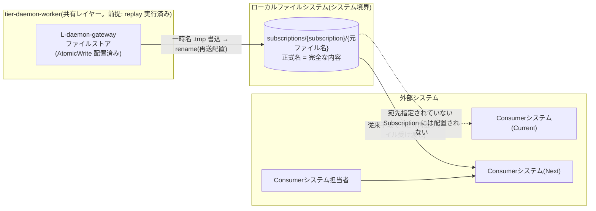
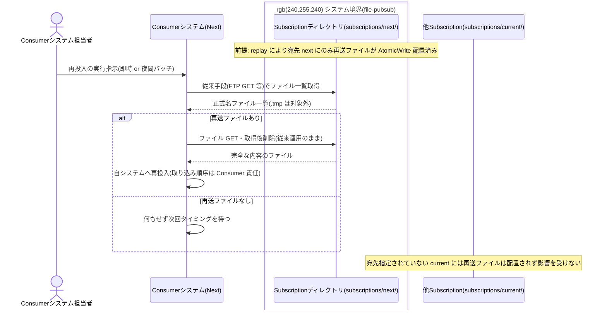

# Subscriptionディレクトリから再送ファイルを取得する

## 概要

Consumer システム(Current / Next)が、再送(Replay)されたファイルを自システム向け Subscription ディレクトリから従来手段(FTP GET 等)で取得し再投入する。再送は宛先 Subscription を指定して行われるため他 Subscription の配送に影響せず、Current / Next 並行稼働中でも安全に遡及処理できる。本 UC は Consumer 側の操作であり、システム(file-pubsub)側の責務は「宛先 Subscription ディレクトリへの配置保証」である。**システム境界の外部インターフェース仕様**として、Consumer から見た再送ファイル取得契約を定義する。

> 画面「再送ファイル受取画面」は GUI ではなく、Consumer から見た Subscription ディレクトリそのもの(ファイル IF)として実現する(_inference.md / ux-design.md「外部インターフェース一覧」)。

## データフロー



| レイヤー | データモデル | 変換内容 |
|---------|------------|---------|
| 共有 L-daemon-gateway(前提) | 再送ファイル(元ファイル名のまま、内容は pass-through) | replay により一時名 → 正式名 rename で配置済み(条件「AtomicWrite配置」経由の保証) |
| システム境界(Subscription ディレクトリ) | {配置先ディレクトリパス}/{元ファイル名} | 正式名のファイルは常に完全な内容。一時名(.tmp)は取得対象外 |
| Consumer 側 | 取得ファイル | 従来手段(FTP GET 等)で取得・削除し、即時 / 夜間バッチ等の自分のタイミングで再投入。取り込み順序の制御は Consumer 責任 |

## 処理フロー



## バリエーション一覧

| バリエーション名 | 値 | 処理内容 | 適用 tier | 適用箇所 |
|----------------|---|---------|----------|---------|
| Subscription種別 | current、next、test | 再送の宛先として指定された Subscription ディレクトリにのみ再送ファイルが現れる。並行稼働・検証用途を区別する | tier-daemon-worker(配置保証) | Subscription ディレクトリ |
| Consumer取り込みタイミング | 即時取り込み、夜間バッチ | Consumer は自分のタイミングで取得してよい。Subscription 独立配送がタイミング差を吸収する | 外部(Consumer 側) | 取得処理 |
| 配信方式 | 通常配信(Fan-out)、再送(Replay) | 再送(Replay)のファイルも通常配信と同じディレクトリ・同じ規約(正式名 = 完全な内容)で配置される | tier-daemon-worker(配置保証) | Subscription ディレクトリ |

## 分岐条件一覧

| 条件名 | 判定ルール | 適用 tier | 適用箇所 | BDD Scenario |
|--------|----------|----------|---------|-------------|
| Replay記録 | 再送は宛先 Subscription を指定して行われ、指定した Subscription にのみ再配置される。Consumer は自分宛ての再送ファイルだけを取得でき、他 Subscription の配送に影響しない | tier-daemon-worker(配置保証) | Subscription ディレクトリへの配置 | 宛先 Subscription だけが再送ファイルを取得できる |

## 計算ルール一覧

| 計算名 | 入力情報 | 計算式/ロジック | 出力情報 | 適用 tier |
|--------|---------|---------------|---------|----------|
| (該当なし) | - | この UC に計算ルールはない(取得・再投入のみ) | - | - |

## 状態遷移一覧

| 状態モデル | 遷移元 | 遷移先 | トリガー | 事前条件 | 事後処理 | 適用 tier |
|-----------|--------|--------|---------|---------|---------|----------|
| メッセージ配送状態 | (遷移なし・Consumer 側操作) | - | - | replay により配信中 → 配置完了が Manifest に記録済み | Consumer の取得・削除はシステムの配送状態に影響しない(配送の正は Manifest) | 外部(Consumer 側) |

## 関連 RDRA モデル

| モデル種別 | 要素名 | 関連 |
|-----------|--------|------|
| 業務 | ファイル配信業務 | このUCが属する業務 |
| BUC | ファイルを再送するフロー | このUCを含むBUC |
| アクティビティ | 再送ファイルを取り込む | このUCを含むアクティビティ |
| アクター | Consumerシステム担当者 | 再送ファイルを取得・再投入する(価値受益) |
| 画面 | 再送ファイル受取画面 | Subscription ディレクトリ(ファイル IF)として実現 |
| 情報 | Subscription | 参照(Subscription名、配置先ディレクトリパス、所属Topic)。取得元ディレクトリ |
| 条件 | Replay記録 | 宛先指定配置の保証(指定 Subscription にのみ再配置) |
| イベント | 再送ファイル受け渡し | システム → Consumer のファイル受け渡し |
| 外部システム | Consumerシステム(Current) | subscriptions/current から取得する現行システム |
| 外部システム | Consumerシステム(Next) | subscriptions/next から取得する更改後システム |
| バリエーション | Subscription種別 | 取得元の値域(current / next / test) |
| バリエーション | Consumer取り込みタイミング | 即時取り込み / 夜間バッチ |
| バリエーション | 配信方式 | 再送(Replay)ファイルの取得 |

## E2E 完了条件（BDD）

### 正常系

```gherkin
Feature: Subscriptionディレクトリから再送ファイルを取得する

  Scenario: 宛先 Subscription だけが再送ファイルを取得できる
    Given replay により message_id=20260601T091500_orders_orders_20260601.csv のファイル orders_20260601.csv が subscriptions の next 配置先ディレクトリにのみ配置済みである
    When Consumerシステム(Next) が従来手段(FTP GET)で subscription=next のディレクトリからファイルを取得する
    Then 完全な内容の orders_20260601.csv を取得でき current の配置先ディレクトリには再送ファイルが存在しない

  Scenario: 夜間バッチのタイミングでまとめて再投入できる
    Given replay により 2026-05 分の再送ファイル 20 件が subscriptions の next 配置先ディレクトリに配置済みである
    When Consumerシステム(Next) が夜間バッチ(02:00)で 20 件をまとめて取得・削除し自システムへ再投入する
    Then 20 件すべてが完全な内容で取り込まれ取得・削除は current の配送に影響しない

  Scenario: 並行稼働中の他 Consumer に影響しない
    Given Consumerシステム(Current) が subscriptions/current を通常配信の取得で利用中である
    When subscription=next への再送ファイル配置と Consumerシステム(Next) の取得が並行して行われる
    Then Consumerシステム(Current) の取得・削除・取り込みタイミングは影響を受けない
```

### 異常系

```gherkin
  Scenario: 一時名ファイルは取得対象にしない
    Given subscriptions の next 配置先ディレクトリに再配置中の一時名ファイル orders_20260601.csv.tmp が存在する
    When Consumerシステム(Next) がファイル一覧を取得する
    Then 一時名(.tmp)のファイルを取得対象から除外し正式名へ rename された後にのみ取得する
```

## ティア別仕様

- [常駐デーモン](tier-daemon-worker.md)（外部 IF 仕様: 配置保証の観点）

### 統合 API Spec

- [OpenAPI Spec](../../../_cross-cutting/api/openapi.yaml)（全 UC 統合。この UC に HTTP API はない）
- AsyncAPI Spec: 対象イベントなし(生成しない。ファイル受け渡しは Subscription ディレクトリ規約で定義)
