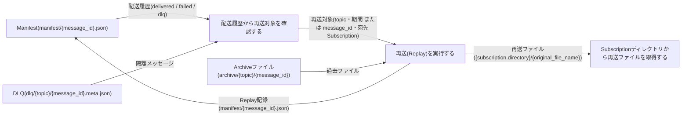
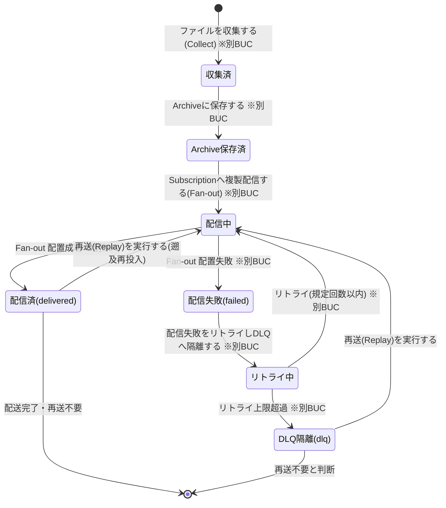

# ファイルを再送するフロー

## 概要

障害復旧や「先月分を再投入したい」等の遡及要望に対し、Manifest の配送履歴から再送対象を特定し、Archive 保存済みの過去ファイルを宛先 Subscription を指定して再送(Replay)する BUC。再送も Manifest に記録して追跡可能性を維持し、他 Subscription の配送に影響を与えずに遡及処理できる。

## 所属 UC 一覧

| UC名 | アクター | 主な操作 | 関連情報 |
|------|---------|---------|---------|
| [配送履歴から再送対象を確認する](<配送履歴から再送対象を確認する/spec.md>) | 運用者 | status コマンドで Manifest の配送履歴(delivered / failed / dlq)を照会し、再送対象の Topic・期間(またはメッセージ)と宛先 Subscription を特定する | Manifest、メッセージ、Topic、Subscription、DLQ |
| [再送(Replay)を実行する](<再送(Replay)を実行する/spec.md>) | 運用者 | replay コマンドで archive/{topic}/{message_id} の過去ファイルを宛先 Subscription へ再配置し、Replay 記録を Manifest に残す | Archiveファイル、メッセージ、Topic、Subscription、Manifest |
| [Subscriptionディレクトリから再送ファイルを取得する](<Subscriptionディレクトリから再送ファイルを取得する/spec.md>) | Consumerシステム担当者(価値受益) / Consumerシステム(Current/Next)(外部) | 再送されたファイルを自システム向け {subscription.directory} から従来手段で取得し再投入する | Subscription |

## UC 横断データフロー

BUC 内の UC 間で情報がどう流れるかを示す。情報がどの UC で作成(C)・参照(R)・更新(U)されるかを明記する。

### データフロー図

### 情報 CRUD マトリクス

| 情報名 | 配送履歴から再送対象を確認する | 再送(Replay)を実行する | Subscriptionディレクトリから再送ファイルを取得する |
|--------|:---:|:---:|:---:|
| Manifest(manifest/{message_id}.json) | R | U | |
| メッセージ | R | U | |
| Topic | R | R | |
| Subscription | R | R | R |
| DLQ(dlq/{topic}/{message_id}.meta.json) | R | R | |
| Archiveファイル(archive/{topic}/{message_id}) | | R | |
| 再送ファイル({subscription.directory}/{original_file_name}) | | C | R |

- 再送(Replay)を実行する の Manifest「U」は Replay の配送履歴追記(再送記録)を表し、メッセージの「U」は配送状態の遷移(dlq / delivered → 配信中)を表す。
- Consumer の取得・削除(取得 UC)は Manifest の配送状態に影響しない(配送の正は Manifest)。

## 状態遷移全体図

本 BUC が遷移を担当する状態モデルはメッセージ配送状態。状態.tsv の全遷移行を示し、本 BUC 外の UC が担当する遷移は所属 BUC を併記する。

### 状態遷移 UC マッピング

| 状態モデル | 遷移元 | 遷移先 | 担当 UC |
|-----------|--------|--------|--------|
| メッセージ配送状態 | (初期) | 収集済 | ファイルを収集する(Collect)(別BUC: ファイルを収集して配信するフロー) |
| メッセージ配送状態 | 収集済 | Archive保存済 | Archiveに保存する(別BUC: ファイルを収集して配信するフロー) |
| メッセージ配送状態 | Archive保存済 | 配信中 | Subscriptionへ複製配信する(Fan-out)(別BUC: ファイルを収集して配信するフロー) |
| メッセージ配送状態 | 配信中 | 配信済(delivered) | Subscriptionへ複製配信する(Fan-out)(別BUC: ファイルを収集して配信するフロー) |
| メッセージ配送状態 | 配信中 | 配信失敗(failed) | Subscriptionへ複製配信する(Fan-out)(別BUC: ファイルを収集して配信するフロー) |
| メッセージ配送状態 | 配信失敗(failed) | リトライ中 | 配信失敗をリトライしDLQへ隔離する(別BUC: ファイルを収集して配信するフロー) |
| メッセージ配送状態 | リトライ中 | 配信中 | 配信失敗をリトライしDLQへ隔離する(別BUC: ファイルを収集して配信するフロー) |
| メッセージ配送状態 | リトライ中 | DLQ隔離(dlq) | 配信失敗をリトライしDLQへ隔離する(別BUC: ファイルを収集して配信するフロー) |
| メッセージ配送状態 | DLQ隔離(dlq) | 配信中 | [再送(Replay)を実行する](<再送(Replay)を実行する/spec.md>) |
| メッセージ配送状態 | 配信済(delivered) | 配信中 | [再送(Replay)を実行する](<再送(Replay)を実行する/spec.md>) |
| メッセージ配送状態 | 配信済(delivered) | (終了) | (UC遷移なし。全宛先配送完了・再送不要の終了状態) |
| メッセージ配送状態 | DLQ隔離(dlq) | (終了) | (UC遷移なし。運用者が再送不要と判断した終了状態) |

- 配送履歴から再送対象を確認する / Subscriptionディレクトリから再送ファイルを取得する は状態を遷移させない(参照・取得のみ)。再送判断の入力として delivered / failed / dlq を読み取る。

## BUC 内共有条件一覧

本 BUC 内の UC に適用される条件.tsv の条件と、適用先 UC の一覧。2 つ以上の UC で適用されるものが「共有」。

| 条件名 | 条件の説明 | 適用 UC | 共有 |
|--------|----------|--------|:---:|
| Replay記録 | Archive からの再送(Replay)は Topic・期間(またはメッセージ指定)・宛先 Subscription を指定して実行し、指定した Subscription にのみ再配置する。Replay の配送履歴も Manifest に記録する | 再送(Replay)を実行する、Subscriptionディレクトリから再送ファイルを取得する | 共有 |
| AtomicWrite配置 | Subscription ディレクトリへの配置は一時名({original_file_name}.tmp)で書き込んでから正式名へ rename する。正式名のファイルは常に完全な内容であることを保証する | 再送(Replay)を実行する | |

単一 UC のみで適用される条件の詳細は各 UC Spec の「分岐条件一覧」を参照。配送履歴から再送対象を確認する には条件.tsv の直接適用条件はない(参照のみの UC。配送状態の値域は Manifest の語彙 delivered / failed / dlq に従う)。

## BUC 内共有バリエーション一覧

本 BUC 内の UC に適用されるバリエーション.tsv のバリエーションと、適用先 UC の一覧。2 つ以上の UC で適用されるものが「共有」。

| バリエーション名 | 値 | 適用 UC | 共有 |
|----------------|---|--------|:---:|
| 配信方式 | 通常配信(Fan-out)、再送(Replay) | 配送履歴から再送対象を確認する(REPLAY 列の表示)、再送(Replay)を実行する、Subscriptionディレクトリから再送ファイルを取得する | 共有 |
| Subscription種別 | current、next、test | 配送履歴から再送対象を確認する(絞り込み・宛先特定)、再送(Replay)を実行する(宛先指定)、Subscriptionディレクトリから再送ファイルを取得する(宛先分離) | 共有 |
| Consumer取り込みタイミング | 即時取り込み、夜間バッチ | Subscriptionディレクトリから再送ファイルを取得する | |
