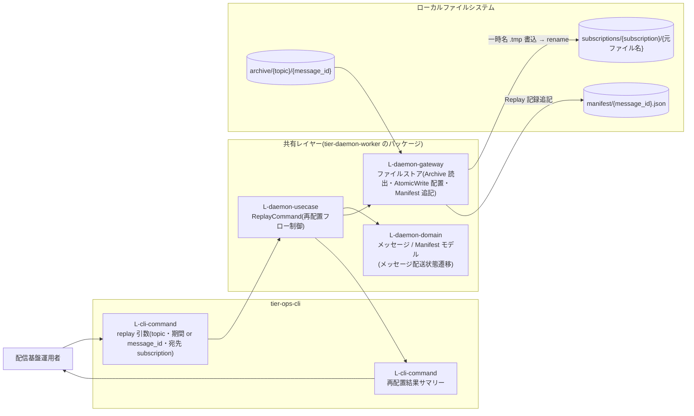
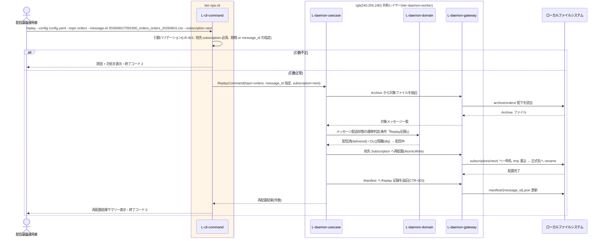

# 再送(Replay)を実行する

## 概要

配信基盤運用者が `replay` サブコマンドで、Archive に保存済みの過去ファイルを Topic・期間(またはメッセージ指定)・宛先 Subscription を指定して再送する。Archive から宛先 Subscription ディレクトリへ AtomicWrite で再配置し、再送の配送履歴も Manifest に記録して追跡可能性を維持する(条件「Replay記録」)。指定した Subscription にのみ再配置し、他 Subscription の配送に影響しない(SP-102)。

> GUI は存在しない。RDRA の画面「再送実行画面」は運用 CLI(`replay` サブコマンド)として実現する(_inference.md / ux-design.md)。実処理(再配置・Manifest 記録)は tier-daemon-worker と共有する usecase 層が担う(CLP-101)。

## データフロー



| レイヤー | データモデル | 変換内容 |
|---------|------------|---------|
| CLI L-cli-command | replay 引数(`--config` 必須、topic、期間または message_id、宛先 subscription 必須) | 引数バリデーション(LR-401: 不正な指定は実行前に終了コードで弾く)+ ReplayCommand への変換 |
| 共有 L-daemon-usecase | ReplayCommand(topic, from/to または message_id, subscription) | Archive からの対象抽出 → 宛先 Subscription への再配置 → Manifest 記録のフロー制御 |
| 共有 L-daemon-domain | メッセージ(message_id、Topic名、元ファイル名、収集時刻)、Manifest(Subscription別配送状態、再送(Replay)記録) | メッセージ配送状態の遷移判定(dlq / delivered → 配信中)、対象期間の絞り込み |
| 共有 L-daemon-gateway | Archiveファイル(保存先パス(Topic別)、message_id、元ファイル名、ファイル内容)、Subscription 配置レコード、Manifest レコード | Archive 読出 → 一時名書込 → rename(AtomicWrite、LR-301)→ Manifest へ Replay 記録追記 |
| 出力 | 再配置結果サマリー(対象 topic、指定期間または message_id、宛先 Subscription、再配置件数) | `status` で再送履歴を確認できることを案内(ui-design.md) |

## 処理フロー



## バリエーション一覧

| バリエーション名 | 値 | 処理内容 | 適用 tier | 適用箇所 |
|----------------|---|---------|----------|---------|
| 配信方式 | 通常配信(Fan-out)、再送(Replay) | この UC は再送(Replay)。Archive から Topic・期間・宛先 Subscription を指定して再配置し、Manifest に Replay として記録する(通常配信は全 Subscription へ複製、再送は指定 Subscription のみ) | tier-ops-cli / 共有 usecase | replay コマンド全体・Manifest 記録 |
| Subscription種別 | current、next、test | 宛先 Subscription の値域。並行稼働中の特定 Consumer(例: next)だけに遡及再送できる | tier-ops-cli | `--subscription` 引数 |

## 分岐条件一覧

| 条件名 | 判定ルール | 適用 tier | 適用箇所 | BDD Scenario |
|--------|----------|----------|---------|-------------|
| Replay記録 | 再送は Topic・期間(またはメッセージ指定)・宛先 Subscription を指定して実行し、指定した Subscription にのみ再配置する。Replay の配送履歴も Manifest に記録する | tier-ops-cli / 共有 usecase | replay の引数バリデーション・再配置・Manifest 記録 | message_id 指定で宛先 Subscription にのみ再送する |
| AtomicWrite配置 | Subscription ディレクトリへの配置は一時名(file.csv.tmp)で書き込んでから正式名(file.csv)へ rename する。正式名のファイルは常に完全な内容であることを保証する | 共有 gateway | 宛先 Subscription への再配置 | 再配置中の一時名ファイルは Consumer の取得対象にならない |

## 計算ルール一覧

| 計算名 | 入力情報 | 計算式/ロジック | 出力情報 | 適用 tier |
|--------|---------|---------------|---------|----------|
| 再送対象抽出 | Archiveファイル(message_id、保存日時)、replay 引数(topic、期間 from/to または message_id) | message_id 指定時は完全一致 1 件。期間指定時は対象 topic の Archive のうち収集時刻が期間内のものを抽出(message_id は収集時刻 + Topic + 元ファイル名から採番されているため期間で特定できる) | 再送対象メッセージ一覧・再配置件数 | 共有 usecase / domain |

## 状態遷移一覧

| 状態モデル | 遷移元 | 遷移先 | トリガー | 事前条件 | 事後処理 | 適用 tier |
|-----------|--------|--------|---------|---------|---------|----------|
| メッセージ配送状態 | DLQ隔離(dlq) | 配信中 | 再送(Replay)を実行する | 対象メッセージが Archive に保存済みであり、運用者が status で状況確認のうえ再送を判断した | 宛先 Subscription へ AtomicWrite で再配置し、Manifest に Replay の配送履歴を記録する | tier-ops-cli / 共有 usecase |
| メッセージ配送状態 | 配信済(delivered) | 配信中 | 再送(Replay)を実行する | 「先月分を再投入したい」等の遡及処理として Topic・期間(またはメッセージ指定)・宛先 Subscription が指定された | 宛先 Subscription へ再配置し、再送も Manifest に記録する | tier-ops-cli / 共有 usecase |

## 関連 RDRA モデル

| モデル種別 | 要素名 | 関連 |
|-----------|--------|------|
| 業務 | ファイル配信業務 | このUCが属する業務 |
| BUC | ファイルを再送するフロー | このUCを含むBUC |
| アクティビティ | 過去ファイルを再送する | このUCを含むアクティビティ |
| アクター | 配信基盤運用者 | replay を実行する(価値提供) |
| 画面 | 再送実行画面 | CLI `replay` サブコマンドとして実現 |
| 情報 | Archiveファイル | 参照(保存先パス(Topic別)、Topic名、message_id、元ファイル名、ファイル内容、保存日時、保持期限)。再送の読出元 |
| 情報 | メッセージ | 参照(message_id、Topic名、元ファイル名、収集時刻)。再送対象の単位 |
| 情報 | Topic | 参照(Topic名)。再送対象の指定キー |
| 情報 | Subscription | 参照(Subscription名、配置先ディレクトリパス、所属Topic)。宛先指定・再配置先 |
| 情報 | Manifest | 更新(再送(Replay)記録、Subscription別配送状態、配送日時)。再送履歴の記録先 |
| 条件 | Replay記録 | 適用される条件(宛先指定・Manifest 記録) |
| 条件 | AtomicWrite配置 | 適用される条件(再配置の書き込み規約) |
| 状態 | メッセージ配送状態 | DLQ隔離(dlq) → 配信中、配信済(delivered) → 配信中 |
| バリエーション | 配信方式 | 再送(Replay)に該当 |
| バリエーション | Subscription種別 | 宛先の値域(current / next / test) |
| 外部システム | Consumerシステム(Current)、Consumerシステム(Next) | 再配置後に Subscription ディレクトリから取得する(後続 UC) |

## E2E 完了条件（BDD）

### 正常系

```gherkin
Feature: 再送(Replay)を実行する

  Scenario: message_id 指定で宛先 Subscription にのみ再送する
    Given archive/orders/ に message_id=20260601T091500_orders_orders_20260601.csv のファイルが保存済みで manifest 上の subscription=next の配送状態が dlq である
    When 配信基盤運用者が「replay --config config.yaml --topic orders --message-id 20260601T091500_orders_orders_20260601.csv --subscription next」を実行する
    Then subscriptions の next 配置先ディレクトリに orders_20260601.csv が正式名で配置され manifest に Replay の配送履歴が記録され current の配置先ディレクトリには何も配置されず終了コード 0 で終了する

  Scenario: 期間指定で先月分を一括再送する
    Given archive/orders/ に収集時刻が 2026-05-01 から 2026-05-31 の message_id を持つファイルが 20 件保存済みである
    When 配信基盤運用者が「replay --config config.yaml --topic orders --from 2026-05-01 --to 2026-05-31 --subscription next」を実行する
    Then 20 件すべてが subscriptions の next 配置先ディレクトリへ AtomicWrite で再配置され再配置件数 20 を含むサマリーが表示され manifest の各 message_id に Replay 記録が追記される

  Scenario: 再送結果を status で追跡できる
    Given message_id=20260601T091500_orders_orders_20260601.csv を subscription=next へ replay 済みである
    When 配信基盤運用者が「status --config config.yaml --topic orders」を実行する
    Then 該当行の REPLAY 列に replay が表示され再送の追跡可能性が維持されている
```

### 異常系

```gherkin
  Scenario: 宛先 Subscription 未指定は実行前に弾かれる
    Given archive/orders/ に再送可能なファイルが存在する
    When 配信基盤運用者が「replay --config config.yaml --topic orders --message-id 20260601T091500_orders_orders_20260601.csv」を宛先指定なしで実行する
    Then 引数バリデーションにより原因(宛先 subscription 必須)と対処が表示され再配置は一切行われず終了コード 2 で終了する

  Scenario: 設定に存在しない宛先 Subscription は実行前に弾かれる
    Given 設定 YAML の topic=orders の subscriptions に「staging」が定義されていない
    When 配信基盤運用者が「replay --config config.yaml --topic orders --message-id 20260601T091500_orders_orders_20260601.csv --subscription staging」を実行する
    Then 原因と対処が表示され終了コード 2 で終了する

  Scenario: 宛先ディレクトリへの書き込み失敗は実行時エラーとなり中途半端な状態を残さない
    Given subscriptions の next 配置先ディレクトリに実行ユーザの書き込み権限がない
    When 配信基盤運用者が「replay --config config.yaml --topic orders --message-id 20260601T091500_orders_orders_20260601.csv --subscription next」を実行する
    Then 一時名(.tmp)のファイルが正式名に rename されることはなく原因 + 対処が表示され終了コード 1 で終了する
```

## ティア別仕様

- [運用 CLI](tier-ops-cli.md)

### 統合 API Spec

- [OpenAPI Spec](../../../_cross-cutting/api/openapi.yaml)（全 UC 統合。この UC に HTTP API はない）
- AsyncAPI Spec: 対象イベントなし(生成しない)
