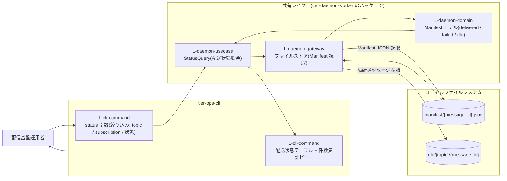
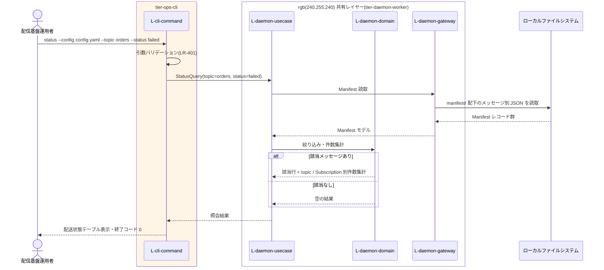

# 配送履歴から再送対象を確認する

## 概要

障害復旧や「先月分を再投入したい」等の遡及要望を受け、配信基盤運用者が `status` サブコマンドで Manifest の配送履歴(message_id・topic・Subscription 別の delivered / failed / dlq)を照会し、再送対象の Topic・期間(またはメッセージ)と宛先 Subscription を特定する。本 UC は参照のみで状態を変更しない。

> GUI は存在しない。RDRA の画面「配送履歴照会画面」は運用 CLI(`status` サブコマンド)の出力として実現する(_inference.md / ux-design.md)。

## データフロー



| レイヤー | データモデル | 変換内容 |
|---------|------------|---------|
| CLI L-cli-command | status 引数(`--config` 必須、絞り込み: topic / subscription / 状態) | 引数バリデーション(LR-401)+ StatusQuery への変換 |
| 共有 L-daemon-usecase | StatusQuery(topic, subscription, status) | Manifest 照会のフロー制御(CLR-101: CLI からのデータアクセスは共有 usecase 経由) |
| 共有 L-daemon-domain | Manifest モデル(message_id、Topic名、Subscription別配送状態 delivered / failed / dlq、リトライ回数、配送日時、再送(Replay)記録) | 絞り込み・topic / Subscription 別の件数集計 |
| 共有 L-daemon-gateway | Manifest レコード(メッセージ別 JSON ファイル) | manifest/ 配下の JSON 読取 → ドメインモデル変換 |
| 出力 | 配送状態テーブル(MESSAGE_ID / TOPIC / SUBSCRIPTION / STATUS / RETRY / DELIVERED_AT / REPLAY)+ 集計ビュー | ui-design.md の列規約に従う人間可読テーブル。終了コードで成否を機械判定 |

## 処理フロー



## バリエーション一覧

| バリエーション名 | 値 | 処理内容 | 適用 tier | 適用箇所 |
|----------------|---|---------|----------|---------|
| 配信方式 | 通常配信(Fan-out)、再送(Replay) | REPLAY 列の表示切替(再送(Replay)による配送は `replay`、通常配信は `-`)。Manifest の再送(Replay)記録から判定 | tier-ops-cli | status のテーブル表示 |
| Subscription種別 | current、next、test | SUBSCRIPTION 列・subscription 絞り込みの値域。再送の宛先 Subscription 特定に使う | tier-ops-cli | status の絞り込み・表示 |

## 分岐条件一覧

| 条件名 | 判定ルール | 適用 tier | 適用箇所 | BDD Scenario |
|--------|----------|----------|---------|-------------|
| (条件.tsv 該当なし) | この UC に適用される条件.tsv の条件はない(参照のみの UC)。配送状態の値域は Manifest の語彙(delivered / failed / dlq)に従う | tier-ops-cli | status 照会 | - |

## 計算ルール一覧

| 計算名 | 入力情報 | 計算式/ロジック | 出力情報 | 適用 tier |
|--------|---------|---------------|---------|----------|
| 配送状態件数集計 | Manifest の Subscription別配送状態(delivered / failed / dlq) | topic / Subscription 別に状態ごとの件数を合計する(LP-401「status の出力整形」) | topic / Subscription 別の delivered / failed / dlq 件数 | tier-ops-cli |

## 状態遷移一覧

| 状態モデル | 遷移元 | 遷移先 | トリガー | 事前条件 | 事後処理 | 適用 tier |
|-----------|--------|--------|---------|---------|---------|----------|
| メッセージ配送状態 | (遷移なし・参照のみ) | - | - | - | 配信済(delivered) / 配信失敗(failed) / DLQ隔離(dlq) を読み取り再送判断の入力にする。後続 UC「再送(Replay)を実行する」が遷移させる | tier-ops-cli |

## 関連 RDRA モデル

| モデル種別 | 要素名 | 関連 |
|-----------|--------|------|
| 業務 | ファイル配信業務 | このUCが属する業務 |
| BUC | ファイルを再送するフロー | このUCを含むBUC |
| アクティビティ | 再送対象を特定する | このUCを含むアクティビティ |
| アクター | 配信基盤運用者 | status で配送履歴を照会する(価値提供) |
| 画面 | 配送履歴照会画面 | CLI `status` サブコマンドの出力として実現 |
| 情報 | Manifest | 参照(message_id、Topic名、Subscription別配送状態(delivered / failed / dlq)、リトライ回数、配送日時、再送(Replay)記録) |
| 情報 | メッセージ | 参照(message_id(収集時刻 + Topic + 元ファイル名から採番)、Topic名、元ファイル名、収集時刻) |
| 情報 | Topic | 参照(Topic名、説明)。絞り込みキー |
| 情報 | Subscription | 参照(Subscription名、配置先ディレクトリパス、所属Topic)。宛先特定キー |
| 情報 | DLQ | 参照(隔離メッセージ(message_id)、隔離理由、失敗回数、隔離日時)。dlq 状態の再送対象特定 |
| 状態 | メッセージ配送状態 | delivered / failed / dlq の現在状態を参照(遷移はしない) |
| バリエーション | 配信方式 | REPLAY 列の表示判定 |
| バリエーション | Subscription種別 | SUBSCRIPTION 列の値域 |

## E2E 完了条件（BDD）

### 正常系

```gherkin
Feature: 配送履歴から再送対象を確認する

  Scenario: failed のメッセージを topic と状態で絞り込んで再送対象を特定する
    Given manifest/ に message_id=20260601T091500_orders_orders_20260601.csv の Manifest が記録されており subscription=next の配送状態が failed である
    When 配信基盤運用者が「status --config config.yaml --topic orders --status failed」を実行する
    Then MESSAGE_ID=20260601T091500_orders_orders_20260601.csv TOPIC=orders SUBSCRIPTION=next STATUS=failed の行が表示され終了コード 0 で終了する

  Scenario: 遡及再送のために期間内の delivered メッセージと宛先 Subscription を特定する
    Given manifest/ に 2026-05-01 から 2026-05-31 に配送された topic=orders の delivered 記録が 20 件存在する
    When 配信基盤運用者が「status --config config.yaml --topic orders」を実行し DELIVERED_AT 列で 2026-05 の行を確認する
    Then 期間内 20 件の message_id と SUBSCRIPTION 列(current / next)が表示され再送対象の Topic・期間・宛先 Subscription を特定できる

  Scenario: dlq 状態のメッセージを再送対象候補として確認する
    Given manifest/ に message_id=20260611T220500_invoices_inv_0042.csv の subscription=current の配送状態が dlq と記録されている
    When 配信基盤運用者が「status --config config.yaml --status dlq」を実行する
    Then STATUS=dlq の行と topic / Subscription 別の件数集計が表示され再送(Replay)判断の入力にできる
```

### 異常系

```gherkin
  Scenario: Manifest の読み取りに失敗した場合は実行時エラーとなる
    Given manifest/ ディレクトリに実行ユーザの読み取り権限がない
    When 配信基盤運用者が「status --config config.yaml」を実行する
    Then 標準エラー出力に原因(読み取り失敗)と対処(権限と実行ユーザの確認)が表示され終了コード 1 で終了する

  Scenario: 不正な絞り込み引数は実行前に弾かれる
    Given 設定 YAML に存在しない topic 名「unknown-topic」を指定する
    When 配信基盤運用者が「status --config config.yaml --topic unknown-topic」を実行する
    Then 引数バリデーションで原因と対処が表示され終了コード 2 で終了する
```

## ティア別仕様

- [運用 CLI](tier-ops-cli.md)

### 統合 API Spec

- [OpenAPI Spec](../../../_cross-cutting/api/openapi.yaml)（全 UC 統合。この UC に HTTP API はない）
- AsyncAPI Spec: 対象イベントなし(生成しない)
