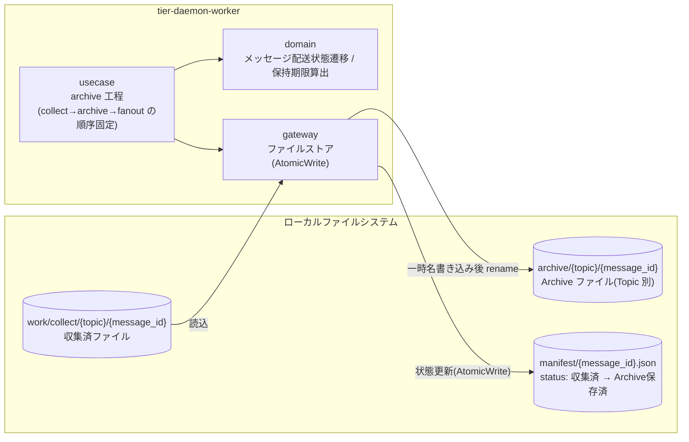
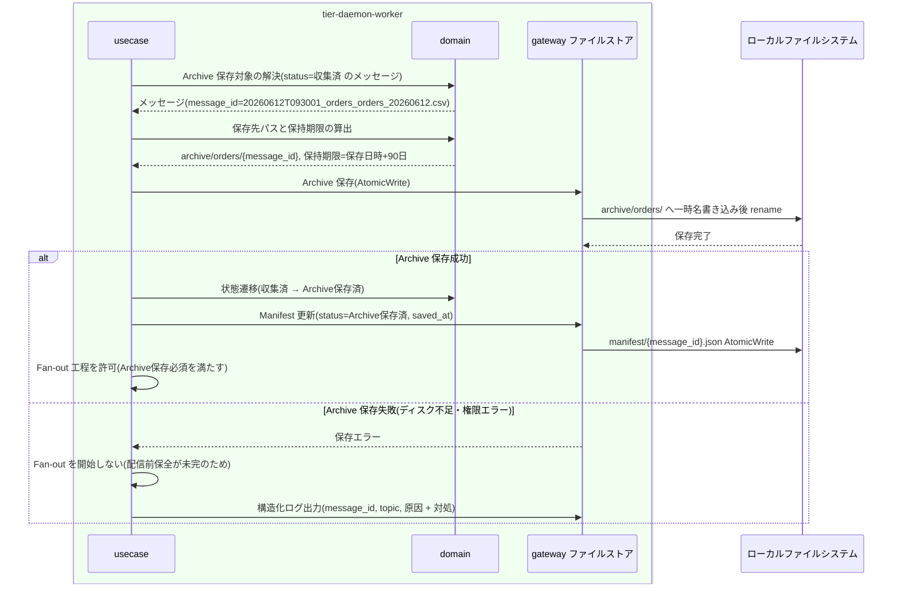

# Archiveに保存する

## 概要

収集したファイルを配信(Fan-out)の前に必ず `archive/` 配下へ Topic 別に保存する。同名ファイルの再出力は上書きせず、収集時刻 + Topic + 元ファイル名から採番した別 message_id の新しいメッセージとして扱い履歴を失わない。Archive 保存が完了するまで配信を開始せず(条件「Archive保存必須」)、メッセージ配送状態を「収集済」から「Archive保存済」へ遷移させる。Archive は再送(Replay)・監査・障害復旧・差分比較の基盤となる。

> 本システムは GUI を持たない。RDRA の画面「Archive保存管理画面」は、常駐デーモンの自動実行 + 構造化ログ / status による観測として実現する。HTTP API はこの UC には存在しない。

## データフロー



| レイヤー | データモデル | 変換内容 |
|---------|------------|---------|
| usecase | Archive 保存コマンド(message_id 単位) | collect→archive→fanout の順序を固定し、保存完了を確認してから Fan-out を許可(LR-101) |
| domain | メッセージ(収集済) → Archiveファイル(保存先パス、保持期限) | Topic 別保存先パスの解決、保持期限(保存日時 + retention)の算出、状態遷移(収集済→Archive保存済) |
| gateway | 収集済ファイル実体 → Archive ファイル + Manifest 更新 | AtomicWrite(一時名→rename)で保存・記録(LR-301) |

## 処理フロー



## バリエーション一覧

この UC に直接対応するバリエーションはない(Archive 保存は収集ソース種別・配信方式に依存しない共通工程)。

| バリエーション名 | 値 | 処理内容 | 適用 tier | 適用箇所 |
|----------------|---|---------|----------|---------|
| (該当なし) | - | - | - | - |

## 分岐条件一覧

| 条件名 | 判定ルール | 適用 tier | 適用箇所 | BDD Scenario |
|--------|----------|----------|---------|-------------|
| Archive保存必須 | 収集したファイルは配信(Fan-out)の前に必ず archive/ 配下へ Topic 別に保存する。Archive 保存が完了するまで配信を開始しない | tier-daemon-worker | usecase の工程順序制御(LR-101) | Archive 保存が完了するまで配信を開始しない |
| message_id採番 | 同名ファイルの再出力は別 message_id の新しいメッセージとして保存し、上書きで履歴を失わない | tier-daemon-worker | domain 保存先パス解決(パスに message_id を含める) | 同名ファイルの再出力を上書きせずに保存する |

## 計算ルール一覧

| 計算名 | 入力情報 | 計算式/ロジック | 出力情報 | 適用 tier |
|--------|---------|---------------|---------|----------|
| 保存先パス解決 | メッセージ(Topic名、message_id) | `archive/{topic}/{message_id}`(Topic 別 + message_id でユニーク) | Archiveファイル.保存先パス(Topic別) | tier-daemon-worker |
| 保持期限算出 | Archiveファイル(保存日時)、設定(Archive保持期間 retention) | 保持期限 = 保存日時 + retention 日数(例: 2026-06-12 保存 + 90 日 = 2026-09-10) | Archiveファイル.保持期限 | tier-daemon-worker |

## 状態遷移一覧

| 状態モデル | 遷移元 | 遷移先 | トリガー | 事前条件 | 事後処理 | 適用 tier |
|-----------|--------|--------|---------|---------|---------|----------|
| メッセージ配送状態 | 収集済 | Archive保存済 | Archiveに保存する | 収集済ファイルが work 領域に存在する | Manifest 更新。Fan-out 工程を許可 | tier-daemon-worker |
| Archiveファイル保持状態 | (初期) | 保持中 | Archiveに保存する | Archive 保存(AtomicWrite)成功 | 保持期限(保存日時 + retention)で管理を開始 | tier-daemon-worker |

## 関連 RDRA モデル

| モデル種別 | 要素名 | 関連 |
|-----------|--------|------|
| 業務 | ファイル配信業務 | この UC が属する業務 |
| BUC | ファイルを収集して配信するフロー | この UC を含む BUC |
| アクター | 配信基盤運用者 | 保存の自動実行を観測する(立場: 価値提供。実行主体は常駐デーモン) |
| 情報 | Archiveファイル | この UC で作成。属性: 保存先パス(Topic別)、Topic名、message_id、元ファイル名、ファイル内容、保存日時、保持期限 |
| 情報 | メッセージ | 状態を遷移させる。属性: message_id(収集時刻 + Topic + 元ファイル名から採番)、Topic名、元ファイル名、収集時刻 |
| 情報 | Topic | 保存先パスの単位。属性: Topic名、説明 |
| 状態 | メッセージ配送状態 | 収集済→Archive保存済 |
| 状態 | Archiveファイル保持状態 | (初期)→保持中 |
| 条件 | Archive保存必須 / message_id採番 | 分岐条件一覧参照 |
| バリエーション | (該当なし) | - |
| 画面 | Archive保存管理画面 | 常駐デーモンの自動実行 + 構造化ログ / status 観測として翻案(GUI なし) |
| 外部システム | (該当なし) | Archive 保存はシステム内で完結する |

## E2E 完了条件（BDD）

### 正常系

```gherkin
Feature: Archiveに保存する

  Scenario: 収集したファイルを Topic 別に Archive へ保存する
    Given message_id「20260612T093001_orders_orders_20260612.csv」のメッセージが配送状態「収集済」である
    And 設定の archive_retention が 90 日である
    When Archive 保存工程が実行される
    Then ファイルが archive/orders/20260612T093001_orders_orders_20260612.csv へ AtomicWrite で保存される
    And Manifest の配送状態が「Archive保存済」に更新され、保持期限が保存日時 + 90 日で記録される
    And Archiveファイル保持状態が「保持中」になる

  Scenario: 同名ファイルの再出力を上書きせずに保存する
    Given archive/orders/ に message_id「20260612T093001_orders_orders_20260612.csv」が保存済みである
    And 同名の元ファイル「orders_20260612.csv」が message_id「20260612T101502_orders_orders_20260612.csv」として収集された
    When Archive 保存工程が実行される
    Then archive/orders/ に両方の message_id のファイルが別ファイルとして存在し、履歴は失われない

  Scenario: Archive 保存完了後にのみ Fan-out が許可される
    Given message_id「20260612T093001_orders_orders_20260612.csv」の Archive 保存が完了し配送状態が「Archive保存済」である
    When ポーリングサイクルが次工程へ進む
    Then 当該メッセージの Fan-out(Subscription への複製配信)が開始される
```

### 異常系

```gherkin
  Scenario: Archive 保存が完了するまで配信を開始しない
    Given message_id「20260612T093001_orders_orders_20260612.csv」の Archive 保存がディスク容量不足で失敗した
    When ポーリングサイクルが次工程へ進む
    Then 当該メッセージの Fan-out は開始されず、配送状態は「収集済」のまま保持される
    And message_id・topic を含む構造化ログ(event_type=Archive保存失敗、原因 + 対処)が出力される
    And 次のポーリングサイクルで Archive 保存が再試行される

  Scenario: 保存中断時に不完全な Archive ファイルを残さない
    Given archive/orders/ への書き込み中にデーモンが異常終了した
    When デーモンが再起動して Archive 保存工程が再実行される
    Then 一時名のファイルだけが残り正式名の不完全ファイルは存在しない
    And 再実行により正式名の完全な Archive ファイルが作成される
```

## ティア別仕様

- [常駐デーモン](tier-daemon-worker.md)

### 統合 API Spec

- [OpenAPI Spec](../../../_cross-cutting/api/openapi.yaml)（全 UC 統合。この UC に HTTP API はない）
- AsyncAPI Spec: 該当なし（本システムに非同期メッセージングイベントはない）
