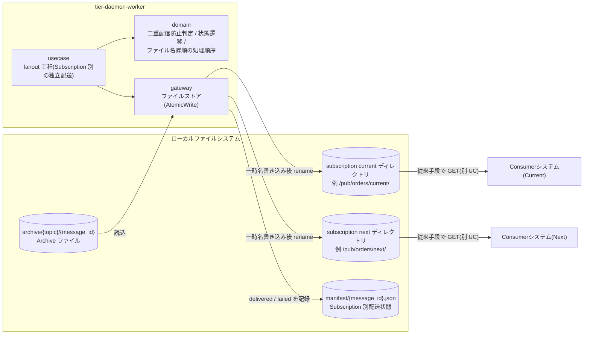
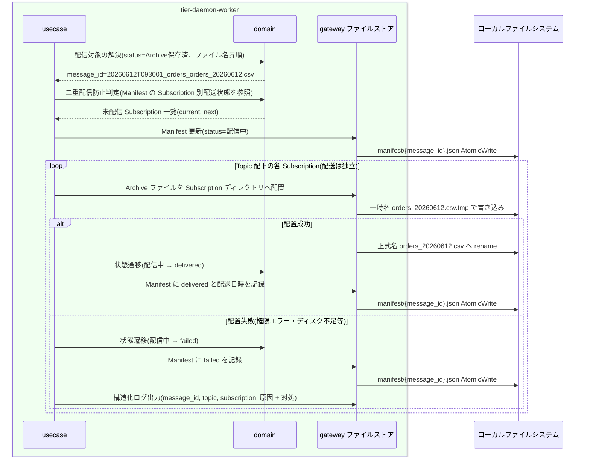

# Subscriptionへ複製配信する(Fan-out)

## 概要

Archive のファイルを Topic 配下の全 Subscription ディレクトリへ、一時名から rename する Atomic Write で複製配信する。Subscription ごとに配送は独立し、配送結果を Manifest に message_id・topic・Subscription 単位で記録する。再起動・再実行しても二重配信しない冪等処理とし、メッセージ配送状態を「Archive保存済」から「配信中」を経て「配信済(delivered)」(失敗時は「配信失敗(failed)」)へ遷移させる。

> 本システムは GUI を持たない。RDRA の画面「配信実行管理画面」は、常駐デーモンの自動実行 + 構造化ログ / status による観測として実現する。HTTP API はこの UC には存在しない。

## データフロー



| レイヤー | データモデル | 変換内容 |
|---------|------------|---------|
| usecase | Fan-out コマンド(status=Archive保存済 のメッセージ、ファイル名昇順) | Subscription 別に独立して配置を実行し、結果ごとに Manifest を更新 |
| domain | Manifest(Subscription 別配送状態) → 配信対象 Subscription 一覧 | 二重配信防止判定(delivered 済みを除外)、状態遷移(Archive保存済→配信中→delivered / failed) |
| gateway | Archive ファイル実体 → Subscription ディレクトリ配置 + Manifest 更新 | AtomicWrite(一時名 file.csv.tmp → 正式名 file.csv)(LR-301) |

## 処理フロー



## バリエーション一覧

| バリエーション名 | 値 | 処理内容 | 適用 tier | 適用箇所 |
|----------------|---|---------|----------|---------|
| 配信方式 | 通常配信(Fan-out)、再送(Replay) | この UC は通常配信(Fan-out)。収集後に全 Subscription へ複製する。再送(Replay)は別 UC「再送(Replay)を実行する」。いずれも Manifest に記録する | tier-daemon-worker | usecase fanout 工程 / Manifest 記録 |
| Subscription種別 | current、next、test | 配置先 Subscription の用途区分。Consumer 更改時の Current/Next 並行稼働・検証用(test)を同報配信で成立させる | tier-daemon-worker | 配置先 Subscription の解決 |
| Consumer取り込みタイミング | 即時取り込み、夜間バッチ | Subscription 独立配送がタイミング差を吸収する(配信側は意識しない) | tier-daemon-worker | 配送独立性の保証 |

## 分岐条件一覧

| 条件名 | 判定ルール | 適用 tier | 適用箇所 | BDD Scenario |
|--------|----------|----------|---------|-------------|
| 全Subscription同報配信 | Topic に収集されたファイルは、その Topic の全 Subscription のディレクトリへ同一内容で複製する。Subscription ごとに配送は独立し、一方の取得・削除は他方に影響しない | tier-daemon-worker | usecase fanout 工程 | 全 Subscription へ同一内容を複製する |
| Fan-out処理順序 | メッセージの順序保証はせず、Fan-out 配置はファイル名昇順で処理する。取り込み順序の制御は Consumer の責任とする | tier-daemon-worker | usecase 配信対象の処理順序 | 複数メッセージをファイル名昇順で配置する |
| AtomicWrite配置 | 一時名(file.csv.tmp)で書き込んでから正式名(file.csv)へ rename する。正式名のファイルは常に完全な内容であることを保証する | tier-daemon-worker | gateway ファイルストア(LR-301) | 配置中の異常終了でも不完全な正式名ファイルを残さない |
| 二重配信防止 | 再起動・処理中断後の再開では Manifest の配送状態を参照し、未配信の Subscription にのみ配信する。配信済みの Subscription へは重複配置しない | tier-daemon-worker | domain 冪等判定(SR-003) | 再起動後に配信済み Subscription へ重複配置しない |

## 計算ルール一覧

| 計算名 | 入力情報 | 計算式/ロジック | 出力情報 | 適用 tier |
|--------|---------|---------------|---------|----------|
| 配信対象 Subscription 解決 | Topic(Subscription 定義一覧)、Manifest(Subscription別配送状態) | Topic 配下の全 Subscription から delivered 済みを除外する | 未配信 Subscription 一覧 | tier-daemon-worker |
| 配置順序決定 | 配信待ちメッセージ一覧(元ファイル名) | ファイル名昇順にソート(順序保証はしない) | Fan-out 処理順 | tier-daemon-worker |

## 状態遷移一覧

| 状態モデル | 遷移元 | 遷移先 | トリガー | 事前条件 | 事後処理 | 適用 tier |
|-----------|--------|--------|---------|---------|---------|----------|
| メッセージ配送状態 | Archive保存済 | 配信中 | Subscriptionへ複製配信する(Fan-out) | Archive 保存完了(Archive保存必須) | Subscription ごとに独立した配置を開始 | tier-daemon-worker |
| メッセージ配送状態 | 配信中 | 配信済(delivered) | Subscriptionへ複製配信する(Fan-out) | Subscription ディレクトリへの配置成功 | Manifest に delivered と配送日時を記録。再実行時の二重配信防止に使う | tier-daemon-worker |
| メッセージ配送状態 | 配信中 | 配信失敗(failed) | Subscriptionへ複製配信する(Fan-out) | Subscription ディレクトリへの配置失敗 | Manifest に failed を記録。構造化ログで message_id・subscription を特定可能にする | tier-daemon-worker |

## 関連 RDRA モデル

| モデル種別 | 要素名 | 関連 |
|-----------|--------|------|
| 業務 | ファイル配信業務 | この UC が属する業務 |
| BUC | ファイルを収集して配信するフロー | この UC を含む BUC |
| アクター | 配信基盤運用者 | 配信の自動実行を観測する(立場: 価値提供。実行主体は常駐デーモン) |
| 情報 | Archiveファイル | 配信元。属性: 保存先パス(Topic別)、Topic名、message_id、元ファイル名、ファイル内容、保存日時、保持期限 |
| 情報 | Topic | 配信単位。属性: Topic名、説明 |
| 情報 | Subscription | 配置先。属性: Subscription名、配置先ディレクトリパス、所属Topic |
| 情報 | メッセージ | 状態を遷移させる。属性: message_id、Topic名、元ファイル名、収集時刻 |
| 情報 | Manifest | 配送結果を記録。属性: message_id、Topic名、Subscription別配送状態(delivered / failed / dlq)、リトライ回数、配送日時、再送(Replay)記録 |
| 状態 | メッセージ配送状態 | Archive保存済→配信中→配信済(delivered) / 配信失敗(failed) |
| 条件 | 全Subscription同報配信 / Fan-out処理順序 / AtomicWrite配置 / 二重配信防止 | 分岐条件一覧参照 |
| バリエーション | 配信方式 / Subscription種別 / Consumer取り込みタイミング | バリエーション一覧参照 |
| 画面 | 配信実行管理画面 | 常駐デーモンの自動実行 + 構造化ログ / status 観測として翻案(GUI なし) |
| 外部システム | (直接連携なし) | Consumer の取得は別 UC「Subscriptionディレクトリからファイルを取得する」 |

## E2E 完了条件（BDD）

### 正常系

```gherkin
Feature: Subscriptionへ複製配信する(Fan-out)

  Scenario: 全 Subscription へ同一内容を複製する
    Given topic「orders」に subscription「current」(directory=/pub/orders/current) と「next」(directory=/pub/orders/next) が定義されている
    And message_id「20260612T093001_orders_orders_20260612.csv」が配送状態「Archive保存済」である
    When Fan-out 工程が実行される
    Then /pub/orders/current/orders_20260612.csv と /pub/orders/next/orders_20260612.csv に同一内容のファイルが正式名で配置される
    And Manifest に current=delivered、next=delivered と配送日時が記録され、メッセージ配送状態が「配信済(delivered)」になる

  Scenario: 複数メッセージをファイル名昇順で配置する
    Given topic「orders」に配送状態「Archive保存済」のメッセージ「orders_a.csv」「orders_b.csv」「orders_c.csv」がある
    When Fan-out 工程が実行される
    Then 配置は orders_a.csv、orders_b.csv、orders_c.csv のファイル名昇順で処理される
    And メッセージの順序保証は行わず、取り込み順序の制御は Consumer の責任とする

  Scenario: 再起動後に配信済み Subscription へ重複配置しない
    Given message_id「20260612T093001_orders_orders_20260612.csv」の Manifest が current=delivered、next=未配信 の状態でデーモンが再起動した
    When Fan-out 工程が再開される
    Then next にのみ配置が実行され、current へは再配置されない(冪等)
```

### 異常系

```gherkin
  Scenario: 一部 Subscription の配置失敗は他 Subscription に影響しない
    Given /pub/orders/next が書き込み権限エラーで配置に失敗する状態である
    And message_id「20260612T093001_orders_orders_20260612.csv」が配送状態「Archive保存済」である
    When Fan-out 工程が実行される
    Then current への配置は成功し Manifest に current=delivered が記録される
    And next は Manifest に failed が記録され、message_id=20260612T093001_orders_orders_20260612.csv, topic=orders, subscription=next を含む構造化ログが出力される

  Scenario: 配置中の異常終了でも不完全な正式名ファイルを残さない
    Given /pub/orders/current への一時名「orders_20260612.csv.tmp」書き込み中にデーモンが異常終了した
    When Consumer が /pub/orders/current を参照する
    Then 正式名「orders_20260612.csv」は存在せず、不完全な内容のファイルを取得することはない
    And デーモン再起動後の Fan-out 再開で正式名の完全なファイルが配置される
```

## ティア別仕様

- [常駐デーモン](tier-daemon-worker.md)

### 統合 API Spec

- [OpenAPI Spec](../../../_cross-cutting/api/openapi.yaml)（全 UC 統合。この UC に HTTP API はない）
- AsyncAPI Spec: 該当なし（本システムに非同期メッセージングイベントはない）
