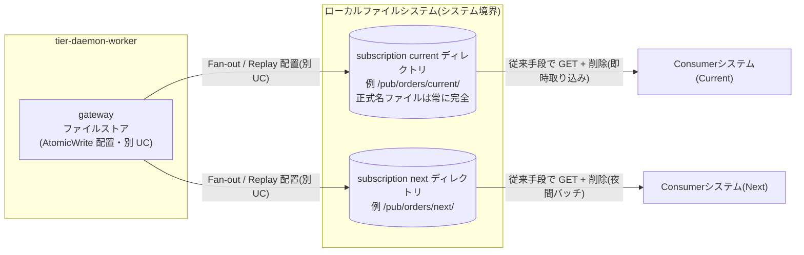
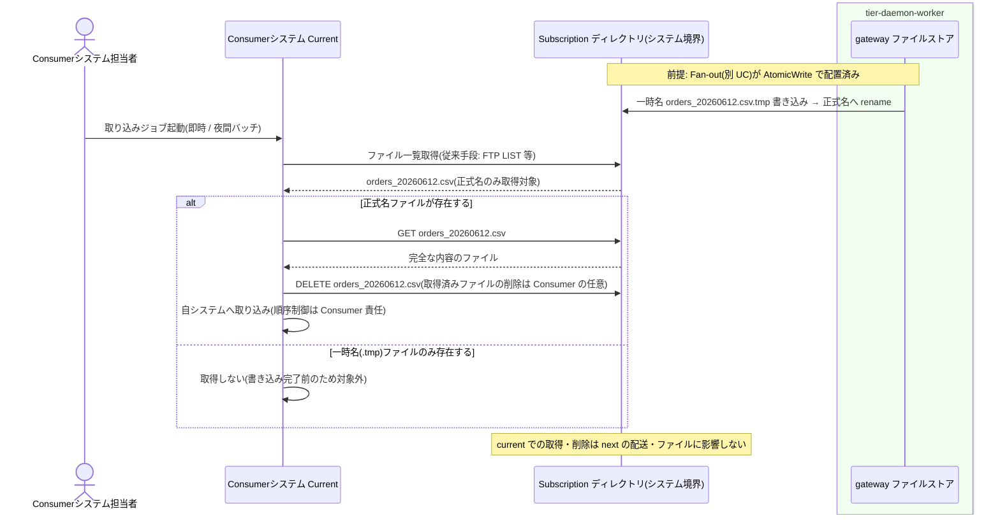

# Subscriptionディレクトリからファイルを取得する

## 概要

Consumer は自システム向け Subscription ディレクトリから従来手段(FTP GET 等)でファイルを取得し、即時取り込み / 夜間バッチ等の自分のタイミングで取り込む。Subscription 独立配送により他 Consumer の取得・削除・取り込みタイミングの影響を受けず、取り込み順序の制御は Consumer 側の責任とする。

この UC は **システム境界の外部インターフェース仕様**である。操作主体は Consumer システム(担当者)であり、本システム(tier-daemon-worker)の責務は「Consumer から見た Subscription ディレクトリ契約」の保証(正式名ファイルは常に完全 / 配送独立 / 再送も同一規約)に限定される。

> 本システムは GUI を持たない。RDRA の画面「配信ファイル受取画面」は、Subscription ディレクトリそのもの(従来手段でアクセスするファイル領域)として実現する。HTTP API はこの UC には存在しない。

## データフロー



| レイヤー | データモデル | 変換内容 |
|---------|------------|---------|
| 本システム gateway(別 UC) | Subscription 配置ファイル(正式名) | AtomicWrite により正式名ファイルは常に完全な内容であることを保証 |
| システム境界(Subscription ディレクトリ) | 配信ファイル(元ファイル名のまま、pass-through) | 変換なし。Consumer はファイル内容をそのまま取得する |
| Consumer 側(本システム外) | 取得ファイル → 自システムへの取り込み | 取得・削除・取り込み順序の制御は Consumer 責任 |

## 処理フロー



## バリエーション一覧

| バリエーション名 | 値 | 処理内容 | 適用 tier | 適用箇所 |
|----------------|---|---------|----------|---------|
| Subscription種別 | current、next、test | Consumer ごとの配送先の種別。Current/Next 並行稼働・検証用(test)を Subscription 単位で分離する | tier-daemon-worker(配置保証) | Subscription ディレクトリの分離 |
| Consumer取り込みタイミング | 即時取り込み、夜間バッチ | Consumer が取得・取り込みを行うタイミングの区分。Subscription 独立配送がタイミング差を吸収する | Consumer 側(本システム外) | Consumer の取り込みジョブ |

## 分岐条件一覧

| 条件名 | 判定ルール | 適用 tier | 適用箇所 | BDD Scenario |
|--------|----------|----------|---------|-------------|
| 全Subscription同報配信 | Subscription ごとに配送は独立し、一方の取得・削除は他方に影響しない | tier-daemon-worker(保証) / Consumer(前提) | Subscription ディレクトリ契約 | 他 Subscription の取得・削除の影響を受けない |
| AtomicWrite配置 | 正式名のファイルは常に完全な内容であることを保証する。一時名(file.csv.tmp)のファイルは取得対象にしないこと | tier-daemon-worker(保証) / Consumer(遵守) | Subscription ディレクトリ契約 | 正式名ファイルは常に完全な内容で取得できる |

## 計算ルール一覧

この UC に計算ルールはない(取得・取り込みのロジックは Consumer 側の責任で、本システムは関与しない)。

| 計算名 | 入力情報 | 計算式/ロジック | 出力情報 | 適用 tier |
|--------|---------|---------------|---------|----------|
| (該当なし) | - | - | - | - |

## 状態遷移一覧

この UC が遷移させる状態モデルはない(配送状態の遷移は Fan-out / リトライ / Replay の各 UC が行う。Consumer の取得・削除は Manifest の配送状態に影響しない)。

| 状態モデル | 遷移元 | 遷移先 | トリガー | 事前条件 | 事後処理 | 適用 tier |
|-----------|--------|--------|---------|---------|---------|----------|
| (該当なし) | - | - | - | - | - | - |

## Subscription ディレクトリ契約(外部 IF 仕様)

Consumer から見た本システムの境界契約。ux-design.md「Subscription ディレクトリ規約」と整合する。

| 項目 | 契約 | 根拠 |
|------|------|------|
| 取得手段 | 従来手段(FTP GET 等)でファイルを取得する。Consumer は無改修でよい | UC 説明 / システム概要 |
| ファイルの完全性 | 正式名のファイルは常に完全な内容。一時名(`*.tmp`)は書き込み中のため取得対象にしないこと | 条件「AtomicWrite配置」 |
| 配送の独立性 | 自 Subscription での取得・削除・取り込みタイミングは他 Subscription に影響せず、影響も受けない | 条件「全Subscription同報配信」 |
| 取り込みタイミング | 即時取り込み / 夜間バッチ等、Consumer 側の任意のタイミングでよい | バリエーション「Consumer取り込みタイミング」 |
| 順序 | メッセージの順序保証はない(Fan-out 配置はファイル名昇順処理)。取り込み順序の制御は Consumer 側の責任 | 条件「Fan-out処理順序」(適用は Fan-out UC) |
| ファイル名 | 元ファイル名のまま配置される(pass-through。内容の変換・解釈はしない) | CTP-004 |
| 取得後の削除 | 取得済みファイルの削除は Consumer の任意。削除しても本システムの配送状態(Manifest)には影響しない | 条件「全Subscription同報配信」 |
| 再送ファイル | 再送(Replay)も同じ Subscription ディレクトリへ同じ規約(AtomicWrite)で配置される(別 UC) | 条件「Replay記録」(適用は Replay UC) |

## 関連 RDRA モデル

| モデル種別 | 要素名 | 関連 |
|-----------|--------|------|
| 業務 | ファイル配信業務 | この UC が属する業務 |
| BUC | ファイルを収集して配信するフロー | この UC を含む BUC |
| アクター | Consumerシステム担当者 | Subscription ディレクトリからファイルを取得・取り込みする(立場: 価値受益) |
| 情報 | Subscription | 取得元。属性: Subscription名、配置先ディレクトリパス、所属Topic |
| 状態 | (該当なし) | この UC は状態を遷移させない |
| 条件 | 全Subscription同報配信 / AtomicWrite配置 | 分岐条件一覧参照 |
| バリエーション | Subscription種別 / Consumer取り込みタイミング | バリエーション一覧参照 |
| 画面 | 配信ファイル受取画面 | Subscription ディレクトリ(従来手段でアクセスするファイル領域)として翻案(GUI なし) |
| 外部システム | Consumerシステム(Current) | イベント「配信ファイル受け渡し」で subscriptions/current からファイルを取得する |
| 外部システム | Consumerシステム(Next) | イベント「配信ファイル受け渡し」で subscriptions/next からファイルを取得する(Current と並行稼働) |

## E2E 完了条件（BDD）

### 正常系

```gherkin
Feature: Subscriptionディレクトリからファイルを取得する

  Scenario: Consumer が従来手段でファイルを取得する
    Given topic「orders」の subscription「current」ディレクトリ /pub/orders/current に正式名「orders_20260612.csv」が配置されている
    When Consumerシステム(Current) が従来手段(FTP GET)で /pub/orders/current からファイルを取得する
    Then 完全な内容の「orders_20260612.csv」が取得できる

  Scenario: 他 Subscription の取得・削除の影響を受けない
    Given /pub/orders/current と /pub/orders/next の両方に「orders_20260612.csv」が配置されている
    When Consumerシステム(Current) が /pub/orders/current の「orders_20260612.csv」を取得して削除する
    Then /pub/orders/next の「orders_20260612.csv」は残っており、Consumerシステム(Next) は自分のタイミングで取得できる

  Scenario: 夜間バッチの取り込みタイミングでも取りこぼさない
    Given /pub/orders/next に日中配信された「orders_20260612.csv」と「orders_20260612_2.csv」が残っている
    When Consumerシステム(Next) の夜間バッチが 02:00 に /pub/orders/next を取得する
    Then 2 ファイルとも完全な内容で取得できる
    And 取り込み順序の制御は Consumer 側の責任で行う
```

### 異常系

```gherkin
  Scenario: 書き込み途中の一時名ファイルを取得対象にしない
    Given /pub/orders/current に一時名「orders_20260613.csv.tmp」が書き込み中である
    When Consumerシステム(Current) がファイル一覧を取得する
    Then 正式名「orders_20260613.csv」は存在せず、取得対象は正式名ファイルのみとなる
    And rename 完了後の次回取得で完全な内容の「orders_20260613.csv」を取得できる

  Scenario: Consumer の取得失敗は本システムの配送状態に影響しない
    Given message_id「20260612T093001_orders_orders_20260612.csv」が Manifest で current=delivered と記録されている
    When Consumerシステム(Current) の取得処理がネットワーク障害で失敗する
    Then /pub/orders/current の「orders_20260612.csv」は残ったままであり、Manifest の配送状態は delivered のまま変わらない
    And Consumer は障害回復後に自分のタイミングで再取得できる
```

## ティア別仕様

- [常駐デーモン](tier-daemon-worker.md)（配置保証の観点。取得操作は Consumer 側で本システムの実装対象外）

### 統合 API Spec

- [OpenAPI Spec](../../../_cross-cutting/api/openapi.yaml)（全 UC 統合。この UC に HTTP API はない）
- AsyncAPI Spec: 該当なし（本システムに非同期メッセージングイベントはない）
