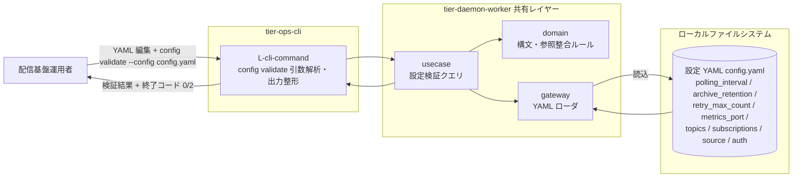
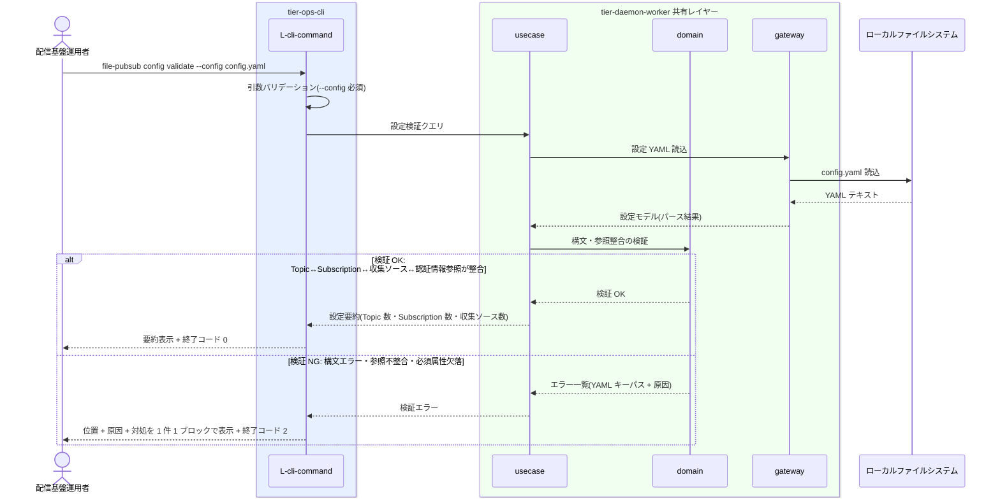

# Topic・Subscriptionを設定する

## 概要

配信基盤運用者が単一 YAML 設定で Topic と Subscription の 2 概念により配信構成を定義する。収集ソース(FTP / SFTP / SCP / ローカルディレクトリ)は Topic ごとに切り替えられ、認証情報は環境変数参照(`${ENV_VAR}`)や鍵ファイルパス指定で安全に扱う。編集後は `config validate` サブコマンドで構文・参照整合(Topic↔Subscription↔収集ソース↔認証情報参照)をデーモン起動前に検証する(arch-design.yaml SR-101)。

> 本システムは GUI を持たない。RDRA の画面「配信構成定義画面」は、_cross-cutting/ux-ui の方針に従い **設定 YAML + `config validate` CLI** として実現する。HTTP API はこの UC には存在しない。

## データフロー



| レイヤー | データモデル | 変換内容 |
|---------|------------|---------|
| CLI L-cli-command | `config validate` 引数(`--config <path>`) | 引数バリデーション(LR-401) + 設定検証クエリへ変換 |
| 共有 usecase | 設定検証クエリ | YAML 読込と検証ルール適用のフロー制御 |
| 共有 gateway | 設定 YAML テキスト → 設定モデル | YAML パース(構文エラー検出) |
| 共有 domain | 設定モデル(Topic / Subscription / 収集ソース / 認証情報参照) | 参照整合・必須属性の検証(I/O なしの純粋ロジック) |
| 出力 | 検証結果(要約 or エラー一覧) + 終了コード(0=OK / 2=NG) | 運用者向け表示(ui-design.md の `config validate` 出力規約) |

## 処理フロー



## バリエーション一覧

| バリエーション名 | 値 | 処理内容 | 適用 tier | 適用箇所 |
|----------------|---|---------|----------|---------|
| 収集ソース種別 | FTP、SFTP、SCP、ローカルディレクトリ | `source.type` の選択肢。Topic ごとに切り替えられ、後段(Archive / Fan-out / Manifest)はソース種別に依存しない | tier-ops-cli | 設定 YAML `topics[].source.type` / config validate の値検証 |
| 元ファイル処理方式 | 回収(GET後DELETE)、残す(copy) | `source.original_file_handling` の選択肢(既定: 回収) | tier-ops-cli | 設定 YAML `topics[].source.original_file_handling` / config validate の値検証 |
| Subscription種別 | current、next、test | Consumer 更改時の Current/Next 並行稼働や検証用(test)など、用途に応じて Subscription を追加できる | tier-ops-cli | 設定 YAML `topics[].subscriptions[].name` |
| Consumer取り込みタイミング | 即時取り込み、夜間バッチ | Subscription 独立配送がタイミング差を吸収するため、設定上の制約はない(Consumer 側の運用区分) | tier-ops-cli | Subscription 設計時の考慮事項(設定値ではない) |
| 認証方式 | YAML平文記述、環境変数参照(${ENV_VAR})、鍵ファイルパス指定 | `source.auth` の記述方式。平文も許容しつつ環境変数参照と鍵ファイルパス指定を推奨(CTP-002) | tier-ops-cli | 設定 YAML `topics[].source.auth` / config validate の記法検証 |

## 分岐条件一覧

この UC に直接対応する 条件.tsv の条件はない(設定値はここで定義され、各条件は後続 UC で適用される)。検証の分岐は arch-design.yaml SR-101「設定検証サブコマンド」に由来する。

| 条件名 | 判定ルール | 適用 tier | 適用箇所 | BDD Scenario |
|--------|----------|----------|---------|-------------|
| 設定検証(SR-101 由来) | YAML 構文が正しく、Topic↔Subscription↔収集ソース↔認証情報参照の整合が取れていれば OK(終了コード 0)。構文エラー・参照不整合・必須属性欠落は NG(終了コード 2) | tier-ops-cli | config validate | 新しい Topic と Subscription を定義して検証する / 配置先ディレクトリパス未定義を検出する |

## 計算ルール一覧

| 計算名 | 入力情報 | 計算式/ロジック | 出力情報 | 適用 tier |
|--------|---------|---------------|---------|----------|
| 設定要約集計 | 設定(Topic定義一覧、Subscription定義一覧、収集ソース定義一覧) | 各定義一覧の件数を集計する | 検証 OK 時の要約(Topic 数・Subscription 数・収集ソース数) | tier-ops-cli |

## 状態遷移一覧

この UC に関連する状態遷移はない(情報「設定」は状態モデルを持たない)。

| 状態モデル | 遷移元 | 遷移先 | トリガー | 事前条件 | 事後処理 | 適用 tier |
|-----------|--------|--------|---------|---------|---------|----------|
| (該当なし) | - | - | - | - | - | - |

## 関連 RDRA モデル

| モデル種別 | 要素名 | 関連 |
|-----------|--------|------|
| 業務 | ファイル配信業務 | この UC が属する業務 |
| BUC | ファイルを収集して配信するフロー | この UC を含む BUC |
| アクター | 配信基盤運用者 | 設定 YAML を編集し config validate を実行する(立場: 価値提供) |
| 情報 | 設定 | 定義する情報。属性: ポーリング間隔、Archive保持期間(retention)、リトライ上限回数、メトリクスポート、Topic定義一覧、Subscription定義一覧、収集ソース定義一覧、認証情報参照 |
| 情報 | Topic | 定義する情報。属性: Topic名、説明 |
| 情報 | Subscription | 定義する情報。属性: Subscription名、配置先ディレクトリパス、所属Topic |
| 情報 | 収集ソース | 定義する情報。属性: ソース種別(FTP / SFTP / SCP / ローカルディレクトリ)、接続先ホスト、対象ディレクトリパス、元ファイル処理方式(回収 / 残す)、安定待ち判定設定、除外パターン |
| 情報 | 認証情報 | 定義する情報。属性: 記述方式(平文 / 環境変数参照 / 鍵ファイルパス)、ユーザー名、パスワードまたは鍵ファイルパス |
| バリエーション | 収集ソース種別 / 元ファイル処理方式 / Subscription種別 / Consumer取り込みタイミング / 認証方式 | 設定 YAML で選択する値(バリエーション一覧参照) |
| 画面 | 配信構成定義画面 | 設定 YAML + config validate CLI として翻案(GUI なし) |
| 状態 | (該当なし) | 情報「設定」は状態モデルを持たない |
| 条件 | (直接適用なし) | 各条件の設定値(リトライ上限・Archive保持期間・安定待ち判定設定 等)をここで定義する |
| 外部システム | (該当なし) | 設定定義はシステム内で完結する |

## E2E 完了条件（BDD）

### 正常系

```gherkin
Feature: Topic・Subscriptionを設定する

  Scenario: 新しい Topic と Subscription を定義して検証する
    Given 設定 YAML config.yaml に topic「orders」が source(type=sftp, host=legacy-host01, directory=/out/orders) とともに定義されている
    And topic「orders」の subscriptions に「current」(directory=/pub/orders/current) と「next」(directory=/pub/orders/next) が定義されている
    When 配信基盤運用者が「file-pubsub config validate --config config.yaml」を実行する
    Then 終了コード 0 で終了する
    And 設定要約として Topic 数 1・Subscription 数 2・収集ソース数 1 が表示される

  Scenario: 認証情報を環境変数参照で定義して検証する
    Given config.yaml の topics[0].source.auth に username「${SFTP_USER}」と password「${SFTP_PASSWORD}」が定義されている
    When 配信基盤運用者が「file-pubsub config validate --config config.yaml」を実行する
    Then 終了コード 0 で終了し検証 OK となる

  Scenario: Producer を変更せずに Subscription を追加する
    Given topic「orders」に subscription「current」のみが定義され検証 OK の config.yaml がある
    When 配信基盤運用者が subscriptions に「test」(directory=/pub/orders/test) を追記して「file-pubsub config validate --config config.yaml」を実行する
    Then 終了コード 0 で終了し Subscription 数 2 と表示される
    And Producer 側・Consumer 側の変更は不要である
```

### 異常系

```gherkin
  Scenario: 配置先ディレクトリパス未定義を検出する
    Given config.yaml の topics[0].subscriptions[0] に name「current」のみがあり directory が未定義である
    When 配信基盤運用者が「file-pubsub config validate --config config.yaml」を実行する
    Then 終了コード 2 で終了する
    And 「NG: topics[0].subscriptions[0].directory」の位置と原因「配置先ディレクトリパスが未定義です」と対処が表示される

  Scenario: YAML 構文エラーを検出する
    Given config.yaml の 12 行目にインデント不正がある
    When 配信基盤運用者が「file-pubsub config validate --config config.yaml」を実行する
    Then 終了コード 2 で終了する
    And 構文エラーの位置(行)と原因と対処が表示される

  Scenario: 不正なソース種別を検出する
    Given config.yaml の topics[0].source.type に「http」が指定されている
    When 配信基盤運用者が「file-pubsub config validate --config config.yaml」を実行する
    Then 終了コード 2 で終了する
    And 「NG: topics[0].source.type」と許容値(ftp / sftp / scp / local)が表示される
```

## ティア別仕様

- [運用 CLI](tier-ops-cli.md)

### 統合 API Spec

- [OpenAPI Spec](../../../_cross-cutting/api/openapi.yaml)（全 UC 統合。この UC に HTTP API はない）
- AsyncAPI Spec: 該当なし（本システムに非同期メッセージングイベントはない）
