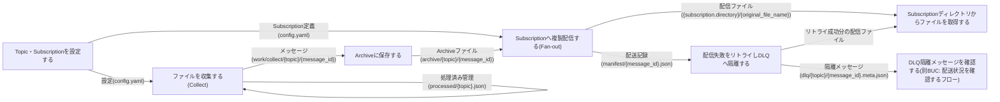
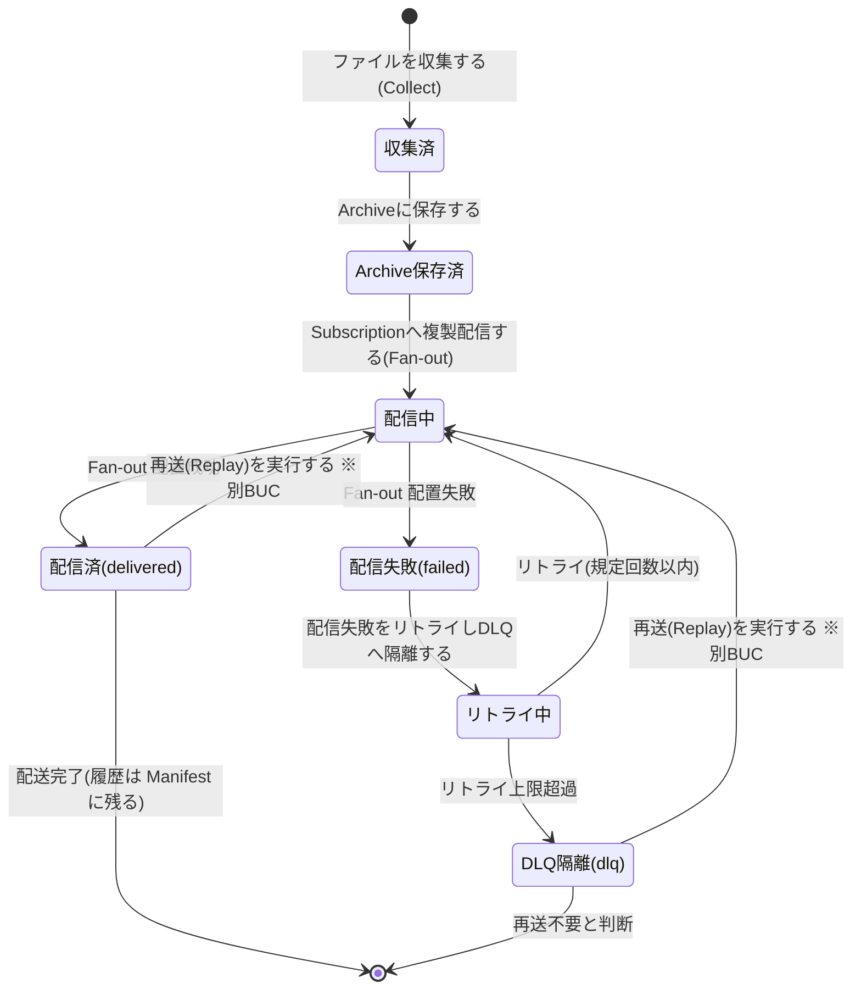
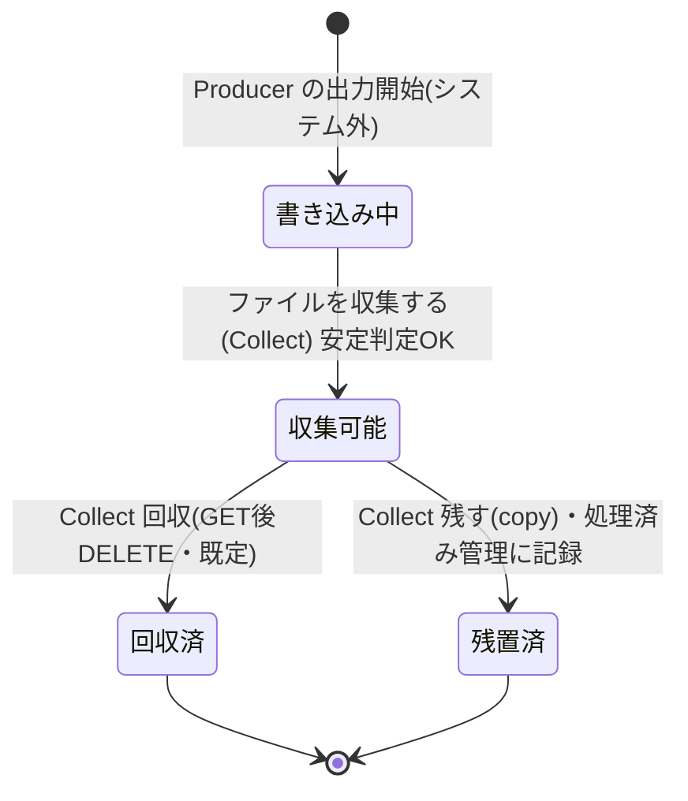
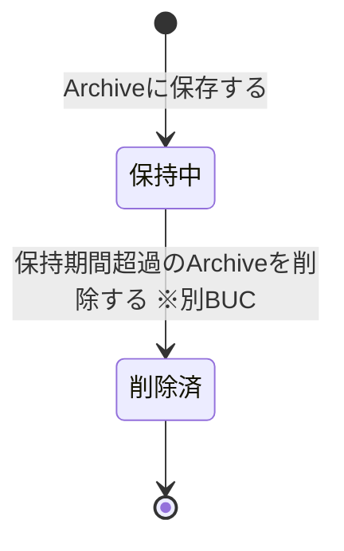

# ファイルを収集して配信するフロー

## 概要

Producer が出力したファイルを常駐デーモンが収集(Collect)し、Archive 保全を経て Topic 配下の全 Subscription へ複製配信(Fan-out)する、本システムの主動線となる BUC。配信失敗はリトライと DLQ 隔離で滞留させず、Consumer は自分の Subscription ディレクトリから従来手段でファイルを取得する。

## 所属 UC 一覧

| UC名 | アクター | 主な操作 | 関連情報 |
|------|---------|---------|---------|
| [Topic・Subscriptionを設定する](<Topic・Subscriptionを設定する/spec.md>) | 運用者 | 単一 YAML(config.yaml) で Topic / Subscription / 収集ソース / 認証情報を定義・検証する | 設定、Topic、Subscription、収集ソース、認証情報 |
| [ファイルを収集する(Collect)](<ファイルを収集する(Collect)/spec.md>) | 運用者(価値提供) / Producerシステム・リモートファイル領域(外部) | ポーリングごとに収集ソース(FTP/SFTP/SCP/ローカル)から安定ファイルを収集し message_id を採番する | Topic、収集ソース、認証情報、メッセージ、処理済み管理 |
| [Archiveに保存する](<Archiveに保存する/spec.md>) | 運用者 | 収集ファイルを配信前に必ず archive/{topic}/{message_id} へ保存する | Archiveファイル、メッセージ、Topic |
| [Subscriptionへ複製配信する(Fan-out)](<Subscriptionへ複製配信する(Fan-out)/spec.md>) | 運用者 | Archive のファイルを全 Subscription ディレクトリへ Atomic Write で複製配信し Manifest に記録する | Archiveファイル、Topic、Subscription、メッセージ、Manifest |
| [配信失敗をリトライしDLQへ隔離する](<配信失敗をリトライしDLQへ隔離する/spec.md>) | 運用者 | 一時的な配信失敗をリトライで自動回復させ、上限超過分を dlq/{topic}/{message_id} へ隔離する | メッセージ、Manifest、DLQ |
| [Subscriptionディレクトリからファイルを取得する](<Subscriptionディレクトリからファイルを取得する/spec.md>) | Consumerシステム担当者(価値受益) / Consumerシステム(Current/Next)(外部) | 自システム向け {subscription.directory} から従来手段でファイルを取得・取り込みする | Subscription |

## UC 横断データフロー

BUC 内の UC 間で情報がどう流れるかを示す。情報がどの UC で作成(C)・参照(R)・更新(U)・削除(D)されるかを明記する。

### データフロー図

### 情報 CRUD マトリクス

| 情報名 | Topic・Subscriptionを設定する | ファイルを収集する(Collect) | Archiveに保存する | Subscriptionへ複製配信する(Fan-out) | 配信失敗をリトライしDLQへ隔離する | Subscriptionディレクトリからファイルを取得する |
|--------|:---:|:---:|:---:|:---:|:---:|:---:|
| 設定(config.yaml) | C | R | R | R | R | |
| Topic | C | R | R | R | | |
| Subscription | C | | | R | | R |
| 収集ソース | C | R | | | | |
| 認証情報 | C | R | | | | |
| メッセージ(work/collect/{topic}/{message_id}) | | C | U | U | U | |
| 処理済み管理(processed/{topic}.json) | | C/R | | | | |
| Archiveファイル(archive/{topic}/{message_id}) | | | C | R | | |
| Manifest(manifest/{message_id}.json) | | C | U | U | U | |
| DLQ(dlq/{topic}/{message_id}.meta.json) | | | | | C | |
| 配信ファイル({subscription.directory}/{original_file_name}) | | | | C | C | R |

- メッセージの U は状態遷移(収集済 → Archive保存済 → 配信中 → 配信済/配信失敗 → リトライ中 → DLQ隔離)の更新を表す。
- Consumer の取得・削除(取得 UC)は Manifest の配送状態に影響しない(配送の正は Manifest)。

## 状態遷移全体図

BUC 内で関連する 3 つの状態モデル(メッセージ配送状態 / 元ファイル収集状態 / Archiveファイル保持状態)の全遷移パスと、各遷移を担当する UC を示す。

### メッセージ配送状態

### 元ファイル収集状態

### Archiveファイル保持状態

### 状態遷移 UC マッピング

状態.tsv の該当状態モデルの全遷移行を網羅する。本 BUC 外の UC が担当する遷移は所属 BUC を併記する。

| 状態モデル | 遷移元 | 遷移先 | 担当 UC |
|-----------|--------|--------|--------|
| メッセージ配送状態 | (初期) | 収集済 | [ファイルを収集する(Collect)](<ファイルを収集する(Collect)/spec.md>) |
| メッセージ配送状態 | 収集済 | Archive保存済 | [Archiveに保存する](<Archiveに保存する/spec.md>) |
| メッセージ配送状態 | Archive保存済 | 配信中 | [Subscriptionへ複製配信する(Fan-out)](<Subscriptionへ複製配信する(Fan-out)/spec.md>) |
| メッセージ配送状態 | 配信中 | 配信済(delivered) | [Subscriptionへ複製配信する(Fan-out)](<Subscriptionへ複製配信する(Fan-out)/spec.md>) |
| メッセージ配送状態 | 配信中 | 配信失敗(failed) | [Subscriptionへ複製配信する(Fan-out)](<Subscriptionへ複製配信する(Fan-out)/spec.md>) |
| メッセージ配送状態 | 配信失敗(failed) | リトライ中 | [配信失敗をリトライしDLQへ隔離する](<配信失敗をリトライしDLQへ隔離する/spec.md>) |
| メッセージ配送状態 | リトライ中 | 配信中 | [配信失敗をリトライしDLQへ隔離する](<配信失敗をリトライしDLQへ隔離する/spec.md>) |
| メッセージ配送状態 | リトライ中 | DLQ隔離(dlq) | [配信失敗をリトライしDLQへ隔離する](<配信失敗をリトライしDLQへ隔離する/spec.md>) |
| メッセージ配送状態 | DLQ隔離(dlq) | 配信中 | 再送(Replay)を実行する(別BUC: ファイルを再送するフロー) |
| メッセージ配送状態 | 配信済(delivered) | 配信中 | 再送(Replay)を実行する(別BUC: ファイルを再送するフロー) |
| メッセージ配送状態 | 配信済(delivered) | (終了) | (UC遷移なし。全宛先配送完了の終了状態) |
| メッセージ配送状態 | DLQ隔離(dlq) | (終了) | (UC遷移なし。運用者が再送不要と判断した終了状態) |
| 元ファイル収集状態 | (初期) | 書き込み中 | (UC遷移なし。Producer 側の出力開始) |
| 元ファイル収集状態 | 書き込み中 | 収集可能 | [ファイルを収集する(Collect)](<ファイルを収集する(Collect)/spec.md>) |
| 元ファイル収集状態 | 収集可能 | 回収済 | [ファイルを収集する(Collect)](<ファイルを収集する(Collect)/spec.md>) |
| 元ファイル収集状態 | 収集可能 | 残置済 | [ファイルを収集する(Collect)](<ファイルを収集する(Collect)/spec.md>) |
| 元ファイル収集状態 | 回収済 | (終了) | (UC遷移なし。元ファイルが収集ソース上に存在しない終了状態) |
| 元ファイル収集状態 | 残置済 | (終了) | (UC遷移なし。処理済み管理により再収集されない終了状態) |
| Archiveファイル保持状態 | (初期) | 保持中 | [Archiveに保存する](<Archiveに保存する/spec.md>) |
| Archiveファイル保持状態 | 保持中 | 削除済 | 保持期間超過のArchiveを削除する(別BUC: 配信基盤を運用するフロー) |
| Archiveファイル保持状態 | 削除済 | (終了) | (UC遷移なし。削除完了の終了状態) |

## BUC 内共有条件一覧

本 BUC 内の UC に適用される条件.tsv の条件と、適用先 UC の一覧。2 つ以上の UC で適用されるものが「共有」。

| 条件名 | 条件の説明 | 適用 UC | 共有 |
|--------|----------|--------|:---:|
| message_id採番 | 同名ファイルの再出力は新しいメッセージとして扱い、message_id は収集時刻 + Topic + 元ファイル名から採番する。上書きで履歴を失わない | ファイルを収集する(Collect)、Archiveに保存する | 共有 |
| 全Subscription同報配信 | Topic に収集されたファイルは、その Topic の全 Subscription のディレクトリへ同一内容で複製する。Subscription ごとに配送は独立し、一方の取得・削除は他方に影響しない | Subscriptionへ複製配信する(Fan-out)、Subscriptionディレクトリからファイルを取得する | 共有 |
| AtomicWrite配置 | 一時名({original_file_name}.tmp)で書き込んでから正式名({original_file_name})へ rename する。正式名のファイルは常に完全な内容であることを保証する | Subscriptionへ複製配信する(Fan-out)、Subscriptionディレクトリからファイルを取得する | 共有 |
| 書き込み完了判定 | Producer が書き込み中のファイルは収集しない。サイズ・更新時刻が安定するまで待ち、除外パターン該当ファイルは対象外とする | ファイルを収集する(Collect) | |
| 元ファイル処理判定 | 収集後の元ファイルは GET 後 DELETE(回収)が既定。「残す(copy)」選択時は処理済み管理(processed/{topic}.json)と照合し再収集しない | ファイルを収集する(Collect) | |
| Archive保存必須 | 収集したファイルは配信(Fan-out)の前に必ず archive/ 配下へ Topic 別に保存する。Archive 保存が完了するまで配信を開始しない | Archiveに保存する | |
| Fan-out処理順序 | メッセージの順序保証はせず、Fan-out 配置はファイル名昇順で処理する。取り込み順序の制御は Consumer の責任とする | Subscriptionへ複製配信する(Fan-out) | |
| 二重配信防止 | 再起動・処理中断後の再開では Manifest の配送状態を参照し、未配信の Subscription にのみ配信する | Subscriptionへ複製配信する(Fan-out) | |
| リトライ上限 | 配信失敗はリトライし、規定回数以内に成功すれば delivered とする。規定回数を超えたメッセージは DLQ へ隔離し Manifest に dlq として記録する | 配信失敗をリトライしDLQへ隔離する | |

単一 UC のみで適用される条件の詳細は各 UC Spec の「分岐条件一覧」を参照。

## BUC 内共有バリエーション一覧

本 BUC 内の UC に適用されるバリエーション.tsv のバリエーションと、適用先 UC の一覧。2 つ以上の UC で適用されるものが「共有」。

| バリエーション名 | 値 | 適用 UC | 共有 |
|----------------|---|--------|:---:|
| 収集ソース種別 | FTP、SFTP、SCP、ローカルディレクトリ | Topic・Subscriptionを設定する、ファイルを収集する(Collect) | 共有 |
| 元ファイル処理方式 | 回収(GET後DELETE)、残す(copy) | Topic・Subscriptionを設定する、ファイルを収集する(Collect) | 共有 |
| Subscription種別 | current、next、test | Topic・Subscriptionを設定する、Subscriptionへ複製配信する(Fan-out)、Subscriptionディレクトリからファイルを取得する | 共有 |
| Consumer取り込みタイミング | 即時取り込み、夜間バッチ | Topic・Subscriptionを設定する、Subscriptionへ複製配信する(Fan-out)、Subscriptionディレクトリからファイルを取得する | 共有 |
| 認証方式 | YAML平文記述、環境変数参照(${ENV_VAR})、鍵ファイルパス指定 | Topic・Subscriptionを設定する、ファイルを収集する(Collect) | 共有 |
| 配信方式 | 通常配信(Fan-out)、再送(Replay) | Subscriptionへ複製配信する(Fan-out)、Subscriptionディレクトリからファイルを取得する | 共有 |
