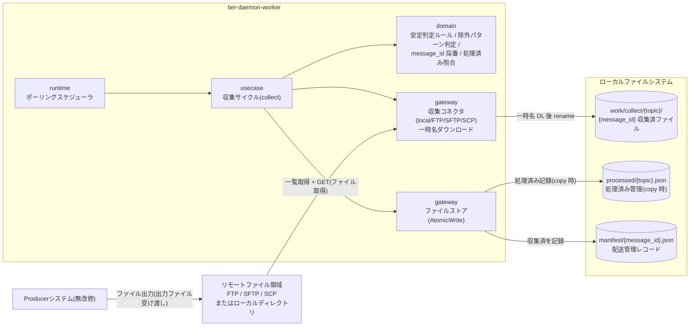
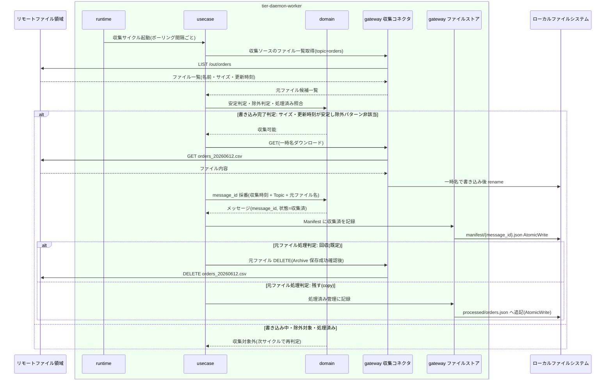

# ファイルを収集する(Collect)

## 概要

常駐デーモンがポーリング間隔ごとに Producer 出力ファイルをリモート(FTP / SFTP / SCP)またはローカルディレクトリから収集する。書き込み中のファイルは安定待ち・除外パターンで収集せず、元ファイルは回収(GET 後 DELETE)を既定に Topic 設定で「残す(copy)」も選択でき、copy 時は処理済み管理で重複収集を防ぐ。収集ファイルには message_id(収集時刻 + Topic + 元ファイル名)を採番してメッセージを発生させ、メッセージ配送状態を「収集済」へ遷移させる。

> 本システムは GUI を持たない。RDRA の画面「収集実行管理画面」は、常駐デーモンの自動実行 + 構造化ログ / status による観測として実現する。HTTP API はこの UC には存在しない。

## データフロー



| レイヤー | データモデル | 変換内容 |
|---------|------------|---------|
| runtime | ポーリングサイクル起動(設定の polling_interval) | 前回サイクル完了を待って収集サイクルを起動(LR-001) |
| usecase | 収集サイクルコマンド(Topic 別の収集ソース定義) | ソース一覧取得 → 安定判定 → 収集 → メッセージ発生のフロー制御 |
| domain | 元ファイル候補(ファイル名・サイズ・更新時刻) → メッセージ(message_id, Topic名, 元ファイル名, 収集時刻) | 安定判定・除外判定・処理済み照合・message_id 採番(純粋ロジック) |
| gateway(収集コネクタ) | リモート/ローカルのファイル実体 | 一時名ダウンロード → 完了後 rename(LR-303)。共通インターフェースでソース種別を差し替え(LP-301) |
| gateway(ファイルストア) | 処理済み管理レコード / Manifest レコード | AtomicWrite で記録(LR-301) |

## 処理フロー



## バリエーション一覧

| バリエーション名 | 値 | 処理内容 | 適用 tier | 適用箇所 |
|----------------|---|---------|----------|---------|
| 収集ソース種別 | FTP、SFTP、SCP、ローカルディレクトリ | 収集コネクタの差し替え(共通インターフェース LP-301)。後段(Archive / Fan-out / Manifest)はソース種別に依存しない | tier-daemon-worker | gateway 収集コネクタ |
| 元ファイル処理方式 | 回収(GET後DELETE)、残す(copy) | 既定は GET 後 DELETE で回収。copy 選択時は処理済み管理と照合して重複収集を防ぐ | tier-daemon-worker | usecase 収集サイクル / gateway ファイルストア(処理済み管理) |
| 認証方式 | YAML平文記述、環境変数参照(${ENV_VAR})、鍵ファイルパス指定 | リモート収集(FTP/SFTP/SCP)の接続時に認証情報を解決する | tier-daemon-worker | gateway 収集コネクタ(接続確立) |

## 分岐条件一覧

| 条件名 | 判定ルール | 適用 tier | 適用箇所 | BDD Scenario |
|--------|----------|----------|---------|-------------|
| 書き込み完了判定 | サイズ・更新時刻が安定するまで収集しない。除外パターン該当ファイルは対象外。リモート GET 中も一時名でダウンロードし完了後に rename する | tier-daemon-worker | domain 安定判定ルール / gateway 収集コネクタ | 書き込み中のファイルは収集しない |
| 元ファイル処理判定 | GET 後 DELETE(回収)が既定。Topic 設定で「残す(copy)」選択時は処理済み管理と照合し、処理済みファイルは再収集しない | tier-daemon-worker | usecase 収集サイクル / 処理済み管理 | copy 設定で同じファイルを重複収集しない |
| message_id採番 | 同名ファイルの再出力は新しいメッセージとして扱い、message_id は収集時刻 + Topic + 元ファイル名から採番する | tier-daemon-worker | domain 採番規則(LR-202) | 同名ファイルの再出力を別メッセージとして収集する |

## 計算ルール一覧

| 計算名 | 入力情報 | 計算式/ロジック | 出力情報 | 適用 tier |
|--------|---------|---------------|---------|----------|
| message_id 採番 | メッセージ(収集時刻、Topic名、元ファイル名) | 収集時刻 + Topic + 元ファイル名を結合して採番(例: 20260612T093001_orders_orders_20260612.csv) | メッセージ.message_id | tier-daemon-worker |
| 安定判定 | 収集ソース(安定待ち判定設定)、元ファイル候補(サイズ、更新時刻) | 安定確認間隔をおいて 2 回観測しサイズ・更新時刻が一致すれば安定 | 収集可能 / 書き込み中 の判定 | tier-daemon-worker |
| 除外判定 | 収集ソース(除外パターン)、元ファイル候補(ファイル名) | ファイル名が除外パターン(例: *.tmp)に一致すれば対象外 | 収集対象 / 対象外 の判定 | tier-daemon-worker |
| 処理済み照合 | 処理済み管理(収集元ファイル識別子)、元ファイル候補 | copy 設定時、収集元ファイル識別子(ファイル名・収集元パス等)が処理済み管理に存在すれば再収集しない | 収集対象 / 処理済み の判定 | tier-daemon-worker |

## 状態遷移一覧

| 状態モデル | 遷移元 | 遷移先 | トリガー | 事前条件 | 事後処理 | 適用 tier |
|-----------|--------|--------|---------|---------|---------|----------|
| メッセージ配送状態 | (初期) | 収集済 | ファイルを収集する(Collect) | 安定判定 OK・除外非該当・(copy 時)未処理 | message_id 採番、Manifest による Subscription 単位の配送管理を開始 | tier-daemon-worker |
| 元ファイル収集状態 | 書き込み中 | 収集可能 | ファイルを収集する(Collect) | サイズ・更新時刻の安定と除外パターン非該当を確認 | 収集対象に含める | tier-daemon-worker |
| 元ファイル収集状態 | 収集可能 | 回収済 | ファイルを収集する(Collect) | 元ファイル処理方式=回収(既定)。Archive 保存の成功確認後 | 収集ソースから元ファイルを DELETE | tier-daemon-worker |
| 元ファイル収集状態 | 収集可能 | 残置済 | ファイルを収集する(Collect) | 元ファイル処理方式=残す(copy) | 処理済み管理に記録し再収集を防ぐ | tier-daemon-worker |

## 関連 RDRA モデル

| モデル種別 | 要素名 | 関連 |
|-----------|--------|------|
| 業務 | ファイル配信業務 | この UC が属する業務 |
| BUC | ファイルを収集して配信するフロー | この UC を含む BUC |
| アクター | 配信基盤運用者 | 収集の自動実行を観測する(立場: 価値提供。実行主体は常駐デーモン) |
| 情報 | Topic | 収集単位。属性: Topic名、説明 |
| 情報 | 収集ソース | 収集元定義。属性: ソース種別(FTP / SFTP / SCP / ローカルディレクトリ)、接続先ホスト、対象ディレクトリパス、元ファイル処理方式(回収 / 残す)、安定待ち判定設定、除外パターン |
| 情報 | 認証情報 | 接続時に解決。属性: 記述方式(平文 / 環境変数参照 / 鍵ファイルパス)、ユーザー名、パスワードまたは鍵ファイルパス |
| 情報 | メッセージ | この UC で発生。属性: message_id(収集時刻 + Topic + 元ファイル名から採番)、Topic名、元ファイル名、収集時刻 |
| 情報 | 処理済み管理 | copy 時に更新。属性: 収集元ファイル識別子(ファイル名・収集元パス等)、処理済み判定日時 |
| 状態 | メッセージ配送状態 | (初期)→収集済 |
| 状態 | 元ファイル収集状態 | 書き込み中→収集可能→回収済 / 残置済 |
| 条件 | 書き込み完了判定 / 元ファイル処理判定 / message_id採番 | 分岐条件一覧参照 |
| バリエーション | 収集ソース種別 / 元ファイル処理方式 / 認証方式 | バリエーション一覧参照 |
| 画面 | 収集実行管理画面 | 常駐デーモンの自動実行 + 構造化ログ / status 観測として翻案(GUI なし) |
| 外部システム | Producerシステム | イベント「出力ファイル受け渡し」の連携元(無改修) |
| 外部システム | リモートファイル領域 | イベント「ファイル取得」の収集元(FTP/SFTP/SCP サーバ上の領域) |

## E2E 完了条件（BDD）

### 正常系

```gherkin
Feature: ファイルを収集する(Collect)

  Scenario: SFTP の収集ソースからファイルを回収して収集する
    Given topic「orders」の収集ソースが type=sftp, host=legacy-host01, directory=/out/orders, original_file_handling=delete で設定されている
    And リモートの /out/orders に書き込み完了済みのファイル「orders_20260612.csv」が存在する
    When ポーリングサイクルが収集を実行する
    Then ファイルが一時名でダウンロードされ完了後に rename される
    And message_id「20260612T093001_orders_orders_20260612.csv」のメッセージが発生しメッセージ配送状態が「収集済」になる
    And Archive 保存の成功確認後にリモートの元ファイル「orders_20260612.csv」が DELETE され元ファイル収集状態が「回収済」になる

  Scenario: copy 設定で元ファイルを残して収集する
    Given topic「customers」の収集ソースが original_file_handling=copy で設定されている
    And ローカル収集ソース /data/out/customers に「customers_20260612.csv」が存在する
    When ポーリングサイクルが収集を実行する
    Then ファイルが収集されメッセージ配送状態が「収集済」になる
    And 元ファイルは収集ソースに残り、処理済み管理 processed/customers.json に収集元ファイル識別子と処理済み判定日時が記録され元ファイル収集状態が「残置済」になる

  Scenario: 同名ファイルの再出力を別メッセージとして収集する
    Given topic「orders」で「orders_20260612.csv」が message_id「20260612T093001_orders_orders_20260612.csv」として収集済みである
    And Producer が同名の「orders_20260612.csv」を再出力した
    When 次のポーリングサイクルが収集を実行する
    Then 収集時刻の異なる新しい message_id「20260612T101502_orders_orders_20260612.csv」のメッセージとして収集され、既存メッセージの履歴は失われない
```

### 異常系

```gherkin
  Scenario: 書き込み中のファイルは収集しない
    Given リモートの /out/orders で「orders_20260612.csv」のサイズが観測のたびに増加している
    When ポーリングサイクルが収集を実行する
    Then 「orders_20260612.csv」は収集されず元ファイル収集状態は「書き込み中」のまま残る
    And 次サイクルでサイズ・更新時刻が安定した後に収集される

  Scenario: 除外パターン該当ファイルを収集しない
    Given topic「orders」の収集ソースに exclude_patterns「*.tmp」が設定されている
    And リモートの /out/orders に「orders_20260612.csv.tmp」が存在する
    When ポーリングサイクルが収集を実行する
    Then 「orders_20260612.csv.tmp」は収集対象外となる

  Scenario: copy 設定で処理済みファイルを再収集しない
    Given topic「customers」が original_file_handling=copy で「customers_20260612.csv」が処理済み管理に記録済みである
    When 次のポーリングサイクルが収集を実行する
    Then 「customers_20260612.csv」は再収集されず重複メッセージは発生しない

  Scenario: 収集ソースへの接続失敗を構造化ログに記録する
    Given topic「orders」の収集ソース legacy-host01 が応答しない
    When ポーリングサイクルが収集を実行する
    Then 収集はスキップされ topic=orders を含む構造化ログ(event_type=収集失敗、原因 + 対処)が出力される
    And デーモンは停止せず次のポーリングサイクルで再試行する
```

## ティア別仕様

- [常駐デーモン](tier-daemon-worker.md)

### 統合 API Spec

- [OpenAPI Spec](../../../_cross-cutting/api/openapi.yaml)（全 UC 統合。この UC に HTTP API はない）
- AsyncAPI Spec: 該当なし（本システムに非同期メッセージングイベントはない）
