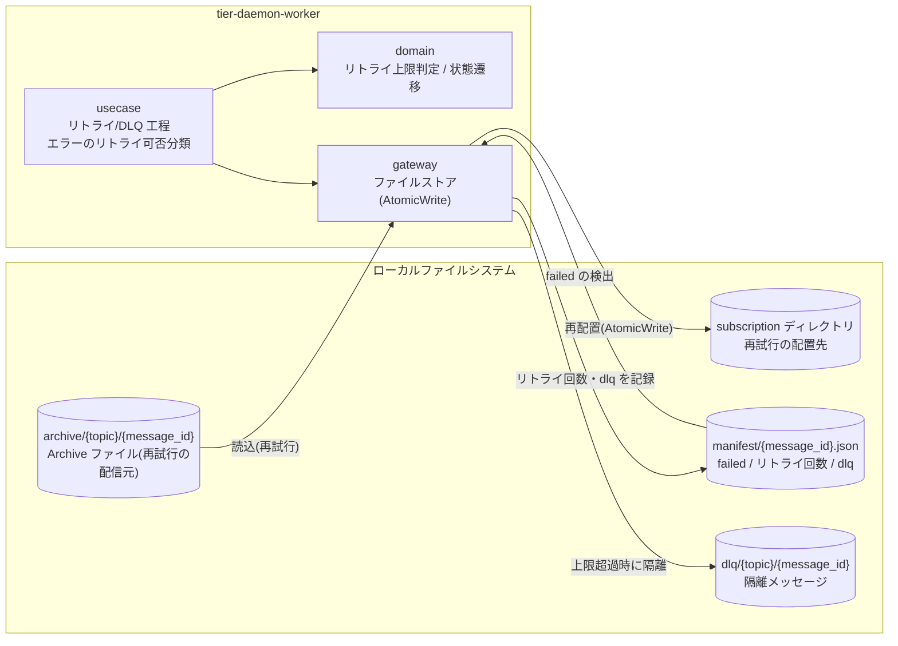
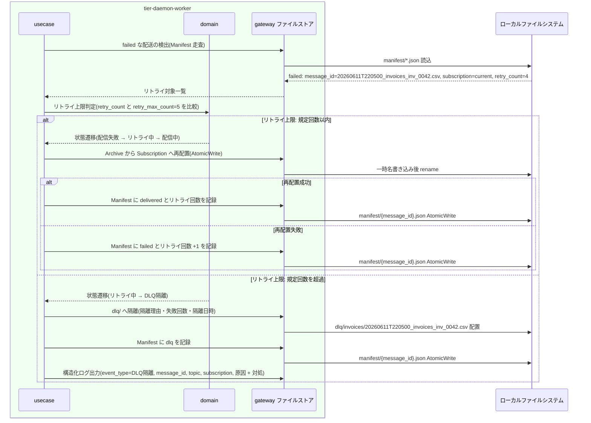

# 配信失敗をリトライしDLQへ隔離する

## 概要

一時的な配信失敗はメッセージ配送状態を「配信失敗(failed)」から「リトライ中」へ遷移させ、リトライで自動回復させる。規定回数(設定 `retry_max_count`)を超えた恒久的な失敗は「DLQ隔離(dlq)」へ遷移させ、`dlq/` ディレクトリへ隔離して Manifest に dlq として記録し、滞留させずに運用者の対処判断(再送 / 破棄)に委ねる。

> 本システムは GUI を持たない。RDRA の画面「配信失敗対処画面」は、常駐デーモンの自動実行 + 構造化ログ / status / DLQ 確認(別 UC)による観測として実現する。HTTP API はこの UC には存在しない。

## データフロー



| レイヤー | データモデル | 変換内容 |
|---------|------------|---------|
| usecase | リトライ対象(Manifest の failed な message_id × Subscription) | エラーのリトライ可否分類(LR-102)と再試行 / 隔離のフロー制御 |
| domain | Manifest(リトライ回数)、設定(リトライ上限回数) | リトライ上限判定、状態遷移(failed→リトライ中→配信中 / DLQ隔離) |
| gateway | Archive ファイル → Subscription 再配置 / DLQ 隔離レコード | AtomicWrite での再配置・dlq/ への隔離・Manifest 更新 |

## 処理フロー



## バリエーション一覧

この UC に直接対応するバリエーションはない(リトライ・DLQ 隔離は配信方式・ソース種別に依存しない共通処理)。

| バリエーション名 | 値 | 処理内容 | 適用 tier | 適用箇所 |
|----------------|---|---------|----------|---------|
| (該当なし) | - | - | - | - |

## 分岐条件一覧

| 条件名 | 判定ルール | 適用 tier | 適用箇所 | BDD Scenario |
|--------|----------|----------|---------|-------------|
| リトライ上限 | 配信失敗はリトライし、規定回数以内に成功すれば delivered とする。規定回数を超えたメッセージは DLQ へ隔離し Manifest に dlq として記録する | tier-daemon-worker | domain リトライ上限判定 / usecase エラー分類(LR-102) | 規定回数以内のリトライで自動回復する / 上限超過で DLQ へ隔離する |

## 計算ルール一覧

| 計算名 | 入力情報 | 計算式/ロジック | 出力情報 | 適用 tier |
|--------|---------|---------------|---------|----------|
| リトライ回数カウント | Manifest(リトライ回数) | 再試行が失敗するたびに +1 する | Manifest.リトライ回数 | tier-daemon-worker |
| リトライ上限判定 | Manifest(リトライ回数)、設定(リトライ上限回数) | リトライ回数 < retry_max_count なら再試行、リトライ回数 >= retry_max_count なら DLQ 隔離 | 再試行 / DLQ隔離 の判定 | tier-daemon-worker |

## 状態遷移一覧

| 状態モデル | 遷移元 | 遷移先 | トリガー | 事前条件 | 事後処理 | 適用 tier |
|-----------|--------|--------|---------|---------|---------|----------|
| メッセージ配送状態 | 配信失敗(failed) | リトライ中 | 配信失敗をリトライしDLQへ隔離する | Manifest に failed が記録されている | リトライ処理に入る(一時的な失敗の自動回復) | tier-daemon-worker |
| メッセージ配送状態 | リトライ中 | 配信中 | 配信失敗をリトライしDLQへ隔離する | リトライ規定回数以内 | 該当 Subscription への配信を再試行する | tier-daemon-worker |
| メッセージ配送状態 | リトライ中 | DLQ隔離(dlq) | 配信失敗をリトライしDLQへ隔離する | リトライ規定回数を超過 | dlq/ へ隔離し Manifest に dlq を記録。運用者の対処判断(再送 / 破棄)に委ねる | tier-daemon-worker |

## 関連 RDRA モデル

| モデル種別 | 要素名 | 関連 |
|-----------|--------|------|
| 業務 | ファイル配信業務 | この UC が属する業務 |
| BUC | ファイルを収集して配信するフロー | この UC を含む BUC |
| アクター | 配信基盤運用者 | DLQ 隔離後の対処(再送 / 破棄)を判断する(立場: 価値提供。リトライ・隔離の実行主体は常駐デーモン) |
| 情報 | メッセージ | 状態を遷移させる。属性: message_id、Topic名、元ファイル名、収集時刻 |
| 情報 | Manifest | リトライ回数と dlq を記録。属性: message_id、Topic名、Subscription別配送状態(delivered / failed / dlq)、リトライ回数、配送日時、再送(Replay)記録 |
| 情報 | DLQ | この UC で作成。属性: 隔離メッセージ(message_id)、隔離理由、失敗回数、隔離日時 |
| 状態 | メッセージ配送状態 | 配信失敗(failed)→リトライ中→配信中 / DLQ隔離(dlq) |
| 条件 | リトライ上限 | 分岐条件一覧参照 |
| バリエーション | (該当なし) | - |
| 画面 | 配信失敗対処画面 | 構造化ログ / status / DLQ 確認(別 UC)による観測として翻案(GUI なし) |
| 外部システム | (該当なし) | リトライ・DLQ 隔離はシステム内で完結する |

## E2E 完了条件（BDD）

### 正常系

```gherkin
Feature: 配信失敗をリトライしDLQへ隔離する

  Scenario: 規定回数以内のリトライで自動回復する
    Given 設定の retry_max_count が 5 である
    And message_id「20260612T093001_orders_orders_20260612.csv」の subscription「next」への配信が failed(retry_count=1)で Manifest に記録されている
    And 配置先 /pub/orders/next の一時的な書き込み障害が解消している
    When リトライ処理が実行される
    Then メッセージ配送状態が「リトライ中」を経て「配信中」となり Archive から再配置される
    And 再配置成功により Manifest の next が delivered になり、メッセージ配送状態が「配信済(delivered)」になる

  Scenario: リトライ上限超過で DLQ へ隔離する
    Given 設定の retry_max_count が 5 である
    And message_id「20260611T220500_invoices_inv_0042.csv」の subscription「current」への配信が、配置先への書き込み権限エラー(permission denied (write))により retry_count=5 で failed のままである
    When リトライ処理が実行される
    Then メッセージ配送状態が「リトライ中」から「DLQ隔離(dlq)」へ遷移する
    And dlq/invoices/20260611T220500_invoices_inv_0042.csv が作成され、隔離理由「permission denied (write)」・失敗回数 5・隔離日時が記録される
    And Manifest の current が dlq として記録され、運用者が status コマンドで確認できる
```

### 異常系

```gherkin
  Scenario: DLQ 隔離はメッセージを滞留させない
    Given message_id「20260611T220500_invoices_inv_0042.csv」が DLQ 隔離(dlq)済みである
    When 次のポーリングサイクルのリトライ処理が実行される
    Then 当該メッセージは再試行対象から除外され、後続メッセージの配信を妨げない
    And 再配信は運用者の再送(Replay)判断に委ねられる

  Scenario: 隔離処理中の異常終了後も冪等に隔離を完了する
    Given message_id「20260611T220500_invoices_inv_0042.csv」の dlq/ への隔離中にデーモンが異常終了し Manifest はリトライ上限超過のままである
    When デーモンが再起動してリトライ処理が再開される
    Then dlq/ への隔離と Manifest への dlq 記録が冪等に完了し、二重隔離は発生しない
```

## ティア別仕様

- [常駐デーモン](tier-daemon-worker.md)

### 統合 API Spec

- [OpenAPI Spec](../../../_cross-cutting/api/openapi.yaml)（全 UC 統合。この UC に HTTP API はない）
- AsyncAPI Spec: 該当なし（本システムに非同期メッセージングイベントはない）
