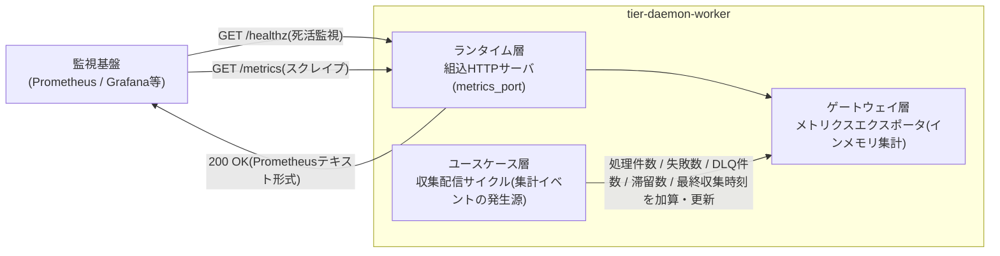
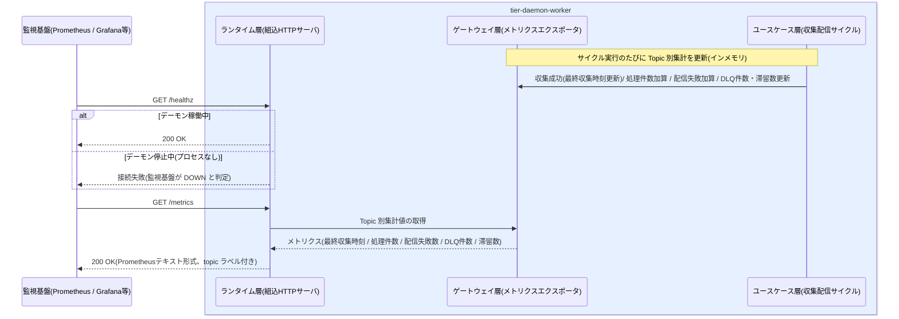

# /healthzと/metricsをHTTPで公開する

> ディレクトリ名は命名ルール("/" は "-" に置換)により「-healthzと-metricsをHTTPで公開する」とする。

## 概要

デーモンが死活監視用の `/healthz` と Prometheus 形式の `/metrics`(topic 別の最終収集時刻・処理件数・配信失敗数・DLQ 件数・滞留数)を組込 HTTP サーバで公開する。しきい値判定・アラート発報は外部監視基盤の責務とし、本体はメトリクス契約の安定提供に徹する(SP-005)。HTTP API はこの 2 エンドポイントのみで、オンライン応答系は持たない。

## データフロー



| レイヤー | データモデル | 変換内容 |
|---------|------------|---------|
| 監視基盤(外部) | HTTP GET リクエスト(/healthz、/metrics) | 監視ポーリング(スクレイプ間隔はポーリング間隔と独立) |
| DW ランタイム層 | 組込 HTTP サーバ | リクエスト受付 → /healthz は 200 応答、/metrics はエクスポータへ委譲 |
| DW ゲートウェイ層 | メトリクスエクスポータ(Topic 別のインメモリ集計) | 集計値 → Prometheus テキスト形式へ整形(LR-302) |
| DW ユースケース層 | 収集配信サイクルの処理イベント | 収集成功・配信失敗・DLQ 隔離等のイベント → Topic 別カウンタ/ゲージの更新 |
| Response | Prometheus テキスト形式(topic ラベル付きメトリクス) | 外部監視基盤での時系列蓄積・しきい値判定の入力 |

## 処理フロー



## バリエーション一覧

| バリエーション名 | 値 | 処理内容 | 適用 tier | 適用箇所 |
|----------------|---|---------|----------|---------|
| (該当なし) | - | この UC に直接適用されるバリエーション.tsv の値はない | - | - |

## 分岐条件一覧

| 条件名 | 判定ルール | 適用 tier | 適用箇所 | BDD Scenario |
|--------|----------|----------|---------|-------------|
| (該当なし) | この UC に直接適用される条件.tsv の条件は定義されていない。/healthz の応答可否はデーモン稼働状態(稼働中のみプロセスが応答)に従う | - | - | - |

## 計算ルール一覧

| 計算名 | 入力情報 | 計算式/ロジック | 出力情報 | 適用 tier |
|--------|---------|---------------|---------|----------|
| Topic 別メトリクス集計 | メッセージ(収集・配信・リトライ・DLQ 隔離イベント)、Topic | 収集成功時に最終収集時刻を更新、処理完了で処理件数を加算、Subscription 配信失敗で配信失敗数を加算、DLQ 隔離中の件数と未配信完了の滞留数をゲージ更新(インメモリ集計、永続化しない) | メトリクス(Topic別最終収集時刻 / 処理件数 / 配信失敗数 / DLQ件数 / 滞留数) | tier-daemon-worker |

## 状態遷移一覧

| 状態モデル | 遷移元 | 遷移先 | トリガー | 事前条件 | 事後処理 | 適用 tier |
|-----------|--------|--------|---------|---------|---------|----------|
| (該当なし) | - | - | この UC が遷移させる状態モデルはない。情報「メトリクス」に状態モデルはなく、/healthz が応答するのはデーモン稼働状態「稼働中」の間(遷移は UC「デーモンを起動する」「デーモンをgraceful shutdownで停止する」が行う) | - | - | - |

## 関連 RDRA モデル

| モデル種別 | 要素名 | 関連 |
|-----------|--------|------|
| 業務 | 配信基盤運用業務 | このUCが属する業務 |
| BUC | 配信基盤を監視するフロー | このUCを含むBUC |
| アクティビティ | 監視エンドポイントを公開する | このUCを含むアクティビティ |
| アクター | 配信基盤運用者 | メトリクスポートを設定し公開を構成するアクター(価値提供) |
| 情報 | メトリクス | 公開する観測データ(Topic別最終収集時刻 / 処理件数 / 配信失敗数 / DLQ件数 / 滞留数) |
| 情報 | Topic | メトリクスのラベル(異常検知の単位) |
| 情報 | 設定 | metrics_port(公開ポート)の定義元 |
| 外部システム | 監視基盤 | /healthz・/metrics を取得する外部システム |
| イベント | 監視データ提供 | 監視基盤への HTTP でのデータ提供 |
| 画面 | 監視エンドポイント設定画面 | GUI なしのため、設定 YAML の metrics_port がこの画面の代替となる |

## E2E 完了条件（BDD）

### 正常系

```gherkin
Feature: /healthzと/metricsをHTTPで公開する

  Scenario: 稼働中のデーモンが /healthz で 200 を返す
    Given デーモンが metrics_port=9090 で稼働中である
    When 監視基盤が GET http://localhost:9090/healthz を実行する
    Then HTTP 200 が返る

  Scenario: /metrics が Topic 別メトリクスを Prometheus 形式で返す
    Given Topic 「orders」 で当日 12 件のメッセージが処理され、Subscription 「next」 への配信失敗が 2 回、DLQ 隔離が 1 件発生している
    When 監視基盤が GET http://localhost:9090/metrics を実行する
    Then HTTP 200 で Prometheus テキスト形式のボディが返る
    And file_pubsub_processed_total{topic="orders"} が 12、file_pubsub_delivery_failure_total{topic="orders"} が 2、file_pubsub_dlq_count{topic="orders"} が 1 を示す
    And file_pubsub_last_collect_timestamp_seconds{topic="orders"} に最終収集時刻(Unix 秒)、file_pubsub_backlog_count{topic="orders"} に滞留数が示される

  Scenario: 再起動で counter がリセットされる(契約上の特性)
    Given file_pubsub_processed_total{topic="orders"} が 12 を示している
    When デーモンを再起動して GET /metrics を実行する
    Then counter は 0 から再カウントされる(蓄積と rate()/increase() ベースの扱いは外部監視基盤側の責務)
```

### 異常系

```gherkin
  Scenario: デーモン停止中は接続できず監視基盤が DOWN を検知する
    Given デーモンが graceful shutdown で停止済である
    When 監視基盤が GET http://localhost:9090/healthz を実行する
    Then 接続が失敗する(connection refused)
    And 外部監視基盤が死活 DOWN(up=0 相当)として検知する

  Scenario: 未定義パスへのリクエストには応答しない
    Given デーモンが metrics_port=9090 で稼働中である
    When GET http://localhost:9090/admin を実行する
    Then HTTP 404 が返る(公開するのは /healthz と /metrics の 2 エンドポイントのみ)
```

## ティア別仕様

- [常駐デーモン](tier-daemon-worker.md)

### 統合 API Spec

- [OpenAPI Spec](../../../_cross-cutting/api/openapi.yaml)（全 UC 統合、Contract First 開発用。GET /healthz・GET /metrics を含む）
