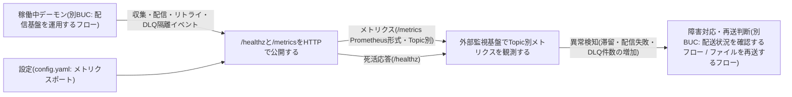
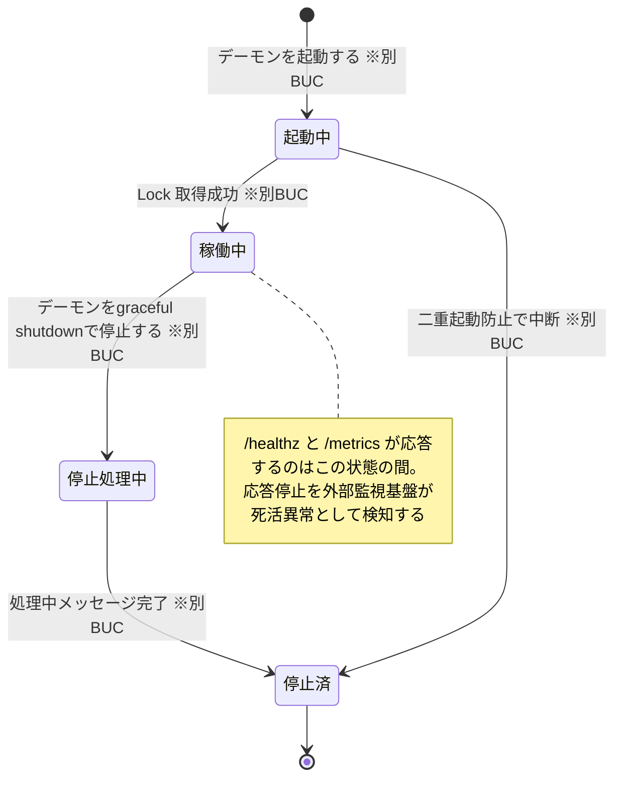

# 配信基盤を監視するフロー

## 概要

常駐デーモンが死活監視用の /healthz と Prometheus 形式の /metrics(Topic 別の最終収集時刻・処理件数・配信失敗数・DLQ 件数・滞留数等)を HTTP で公開し、Prometheus / Grafana 等の外部監視基盤が Topic ごとの異常検知(滞留・配信失敗・DLQ 増加)を行う BUC。しきい値判定・アラート発報は外部監視基盤の責務とし、検知結果を障害対応・再送判断につなげる。

## 所属 UC 一覧

| UC名 | アクター | 主な操作 | 関連情報 |
|------|---------|---------|---------|
| [/healthzと/metricsをHTTPで公開する](<-healthzと-metricsをHTTPで公開する/spec.md>) | 運用者(価値提供) / 監視基盤(外部) | デーモンが Topic 別メトリクスをインメモリ集計し、/healthz と /metrics を HTTP で公開する | メトリクス、Topic |
| [外部監視基盤でTopic別メトリクスを観測する](<外部監視基盤でTopic別メトリクスを観測する/spec.md>) | 運用者(価値受益) / 監視基盤(外部) | 外部監視基盤から /healthz による死活監視と /metrics による Topic ごとの異常検知を行う | メトリクス、Topic |

## UC 横断データフロー

BUC 内の UC 間で情報がどう流れるかを示す。情報がどの UC で作成(C)・参照(R)・更新(U)されるかを明記する。

### データフロー図

### 情報 CRUD マトリクス

| 情報名 | /healthzと/metricsをHTTPで公開する | 外部監視基盤でTopic別メトリクスを観測する |
|--------|:---:|:---:|
| メトリクス(Topic別最終収集時刻 / 処理件数 / 配信失敗数 / DLQ件数 / 滞留数) | C/U | R |
| Topic | R | R |
| 設定(config.yaml: メトリクスポート) | R | |

- /healthzと/metricsをHTTPで公開する の「C/U」は、収集・配信・リトライ・DLQ 隔離の各イベントに応じたインメモリ集計(永続化しない)を表す。counter はデーモン再起動でリセットされるため、観測側は rate() / increase() ベースで扱う。
- しきい値判定・アラート発報は外部監視基盤(Prometheus / Grafana 等)の責務であり、file-pubsub 本体は判定ルールを持たない。

## 状態遷移全体図

本 BUC の UC が遷移させる状態モデルはない(公開・観測のみ)。該当状態モデルはデーモン稼働状態で、/healthz が応答するのは「稼働中」の間のみという形で本 BUC の観測対象を規定する。状態.tsv のデーモン稼働状態の全遷移行を示す(遷移の担当 UC はいずれも別BUC: 配信基盤を運用するフロー)。

### 状態遷移 UC マッピング

| 状態モデル | 遷移元 | 遷移先 | 担当 UC | 本 BUC での扱い |
|-----------|--------|--------|--------|----------------|
| デーモン稼働状態 | (初期) | 起動中 | デーモンを起動する(別BUC: 配信基盤を運用するフロー) | /healthz 未応答(起動処理中) |
| デーモン稼働状態 | 起動中 | 稼働中 | デーモンを起動する(別BUC: 配信基盤を運用するフロー) | /healthz・/metrics の公開開始を観測 |
| デーモン稼働状態 | 起動中 | 停止済 | デーモンを起動する(別BUC: 配信基盤を運用するフロー) | 死活監視で応答なしとして検知 |
| デーモン稼働状態 | 稼働中 | 停止処理中 | デーモンをgraceful shutdownで停止する(別BUC: 配信基盤を運用するフロー) | 停止に伴う応答停止へ向かう |
| デーモン稼働状態 | 停止処理中 | 停止済 | デーモンをgraceful shutdownで停止する(別BUC: 配信基盤を運用するフロー) | /healthz 応答停止を死活監視で検知 |
| デーモン稼働状態 | 停止済 | (終了) | (UC遷移なし。停止完了の終了状態) | 計画停止か障害かを運用者が判断 |

- 情報「メトリクス」自体に状態モデルはない。メトリクスが反映するメッセージ配送状態(配信失敗・DLQ 隔離等)の遷移は別BUC(ファイルを収集して配信するフロー)の各 UC が担当する。

## BUC 内共有条件一覧

本 BUC の 2 UC に直接適用される条件.tsv の条件はない(両 UC とも公開・観測のみで、判定は外部監視基盤の責務)。

| 条件名 | 条件の説明 | 適用 UC |
|--------|----------|--------|
| (条件.tsv 該当なし) | /healthz の応答可否はデーモン稼働状態(稼働中のみ応答)に従い、その遷移を規定する条件「二重起動防止」「graceful shutdown」は別BUC(配信基盤を運用するフロー)で適用される。メトリクスが観測する DLQ 件数の増加は条件「リトライ上限」(別BUC: ファイルを収集して配信するフロー)の適用結果である | (なし。関連条件はすべて別BUC で適用) |

## BUC 内共有バリエーション一覧

本 BUC の 2 UC に直接適用されるバリエーション.tsv のバリエーションはない。

| バリエーション名 | 値 | 適用 UC |
|----------------|---|--------|
| (バリエーション.tsv 該当なし) | メトリクスは Topic 別に公開され、収集ソース種別(FTP / SFTP / SCP / ローカルディレクトリ)に依存しない。Topic 軸の観測は配信構成のバリエーションを吸収した後段の共通観測点である | (なし。関連バリエーションはすべて別BUC で適用) |
