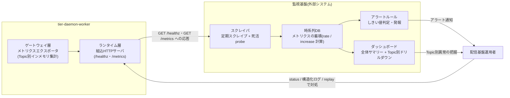
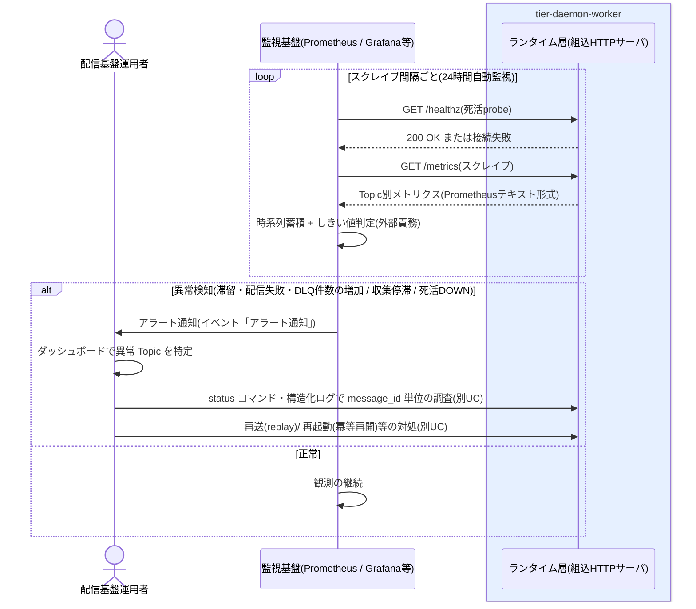

# 外部監視基盤でTopic別メトリクスを観測する

## 概要

Prometheus / Grafana 等の外部監視基盤から `/healthz` による死活監視と `/metrics` による Topic ごとの異常検知(滞留・配信失敗・DLQ 件数の増加 等)を行い、障害対応・再送判断につなげる。本 UC は file-pubsub から見た**外部 IF 仕様**であり、本体の責務はメトリクス契約の安定提供まで。しきい値判定・アラート発報・時系列蓄積・ダッシュボード表示は外部監視基盤の責務とする(SP-005、CTP-009)。

## データフロー



| レイヤー | データモデル | 変換内容 |
|---------|------------|---------|
| DW ランタイム層 + ゲートウェイ層 | Topic 別メトリクス(Prometheus テキスト形式) | 契約に従った安定提供(詳細は UC「/healthzと/metricsをHTTPで公開する」) |
| 監視基盤 スクレイパ | /healthz probe 結果 + /metrics スクレイプ結果 | 死活(up)と Topic 別メトリクスの時系列化 |
| 監視基盤 時系列DB | 時系列メトリクス | counter の rate()/increase() 計算(再起動リセットの吸収) |
| 監視基盤 アラートルール | しきい値判定結果 | 滞留・配信失敗・DLQ 増加・収集停滞・死活 DOWN の検知 → アラート通知 |
| 監視基盤 ダッシュボード | 全体サマリー + Topic 別パネル | 運用者が「いま対処が必要か」「どの Topic が異常か」を判断する表示 |

## 処理フロー



## バリエーション一覧

| バリエーション名 | 値 | 処理内容 | 適用 tier | 適用箇所 |
|----------------|---|---------|----------|---------|
| (該当なし) | - | この UC に直接適用されるバリエーション.tsv の値はない | - | - |

## 分岐条件一覧

| 条件名 | 判定ルール | 適用 tier | 適用箇所 | BDD Scenario |
|--------|----------|----------|---------|-------------|
| (該当なし) | この UC に直接適用される条件.tsv の条件は定義されていない。しきい値判定は外部監視基盤の責務であり file-pubsub 本体は判定ルールを持たない(SP-005) | - | - | - |

## 計算ルール一覧

| 計算名 | 入力情報 | 計算式/ロジック | 出力情報 | 適用 tier |
|--------|---------|---------------|---------|----------|
| 収集鮮度(外部監視基盤側) | メトリクス(Topic別最終収集時刻) | time() - file_pubsub_last_collect_timestamp_seconds(最終収集からの経過秒) | Topic 別の収集停滞検知 | 監視基盤(外部責務) |
| 増加量(外部監視基盤側) | メトリクス(処理件数 / 配信失敗数) | increase(counter[期間])。counter は再起動でリセットされるため rate()/increase() ベースで扱う | 配信失敗・処理量の傾向 | 監視基盤(外部責務) |

## 状態遷移一覧

| 状態モデル | 遷移元 | 遷移先 | トリガー | 事前条件 | 事後処理 | 適用 tier |
|-----------|--------|--------|---------|---------|---------|----------|
| (該当なし) | - | - | この UC が遷移させる状態モデルはない(観測のみ)。検知後の対処で UC「再送(Replay)を実行する」(メッセージ配送状態: dlq→配信中)や UC「デーモンを起動する」(デーモン稼働状態)へつなげる | - | - | - |

## 関連 RDRA モデル

| モデル種別 | 要素名 | 関連 |
|-----------|--------|------|
| 業務 | 配信基盤運用業務 | このUCが属する業務 |
| BUC | 配信基盤を監視するフロー | このUCを含むBUC |
| アクティビティ | 異常を検知する | このUCを含むアクティビティ |
| アクター | 配信基盤運用者 | アラート・ダッシュボードで異常を把握するアクター(価値受益) |
| 情報 | メトリクス | 観測対象(Topic別最終収集時刻 / 処理件数 / 配信失敗数 / DLQ件数 / 滞留数) |
| 情報 | Topic | 異常検知の単位(メトリクスのラベル) |
| 外部システム | 監視基盤 | /healthz 死活監視・/metrics しきい値判定・アラート発報を行う |
| イベント | アラート通知 | 監視基盤から運用者への異常通知 |
| 画面 | 監視ダッシュボード画面 | 外部監視基盤(Grafana 等)側のダッシュボードが該当(設計ガイドは data-visualization.md) |

## 外部 IF 仕様(監視基盤から見たメトリクス契約)

正本は [data-visualization.md](../../../_cross-cutting/ux-ui/data-visualization.md)。要点:

| 項目 | 契約 |
|------|------|
| 提供メトリクス | topic ラベル付きの 5 系列のみ(最終収集時刻 gauge / 処理件数 counter / 配信失敗数 counter / DLQ 件数 gauge / 滞留数 gauge)。RDRA に無いメトリクスは契約に含めない |
| 集計特性 | インメモリ集計・永続化なし。再起動で counter リセット。監視側は rate()/increase() ベースで扱う |
| 取得方法 | GET /metrics(Prometheus テキスト形式)、ポートは設定 YAML の metrics_port。スクレイプ間隔はポーリング間隔と独立 |
| 死活 | GET /healthz が稼働中に 200。死活はこちらで判定する(メトリクスと役割分離) |
| 推奨アラートルール例 | 死活 DOWN / 最終収集時刻の停滞 / DLQ > 0 / 配信失敗の増加 / 滞留の増加(PromQL 例は data-visualization.md)。しきい値は Topic のポーリング間隔・業務上の許容遅延に合わせて導入先が調整する |
| 責務境界 | 算出・公開 = file-pubsub / 蓄積・しきい値判定・発報・表示 = 外部監視基盤 / 検知後の調査・再送判断 = 配信基盤運用者(営業時間内) |

## E2E 完了条件（BDD）

### 正常系

```gherkin
Feature: 外部監視基盤でTopic別メトリクスを観測する

  Scenario: 監視基盤が Topic 別メトリクスを定期スクレイプで蓄積する
    Given Prometheus が scrape_interval=30s で http://daemon-host:9090/metrics をスクレイプ対象に設定している
    When デーモンが Topic 「orders」 のメッセージを処理し続ける
    Then Prometheus に file_pubsub_processed_total{topic="orders"} 等の 5 系列が時系列として蓄積される
    And Grafana のダッシュボードで全体サマリー(死活 / DLQ 合計 / 滞留合計 / 直近の配信失敗合計)と Topic 別ドリルダウンが表示できる

  Scenario: DLQ 滞留をアラートルールで検知して再送判断につなげる
    Given 外部監視基盤にアラートルール file_pubsub_dlq_count > 0 が設定されている
    And Topic 「invoices」 でリトライ上限 5 回を超えたメッセージが DLQ へ隔離され file_pubsub_dlq_count{topic="invoices"} が 1 になっている
    When 監視基盤が次のスクレイプでしきい値判定を行う
    Then アラート通知が配信基盤運用者へ発報される
    And 運用者は status コマンドで隔離理由を確認し再送(replay)/破棄を判断する(後続の別 UC)

  Scenario: 収集停滞を最終収集時刻の経過で検知する
    Given アラートルール time() - file_pubsub_last_collect_timestamp_seconds{topic="orders"} > 1800 が設定されている
    When Producer 側の障害で Topic 「orders」 の収集が 30 分以上行われない
    Then 収集停滞のアラートが発報され、Producer・収集ソース疎通の調査につなげられる
```

### 異常系

```gherkin
  Scenario: デーモン停止を死活監視で検知する
    Given 監視基盤が /healthz を 24 時間自動で probe している
    When デーモンのプロセスが停止し /healthz への接続が失敗する
    Then up=0 相当の死活 DOWN アラートが発報される
    And 運用者は再起動(冪等再開)で復旧する(UC「デーモンを起動する」「冪等に処理を再開する」)

  Scenario: デーモン再起動による counter リセットを誤検知しない
    Given 監視基盤が increase(file_pubsub_delivery_failure_total[15m]) でアラート判定している
    When デーモンの計画再起動で counter が 12 から 0 にリセットされる
    Then rate()/increase() ベースの判定によりリセットが負の増加として誤検知されない(契約上の前提を満たす)
```

## ティア別仕様

- [常駐デーモン(外部 IF 仕様)](tier-daemon-worker.md)

### 統合 API Spec

- [OpenAPI Spec](../../../_cross-cutting/api/openapi.yaml)（全 UC 統合。エンドポイント定義は UC「/healthzと/metricsをHTTPで公開する」に帰属）
