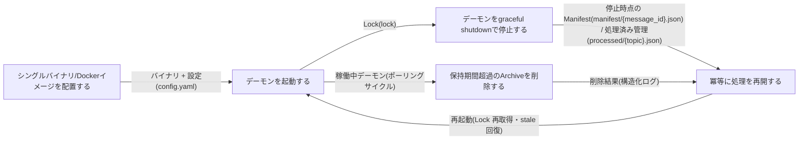
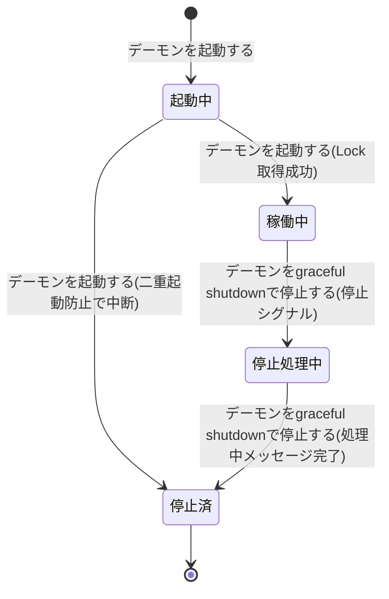
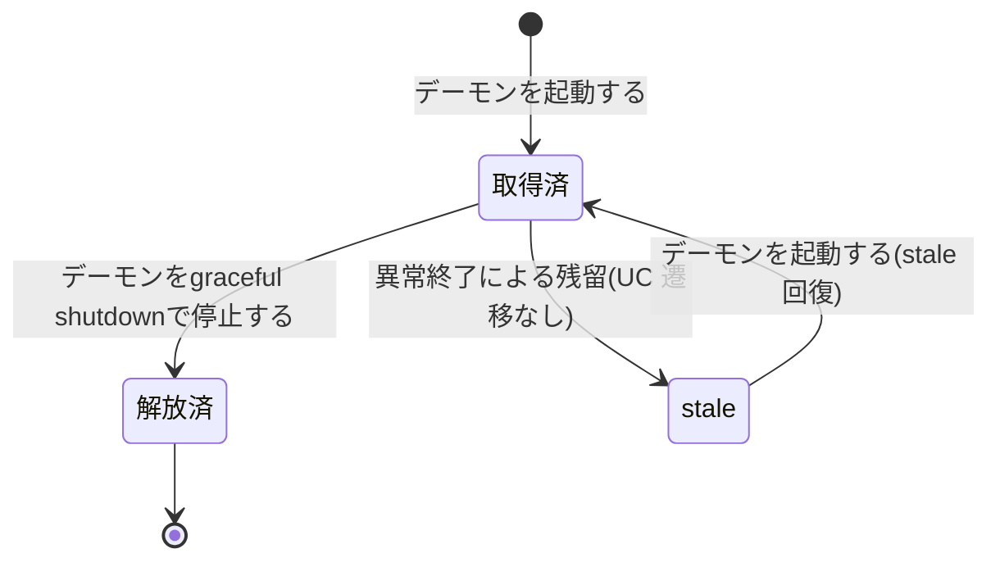
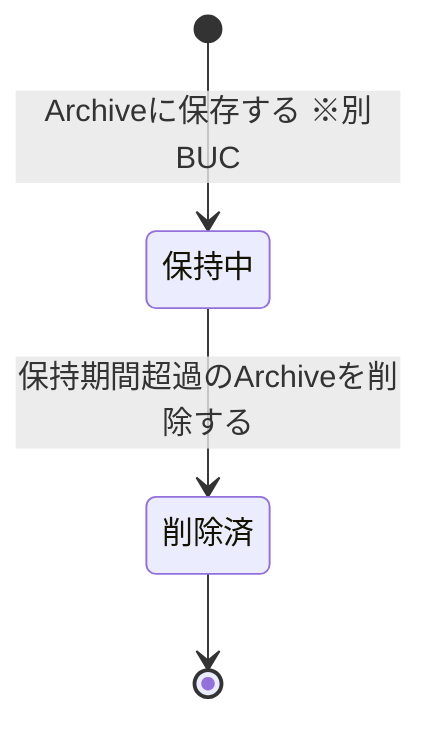

# 配信基盤を運用するフロー

## 概要

file-pubsub をレガシー現場へ導入(シングルバイナリ / Docker イメージ配置)し、常駐デーモンの起動・graceful shutdown・Archive の保持期間管理(retention)・再起動後の冪等な処理再開までを担う、配信基盤のライフサイクル運用の BUC。Lock による二重起動防止と Manifest / 処理済み管理に基づく冪等再開により、単一インスタンスでの安全な継続運用を実現する。

## 所属 UC 一覧

| UC名 | アクター | 主な操作 | 関連情報 |
|------|---------|---------|---------|
| [シングルバイナリ/Dockerイメージを配置する](<シングルバイナリ-Dockerイメージを配置する/spec.md>) | 運用者 | Go シングルバイナリまたは Docker コンテナイメージを配置し、docker compose 環境で動作を事前確認する | 設定 |
| [デーモンを起動する](<デーモンを起動する/spec.md>) | 運用者 | Lock(lock) を取得して常駐デーモンを起動し、収集・配信サイクルの自動実行を開始する。stale lock からは安全に回復する | 設定、Lock |
| [デーモンをgraceful shutdownで停止する](<デーモンをgraceful shutdownで停止する/spec.md>) | 運用者 | 停止シグナルを受けて処理中のメッセージを完了させてから停止し、Lock を解放する | メッセージ、Lock |
| [保持期間超過のArchiveを削除する](<保持期間超過のArchiveを削除する/spec.md>) | 運用者 | archive/{topic}/{message_id} のうち保持期間(retention)超過分だけを安全に削除し、ディスク枯渇を防ぐ | Archiveファイル、設定 |
| [冪等に処理を再開する](<冪等に処理を再開する/spec.md>) | 運用者(価値受益) | 再起動後に Manifest(manifest/{message_id}.json) と処理済み管理(processed/{topic}.json)に基づき、二重配信・重複収集なく処理を再開する | Manifest、処理済み管理、メッセージ、Lock |

## UC 横断データフロー

BUC 内の UC 間で情報がどう流れるかを示す。情報がどの UC で作成(C)・参照(R)・更新(U)・削除(D)されるかを明記する。

### データフロー図

### 情報 CRUD マトリクス

| 情報名 | シングルバイナリ/Dockerイメージを配置する | デーモンを起動する | デーモンをgraceful shutdownで停止する | 保持期間超過のArchiveを削除する | 冪等に処理を再開する |
|--------|:---:|:---:|:---:|:---:|:---:|
| 設定(config.yaml) | R | R | | R | R |
| Lock(lock) | | C | D | | R |
| メッセージ | | | U | | U |
| Manifest(manifest/{message_id}.json) | | | U | | R/U |
| 処理済み管理(processed/{topic}.json) | | | | | R |
| Archiveファイル(archive/{topic}/{message_id}) | | | | D | |

- デーモンを起動する の Lock「C」は新規取得と stale lock からの再取得、デーモンをgraceful shutdownで停止する の「D」は解放(lock ファイル削除)を表す。
- デーモンをgraceful shutdownで停止する のメッセージ「U」は処理中メッセージの完了(delivered / failed 記録)、冪等に処理を再開する の「U」は追いつき配信による配送状態の遷移を表す。
- 保持期間超過のArchiveを削除する は Archive ファイルのみ削除し、Manifest の配送履歴は削除しない。

## 状態遷移全体図

本 BUC が関連する状態モデルはデーモン稼働状態 / Lock状態 / Archiveファイル保持状態。状態.tsv の全遷移行を示す。

### デーモン稼働状態

### Lock状態

### Archiveファイル保持状態

### 状態遷移 UC マッピング

状態.tsv の該当状態モデルの全遷移行を網羅する。本 BUC 外の UC が担当する遷移は所属 BUC を併記する。

| 状態モデル | 遷移元 | 遷移先 | 担当 UC |
|-----------|--------|--------|--------|
| デーモン稼働状態 | (初期) | 起動中 | [デーモンを起動する](<デーモンを起動する/spec.md>) |
| デーモン稼働状態 | 起動中 | 稼働中 | [デーモンを起動する](<デーモンを起動する/spec.md>) |
| デーモン稼働状態 | 起動中 | 停止済 | [デーモンを起動する](<デーモンを起動する/spec.md>)(二重起動防止による中断) |
| デーモン稼働状態 | 稼働中 | 停止処理中 | [デーモンをgraceful shutdownで停止する](<デーモンをgraceful shutdownで停止する/spec.md>) |
| デーモン稼働状態 | 停止処理中 | 停止済 | [デーモンをgraceful shutdownで停止する](<デーモンをgraceful shutdownで停止する/spec.md>) |
| デーモン稼働状態 | 停止済 | (終了) | (UC遷移なし。再開時は[冪等に処理を再開する](<冪等に処理を再開する/spec.md>)が二重配信なく再起動できることを保証) |
| Lock状態 | (初期) | 取得済 | [デーモンを起動する](<デーモンを起動する/spec.md>) |
| Lock状態 | 取得済 | 解放済 | [デーモンをgraceful shutdownで停止する](<デーモンをgraceful shutdownで停止する/spec.md>) |
| Lock状態 | 取得済 | stale | (UC遷移なし。デーモンの異常終了による残留) |
| Lock状態 | stale | 取得済 | [デーモンを起動する](<デーモンを起動する/spec.md>)(stale 回復) |
| Lock状態 | 解放済 | (終了) | (UC遷移なし。Lock 解放の終了状態) |
| Archiveファイル保持状態 | (初期) | 保持中 | Archiveに保存する(別BUC: ファイルを収集して配信するフロー) |
| Archiveファイル保持状態 | 保持中 | 削除済 | [保持期間超過のArchiveを削除する](<保持期間超過のArchiveを削除する/spec.md>) |
| Archiveファイル保持状態 | 削除済 | (終了) | (UC遷移なし。削除完了の終了状態) |

## BUC 内共有条件一覧

本 BUC 内の UC に適用される条件.tsv の条件と、適用先 UC の一覧。2 つ以上の UC で適用されるものが「共有」。

| 条件名 | 条件の説明 | 適用 UC | 共有 |
|--------|----------|--------|:---:|
| 二重起動防止 | デーモンは起動時に Lock(lock) を取得し、同じ構成で 2 つ目のデーモンは起動せず終了する。異常終了で残った stale lock からは安全に回復して処理を開始できる | デーモンを起動する、冪等に処理を再開する(単一インスタンスでの再開前提) | 共有 |
| graceful shutdown | 停止シグナルを受けたら処理中のメッセージを完了してから停止する。中途半端な状態を残さない | デーモンをgraceful shutdownで停止する | |
| Archive保持期間 | Archive の保持期間を設定でき、retention 処理では期間を超過した Archive ファイルだけを安全に削除する | 保持期間超過のArchiveを削除する | |
| 二重配信防止 | 再起動・処理中断後の再開では Manifest の配送状態を参照し、未配信の Subscription にのみ配信する。配信済みの Subscription へは重複配置しない | 冪等に処理を再開する | |
| 元ファイル処理判定 | copy 設定の収集ソースでは処理済み管理(processed/{topic}.json)と照合し、処理済みのファイルは再収集しない | 冪等に処理を再開する | |

単一 UC のみで適用される条件の詳細は各 UC Spec の「分岐条件一覧」を参照。二重配信防止・元ファイル処理判定は別BUC(ファイルを収集して配信するフロー)の Fan-out / Collect とも共有される横断条件。シングルバイナリ/Dockerイメージを配置する には条件.tsv の直接適用条件はない(配布形態の選択はバリエーション「配布形態」による)。

## BUC 内共有バリエーション一覧

本 BUC 内の UC に適用されるバリエーション.tsv のバリエーションと、適用先 UC の一覧。2 つ以上の UC で適用されるものが「共有」。

| バリエーション名 | 値 | 適用 UC | 共有 |
|----------------|---|--------|:---:|
| 配布形態 | シングルバイナリ、Dockerコンテナイメージ | シングルバイナリ/Dockerイメージを配置する | |
| 元ファイル処理方式 | 回収(GET後DELETE)、残す(copy) | 冪等に処理を再開する(copy 時の処理済み照合 / 回収時は重複収集が発生しない) | |
| 配信方式 | 通常配信(Fan-out)、再送(Replay) | 冪等に処理を再開する(追いつき配信は通常配信として Manifest に記録) | |

本 BUC 内で 2 つ以上の UC に共有されるバリエーションはない(各バリエーションの適用は単一 UC)。元ファイル処理方式・配信方式は別BUC(ファイルを収集して配信するフロー / ファイルを再送するフロー)と共有される横断バリエーション。デーモンを起動する / デーモンをgraceful shutdownで停止する / 保持期間超過のArchiveを削除する に直接適用されるバリエーションはない。
