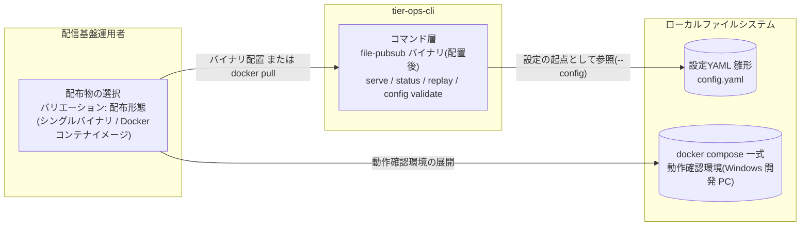
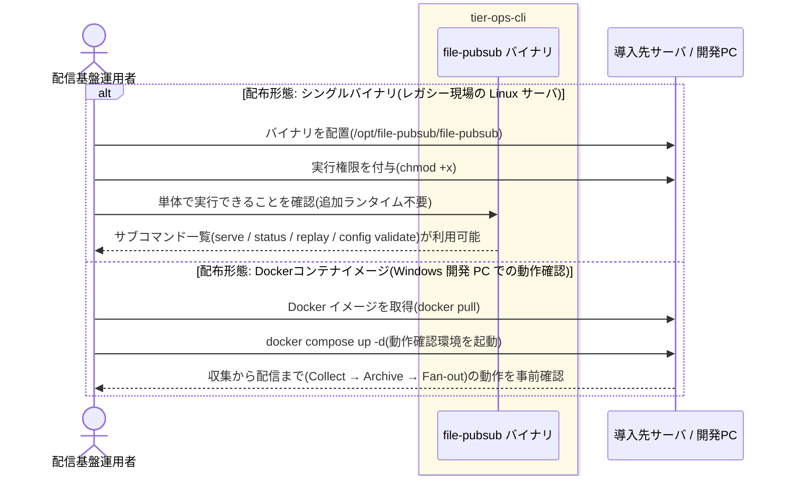

# シングルバイナリ/Dockerイメージを配置する

> ディレクトリ名は命名ルール("/" は "-" に置換)により「シングルバイナリ-Dockerイメージを配置する」とする。

## 概要

Go 実装のシングルバイナリを追加ランタイムなしでレガシー現場のサーバへ配置するか、Docker コンテナイメージを利用して file-pubsub を導入する。docker compose の動作確認環境で収集から配信までの動作を事前確認できる。本システムは GUI を持たないため、本 UC は tier-ops-cli の導入手順仕様として定義する。

## データフロー

この UC で扱うデータ(配布物・設定 YAML 雛形・動作確認環境)がどう流れるかを示す。
デーモン稼働前の導入作業のため、レイヤー間の call stack ではなく配布物の配置フローとして表現する。



| レイヤー | データモデル | 変換内容 |
|---------|------------|---------|
| 運用者(導入作業) | 配布物(シングルバイナリ / Docker イメージ) | 配布形態の選択 → 導入先サーバ/開発 PC への配置 |
| tier-ops-cli コマンド層 | file-pubsub バイナリ(単一バイナリ・全サブコマンド同梱) | 配置完了 → serve / status / replay / config validate が実行可能になる |
| ローカルファイルシステム | 設定 YAML 雛形(config.yaml)、docker compose 一式 | 後続 UC「Topic・Subscriptionを設定する」「デーモンを起動する」の前提を整える |

## 処理フロー



## バリエーション一覧

| バリエーション名 | 値 | 処理内容 | 適用 tier | 適用箇所 |
|----------------|---|---------|----------|---------|
| 配布形態 | シングルバイナリ | レガシー現場の Linux サーバへ追加ランタイム不要で配置(Go シングルバイナリ) | tier-ops-cli | 導入手順(バイナリ配置) |
| 配布形態 | Dockerコンテナイメージ | Windows 開発 PC での動作確認に docker compose 一式を利用 | tier-ops-cli | 導入手順(docker compose 動作確認環境) |

## 分岐条件一覧

| 条件名 | 判定ルール | 適用 tier | 適用箇所 | BDD Scenario |
|--------|----------|----------|---------|-------------|
| (該当なし) | この UC に直接適用される条件.tsv の条件は定義されていない。配布形態の選択はバリエーション「配布形態」による | - | - | - |

## 計算ルール一覧

| 計算名 | 入力情報 | 計算式/ロジック | 出力情報 | 適用 tier |
|--------|---------|---------------|---------|----------|
| (該当なし) | - | この UC に計算ルールはない | - | - |

## 状態遷移一覧

| 状態モデル | 遷移元 | 遷移先 | トリガー | 事前条件 | 事後処理 | 適用 tier |
|-----------|--------|--------|---------|---------|---------|----------|
| (該当なし) | - | - | この UC が遷移させる状態モデルはない(デーモン稼働状態の遷移は UC「デーモンを起動する」から始まる) | - | - | - |

## 関連 RDRA モデル

| モデル種別 | 要素名 | 関連 |
|-----------|--------|------|
| 業務 | 配信基盤運用業務 | このUCが属する業務 |
| BUC | 配信基盤を運用するフロー | このUCを含むBUC |
| アクティビティ | 配信基盤を導入する | このUCを含むアクティビティ |
| アクター | 配信基盤運用者 | 導入作業を行うアクター(価値提供) |
| 情報 | 設定 | 導入後に編集する単一 YAML 設定(配信構成管理の起点) |
| バリエーション | 配布形態 | シングルバイナリ / Dockerコンテナイメージの使い分け |
| 画面 | 基盤導入画面 | GUI なしのため、バイナリ配置手順 + docker compose 動作確認環境がこの画面の代替となる |

## E2E 完了条件（BDD）

### 正常系

```gherkin
Feature: シングルバイナリ/Dockerイメージを配置する

  Scenario: シングルバイナリをレガシー現場の Linux サーバへ配置する
    Given 導入先の Linux サーバに配置先ディレクトリ /opt/file-pubsub が存在する
    And サーバには Go ランタイムや追加ミドルウェアがインストールされていない
    When 配信基盤運用者がシングルバイナリ file-pubsub を /opt/file-pubsub/file-pubsub に配置し chmod +x で実行権限を付与する
    Then 追加ランタイムのインストールなしで file-pubsub が実行できる
    And serve / status / replay / config validate のサブコマンドが同一バイナリで利用できる

  Scenario: docker compose の動作確認環境で収集から配信までを事前確認する
    Given Windows 開発 PC に Docker と docker compose がインストールされている
    And 動作確認環境の config.yaml に Topic 「orders」と Subscription 「current」が定義されている
    When 配信基盤運用者が docker compose up -d で動作確認環境を起動し、収集ソースのディレクトリに sales.csv を配置する
    Then sales.csv が archive/orders/ 配下へ保存される
    And Subscription 「current」 の配置先ディレクトリに sales.csv が配信される
```

### 異常系

```gherkin
  Scenario: 実行権限のないバイナリを起動しようとする
    Given /opt/file-pubsub/file-pubsub に実行権限が付与されていない
    When 配信基盤運用者が file-pubsub を実行する
    Then OS が permission denied で実行を拒否する
    And README の導入手順(chmod +x の付与)に従って解決できる
```

## ティア別仕様

- [運用 CLI(導入手順仕様)](tier-ops-cli.md)

### 統合 API Spec

- [OpenAPI Spec](../../../_cross-cutting/api/openapi.yaml)（全 UC 統合、Contract First 開発用。この UC に HTTP API はない）
