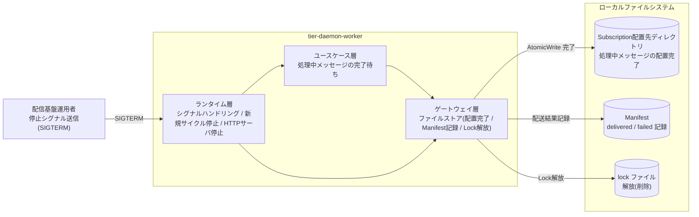
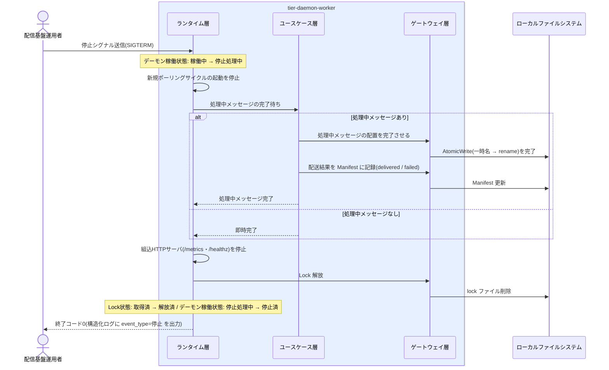

# デーモンをgraceful shutdownで停止する

## 概要

停止シグナルを受けたデーモンはデーモン稼働状態を「稼働中」から「停止処理中」へ遷移させ、新規処理を止め、処理中のメッセージを完了させてから Lock を解放して「停止済」へ遷移する(graceful shutdown)。中途半端な状態を残さず、計画停止ありの 24 時間運用を支える。

## データフロー



| レイヤー | データモデル | 変換内容 |
|---------|------------|---------|
| 運用者 | 停止シグナル(SIGTERM) | 停止指示 → デーモン稼働状態「停止処理中」への遷移トリガー |
| DW ランタイム層 | シグナルハンドラ(LP-001) | 新規ポーリングサイクルの起動停止 → 処理中メッセージ完了待ち → HTTP サーバ停止 |
| DW ユースケース層 | 処理中メッセージ(メッセージ配送状態) | 処理中のメッセージを完了させる(中途半端な状態を残さない) |
| DW ゲートウェイ層 | Manifest 記録 / lock ファイル削除 | 配送結果の記録と Lock 解放(Lock状態: 取得済 → 解放済) |
| 結果 | 終了コード 0 + 構造化ログ(event_type=停止) | graceful shutdown 完了の機械判定 |

## 処理フロー



## バリエーション一覧

| バリエーション名 | 値 | 処理内容 | 適用 tier | 適用箇所 |
|----------------|---|---------|----------|---------|
| (該当なし) | - | この UC に直接適用されるバリエーション.tsv の値はない | - | - |

## 分岐条件一覧

| 条件名 | 判定ルール | 適用 tier | 適用箇所 | BDD Scenario |
|--------|----------|----------|---------|-------------|
| graceful shutdown | 停止シグナルを受けたら新規処理(新規ポーリングサイクル)を止め、処理中のメッセージを完了してから停止する。中途半端な状態を残さない | tier-daemon-worker | ランタイム層 シグナルハンドリング(LP-001、SR-007) | 処理中メッセージを完了してから停止する |

## 計算ルール一覧

| 計算名 | 入力情報 | 計算式/ロジック | 出力情報 | 適用 tier |
|--------|---------|---------------|---------|----------|
| (該当なし) | - | この UC に計算ルールはない | - | - |

## 状態遷移一覧

| 状態モデル | 遷移元 | 遷移先 | トリガー | 事前条件 | 事後処理 | 適用 tier |
|-----------|--------|--------|---------|---------|---------|----------|
| デーモン稼働状態 | 稼働中 | 停止処理中 | 停止シグナル受信(SIGTERM) | デーモンが稼働中 | 新規処理を止め、処理中メッセージの完了を待つ | tier-daemon-worker |
| デーモン稼働状態 | 停止処理中 | 停止済 | 処理中メッセージの完了 | 処理中メッセージがすべて完了し配送結果を Manifest に記録済み | Lock を解放して終了(終了コード 0)。再開時は冪等処理により二重配信なく再起動できる | tier-daemon-worker |
| Lock状態 | 取得済 | 解放済 | graceful shutdown の完了 | デーモン稼働状態が停止処理中→停止済へ遷移する | lock ファイルを削除し、次回起動が正常に行えるようにする | tier-daemon-worker |
| メッセージ配送状態 | 配信中 | 配信済(delivered) | 停止処理中の処理中メッセージ完了 | AtomicWrite による配置が成功 | Manifest に delivered を記録してから停止 | tier-daemon-worker |
| メッセージ配送状態 | 配信中 | 配信失敗(failed) | 停止処理中の配置失敗 | - | Manifest に failed を記録してから停止(再開後にリトライ処理へ) | tier-daemon-worker |

## 関連 RDRA モデル

| モデル種別 | 要素名 | 関連 |
|-----------|--------|------|
| 業務 | 配信基盤運用業務 | このUCが属する業務 |
| BUC | 配信基盤を運用するフロー | このUCを含むBUC |
| アクティビティ | デーモンを停止する | このUCを含むアクティビティ |
| アクター | 配信基盤運用者 | 停止指示を行うアクター(価値提供) |
| 情報 | メッセージ | 完了を待つ処理中メッセージ |
| 情報 | Lock | 停止時に解放するロック情報 |
| 条件 | graceful shutdown | 処理中メッセージ完了後の停止ルール |
| 状態 | デーモン稼働状態 | 稼働中→停止処理中→停止済 |
| 状態 | Lock状態 | 取得済→解放済 |
| 状態 | メッセージ配送状態 | 処理中メッセージの完了(配信中→配信済/配信失敗) |
| 画面 | デーモン操作画面 | GUI なしのため、停止シグナル送信と構造化ログ・終了コードがこの画面の代替となる |

## E2E 完了条件（BDD）

### 正常系

```gherkin
Feature: デーモンをgraceful shutdownで停止する

  Scenario: 処理中メッセージを完了してから停止する
    Given pid=12345 のデーモンが稼働中で lock ファイルを保持している
    And message_id 「20260612T093001_orders_sales.csv」 が Subscription 「next」 へ配信中(一時名 sales.csv.tmp で書込中)である
    When 配信基盤運用者が SIGTERM を送信する
    Then 新規ポーリングサイクルは起動されない
    And sales.csv.tmp の書込と正式名 sales.csv への rename が完了し、Manifest に next=delivered が記録される
    And lock ファイルが削除され(Lock状態: 取得済 → 解放済)、終了コード 0 で停止する

  Scenario: 処理中メッセージがない状態で即時停止する
    Given デーモンが稼働中でポーリングサイクル間の待機中(処理中メッセージなし)である
    When 配信基盤運用者が SIGTERM を送信する
    Then 完了待ちなしで lock が解放され、終了コード 0 で停止する
    And 構造化ログに event_type=停止 が出力される
```

### 異常系

```gherkin
  Scenario: 強制終了(SIGKILL)では stale lock が残る
    Given pid=12345 のデーモンが稼働中で lock ファイルを保持している
    When kill -9 で強制終了される(graceful shutdown が実行されない)
    Then lock ファイルが pid=12345 のまま残留する(Lock状態: 取得済 → stale)
    And 次回起動時に stale lock として安全に回復され(UC「デーモンを起動する」)、処理は冪等に再開される(UC「冪等に処理を再開する」)

  Scenario: 停止処理中に配置が失敗したメッセージは failed を記録して停止する
    Given message_id 「20260612T093001_orders_sales.csv」 の Subscription 「next」 への配置が permission denied で失敗する
    When SIGTERM 受信後の処理中メッセージ完了待ちが実行される
    Then Manifest に next=failed が記録されてから停止する(中途半端な未記録状態を残さない)
    And 再起動後のリトライ処理で自動回復が試みられる
```

## ティア別仕様

- [常駐デーモン](tier-daemon-worker.md)

### 統合 API Spec

- [OpenAPI Spec](../../../_cross-cutting/api/openapi.yaml)（全 UC 統合、Contract First 開発用。この UC に HTTP API はない）
