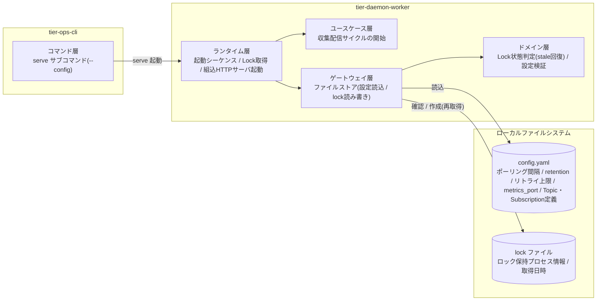
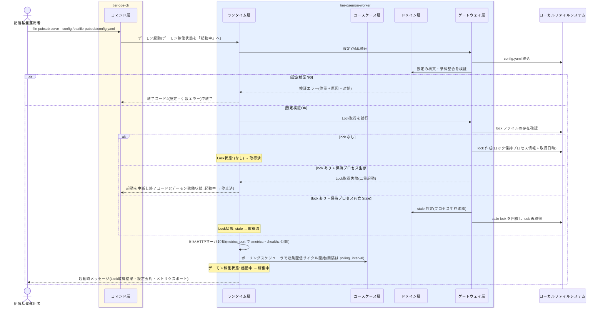

# デーモンを起動する

## 概要

`serve` サブコマンドでポーリング間隔を設定した常駐デーモンを起動する。起動時に設定 YAML を読込・検証し、Lock 取得で二重起動を防止する。異常終了後の stale lock からは安全に回復する。デーモン稼働状態を「起動中」から「稼働中」へ遷移させ、収集・配信サイクルの自動実行を開始する。

## データフロー



| レイヤー | データモデル | 変換内容 |
|---------|------------|---------|
| CLI コマンド層 | serve サブコマンド引数(--config パス) | 引数解析 → デーモン起動指示 |
| DW ランタイム層 | 起動シーケンス(デーモン稼働状態: 起動中) | Lock 取得 → HTTP サーバ起動 → ポーリングスケジューラ開始 |
| DW ドメイン層 | Lock(保持プロセス情報・取得日時)、設定モデル | stale 判定(プロセス生存確認)、設定の構文・参照整合検証 |
| DW ゲートウェイ層 | config.yaml / lock ファイルの読み書き | YAML パース、lock ファイルの確認・作成 |
| 結果 | 構造化ログ(起動メッセージ)+ 終了コード | Lock 取得結果・設定要約・メトリクスポートを起動時メッセージで明示 |

## 処理フロー



## バリエーション一覧

| バリエーション名 | 値 | 処理内容 | 適用 tier | 適用箇所 |
|----------------|---|---------|----------|---------|
| (該当なし) | - | この UC に直接適用されるバリエーション.tsv の値はない(配布形態は UC「シングルバイナリ/Dockerイメージを配置する」で扱う) | - | - |

## 分岐条件一覧

| 条件名 | 判定ルール | 適用 tier | 適用箇所 | BDD Scenario |
|--------|----------|----------|---------|-------------|
| 二重起動防止 | 起動時に Lock を取得する。lock が存在し保持プロセスが生存していれば同じ構成の 2 つ目のデーモンとして起動せず終了(終了コード 3)。lock が存在するが保持プロセスが死亡していれば stale lock と判定し、安全に回復して Lock を再取得する | tier-daemon-worker | ランタイム層 起動シーケンス(LR-002) | 二重起動を防止する / stale lock から安全に回復して起動する |

## 計算ルール一覧

| 計算名 | 入力情報 | 計算式/ロジック | 出力情報 | 適用 tier |
|--------|---------|---------------|---------|----------|
| stale 判定 | Lock(ロック保持プロセス情報、取得日時) | lock に記録された保持プロセスの生存確認を行い、死亡していれば stale と判定する(取得日時は stale 判定の補助情報) | Lock状態(取得済 / stale) | tier-daemon-worker |

## 状態遷移一覧

| 状態モデル | 遷移元 | 遷移先 | トリガー | 事前条件 | 事後処理 | 適用 tier |
|-----------|--------|--------|---------|---------|---------|----------|
| デーモン稼働状態 | (初期) | 起動中 | serve による起動指示 | 設定 YAML が読込可能 | Lock 取得と stale 回復判定を開始 | tier-daemon-worker |
| デーモン稼働状態 | 起動中 | 稼働中 | Lock 取得成功 | Lock状態が取得済 | ポーリング間隔で収集・配信サイクルの自動実行を開始、/metrics・/healthz を公開 | tier-daemon-worker |
| デーモン稼働状態 | 起動中 | 停止済 | 他インスタンスが Lock を保持 | lock が存在し保持プロセスが生存 | 二重起動防止のため起動を中断して終了(終了コード 3) | tier-daemon-worker |
| Lock状態 | (なし) | 取得済 | デーモン起動時の Lock 取得 | lock ファイルが存在しない | lock ファイルにロック保持プロセス情報と取得日時を記録 | tier-daemon-worker |
| Lock状態 | stale | 取得済 | stale lock と判定された場合の再取得 | 保持プロセスの死亡をプロセス生存確認で確認済み | 再起動したインスタンスが安全に回復して Lock を再取得 | tier-daemon-worker |

## 関連 RDRA モデル

| モデル種別 | 要素名 | 関連 |
|-----------|--------|------|
| 業務 | 配信基盤運用業務 | このUCが属する業務 |
| BUC | 配信基盤を運用するフロー | このUCを含むBUC |
| アクティビティ | デーモンを起動する | このUCを含むアクティビティ |
| アクター | 配信基盤運用者 | serve を実行するアクター(価値提供) |
| 情報 | 設定 | 起動時に読込・検証する単一 YAML(ポーリング間隔・metrics_port 等) |
| 情報 | Lock | 二重起動防止のためのロック情報(保持プロセス情報・取得日時) |
| 条件 | 二重起動防止 | Lock 取得・stale 回復の判定ルール |
| 状態 | デーモン稼働状態 | (初期)→起動中→稼働中 / 起動中→停止済 |
| 状態 | Lock状態 | (なし)→取得済 / stale→取得済 |
| 画面 | デーモン操作画面 | GUI なしのため、serve サブコマンドと起動時メッセージがこの画面の代替となる |

## E2E 完了条件（BDD）

### 正常系

```gherkin
Feature: デーモンを起動する

  Scenario: serve でデーモンを起動し稼働中になる
    Given /etc/file-pubsub/config.yaml に polling_interval=60、metrics_port=9090 と Topic 「orders」 が定義され config validate を通過する内容である
    And lock ファイルが存在しない
    When 配信基盤運用者が file-pubsub serve --config /etc/file-pubsub/config.yaml を実行する
    Then lock ファイルが作成されロック保持プロセス情報(pid=12345)と取得日時が記録される
    And 起動時メッセージに Lock 取得結果・設定要約・メトリクスポート 9090 が表示される
    And デーモン稼働状態が起動中から稼働中へ遷移し、60 秒間隔の収集・配信サイクルが開始される

  Scenario: stale lock から安全に回復して起動する
    Given 前回のデーモンが異常終了し、lock ファイルに pid=99999(すでに存在しないプロセス)が残っている
    When 配信基盤運用者が file-pubsub serve --config /etc/file-pubsub/config.yaml を実行する
    Then プロセス生存確認により lock が stale と判定される
    And 新しいインスタンスが Lock を再取得(Lock状態: stale → 取得済)して稼働中へ遷移する
```

### 異常系

```gherkin
  Scenario: 二重起動を防止する
    Given pid=12345 のデーモンが稼働中で lock ファイルを保持している
    When 配信基盤運用者が同じ config.yaml を指定して 2 つ目の file-pubsub serve を実行する
    Then 2 つ目のデーモンは Lock を取得できず起動を中断する
    And 終了コード 3(二重起動)で終了し、稼働中のデーモンには影響しない

  Scenario: 設定検証エラーで起動前に弾く
    Given config.yaml の topics[0].subscriptions[0].directory が未定義である
    When 配信基盤運用者が file-pubsub serve --config config.yaml を実行する
    Then 「位置(YAML のキーパス)+ 原因 + 対処」を含むエラーが表示される
    And 終了コード 2(設定・引数エラー)で終了し、デーモンは稼働状態にならない
```

## ティア別仕様

- [常駐デーモン](tier-daemon-worker.md)
- [運用 CLI](tier-ops-cli.md)

### 統合 API Spec

- [OpenAPI Spec](../../../_cross-cutting/api/openapi.yaml)（全 UC 統合、Contract First 開発用。この UC に HTTP API はない）
