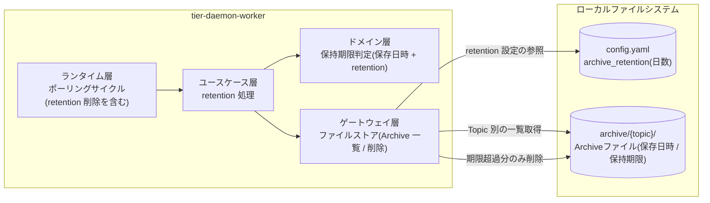
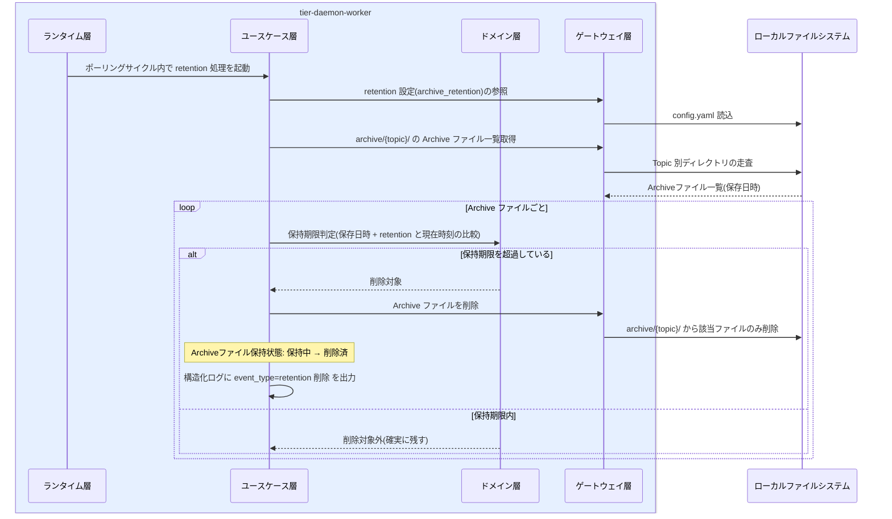

# 保持期間超過のArchiveを削除する

## 概要

Archive に設定した保持期間(retention)を超過した分を retention 処理で安全に削除し、無限に溜めない。長期運用でのディスク枯渇を防ぎつつ、再送(Replay)・監査に必要な期間のデータは確実に残す。retention 処理は常駐デーモンのポーリングサイクル内で自動実行される。

## データフロー



| レイヤー | データモデル | 変換内容 |
|---------|------------|---------|
| DW ランタイム層 | ポーリングサイクル | サイクル内の retention 削除ステップ起動(collect→archive→fanout→リトライ/DLQ→retention 削除) |
| DW ユースケース層 | retention 処理 | Topic 別に Archive ファイル一覧を取得 → 期限判定 → 削除指示 |
| DW ドメイン層 | 保持期限判定(純粋ロジック) | 保存日時 + archive_retention(日数)と現在時刻の比較 → 削除可否 |
| DW ゲートウェイ層 | archive/{topic}/ の一覧・削除 | 期限超過ファイルのみ削除(Archiveファイル保持状態: 保持中 → 削除済) |
| 結果 | 構造化ログ(event_type=retention 削除) | 削除した topic・件数の追跡 |

## 処理フロー



## バリエーション一覧

| バリエーション名 | 値 | 処理内容 | 適用 tier | 適用箇所 |
|----------------|---|---------|----------|---------|
| (該当なし) | - | この UC に直接適用されるバリエーション.tsv の値はない | - | - |

## 分岐条件一覧

| 条件名 | 判定ルール | 適用 tier | 適用箇所 | BDD Scenario |
|--------|----------|----------|---------|-------------|
| Archive保持期間 | Archive の保持期間(retention)を設定でき、retention 処理では期間を超過した Archive ファイルだけを安全に削除する。期限内のファイルは削除しない | tier-daemon-worker | ユースケース層 retention 処理 + ドメイン層 保持期限判定(SP-006) | 保持期間超過の Archive だけが削除される |

## 計算ルール一覧

| 計算名 | 入力情報 | 計算式/ロジック | 出力情報 | 適用 tier |
|--------|---------|---------------|---------|----------|
| 保持期限 | Archiveファイル(保存日時)、設定(archive_retention 日数) | 保持期限 = 保存日時 + archive_retention(日)。現在時刻 > 保持期限 のファイルを削除対象と判定する | Archiveファイル(保持期限)、削除対象判定 | tier-daemon-worker |

## 状態遷移一覧

| 状態モデル | 遷移元 | 遷移先 | トリガー | 事前条件 | 事後処理 | 適用 tier |
|-----------|--------|--------|---------|---------|---------|----------|
| Archiveファイル保持状態 | 保持中 | 削除済 | retention 処理による削除 | 保存日時 + retention(日)を現在時刻が超過している | archive/{topic}/ から該当ファイルを削除し、構造化ログに記録。Manifest の配送履歴は削除しない | tier-daemon-worker |

## 関連 RDRA モデル

| モデル種別 | 要素名 | 関連 |
|-----------|--------|------|
| 業務 | 配信基盤運用業務 | このUCが属する業務 |
| BUC | 配信基盤を運用するフロー | このUCを含むBUC |
| アクティビティ | Archive容量を管理する | このUCを含むアクティビティ |
| アクター | 配信基盤運用者 | retention を設定し容量管理を行うアクター(価値提供) |
| 情報 | Archiveファイル | 削除対象(保存日時・保持期限) |
| 情報 | 設定 | archive_retention(保持期間)の定義元 |
| 条件 | Archive保持期間 | 期間超過分だけを安全に削除するルール |
| 状態 | Archiveファイル保持状態 | 保持中→削除済 |
| 画面 | Archive容量管理画面 | GUI なしのため、設定 YAML の archive_retention と構造化ログがこの画面の代替となる |

## E2E 完了条件（BDD）

### 正常系

```gherkin
Feature: 保持期間超過のArchiveを削除する

  Scenario: 保持期間超過の Archive だけが削除される
    Given config.yaml に archive_retention=90(日)が設定されている
    And archive/orders/ に保存日時 2026-03-01 の sales_old.csv(103 日経過)と保存日時 2026-05-01 の sales_new.csv(42 日経過)が存在する
    When 2026-06-12 のポーリングサイクルで retention 処理が実行される
    Then sales_old.csv は削除される(Archiveファイル保持状態: 保持中 → 削除済)
    And sales_new.csv は削除されず保持される
    And 構造化ログに topic=orders の retention 削除イベントが出力される

  Scenario: 保持期間内のファイルのみの Topic では何も削除されない
    Given archive/invoices/ のすべての Archive ファイルが保存日時から 90 日以内である
    When retention 処理が実行される
    Then archive/invoices/ のファイルは 1 件も削除されない
    And 再送(Replay)・監査に必要な期間のデータが確実に残る
```

### 異常系

```gherkin
  Scenario: 削除に失敗してもデーモンは継続しサイクルごとに再試行される
    Given archive/orders/ の期限超過ファイル sales_old.csv がファイル権限エラーで削除できない
    When retention 処理が実行される
    Then 構造化ログに topic=orders と原因(permission denied)+ 対処(ファイル権限と実行ユーザの確認)が出力される
    And デーモンの収集・配信サイクルは停止せず継続する
    And 次回ポーリングサイクルの retention 処理で再び削除が試行される
```

## ティア別仕様

- [常駐デーモン](tier-daemon-worker.md)

### 統合 API Spec

- [OpenAPI Spec](../../../_cross-cutting/api/openapi.yaml)（全 UC 統合、Contract First 開発用。この UC に HTTP API はない）
