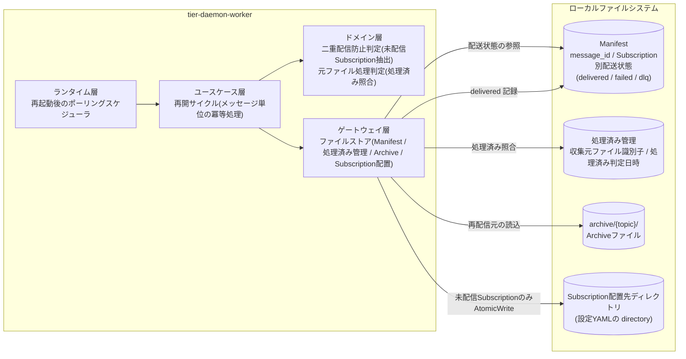
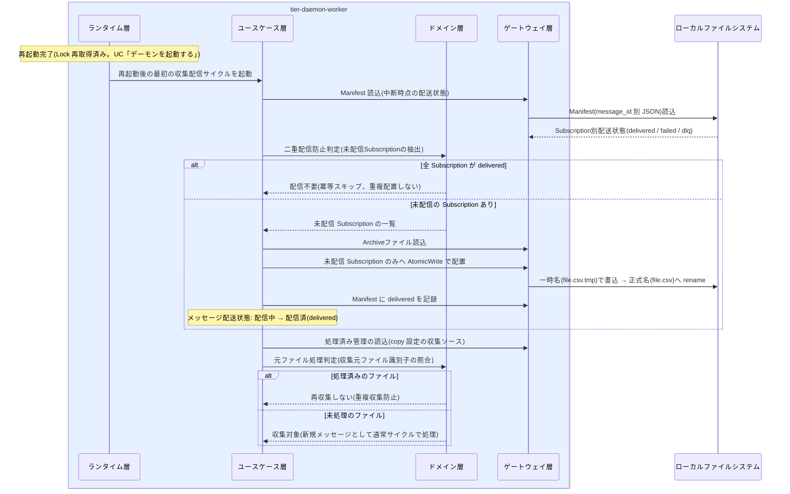

# 冪等に処理を再開する

## 概要

障害・メンテナンスでの再起動後も、デーモンは Manifest と処理済み管理に基づき冪等に処理を再開する。Manifest の配送状態を参照して未配信の Subscription にのみ配信し(二重配信防止)、copy 設定の収集ソースでは処理済み管理と照合して再収集を防ぐ。二重配信や履歴消失なく単一インスタンスでの安全な継続運用を実現する。

## データフロー



| レイヤー | データモデル | 変換内容 |
|---------|------------|---------|
| DW ランタイム層 | ポーリングスケジューラ | 再起動後の最初のサイクル起動(特別な再開モードは持たず、通常サイクルが冪等に再開を兼ねる) |
| DW ユースケース層 | メッセージ単位の処理進行(LP-101) | 中断時点のメッセージ配送状態から処理を継続 |
| DW ドメイン層 | 二重配信防止判定 / 元ファイル処理判定 | Manifest の Subscription 別配送状態 → 未配信 Subscription の抽出。処理済み管理 → 再収集可否 |
| DW ゲートウェイ層 | Manifest / 処理済み管理 / Archive / Subscription 配置 | 未配信分のみ AtomicWrite で配置し、delivered を Manifest に記録 |

## 処理フロー



## バリエーション一覧

| バリエーション名 | 値 | 処理内容 | 適用 tier | 適用箇所 |
|----------------|---|---------|----------|---------|
| 元ファイル処理方式 | 回収(GET後DELETE) | 元ファイルは収集時に削除済みのため、再開時の重複収集は発生しない(収集ソース上に存在しない) | tier-daemon-worker | 再開サイクルの収集処理 |
| 元ファイル処理方式 | 残す(copy) | 収集ソースに残った元ファイルを処理済み管理と照合し、処理済みは再収集しない | tier-daemon-worker | 元ファイル処理判定(ドメイン層) |
| 配信方式 | 通常配信(Fan-out) | 再開時の追いつき配信も通常配信として Manifest に記録する | tier-daemon-worker | 再開サイクルの Fan-out |

## 分岐条件一覧

| 条件名 | 判定ルール | 適用 tier | 適用箇所 | BDD Scenario |
|--------|----------|----------|---------|-------------|
| 二重配信防止 | 再起動・処理中断後の再開では Manifest の配送状態を参照し、未配信(failed または未記録)の Subscription にのみ配信する。delivered 記録済みの Subscription へは重複配置しない | tier-daemon-worker | ユースケース層 再開サイクル + ドメイン層 冪等判定(SR-003、LP-101) | 再起動後に未配信の Subscription にのみ配信する |
| 元ファイル処理判定 | copy 設定の収集ソースでは処理済み管理と照合し、処理済みのファイルは再収集しない | tier-daemon-worker | ドメイン層 元ファイル処理判定(SP-004) | copy 設定の元ファイルを再収集しない |
| 二重起動防止 | 再開はあくまで単一インスタンスで行う。再起動時の Lock 取得・stale 回復は UC「デーモンを起動する」の規約に従う | tier-daemon-worker | ランタイム層 起動シーケンス(SR-006) | (UC「デーモンを起動する」の Scenario を参照) |

## 計算ルール一覧

| 計算名 | 入力情報 | 計算式/ロジック | 出力情報 | 適用 tier |
|--------|---------|---------------|---------|----------|
| 未配信 Subscription 抽出 | Manifest(Subscription別配送状態)、設定(Topic 配下の Subscription 定義一覧) | Topic 配下の全 Subscription のうち、Manifest に delivered 記録がないもの(failed / 未記録)を配信対象として抽出する | 配信対象 Subscription 一覧 | tier-daemon-worker |

## 状態遷移一覧

| 状態モデル | 遷移元 | 遷移先 | トリガー | 事前条件 | 事後処理 | 適用 tier |
|-----------|--------|--------|---------|---------|---------|----------|
| メッセージ配送状態 | 収集済 | Archive保存済 | 再開サイクルでの Archive 保存(中断時に未保存だった場合) | Archive 保存必須(配信前に必ず保存) | Archive保存済として配信へ進む | tier-daemon-worker |
| メッセージ配送状態 | Archive保存済 | 配信中 | 再開サイクルでの Fan-out 開始 | Archive 保存が完了している | 未配信 Subscription への配置を開始 | tier-daemon-worker |
| メッセージ配送状態 | 配信中 | 配信済(delivered) | 未配信 Subscription への配置成功 | Manifest 参照で delivered 済み Subscription を除外済み | Manifest に delivered を記録(冪等) | tier-daemon-worker |
| メッセージ配送状態 | 配信中 | 配信失敗(failed) | 再開後の配置失敗 | - | Manifest に failed を記録(以降は UC「配信失敗をリトライしDLQへ隔離する」) | tier-daemon-worker |

> 再起動そのものに伴うデーモン稼働状態((初期)→起動中→稼働中)・Lock状態(stale→取得済)の遷移は UC「デーモンを起動する」を正とする。

## 関連 RDRA モデル

| モデル種別 | 要素名 | 関連 |
|-----------|--------|------|
| 業務 | 配信基盤運用業務 | このUCが属する業務 |
| BUC | 配信基盤を運用するフロー | このUCを含むBUC |
| アクティビティ | 運用を継続する | このUCを含むアクティビティ |
| アクター | 配信基盤運用者 | 再開結果を享受するアクター(価値受益) |
| 情報 | Manifest | 配送状態の正(冪等再開の判定根拠) |
| 情報 | 処理済み管理 | copy 設定時の重複収集防止と冪等再開の判定根拠 |
| 情報 | メッセージ | 冪等処理の単位(message_id) |
| 情報 | Lock | 単一インスタンスでの再開の前提 |
| 条件 | 二重配信防止 | Manifest 参照で未配信 Subscription のみ配信 |
| 条件 | 二重起動防止 | 再起動時の Lock 取得・stale 回復 |
| 条件 | 元ファイル処理判定 | 処理済み管理との照合 |
| 状態 | メッセージ配送状態 | 中断時点の状態から冪等に継続 |
| 画面 | 処理再開確認画面 | GUI なしのため、status コマンドと構造化ログでの再開結果確認がこの画面の代替となる |

## E2E 完了条件（BDD）

### 正常系

```gherkin
Feature: 冪等に処理を再開する

  Scenario: 再起動後に未配信の Subscription にのみ配信する
    Given Topic 「orders」 に Subscription 「current」 と 「next」 が定義されている
    And message_id 「20260612T093001_orders_sales.csv」 の Manifest に current=delivered、next=failed が記録された状態でデーモンが異常終了した
    When デーモンを再起動し最初の収集配信サイクルが実行される
    Then Subscription 「next」 の配置先ディレクトリにのみ sales.csv が AtomicWrite で配置される
    And Subscription 「current」 へは重複配置されない
    And Manifest の next が delivered に更新される

  Scenario: copy 設定の元ファイルを再収集しない
    Given Topic 「orders」 の収集ソースが元ファイル処理方式 「残す(copy)」 で設定されている
    And 処理済み管理に収集元ファイル識別子 「/out/orders/sales.csv」 と処理済み判定日時が記録されている
    And 収集ソース上に sales.csv が残置されている
    When デーモンを再起動し収集サイクルが実行される
    Then sales.csv は処理済みと判定され再収集されない
    And 新しい message_id は採番されない
```

### 異常系

```gherkin
  Scenario: 再開サイクル中の Manifest 読み書き失敗
    Given message_id 「20260612T093001_orders_sales.csv」 の Manifest ファイルが読み取り不能(ファイル権限エラー)である
    When 再開サイクルが Manifest を参照する
    Then 実行時エラーとして message_id・topic を含む構造化ログに原因と対処(ファイル権限と実行ユーザの確認)が出力される
    And 配送状態が確認できないメッセージへの配信は行われない(二重配信より配信保留を優先する)
```

## ティア別仕様

- [常駐デーモン](tier-daemon-worker.md)

### 統合 API Spec

- [OpenAPI Spec](../../../_cross-cutting/api/openapi.yaml)（全 UC 統合、Contract First 開発用。この UC に HTTP API はない）
