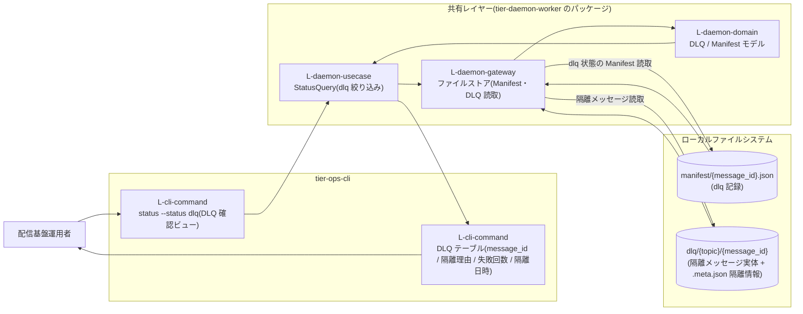
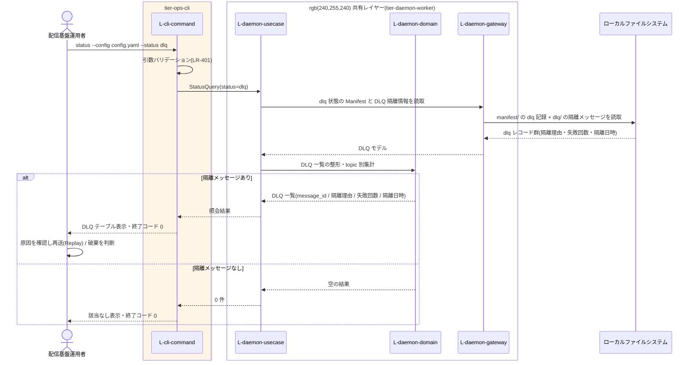

# DLQ隔離メッセージを確認する

## 概要

配信基盤運用者が `status` サブコマンド(状態 dlq の確認ビュー)で、リトライ上限を超えて DLQ へ隔離されたメッセージの一覧(message_id・隔離理由・失敗回数・隔離日時)を把握し、原因に応じて再送(Replay)・破棄等の対処を判断する。

> GUI は存在しない。RDRA の画面「DLQ確認画面」は運用 CLI(`status` の DLQ 表示)として実現する(_inference.md / ux-design.md: status は DLQ 隔離メッセージの確認にも使う)。

## データフロー



| レイヤー | データモデル | 変換内容 |
|---------|------------|---------|
| CLI L-cli-command | status 引数(`--config` 必須、`--status dlq`、任意で topic 絞り込み) | 引数バリデーション(LR-401)+ dlq 絞り込みの StatusQuery への変換 |
| 共有 L-daemon-usecase | StatusQuery(status=dlq) | Manifest の dlq 記録と DLQ 隔離情報の突き合わせ(CLR-101) |
| 共有 L-daemon-domain | DLQ モデル(隔離メッセージ(message_id)、隔離理由、失敗回数、隔離日時)、Manifest モデル(dlq 記録、リトライ回数) | DLQ 属性の一覧化・topic 別件数集計 |
| 共有 L-daemon-gateway | Manifest レコード、DLQ レコード | manifest/ と dlq/ の読取 → ドメインモデル変換 |
| 出力 | DLQ テーブル(MESSAGE_ID / TOPIC / ISOLATION_REASON / FAILURES / ISOLATED_AT) | ui-design.md の DLQ 表示規約に従う人間可読テーブル |

## 処理フロー



## バリエーション一覧

| バリエーション名 | 値 | 処理内容 | 適用 tier | 適用箇所 |
|----------------|---|---------|----------|---------|
| 配信方式 | 通常配信(Fan-out)、再送(Replay) | DLQ 確認後の対処判断の選択肢。再送する場合は再送(Replay)として実行される(後続 UC「再送(Replay)を実行する」) | tier-ops-cli | 対処判断 |

## 分岐条件一覧

| 条件名 | 判定ルール | 適用 tier | 適用箇所 | BDD Scenario |
|--------|----------|----------|---------|-------------|
| リトライ上限 | 配信失敗はリトライし、規定回数以内に成功すれば delivered とする。規定回数を超えたメッセージは DLQ へ隔離し Manifest に dlq として記録する。この UC はその隔離結果(失敗回数 = リトライ上限超過)を確認する | tier-daemon-worker(隔離の前提) / tier-ops-cli(確認) | DLQ 一覧の FAILURES 列・隔離理由 | リトライ上限超過で隔離されたメッセージが一覧に表示される |

## 計算ルール一覧

| 計算名 | 入力情報 | 計算式/ロジック | 出力情報 | 適用 tier |
|--------|---------|---------------|---------|----------|
| DLQ 件数集計 | DLQ(隔離メッセージ一覧) | topic 別に隔離件数を合計する(LP-401 の集計ビューの一部) | topic 別 DLQ 件数 | tier-ops-cli |

## 状態遷移一覧

| 状態モデル | 遷移元 | 遷移先 | トリガー | 事前条件 | 事後処理 | 適用 tier |
|-----------|--------|--------|---------|---------|---------|----------|
| メッセージ配送状態 | (遷移なし・参照のみ) | - | - | リトライ中 → DLQ隔離(dlq) の遷移(UC「配信失敗をリトライしDLQへ隔離する」)が完了している | DLQ隔離(dlq) 状態を確認し、再送(Replay)実行(dlq → 配信中)または再送不要判断(終了状態)につなげる | tier-ops-cli |

## 関連 RDRA モデル

| モデル種別 | 要素名 | 関連 |
|-----------|--------|------|
| 業務 | 配信基盤運用業務 | このUCが属する業務 |
| BUC | 配送状況を確認するフロー | このUCを含むBUC |
| アクティビティ | DLQ対処を判断する | このUCを含むアクティビティ |
| アクター | 配信基盤運用者 | DLQ を確認し対処(再送 / 破棄)を判断する(価値受益) |
| 画面 | DLQ確認画面 | CLI `status` の DLQ 表示として実現 |
| 情報 | DLQ | 参照(隔離メッセージ(message_id)、隔離理由、失敗回数、隔離日時) |
| 情報 | メッセージ | 参照(message_id、Topic名、元ファイル名、収集時刻) |
| 情報 | Manifest | 参照(Subscription別配送状態の dlq 記録、リトライ回数) |
| 条件 | リトライ上限 | 適用される条件(隔離の前提・FAILURES 列の意味) |
| 状態 | メッセージ配送状態 | DLQ隔離(dlq) の現在状態を参照(遷移はしない。対処判断の入力) |
| バリエーション | 配信方式 | 対処が再送の場合は再送(Replay) |

## E2E 完了条件（BDD）

### 正常系

```gherkin
Feature: DLQ隔離メッセージを確認する

  Scenario: DLQ 隔離メッセージの一覧を属性付きで確認する
    Given message_id=20260611T220500_invoices_inv_0042.csv がリトライ上限 5 回を超過して DLQ へ隔離され隔離理由「permission denied (write)」隔離日時 2026-06-11T22:31:10 が記録されている
    When 配信基盤運用者が「status --config config.yaml --status dlq」を実行する
    Then MESSAGE_ID=20260611T220500_invoices_inv_0042.csv TOPIC=invoices ISOLATION_REASON=permission denied (write) FAILURES=5 ISOLATED_AT=2026-06-11T22:31:10 の行が表示され終了コード 0 で終了する

  Scenario: 隔離理由から再送(Replay)の対処を判断する
    Given DLQ 一覧で message_id=20260611T220500_invoices_inv_0042.csv の隔離理由が配置先ディレクトリの権限エラーであることを確認した
    When 配信基盤運用者が配置先ディレクトリの権限を修正し「replay --config config.yaml --topic invoices --message-id 20260611T220500_invoices_inv_0042.csv --subscription current」を実行する
    Then DLQ 隔離メッセージが宛先 Subscription へ再配置され manifest に Replay 記録が追記される

  Scenario: 隔離メッセージが 0 件なら該当なしで正常終了する
    Given DLQ に隔離されたメッセージが存在しない
    When 配信基盤運用者が「status --config config.yaml --status dlq」を実行する
    Then 該当 0 件の表示で終了コード 0 で終了する
```

### 異常系

```gherkin
  Scenario: DLQ 情報の読み取りに失敗した場合は実行時エラーとなる
    Given dlq/ ディレクトリに実行ユーザの読み取り権限がない
    When 配信基盤運用者が「status --config config.yaml --status dlq」を実行する
    Then 標準エラー出力に原因(読み取り失敗)と対処(権限と実行ユーザの確認)が表示され終了コード 1 で終了する
```

## ティア別仕様

- [運用 CLI](tier-ops-cli.md)

### 統合 API Spec

- [OpenAPI Spec](../../../_cross-cutting/api/openapi.yaml)（全 UC 統合。この UC に HTTP API はない）
- AsyncAPI Spec: 対象イベントなし(生成しない)
