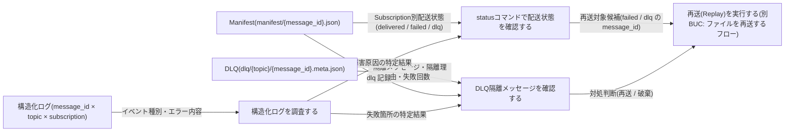
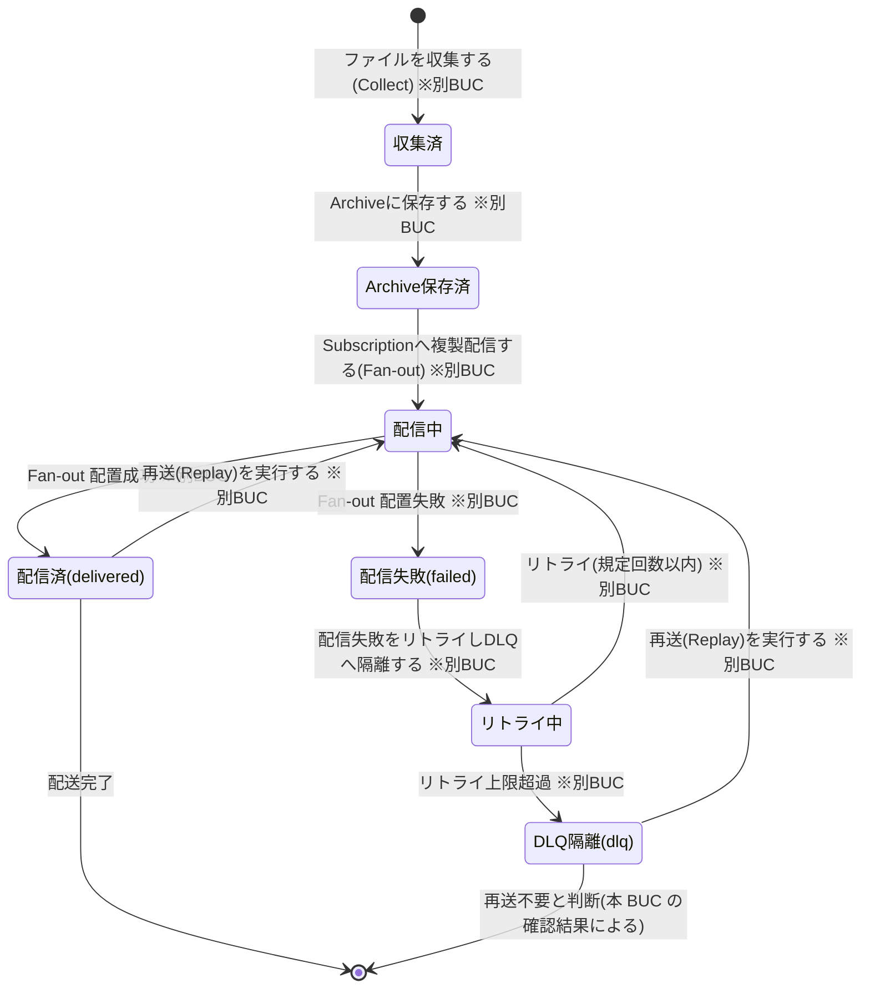
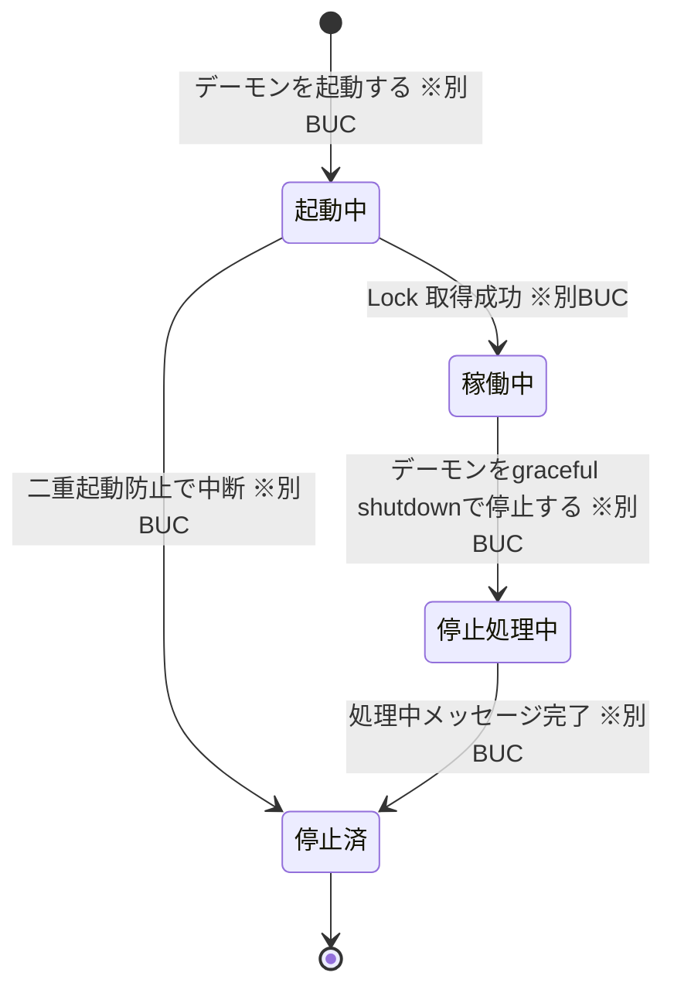

# 配送状況を確認するフロー

## 概要

status コマンドによる Manifest の配送状態(delivered / failed / dlq)の照会、DLQ 隔離メッセージの確認、構造化ログの調査により、運用者が外部の助けなしに障害調査・再送判断・監査を完結させる BUC。いずれの UC も配送状態を参照するのみで遷移はさせず、判断結果を再送(Replay)等の後続対処につなげる。

## 所属 UC 一覧

| UC名 | アクター | 主な操作 | 関連情報 |
|------|---------|---------|---------|
| [statusコマンドで配送状態を確認する](<statusコマンドで配送状態を確認する/spec.md>) | 運用者(価値受益) | status コマンドで manifest/{message_id}.json に記録された message_id・topic・Subscription 別の配送状態を照会・集計する | Manifest、メッセージ、Topic、Subscription |
| [DLQ隔離メッセージを確認する](<DLQ隔離メッセージを確認する/spec.md>) | 運用者(価値受益) | dlq/{topic}/{message_id}(.meta.json) の隔離メッセージ・隔離理由・失敗回数を確認し、再送(Replay)・破棄等の対処を判断する | DLQ、メッセージ、Manifest |
| [構造化ログを調査する](<構造化ログを調査する/spec.md>) | 運用者(価値提供) | どのメッセージのどの Subscription 配信が失敗したかを特定できる粒度の構造化ログ(message_id × topic × subscription)を調査する | ログ、メッセージ、Subscription |

## UC 横断データフロー

BUC 内の UC 間で情報がどう流れるかを示す。情報がどの UC で作成(C)・参照(R)・更新(U)されるかを明記する。

### データフロー図

### 情報 CRUD マトリクス

| 情報名 | statusコマンドで配送状態を確認する | DLQ隔離メッセージを確認する | 構造化ログを調査する |
|--------|:---:|:---:|:---:|
| Manifest(manifest/{message_id}.json) | R | R | |
| メッセージ | R | R | R |
| Topic | R | R | |
| Subscription | R | | R |
| DLQ(dlq/{topic}/{message_id}.meta.json) | | R | |
| ログ(構造化ログ) | | | R |

- 本 BUC の全 UC は参照(R)のみで、情報の作成・更新・削除を行わない。Manifest / DLQ / ログの作成・更新は別BUC(ファイルを収集して配信するフロー / ファイルを再送するフロー)の各 UC が担当する。
- statusコマンドで配送状態を確認する は topic / Subscription 別の delivered / failed / dlq 件数集計、DLQ隔離メッセージを確認する は topic 別 DLQ 件数集計を行う(いずれも読み取り集計)。

## 状態遷移全体図

本 BUC の UC が遷移させる状態モデルはない(参照のみ)。該当状態モデルはメッセージ配送状態(status / DLQ 確認 / ログ調査の照会対象)とデーモン稼働状態(ログ調査が稼働履歴を追跡)。状態.tsv の全遷移行を示す(遷移の担当 UC はいずれも別BUC)。

### メッセージ配送状態(本 BUC は参照のみ)

### デーモン稼働状態(構造化ログを調査する が稼働履歴を追跡)

### 状態遷移 UC マッピング

| 状態モデル | 遷移元 | 遷移先 | 担当 UC | 本 BUC での扱い |
|-----------|--------|--------|--------|----------------|
| メッセージ配送状態 | (初期) | 収集済 | ファイルを収集する(Collect)(別BUC: ファイルを収集して配信するフロー) | ログの収集イベントとして追跡 |
| メッセージ配送状態 | 収集済 | Archive保存済 | Archiveに保存する(別BUC: ファイルを収集して配信するフロー) | ログの Archive 保存イベントとして追跡 |
| メッセージ配送状態 | Archive保存済 | 配信中 | Subscriptionへ複製配信する(Fan-out)(別BUC: ファイルを収集して配信するフロー) | ログの配信イベントとして追跡 |
| メッセージ配送状態 | 配信中 | 配信済(delivered) | Subscriptionへ複製配信する(Fan-out)(別BUC: ファイルを収集して配信するフロー) | status の delivered として照会 |
| メッセージ配送状態 | 配信中 | 配信失敗(failed) | Subscriptionへ複製配信する(Fan-out)(別BUC: ファイルを収集して配信するフロー) | status の failed として照会、ログで失敗箇所特定 |
| メッセージ配送状態 | 配信失敗(failed) | リトライ中 | 配信失敗をリトライしDLQへ隔離する(別BUC: ファイルを収集して配信するフロー) | ログのリトライイベントとして追跡 |
| メッセージ配送状態 | リトライ中 | 配信中 | 配信失敗をリトライしDLQへ隔離する(別BUC: ファイルを収集して配信するフロー) | ログのリトライイベントとして追跡 |
| メッセージ配送状態 | リトライ中 | DLQ隔離(dlq) | 配信失敗をリトライしDLQへ隔離する(別BUC: ファイルを収集して配信するフロー) | status の dlq・DLQ 確認の対象として照会 |
| メッセージ配送状態 | DLQ隔離(dlq) | 配信中 | 再送(Replay)を実行する(別BUC: ファイルを再送するフロー) | DLQ 確認の対処判断(再送)の後続 |
| メッセージ配送状態 | 配信済(delivered) | 配信中 | 再送(Replay)を実行する(別BUC: ファイルを再送するフロー) | status の照会結果が再送判断の入力 |
| メッセージ配送状態 | 配信済(delivered) | (終了) | (UC遷移なし。全宛先配送完了の終了状態) | 監査・追跡の照会対象 |
| メッセージ配送状態 | DLQ隔離(dlq) | (終了) | (UC遷移なし。再送不要判断の終了状態) | DLQ 確認の対処判断(破棄)の結果 |
| デーモン稼働状態 | (初期) | 起動中 | デーモンを起動する(別BUC: 配信基盤を運用するフロー) | ログの起動イベントとして追跡 |
| デーモン稼働状態 | 起動中 | 稼働中 | デーモンを起動する(別BUC: 配信基盤を運用するフロー) | ログの起動イベントとして追跡 |
| デーモン稼働状態 | 起動中 | 停止済 | デーモンを起動する(別BUC: 配信基盤を運用するフロー) | ログの二重起動中断イベントとして追跡 |
| デーモン稼働状態 | 稼働中 | 停止処理中 | デーモンをgraceful shutdownで停止する(別BUC: 配信基盤を運用するフロー) | ログの停止イベントとして追跡 |
| デーモン稼働状態 | 停止処理中 | 停止済 | デーモンをgraceful shutdownで停止する(別BUC: 配信基盤を運用するフロー) | ログの停止イベントとして追跡 |
| デーモン稼働状態 | 停止済 | (終了) | (UC遷移なし。停止完了の終了状態) | 稼働履歴の調査対象 |

## BUC 内共有条件一覧

本 BUC 内の UC に適用される条件.tsv の条件と、適用先 UC の一覧。2 つ以上の UC で適用されるものが「共有」。

| 条件名 | 条件の説明 | 適用 UC | 共有 |
|--------|----------|--------|:---:|
| リトライ上限 | 配信失敗はリトライし、規定回数以内に成功すれば delivered とする。規定回数を超えたメッセージは DLQ へ隔離し Manifest に dlq として記録する。本 BUC ではその隔離結果(失敗回数 = リトライ上限超過)を確認する | DLQ隔離メッセージを確認する(確認側。隔離の実行は別BUC: ファイルを収集して配信するフロー の 配信失敗をリトライしDLQへ隔離する) | |

本 BUC 内で 2 つ以上の UC に共有される条件はない。statusコマンドで配送状態を確認する / 構造化ログを調査する には条件.tsv の直接適用条件はない(参照のみの UC。配送状態の値域は Manifest の語彙 delivered / failed / dlq、ログ出力の必須フィールド規約は構造化ログ契約に従う)。

## BUC 内共有バリエーション一覧

本 BUC 内の UC に適用されるバリエーション.tsv のバリエーションと、適用先 UC の一覧。2 つ以上の UC で適用されるものが「共有」。

| バリエーション名 | 値 | 適用 UC | 共有 |
|----------------|---|--------|:---:|
| 配信方式 | 通常配信(Fan-out)、再送(Replay) | statusコマンドで配送状態を確認する(REPLAY 列の表示切替)、DLQ隔離メッセージを確認する(対処判断の選択肢として再送(Replay)) | 共有 |
| Subscription種別 | current、next、test | statusコマンドで配送状態を確認する(SUBSCRIPTION 列・絞り込みの値域。Current / Next 並行稼働中の配送確認) | |

構造化ログを調査する に直接適用されるバリエーションはない(event_type の値域はメッセージ配送状態・デーモン稼働状態の遷移に対応する)。
