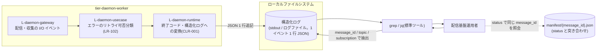
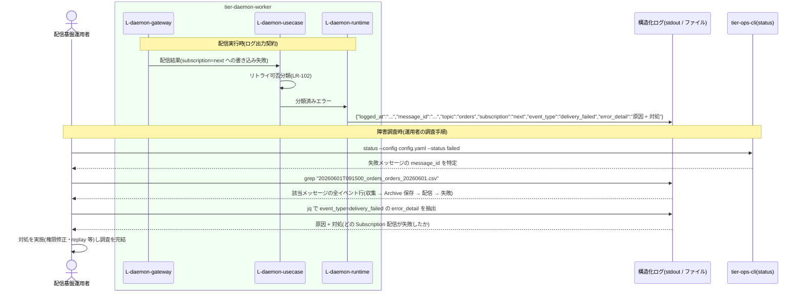

# 構造化ログを調査する

## 概要

配信基盤運用者が、常駐デーモンが出力する 1 行 JSON の構造化ログ(logged_at / message_id / topic / subscription / event_type / error_detail)を grep / jq 等の標準ツールで調査し、どのメッセージのどの Subscription 配信が失敗したかを特定する。`status`(Manifest)と共通キーの message_id で突き合わせ、外部の助けなしに障害調査を完結させる。本 UC の中心は **tier-daemon-worker のログ出力契約**であり、調査操作自体は運用者が標準ツールで行う。

> GUI は存在しない。RDRA の画面「ログ照会画面」は構造化ログ(行指向 JSON)+ 標準ツール(grep / jq)による照会として実現する(_inference.md / ui-design.md「構造化ログのフィールド規約」)。

## データフロー



| レイヤー | データモデル | 変換内容 |
|---------|------------|---------|
| L-daemon-gateway | 収集・配信・retention の I/O イベント(成功 / 失敗) | I/O 結果をイベントとして usecase へ返す |
| L-daemon-usecase | 分類済みエラー(一時的 = リトライ対象 / 恒久的 = DLQ 隔離) | エラーのリトライ可否分類(LR-102) |
| L-daemon-runtime | LogEntry(logged_at、message_id、topic、subscription、event_type、error_detail) | エラー・イベントを終了コードと JSON 構造化ログに変換(CLR-001 / CTR-002) |
| 出力(ログ) | 1 イベント 1 行の JSON(ui-design.md フィールド規約) | grep / jq で message_id・topic をキーに追跡できる行指向 |
| 運用者 | 調査結果(失敗メッセージ・失敗 Subscription・原因・対処) | status(Manifest)と message_id で突き合わせて特定を完結 |

## 処理フロー



## バリエーション一覧

| バリエーション名 | 値 | 処理内容 | 適用 tier | 適用箇所 |
|----------------|---|---------|----------|---------|
| (バリエーション.tsv 該当なし) | - | この UC に直接適用されるバリエーションはない。event_type の値域はメッセージ配送状態・デーモン稼働状態の遷移に対応する | - | - |

## 分岐条件一覧

| 条件名 | 判定ルール | 適用 tier | 適用箇所 | BDD Scenario |
|--------|----------|----------|---------|-------------|
| (条件.tsv 該当なし) | この UC に適用される条件.tsv の条件はない(参照のみの UC)。ログ出力の必須フィールド規約は CTP-001「構造化ログ」に従う(Subscription 配信イベントは message_id + topic + subscription の 3 点必須) | tier-daemon-worker | ログ出力契約 | 配信失敗ログから失敗箇所を特定する |

## 計算ルール一覧

| 計算名 | 入力情報 | 計算式/ロジック | 出力情報 | 適用 tier |
|--------|---------|---------------|---------|----------|
| (該当なし) | - | この UC に計算ルールはない(ログの出力・照会のみ) | - | - |

## 状態遷移一覧

| 状態モデル | 遷移元 | 遷移先 | トリガー | 事前条件 | 事後処理 | 適用 tier |
|-----------|--------|--------|---------|---------|---------|----------|
| メッセージ配送状態 | (遷移なし・参照のみ) | - | - | - | event_type が各遷移(収集 / Archive 保存 / 配信 / リトライ / DLQ 隔離)に対応して記録されており、ログから遷移履歴を追跡できる | tier-daemon-worker |
| デーモン稼働状態 | (遷移なし・参照のみ) | - | - | - | event_type(起動 / 停止)からデーモンの稼働履歴を追跡できる | tier-daemon-worker |

## 関連 RDRA モデル

| モデル種別 | 要素名 | 関連 |
|-----------|--------|------|
| 業務 | 配信基盤運用業務 | このUCが属する業務 |
| BUC | 配送状況を確認するフロー | このUCを含むBUC |
| アクティビティ | 障害を調査する | このUCを含むアクティビティ |
| アクター | 配信基盤運用者 | 構造化ログを調査し障害調査を完結する(価値提供) |
| 画面 | ログ照会画面 | 構造化ログ + 標準ツール(grep / jq)として実現 |
| 情報 | ログ | 参照(出力日時、message_id、Topic名、Subscription名、イベント種別、エラー内容) |
| 情報 | メッセージ | 参照(message_id)。ログ追跡のキー |
| 情報 | Subscription | 参照(Subscription名)。どの Subscription 配信が失敗したかの特定キー |
| 状態 | メッセージ配送状態 | event_type が遷移(収集 / Archive 保存 / 配信 / リトライ / DLQ 隔離)に対応 |
| 状態 | デーモン稼働状態 | event_type が遷移(起動 / 停止)に対応 |

## E2E 完了条件（BDD）

### 正常系

```gherkin
Feature: 構造化ログを調査する

  Scenario: 配信失敗ログから失敗箇所を特定する
    Given 構造化ログに {"logged_at":"2026-06-01T09:15:12+09:00","message_id":"20260601T091500_orders_orders_20260601.csv","topic":"orders","subscription":"next","event_type":"delivery_failed","error_detail":"配置先ディレクトリへの書き込みに失敗 (permission denied)。配置先ディレクトリの権限と実行ユーザを確認してください"} の行が出力されている
    When 配信基盤運用者がログを「grep 20260601T091500_orders_orders_20260601.csv」で抽出する
    Then message_id=20260601T091500_orders_orders_20260601.csv の subscription=next への配信が permission denied で失敗したことと対処(権限と実行ユーザの確認)を 1 行で特定できる

  Scenario: status と message_id で突き合わせて調査を完結する
    Given status の表示で message_id=20260601T091500_orders_orders_20260601.csv の subscription=next が failed と確認できている
    When 配信基盤運用者が構造化ログから同じ message_id の行を jq で event_type 順に抽出する
    Then 収集 → Archive 保存 → 配信 → delivery_failed の遷移履歴と error_detail が得られ外部の助けなしに原因特定を完結できる

  Scenario: メッセージ単位の全イベント履歴を時系列で追跡する
    Given message_id=20260611T220500_invoices_inv_0042.csv が リトライ 5 回ののち DLQ 隔離されている
    When 配信基盤運用者がログを「grep 20260611T220500_invoices_inv_0042.csv」で抽出し logged_at 順に確認する
    Then 収集・Archive 保存・配信失敗・リトライ(5 回)・DLQ 隔離の各 event_type の行が時系列で得られる
```

### 異常系

```gherkin
  Scenario: 配送に紐づかない設定エラーでも代替コンテキストで特定できる
    Given 設定 YAML の不正により収集開始前のエラーが発生している
    When 配信基盤運用者がログから event_type でエラー行を抽出する
    Then message_id / topic / subscription は省略されているが error_detail に特定に必要な代替コンテキスト(設定ファイルのキー位置等)と対処が含まれている
```

## ティア別仕様

- [常駐デーモン](tier-daemon-worker.md)（ログ出力契約仕様）

### 統合 API Spec

- [OpenAPI Spec](../../../_cross-cutting/api/openapi.yaml)（全 UC 統合。この UC に HTTP API はない）
- AsyncAPI Spec: 対象イベントなし(生成しない)
