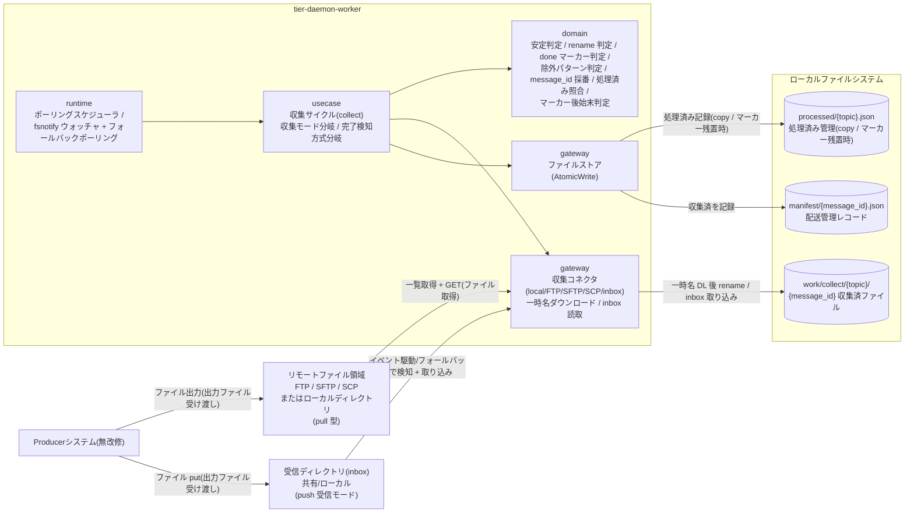
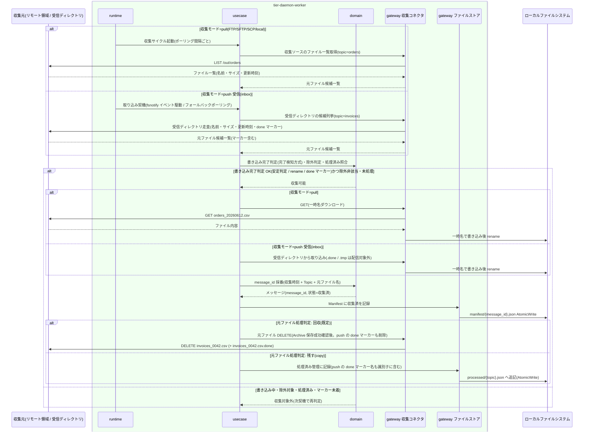

# ファイルを収集する(Collect)

## 概要

常駐デーモンが Producer 出力ファイルを収集する。収集ソース種別は **pull 型**(FTP / SFTP / SCP / ローカルディレクトリ。file-pubsub がポーリング間隔ごとに List → Fetch → Delete で取りに行く)と **push 受信モード(inbox)**(Producer が file-pubsub のアクセスできる共有/ローカルの受信ディレクトリへ直接 put し、file-pubsub が取り込む)の二系統を持ち、Topic ごとに排他で選択する。push 受信モードの取り込み契機は fsnotify によるイベント駆動 + 低頻度フォールバックポーリングのハイブリッドで、共有 FS の実体(ローカルディスク / NFS / SMB)に依存せず取り込む。書き込み完了の検知方式は収集ソース設定で選択する: 安定判定(サイズ・mtime の安定待ち。既定)/ rename(xxx.csv.tmp → xxx.csv の正式名出現)/ done マーカー(xxx.done の出現で xxx を取り込み対象にし、マーカー自体は配信対象外)。元ファイルは回収(pull 型は GET 後 DELETE、push 受信モードは受信ディレクトリから削除。done マーカー方式ではマーカーも削除)を既定に Topic 設定で「残す(copy)」も選択でき、copy 時は処理済み管理で重複収集を防ぐ。収集ファイルには message_id(収集時刻 + Topic + 元ファイル名)を採番してメッセージを発生させ、メッセージ配送状態を「収集済」へ遷移させる。後段(Archive / Fan-out / Manifest / Retry / Retention)はソース種別・収集モードに依存せず既存処理をそのまま流用する。

> 本システムは GUI を持たない。RDRA の画面「収集実行管理画面」は、常駐デーモンの自動実行 + 構造化ログ / status による観測として実現する。HTTP API はこの UC には存在しない。

## データフロー



| レイヤー | データモデル | 変換内容 |
|---------|------------|---------|
| runtime | ポーリングサイクル起動(設定の polling_interval)/ fsnotify イベント + フォールバックポーリング(設定の fallback_poll_interval) | pull 型は前回サイクル完了を待って収集サイクルを起動(LR-001)。push 受信モードは受信ディレクトリのイベント駆動 + 低頻度フォールバックポーリングのハイブリッドで取り込み契機を生成(LR-003) |
| usecase | 収集サイクルコマンド(Topic 別の収集ソース定義) | 収集モード(pull / push)と完了検知方式の分岐 → ソース一覧/イベント取得 → 完了判定 → 収集 → メッセージ発生のフロー制御 |
| domain | 元ファイル候補(ファイル名・サイズ・更新時刻・関連マーカー) → メッセージ(message_id, Topic名, 元ファイル名, 収集時刻) | 安定判定 / rename 判定 / done マーカー判定・除外判定・処理済み照合・マーカー後始末判定・message_id 採番(純粋ロジック。LR-204) |
| gateway(収集コネクタ) | リモート/ローカル/受信ディレクトリのファイル実体 | pull 型は一時名ダウンロード → 完了後 rename(LR-303)。push 受信モードは受信ディレクトリから取り込み(LR-304)。共通インターフェースでソース種別を差し替え(LP-301)。inbox コネクタも同 IF に従う(LP-302) |
| gateway(ファイルストア) | 処理済み管理レコード / Manifest レコード | AtomicWrite で記録(LR-301) |

## 処理フロー



## バリエーション一覧

| バリエーション名 | 値 | 処理内容 | 適用 tier | 適用箇所 |
|----------------|---|---------|----------|---------|
| 収集ソース種別 | FTP、SFTP、SCP、ローカルディレクトリ、push受信(inbox) | 収集コネクタの差し替え(共通インターフェース LP-301)。pull 型(FTP/SFTP/SCP/local)は List → Fetch → Delete、push 受信(inbox)は受信ディレクトリ取り込み(LP-302)。Topic ごとに排他で選択し、後段(Archive / Fan-out / Manifest)はソース種別に依存しない | tier-daemon-worker | gateway 収集コネクタ |
| 取り込みトリガー方式 | イベント駆動(fsnotify)、フォールバックポーリング | push 受信モードの取り込み契機。fsnotify で受信ディレクトリのファイル出現を即時検知(ローカルディスクなら即時反応)。fsnotify を取りこぼす環境(NFS/SMB)に備え低頻度フォールバックポーリングを併用。二重検知しても処理済み管理・message_id 採番で冪等(LR-003、LR-205) | tier-daemon-worker | runtime fsnotify ウォッチャ + フォールバックポーリング |
| 完了検知方式 | 安定判定、rename、doneマーカー | 書き込み完了の判定方式を収集ソース設定で選択(既定=安定判定)。安定判定=サイズ・mtime の安定待ち(既存 stability_check)、rename=xxx.csv.tmp → xxx.csv の正式名出現、done マーカー=xxx.done の出現で xxx を取り込み対象にする(マーカー自体は配信対象外)。domain の共通ルール(LR-204) | tier-daemon-worker | domain 完了判定ルール / gateway 収集コネクタ |
| 元ファイル処理方式 | 回収(pull型はGET後DELETE / push型は受信ディレクトリから削除)、残す(copy) | 既定は回収。pull 型は GET 後 DELETE、push 受信モードは受信ディレクトリのファイル(done マーカー方式では xxx.done も)を削除。copy 選択時は処理済み管理と照合して重複収集を防ぐ | tier-daemon-worker | usecase 収集サイクル / gateway ファイルストア(処理済み管理) / gateway 収集コネクタ |
| 認証方式 | YAML平文記述、環境変数参照(${ENV_VAR})、鍵ファイルパス指定 | リモート収集(FTP/SFTP/SCP)の接続時に認証情報を解決する。push 受信(inbox)はローカル/共有 FS のため認証は OS・マウントの責務(本バリエーションは pull 型のみ適用) | tier-daemon-worker | gateway 収集コネクタ(接続確立) |

## 分岐条件一覧

| 条件名 | 判定ルール | 適用 tier | 適用箇所 | BDD Scenario |
|--------|----------|----------|---------|-------------|
| 書き込み完了判定 | 書き込み中のファイルは収集しない。完了検知方式を設定で選択: 安定判定(サイズ・更新時刻の安定待ち) / rename(xxx.csv.tmp → xxx.csv の正式名出現で取り込み、.tmp は対象外) / done マーカー(xxx.done の出現で xxx を取り込み対象にし、マーカー自体は配信対象外)。除外パターン該当は対象外。pull 型のリモート GET 中も一時名 DL 後 rename | tier-daemon-worker | domain 完了判定ルール(LR-204) / gateway 収集コネクタ | 安定判定 / rename / done マーカーの各 Scenario |
| 元ファイル処理判定 | 回収(既定)。pull 型は GET 後 DELETE、push 受信モードは受信ディレクトリから削除(done マーカー方式では xxx.done も削除)。Topic 設定で「残す(copy)」選択時は処理済み管理と照合し、処理済みファイル(push の done マーカー残置含む)は再収集しない | tier-daemon-worker | usecase 収集サイクル / 処理済み管理 / 収集コネクタ(マーカー後始末 LR-305) | copy 設定で同じファイルを重複収集しない / done マーカーの後始末 |
| message_id採番 | 同名ファイルの再出力は新しいメッセージとして扱い、message_id は収集時刻 + Topic + 元ファイル名から採番する。push 受信モードでイベント駆動とフォールバックポーリングが同一ファイルを二重検知しても、処理済み管理と合わせて二重取り込みしない(LR-205) | tier-daemon-worker | domain 採番規則(LR-202) | 同名ファイルの再出力を別メッセージとして収集する / 二重検知でも二重取り込みしない |

## 計算ルール一覧

| 計算名 | 入力情報 | 計算式/ロジック | 出力情報 | 適用 tier |
|--------|---------|---------------|---------|----------|
| message_id 採番 | メッセージ(収集時刻、Topic名、元ファイル名) | 収集時刻 + Topic + 元ファイル名を結合して採番(例: 20260612T093001_orders_orders_20260612.csv) | メッセージ.message_id | tier-daemon-worker |
| 安定判定 | 収集ソース(安定待ち判定設定)、元ファイル候補(サイズ、更新時刻) | 安定確認間隔をおいて 2 回観測しサイズ・更新時刻が一致すれば安定(完了検知方式=安定判定の場合) | 収集可能 / 書き込み中 の判定 | tier-daemon-worker |
| rename 判定 | 収集ソース(完了検知方式=rename)、元ファイル候補(ファイル名) | ファイル名が正式名(.tmp 等の一時拡張子でない)であれば取り込み対象。一時名(xxx.csv.tmp)は対象外 | 収集可能 / 対象外 の判定 | tier-daemon-worker |
| done マーカー判定 | 収集ソース(完了検知方式=doneマーカー)、元ファイル候補(ファイル名)、マーカー(xxx.done) | 対象ファイル xxx に対応する xxx.done が存在すれば xxx を取り込み対象にする。マーカー自体(xxx.done)は配信対象に含めない | 収集可能 / マーカー未着 の判定 | tier-daemon-worker |
| 除外判定 | 収集ソース(除外パターン)、元ファイル候補(ファイル名) | ファイル名が除外パターン(例: *.tmp)に一致すれば対象外 | 収集対象 / 対象外 の判定 | tier-daemon-worker |
| 処理済み照合 | 処理済み管理(収集元ファイル識別子)、元ファイル候補 | copy 設定時 / push の二重検知時、収集元ファイル識別子(ファイル名・収集元パス・done マーカー名等)が処理済み管理に存在すれば再収集・再取り込みしない | 収集対象 / 処理済み の判定 | tier-daemon-worker |

## 状態遷移一覧

| 状態モデル | 遷移元 | 遷移先 | トリガー | 事前条件 | 事後処理 | 適用 tier |
|-----------|--------|--------|---------|---------|---------|----------|
| メッセージ配送状態 | (初期) | 収集済 | ファイルを収集する(Collect) | 書き込み完了判定 OK(安定判定 / rename / done マーカー)・除外非該当・(copy 時)未処理 | message_id 採番、Manifest による Subscription 単位の配送管理を開始 | tier-daemon-worker |
| 元ファイル収集状態 | 書き込み中 | 収集可能 | ファイルを収集する(Collect) | 完了検知方式(安定判定 / rename / done マーカー)と除外パターン非該当を確認。pull 型のリモート GET 中も一時名 DL 後 rename | 収集対象に含める | tier-daemon-worker |
| 元ファイル収集状態 | 収集可能 | 回収済 | ファイルを収集する(Collect) | 元ファイル処理方式=回収(既定)。Archive 保存の成功確認後 | 収集ソースから元ファイルを削除(pull 型は DELETE、push 受信モードは受信ディレクトリから削除。done マーカー方式では xxx.done も削除) | tier-daemon-worker |
| 元ファイル収集状態 | 収集可能 | 残置済 | ファイルを収集する(Collect) | 元ファイル処理方式=残す(copy) | 処理済み管理に記録し再収集を防ぐ(push の done マーカー残置時はマーカー名も識別子に含む) | tier-daemon-worker |

## 関連 RDRA モデル

| モデル種別 | 要素名 | 関連 |
|-----------|--------|------|
| 業務 | ファイル配信業務 | この UC が属する業務 |
| BUC | ファイルを収集して配信するフロー | この UC を含む BUC |
| アクター | 配信基盤運用者 | 収集の自動実行を観測する(立場: 価値提供。実行主体は常駐デーモン) |
| 情報 | Topic | 収集単位。属性: Topic名、説明 |
| 情報 | 収集ソース | 収集元定義。属性: ソース種別(FTP / SFTP / SCP / ローカルディレクトリ / push受信(inbox))、収集モード(pull / push)、接続先ホスト、対象ディレクトリパス、受信ディレクトリパス、元ファイル処理方式(回収 / 残す)、取り込みトリガー方式(イベント駆動(fsnotify) / フォールバックポーリング)、フォールバックポーリング間隔、完了検知方式(安定判定 / rename / doneマーカー)、安定待ち判定設定、除外パターン |
| 情報 | 認証情報 | 接続時に解決(pull 型のみ)。属性: 記述方式(平文 / 環境変数参照 / 鍵ファイルパス)、ユーザー名、パスワードまたは鍵ファイルパス |
| 情報 | メッセージ | この UC で発生。属性: message_id(収集時刻 + Topic + 元ファイル名から採番)、Topic名、元ファイル名、収集時刻 |
| 情報 | 処理済み管理 | copy 時 / push の二重検知防止時に更新。属性: 収集元ファイル識別子(ファイル名・収集元パス・done マーカー名等)、処理済み判定日時 |
| 状態 | メッセージ配送状態 | (初期)→収集済 |
| 状態 | 元ファイル収集状態 | 書き込み中→収集可能→回収済 / 残置済 |
| 条件 | 書き込み完了判定 / 元ファイル処理判定 / message_id採番 | 分岐条件一覧参照 |
| バリエーション | 収集ソース種別 / 取り込みトリガー方式 / 完了検知方式 / 元ファイル処理方式 / 認証方式 | バリエーション一覧参照 |
| 画面 | 収集実行管理画面 | 常駐デーモンの自動実行 + 構造化ログ / status 観測として翻案(GUI なし) |
| 外部システム | Producerシステム | イベント「出力ファイル受け渡し」の連携元(無改修)。pull 型はリモート領域へ出力、push 受信モードは受信ディレクトリへ put |
| 外部システム | リモートファイル領域 | イベント「ファイル取得」の収集元(FTP/SFTP/SCP サーバ上の領域・ローカルディレクトリ。pull 型) |
| 外部システム | 受信ディレクトリ | push(put)受信モードで Producer が直接 put する file-pubsub アクセス可能な共有/ローカルディレクトリ。fsnotify イベント駆動 + フォールバックポーリングで取り込む収集元 |

## E2E 完了条件（BDD）

### 正常系

```gherkin
Feature: ファイルを収集する(Collect)

  Scenario: SFTP の収集ソース(pull 型)からファイルを回収して収集する
    Given topic「orders」の収集ソースが type=sftp, host=legacy-host01, directory=/out/orders, original_file_handling=delete で設定されている
    And リモートの /out/orders に書き込み完了済みのファイル「orders_20260612.csv」が存在する
    When ポーリングサイクルが収集を実行する
    Then ファイルが一時名でダウンロードされ完了後に rename される
    And message_id「20260612T093001_orders_orders_20260612.csv」のメッセージが発生しメッセージ配送状態が「収集済」になる
    And Archive 保存の成功確認後にリモートの元ファイル「orders_20260612.csv」が DELETE され元ファイル収集状態が「回収済」になる

  Scenario: push 受信モード(inbox)で受信ディレクトリへ put されたファイルを取り込む
    Given topic「invoices」の収集ソースが type=inbox, directory=/inbox/invoices, original_file_handling=delete, completion=stability で設定されている
    When Producer が受信ディレクトリ /inbox/invoices へ「invoices_0042.csv」を put する
    Then ファイルが取り込まれ message_id「20260617T020637_invoices_invoices_0042.csv」のメッセージが発生しメッセージ配送状態が「収集済」になる
    And Archive へ保存され Fan-out される(後段は pull 型と同一処理)
    And Archive 保存の成功確認後に受信ディレクトリから「invoices_0042.csv」が削除され元ファイル収集状態が「回収済」になる

  Scenario: ローカルディスクの受信ディレクトリでイベント駆動により即時取り込みされる
    Given topic「invoices」の push 受信モードがローカルディスクの受信ディレクトリ /inbox/invoices を fsnotify で監視中である
    When Producer がファイル「invoices_0043.csv」を put する
    Then ポーリング間隔(fallback_poll_interval)を待たずにイベント駆動で取り込みが開始される

  Scenario: NFS/SMB の受信ディレクトリでフォールバックポーリングにより取り込まれる
    Given topic「invoices」の push 受信モードが fsnotify イベントを通知しない共有 FS(NFS)上の受信ディレクトリを監視中である
    When Producer がファイル「invoices_0044.csv」を put する
    Then フォールバックポーリング(fallback_poll_interval)の周期内に「invoices_0044.csv」が取り込まれる

  Scenario: rename 方式で正式名の出現を契機に取り込む
    Given topic「invoices」の push 受信モードが completion=rename で設定されている
    When Producer が「invoices_0045.csv.tmp」で書き込み後「invoices_0045.csv」へ rename する
    Then 正式名「invoices_0045.csv」の出現を契機に取り込まれる
    And 一時名「invoices_0045.csv.tmp」は取り込み対象とならない

  Scenario: done マーカー方式でマーカーの出現を契機に取り込みマーカーを後始末する
    Given topic「invoices」の push 受信モードが completion=marker, original_file_handling=delete で設定されている
    When Producer が「invoices_0046.csv」を put した後に「invoices_0046.csv.done」を put する
    Then 「invoices_0046.csv.done」の出現を契機に「invoices_0046.csv」が取り込まれる
    And マーカー「invoices_0046.csv.done」自体は配信対象とならない
    And 取り込み後に「invoices_0046.csv」と「invoices_0046.csv.done」の双方が受信ディレクトリから削除される

  Scenario: copy 設定で元ファイルを残して収集する(pull 型)
    Given topic「customers」の収集ソースが original_file_handling=copy で設定されている
    And ローカル収集ソース /data/out/customers に「customers_20260612.csv」が存在する
    When ポーリングサイクルが収集を実行する
    Then ファイルが収集されメッセージ配送状態が「収集済」になる
    And 元ファイルは収集ソースに残り、処理済み管理 processed/customers.json に収集元ファイル識別子と処理済み判定日時が記録され元ファイル収集状態が「残置済」になる

  Scenario: 同名ファイルの再出力を別メッセージとして収集する
    Given topic「orders」で「orders_20260612.csv」が message_id「20260612T093001_orders_orders_20260612.csv」として収集済みである
    And Producer が同名の「orders_20260612.csv」を再出力した
    When 次のポーリングサイクルが収集を実行する
    Then 収集時刻の異なる新しい message_id「20260612T101502_orders_orders_20260612.csv」のメッセージとして収集され、既存メッセージの履歴は失われない
```

### 異常系

```gherkin
  Scenario: 書き込み中のファイルは収集しない(完了検知=安定判定)
    Given リモートの /out/orders で「orders_20260612.csv」のサイズが観測のたびに増加している
    When ポーリングサイクルが収集を実行する
    Then 「orders_20260612.csv」は収集されず元ファイル収集状態は「書き込み中」のまま残る
    And 次サイクルでサイズ・更新時刻が安定した後に収集される

  Scenario: 除外パターン該当ファイルを収集しない
    Given topic「orders」の収集ソースに exclude_patterns「*.tmp」が設定されている
    And リモートの /out/orders に「orders_20260612.csv.tmp」が存在する
    When ポーリングサイクルが収集を実行する
    Then 「orders_20260612.csv.tmp」は収集対象外となる

  Scenario: push 受信モードの二重検知でも二重取り込みしない
    Given topic「invoices」の push 受信モードで fsnotify イベント駆動とフォールバックポーリングが同一ファイル「invoices_0047.csv」を検知しうる
    When 両方の契機が同じファイルに対して走る
    Then 「invoices_0047.csv」は 1 つの message_id で 1 回だけ取り込まれ、処理済み管理・message_id 採番により重複メッセージは発生しない

  Scenario: push 受信モード・copy 設定で処理済みファイルを再取り込みしない
    Given topic「invoices」の push 受信モードが completion=marker, original_file_handling=copy で「invoices_0048.csv」が処理済み管理に記録済みである
    And 「invoices_0048.csv」と「invoices_0048.csv.done」が受信ディレクトリに残ったまま次の取り込み契機が来る
    When 取り込み契機が走る
    Then 「invoices_0048.csv」は再取り込みされず重複メッセージは発生しない

  Scenario: copy 設定で処理済みファイルを再収集しない(pull 型)
    Given topic「customers」が original_file_handling=copy で「customers_20260612.csv」が処理済み管理に記録済みである
    When 次のポーリングサイクルが収集を実行する
    Then 「customers_20260612.csv」は再収集されず重複メッセージは発生しない

  Scenario: 収集ソースへの接続失敗を構造化ログに記録する(pull 型)
    Given topic「orders」の収集ソース legacy-host01 が応答しない
    When ポーリングサイクルが収集を実行する
    Then 収集はスキップされ topic=orders を含む構造化ログ(event_type=収集失敗、原因 + 対処)が出力される
    And デーモンは停止せず次のポーリングサイクルで再試行する
```

## ティア別仕様

- [常駐デーモン](tier-daemon-worker.md)

### 統合 API Spec

- [OpenAPI Spec](../../../_cross-cutting/api/openapi.yaml)（全 UC 統合。この UC に HTTP API はない）
- AsyncAPI Spec: 該当なし（本システムに非同期メッセージングイベントはない）
