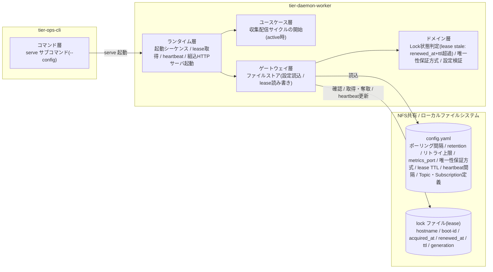
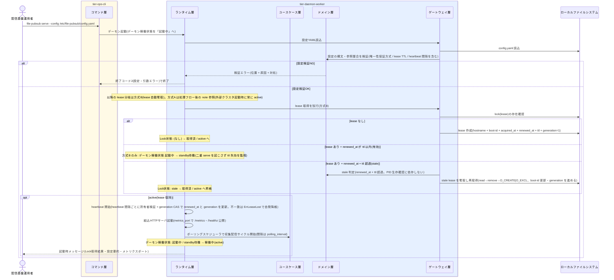

# デーモンを起動する

## 概要

`serve` サブコマンドでポーリング間隔を設定した常駐デーモンを起動する。起動時に設定 YAML を読込・検証し、Lock(lease レコード)取得で二重起動を防止する。Lock は lease レコード化(hostname + boot-id + acquired_at + renewed_at + ttl)し、active な serve が heartbeat 間隔で renewed_at を更新する。stale 判定は PID 生存確認ではなく renewed_at + ttl 超過で行う(マルチホスト対応、SPEC-015-01)。active/standby 冗長構成では、lease を取得できた 1 台が active として収集・配信サイクルを開始し、取得できない 2 台目以降は standby 待機として lease の ttl 失効を待つ(デーモン稼働状態を「起動中」から「稼働中」または「standby待機」へ遷移、SPEC-015-03)。唯一性保証方式は設定で切り替え・併用でき(方式B=lease 自動奪取 / 方式A=外部クラスタ委譲)、同一バイナリで両環境をカバーする(SPEC-015-02、spec-decision-009)。

## データフロー



| レイヤー | データモデル | 変換内容 |
|---------|------------|---------|
| CLI コマンド層 | serve サブコマンド引数(--config パス) | 引数解析 → デーモン起動指示 |
| DW ランタイム層 | 起動シーケンス(デーモン稼働状態: 起動中) | lease 取得 → (active なら)HTTP サーバ起動 → ポーリングスケジューラ開始 + heartbeat 開始 / (取得不可なら)standby 待機 |
| DW ドメイン層 | Lock(lease: hostname・boot-id・acquired_at・renewed_at・ttl)、唯一性保証方式、設定モデル | stale 判定(renewed_at + ttl 超過。PID 生存確認に依存しない)、唯一性保証方式の判定(方式A/方式B)、設定の構文・参照整合検証 |
| DW ゲートウェイ層 | config.yaml / lock(lease)ファイルの読み書き | YAML パース、lease の確認・取得(O_CREATE|O_EXCL)・奪取・heartbeat 更新 |
| 結果 | 構造化ログ(起動メッセージ)+ 終了コード | active 昇格時は Lock 取得結果・設定要約・メトリクスポートを起動時メッセージで明示。standby 待機は構造化ログで明示 |

## 処理フロー



> **起動モデルの方式別一意化(SPEC-015-02、spec-decision-009)**:
> - **方式B(lease 自動奪取)**: 上のシーケンスのとおり「lease あり + 有効」なら 2 台目以降は active にならず standby 待機して ttl 失効を待つ。「lease なし / stale」なら active として起動する。standby 待機ロジック(有効 lease を見て待機)はこの方式にのみ適用する。
> - **方式A(外部クラスタ委譲)**: 唯一性は外部クラスタ(Pacemaker/keepalived 等)の fencing が保証する。外部クラスタが serve リソースを起動した契機で、その serve は**常に active として起動する**(非 active ノードで serve を常駐 standby させない=外部クラスタが serve リソースを起動しない限り serve プロセスは存在しない)。起動した active は lease を稼働識別・観測用として必ず書く。このとき稼働中 lease の hostname/boot-id が自分と異なれば(旧 active がフェイルオーバ前に書いた残留 lease)、lease が有効であっても自分の lease を書き直す(boot-id を更新して奪取する。fencing で旧 active は既に停止済みのため安全)。**「lease 有効を見て standby に落ちる」判定は方式A では行わない**。file-pubsub は lease の TTL 失効による自動奪取は行わない(昇格契機は常に外部クラスタ)。

## バリエーション一覧

| バリエーション名 | 値 | 処理内容 | 適用 tier | 適用箇所 |
|----------------|---|---------|----------|---------|
| 唯一性保証方式 | 方式B(lease 自動奪取) | file-pubsub 単体で lease の ttl 失効を検知し standby が active へ自動昇格する。lease(renewed_at + ttl)で stale 判定し奪取する。**この方式でのみ「有効な lease を他ノードが保持していたら 2 台目以降は active にならず standby 待機して ttl 失効を待つ」起動モデルを適用する** | tier-daemon-worker | ランタイム層 起動シーケンス / heartbeat / 昇格判定 |
| 唯一性保証方式 | 方式A(外部クラスタ委譲) | Pacemaker/keepalived 等の fencing が唯一性を保証し、VIP と serve を同一リソースグループで束ねる。file-pubsub は TTL 失効による自動奪取を行わず、**外部クラスタが serve リソースを起動した契機で常に active として起動する(非 active ノードで serve を常駐 standby させない)**。起動した active は lease を稼働識別・観測用として書き、稼働中 lease の hostname/boot-id が自分と異なれば(旧 active の残留 lease)有効・stale を問わず奪取して(boot-id を更新して)自分の lease を書く。**lease 有効を見て standby に落ちる判定は方式A では行わない**(唯一性は外部クラスタが保証済みのため) | tier-daemon-worker | ランタイム層 起動シーケンス(昇格契機は外部。lease は観測用に必ず取得) |

## 分岐条件一覧

| 条件名 | 判定ルール | 適用 tier | 適用箇所 | BDD Scenario |
|--------|----------|----------|---------|-------------|
| 二重起動防止 | 起動時に Lock(lease)を取得する。**方式B**: lease が有効(renewed_at が ttl 以内)で他ノード/他世代が保持していれば同じ構成の 2 台目は active にならず standby 待機に入る(二重 serve を起こさない)。lease が stale(renewed_at + ttl 超過)なら奪取して active へ昇格する。**方式A**: 外部クラスタが起動した serve は常に active として起動し、稼働中 lease の hostname/boot-id が自分と異なれば(有効・stale を問わず)奪取して自分の lease を書く(standby 判定はしない。唯一性は fencing が保証)。stale 判定は PID 生存確認に依存せず renewed_at + ttl 超過で行う(マルチホスト対応)。奪取は read→remove→O_CREATE\|O_EXCL で行い、複数 standby が同時に奪取しても O_EXCL で勝者1人に収束し敗者は standby 継続する。唯一性保証は方式B(lease 自動奪取)または方式A(外部クラスタの fencing へ委譲)で実現し serve を常に 1 つ(single-writer)に保つ | tier-daemon-worker | ランタイム層 起動シーケンス(LR-002、SPEC-015-01/02/03) | 二重起動を防止する / stale lease から安全に回復して起動する / standby が lease 失効を検知して昇格する |

## 計算ルール一覧

| 計算名 | 入力情報 | 計算式/ロジック | 出力情報 | 適用 tier |
|--------|---------|---------------|---------|----------|
| lease stale 判定 | Lock(lease: renewed_at、ttl)、現在時刻 | `現在時刻 - renewed_at > ttl` なら stale と判定する。PID 生存確認(os.FindProcess + Signal(0))には依存しない(マルチホストで他ホストの PID を判定できないため)。時刻同期(NTP)前提で、lease TTL は NFS 属性キャッシュ(actimeo 既定60s)より十分大きく設定する(SPEC-017-01) | Lock状態(取得済 / stale) | tier-daemon-worker |
| stale lease 奪取(原子的に1人だけ勝つ) | stale と判定した lease、自身の Lease(hostname + 新 boot-id)、現在時刻 | renewed_at + ttl 超過(stale)を確認した上でのみ奪取する。奪取は **read(現在の lease)→ remove(lock ファイル削除)→ O_CREATE\|O_EXCL で再作成**の順で行い、O_EXCL により「最終的に1人だけ」が再作成に成功する。複数 standby が同時に奪取を試みても、remove 後の O_EXCL 再作成で勝者は1人に収束し、敗者(O_EXCL が EEXIST で失敗)は奪取を諦めて standby 待機を継続する。旧 active が同時に heartbeat で renewed_at を書こうとしても、lock ファイルの再作成は O_EXCL で1人に収束するため二重所有にならない | 奪取結果(取得済 / 敗北→standby継続) | tier-daemon-worker |
| heartbeat 更新(所有者検証 + generation CAS) | Lock(lease)、自身の Lease(hostname + boot-id + generation)、heartbeat 間隔、現在時刻 | active な serve が heartbeat 間隔ごとに、まず lock を read して (a)hostname/boot-id が自分自身(self)と一致 かつ (b)generation が自分が最後に書いた値と一致(generation CAS)するか確認する。両方一致する場合のみ lease の renewed_at を現在時刻へ更新し generation を +1 する。不一致(他ノード/他世代が既に奪取済み=generation を進めている=lease lost)なら更新せず失敗(ErrLeaseLost)を返し自発降格へ進む。これにより旧 active が新 active の有効 lease を heartbeat の read→update の隙に上書きして奪い返す TOCTOU を generation 不一致で検出する。書き込みは lease 更新ロックまたは O_EXCL 一時ファイル→rename で行う。更新できなくなった(NFS 断等)場合は ttl 超過で他ノードが stale 判定し奪取できる。NFS の原子性は実装依存のため完全な排他は保証しない(既知の制約) | 更新後の lease(renewed_at / generation)/ lease lost | tier-daemon-worker |
| heartbeat 失敗時の自発降格 | heartbeat 更新結果(ErrLeaseLost を含む)、現在時刻、各メッセージ処理の境界 | heartbeat が所有者検証で不一致(ErrLeaseLost=他ノードが奪取済み)を返した場合、または heartbeat 更新失敗が継続して `現在時刻 - 最後に成功した renewed_at > ttl` に至った場合、active を継続せず scheduler を停止し standby待機へ降格する。降格判定はメッセージ境界(各メッセージの 収集 / Archive 保存 / Fan-out 配置 / Manifest 記録 の前)と各永続化の前で lease 保持確認(lock ファイルの hostname/boot-id が自分自身か、かつ ttl 以内か)として行い、失っていれば「処理中のその1メッセージ」で停止して降格する(spec-decision-011 のメッセージ境界 lease 確認。split-brain の窓で重複させ得るのを高々1メッセージに限定) | 降格(active → standby待機) | tier-daemon-worker |

## 状態遷移一覧

| 状態モデル | 遷移元 | 遷移先 | トリガー | 事前条件 | 事後処理 | 適用 tier |
|-----------|--------|--------|---------|---------|---------|----------|
| デーモン稼働状態 | (初期) | 起動中 | serve による起動指示 | 設定 YAML が読込可能 | lease 取得と stale 回復判定を開始 | tier-daemon-worker |
| デーモン稼働状態 | 起動中 | 稼働中 | lease 取得成功(active) | Lock状態が取得済 | heartbeat を開始し、ポーリング間隔で収集・配信サイクルの自動実行を開始、/metrics・/healthz を公開 | tier-daemon-worker |
| デーモン稼働状態 | 起動中 | standby待機 | 有効な lease を他ノードが保持(2 台目以降)。**方式B のみ**(方式A は外部クラスタ起動時に常に active で起動し standby 待機しない) | lease が存在し renewed_at が ttl 以内、かつ uniqueness_method=lease(方式B) | 二重 serve を起こさず lease の ttl 失効を監視して待機する | tier-daemon-worker |
| デーモン稼働状態 | standby待機 | 稼働中 | standby が lease 失効を検知し奪取(**方式B のみ**) | 方式B: lease が stale | active へ昇格し heartbeat と収集・配信サイクルを開始する | tier-daemon-worker |
| デーモン稼働状態 | 稼働中 | standby待機 | heartbeat の所有者検証で lease lost を検知(lock の hostname/boot-id が他ノード/他世代)/ または active が lease を更新できず(NFS 断・heartbeat 遅延等)ttl 超過 | renewed_at の更新失敗が継続、または lock の所有者が自分でない | active を継続せず降格し、他ノードの昇格を妨げない(旧 active が新 active の lease を奪い返さない。split-brain の窓を高々 1 メッセージ重複に限定) | tier-daemon-worker |
| Lock状態 | (なし) | 取得済 | デーモン起動時の lease 取得 | lock(lease)ファイルが存在しない | lease に hostname + boot-id + acquired_at + renewed_at + ttl を記録 | tier-daemon-worker |
| Lock状態 | stale | 取得済 | stale lease と判定された場合の奪取・再取得 | renewed_at + ttl 超過を確認済み(PID 生存確認に依存しない) | standby だったインスタンスが lease を read→remove→O_CREATE\|O_EXCL で奪取して active へ昇格し Lock を再取得(boot-id を新世代へ更新)。複数 standby が同時に奪取しても O_EXCL で勝者は1人に収束し、敗者は奪取せず standby 待機を継続する。旧 active の heartbeat 書込と競合しても O_EXCL で二重所有にならない(方式B。方式A では外部クラスタの fencing 後に active が Lock を取得) | tier-daemon-worker |

## 関連 RDRA モデル

| モデル種別 | 要素名 | 関連 |
|-----------|--------|------|
| 業務 | 配信基盤運用業務 | このUCが属する業務 |
| BUC | 配信基盤を運用するフロー | このUCを含むBUC |
| アクティビティ | デーモンを起動する | このUCを含むアクティビティ |
| アクター | 配信基盤運用者 | serve を実行するアクター(価値提供) |
| 情報 | 設定 | 起動時に読込・検証する単一 YAML(ポーリング間隔・metrics_port・唯一性保証方式・lease TTL・heartbeat 間隔 等) |
| 情報 | Lock | lease レコード化したロック情報(hostname・boot-id・acquired_at・renewed_at・ttl)。boot-id は active 起動世代の識別子で、同一ホストの再起動と別ホストの奪取を区別する(生成元・用途は tier-daemon-worker.md に定義) |
| バリエーション | 唯一性保証方式 | 方式B(lease 自動奪取)/ 方式A(外部クラスタ委譲)。設定で切り替え・併用 |
| 外部システム | 外部クラスタ | 方式A で唯一性を保証する Pacemaker/keepalived 等(VIP と serve を同一リソースグループで束ねる) |
| 条件 | 二重起動防止 | lease 取得・stale(renewed_at + ttl 超過)回復・唯一性保証方式の判定ルール |
| 状態 | デーモン稼働状態 | 方式A: (初期)→起動中→稼働中(外部クラスタが serve を起動した契機で active。standby 待機は経由しない) / 方式B: (初期)→起動中→稼働中(active) または 起動中→standby待機、standby待機⇄稼働中(昇格・降格)。standby 遷移は方式B のみ |
| 状態 | Lock状態 | (なし)→取得済 / stale→取得済(奪取) |
| 画面 | デーモン操作画面 | GUI なしのため、serve サブコマンドと起動時メッセージがこの画面の代替となる |

## E2E 完了条件（BDD）

### 正常系

```gherkin
Feature: デーモンを起動する

  Scenario: serve でデーモンを起動し active として稼働中になる
    Given /etc/file-pubsub/config.yaml に polling_interval=60、metrics_port=9090、唯一性保証方式=方式B(lease 自動奪取)、lease TTL=30、heartbeat 間隔=10 と Topic 「orders」 が定義され config validate を通過する内容である
    And lock(lease)ファイルが存在しない
    When 配信基盤運用者が file-pubsub serve --config /etc/file-pubsub/config.yaml を実行する
    Then lock(lease)ファイルが作成され hostname=host-a、boot-id、acquired_at、renewed_at、ttl=30 が記録される
    And heartbeat により 10 秒間隔で lease の renewed_at が更新される
    And 起動時メッセージに Lock 取得結果・設定要約・メトリクスポート 9090 が表示される
    And デーモン稼働状態が起動中から稼働中(active)へ遷移し、60 秒間隔の収集・配信サイクルが開始される

  Scenario: stale lease から安全に回復して起動する
    Given lock(lease)ファイルに別ホスト host-b の lease(ttl=30)が残り、renewed_at が現在時刻から 60 秒前(ttl=30 を超過)である
    When 配信基盤運用者が host-a で file-pubsub serve --config /etc/file-pubsub/config.yaml を実行する
    Then renewed_at + ttl 超過により lease が stale と判定される(PID 生存確認には依存しない)
    And host-a が lease を奪取(boot-id を更新)し Lock を再取得(Lock状態: stale → 取得済)して稼働中(active)へ遷移する

  Scenario: 2台目は standby 待機に入り lease 失効を検知して昇格する(方式B)
    Given host-a が有効な lease(renewed_at が ttl=30 以内)を保持し active で稼働している
    When host-b で 2 台目の file-pubsub serve を方式B(lease 自動奪取)で起動する
    Then host-b は lease を取得できず standby 待機に入る(二重 serve を起こさない)
    And host-a の lease が ttl=30 を超えて更新されなくなったとき host-b が stale を検知して lease を奪取し、standby待機から稼働中(active)へ昇格して収集・配信サイクルを開始する
```

### 異常系

```gherkin
  Scenario: 方式A(外部クラスタ委譲)では fencing に唯一性を委ねる
    Given config.yaml に唯一性保証方式=方式A(外部クラスタ委譲)が指定され、VIP と serve が外部クラスタ(Pacemaker/keepalived)の同一リソースグループで束ねられている
    When 外部クラスタが host-a で serve リソースを起動する
    Then file-pubsub は lease の TTL 失効による自動奪取を行わず、外部クラスタが起動した契機で active となる
    And フェイルオーバー時は VIP と serve が同じノードへ移動し、serve の居ないノードへ VIP だけが付く窓を最小化する

  Scenario: 単一インスタンス運用での二重起動を防止する
    Given pid=12345 のデーモンが host-a で稼働中で有効な lease(renewed_at が ttl 以内)を保持している
    When 配信基盤運用者が同じ host-a で同じ config.yaml を指定して 2 つ目の file-pubsub serve を実行する
    Then 2 つ目のデーモンは有効な lease を奪取できず active にならない(同一ホスト・同一構成では standby も意味を持たないため起動を中断)
    And 終了コード 3(二重起動)で終了し、稼働中のデーモンには影響しない

  Scenario: heartbeat 所有者検証で旧 active が lease を奪い返さず自発降格する
    Given host-a が active で稼働していたが、split-brain の窓で host-b が lease を奪取して active になった(lock の hostname=host-b、新 boot-id)
    When host-a が次の heartbeat で lease の renewed_at を更新しようとする
    Then host-a は更新前に lock の hostname/boot-id が自分自身でない(host-b が保持)ことを検知し renewed_at を更新しない(ErrLeaseLost)
    And host-a は active を継続せず scheduler を停止し稼働中から standby待機へ自発降格する(host-b の有効 lease を上書きで奪い返さない)

  Scenario: 設定検証エラーで起動前に弾く
    Given config.yaml の topics[0].subscriptions[0].directory が未定義である
    When 配信基盤運用者が file-pubsub serve --config config.yaml を実行する
    Then 「位置(YAML のキーパス)+ 原因 + 対処」を含むエラーが表示される
    And 終了コード 2(設定・引数エラー)で終了し、デーモンは稼働状態にならない
```

## ティア別仕様

- [常駐デーモン](tier-daemon-worker.md)
- [運用 CLI](tier-ops-cli.md)

### 統合 API Spec

- [OpenAPI Spec](../../../_cross-cutting/api/openapi.yaml)（全 UC 統合、Contract First 開発用。この UC に HTTP API はない）
