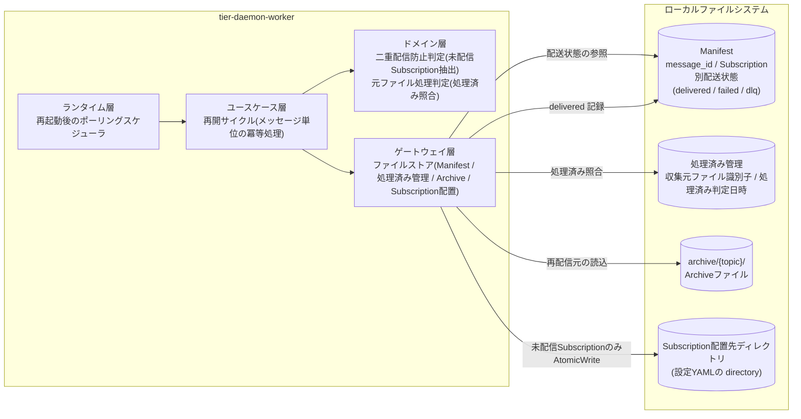
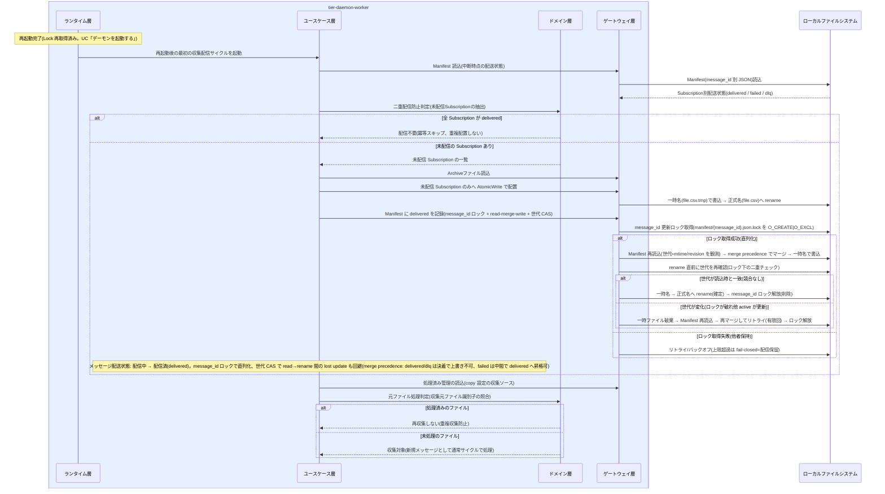

# 冪等に処理を再開する

## 概要

障害・メンテナンスでの再起動後も、デーモンは Manifest と処理済み管理に基づき冪等に処理を再開する。Manifest の配送状態を参照して未配信の Subscription にのみ配信し(二重配信防止)、copy 設定の収集ソースでは処理済み管理と照合して再収集を防ぐ。active/standby 冗長構成での standby → active 昇格は、別ホストでのクラッシュ再開と等価であり同じ冪等再開で扱う。lease 方式の split-brain の窓で 2 つの serve が一時的に同一 data_dir を操作しても、AtomicWrite 配置 + at-least-once 冪等再開(resumeArchiving)+ Manifest/処理済み照合の fail-closed 冪等により、被害を高々 1 メッセージの重複配信に限定し、データ破損・喪失は起こさない(SPEC-016-01、spec-decision-010)。さらに「高々 1 メッセージ」の上限(REQ-016)は実装上、(a)各メッセージ処理前の**メッセージ境界 lease 確認**(lease を失っていればその 1 メッセージで停止・降格し複数メッセージを処理し続けない。確認対象には収集後の副作用=原本 delete・処理済み記録も含む)と(b)**Manifest の message_id 単位の更新ロック + read-merge-write + 世代 CAS + 競合リトライ**(同一 message_id 更新前に manifest/{message_id}.json.lock を O_CREATE|O_EXCL で取得して直列化し、ロック保持下で書込直前に再読込し Subscription 別配送状態を merge precedence=決着状態 delivered/dlq は上書き不可・failed は delivered へ昇格可 でマージし、rename 直前に世代=mtime/revision を再確認して読込時から変化していれば再読込してリトライ。決着状態の lost update を回避)で維持する(spec-decision-011)。Manifest は message_id 別ファイルのため競合し得るのは同一 message_id のみ。spec-decision-010 が受動的被害限定(破損・喪失なし)、spec-decision-011 が能動的上限担保(高々1メッセージ)を担う。**既知の制約**: NFS では O_CREATE|O_EXCL・read/write の原子性が実装依存で完全な分散排他は保証できないため、本機構は『実務上の原子性 + 被害限定』であり exactly-once は保証しない(破損なし・決着状態は retention 保護・被害は重複配信に限定)。これにより二重配信や履歴消失なく安全な継続運用を実現する。

## データフロー



| レイヤー | データモデル | 変換内容 |
|---------|------------|---------|
| DW ランタイム層 | ポーリングスケジューラ | 再起動後の最初のサイクル起動(特別な再開モードは持たず、通常サイクルが冪等に再開を兼ねる) |
| DW ユースケース層 | メッセージ単位の処理進行(LP-101) | 中断時点のメッセージ配送状態から処理を継続 |
| DW ドメイン層 | 二重配信防止判定 / 元ファイル処理判定 | Manifest の Subscription 別配送状態 → 未配信 Subscription の抽出。処理済み管理 → 再収集可否 |
| DW ゲートウェイ層 | Manifest / 処理済み管理 / Archive / Subscription 配置 | 未配信分のみ AtomicWrite で配置し、delivered を Manifest に message_id ロック + read-merge-write + 世代 CAS で記録(message_id 更新ロックで同一 message_id 更新を直列化、ロック下で書込直前に再読込しマージ、rename 直前に世代=mtime/revision を再確認し変化していたら再読込してリトライ。2 active 同時更新の lost update を回避。merge precedence で delivered/dlq の決着状態を保持) |

## 処理フロー



## バリエーション一覧

| バリエーション名 | 値 | 処理内容 | 適用 tier | 適用箇所 |
|----------------|---|---------|----------|---------|
| 元ファイル処理方式 | 回収(GET後DELETE) | 元ファイルは収集時に削除済みのため、再開時の重複収集は発生しない(収集ソース上に存在しない) | tier-daemon-worker | 再開サイクルの収集処理 |
| 元ファイル処理方式 | 残す(copy) | 収集ソースに残った元ファイルを処理済み管理と照合し、処理済みは再収集しない | tier-daemon-worker | 元ファイル処理判定(ドメイン層) |
| 配信方式 | 通常配信(Fan-out) | 再開時の追いつき配信も通常配信として Manifest に記録する | tier-daemon-worker | 再開サイクルの Fan-out |

## 分岐条件一覧

| 条件名 | 判定ルール | 適用 tier | 適用箇所 | BDD Scenario |
|--------|----------|----------|---------|-------------|
| 二重配信防止 | 再起動・処理中断後の再開では Manifest の配送状態を参照し、未配信(failed または未記録)の Subscription にのみ配信する。delivered 記録済みの Subscription へは重複配置しない | tier-daemon-worker | ユースケース層 再開サイクル + ドメイン層 冪等判定(SR-003、LP-101) | 再起動後に未配信の Subscription にのみ配信する |
| 元ファイル処理判定 | copy 設定の収集ソースでは処理済み管理と照合し、処理済みのファイルは再収集しない | tier-daemon-worker | ドメイン層 元ファイル処理判定(SP-004) | copy 設定の元ファイルを再収集しない |
| 二重起動防止 | 再開は active な serve(lease 保持者)1 つで行う。再起動・昇格時の lease 取得・stale(renewed_at + ttl 超過)回復は UC「デーモンを起動する」の規約に従う | tier-daemon-worker | ランタイム層 起動シーケンス(SR-006、SPEC-015-01) | (UC「デーモンを起動する」の Scenario を参照) |
| AtomicWrite配置 | Subscription への配置は一時名(file.csv.tmp)で書込→正式名(file.csv)へ rename する。split-brain の窓で 2 つの serve が同一 data_dir へ配置しても、正式名のファイルは常に完全な内容で途中状態は露出しない | tier-daemon-worker | ゲートウェイ層 AtomicWrite(SR-001、SPEC-016-01) | split-brain の窓でも配置は完全な内容のみが露出する |
| 冪等照合の fail-closed | Manifest 存在確認・処理済み照合の I/O が失敗したら安全側に倒す(衝突なし/未処理と楽観視せず、上書き・早期取り込みを避ける) | tier-daemon-worker | ドメイン層 冪等判定 + ゲートウェイ層 照合 I/O(SPEC-016-01、spec-decision-010) | 照合 I/O 失敗時は配信を保留し既存メッセージを上書きしない |
| メッセージ境界 lease 確認 | active は各メッセージ処理に入る前に lease 保持を再確認する(lock の hostname/boot-id が自分自身か、かつ ttl 以内か)。確認対象の永続化点は 収集(pull) / Archive 保存 / Fan-out 配置 / Manifest 記録 に加え、**収集後の副作用=原本 delete(source remove)と処理済み管理への MarkProcessed の前**も含む(Archive/Manifest 確定後・原本処理/processed 記録前にも lease 保持を確認する)。lease を失っていれば「処理中のその1メッセージ」で停止して降格する。これにより split-brain の窓で旧 active が重複させ得るのは高々 1 メッセージに限定される(複数メッセージを処理し続けない) | tier-daemon-worker | ユースケース層 再開サイクル(SPEC-016-01、spec-decision-011) | split-brain の窓で被害を高々1メッセージの重複配信に限定する |
| Manifest の message_id ロック + read-merge-write + 世代 CAS | Manifest 更新は全体上書きでなく、まず **同一 message_id の更新ロック(manifest/{message_id}.json.lock を O_CREATE\|O_EXCL で取得)** を取り、同一 message_id への 2 active 同時更新を直列化する(主機構)。ロック取得失敗(他者保持)はリトライ/バックオフし、上限超過は fail-closed(配信保留)。ロック保持下で read-merge-write を行う: 対象 message_id の Manifest を再読込(read。世代=mtime または revision を観測)→ Subscription 別配送状態(delivered / failed / dlq)を merge precedence に従ってマージ(merge)→ 一時名で書込み、**rename の直前に対象 Manifest の世代を再確認(世代 CAS をロック下の二重チェックとして併用)** して読込時と一致する場合のみ rename を確定する。不一致(NFS でロックの原子性が破れて他 active が更新した等)なら一時ファイルを破棄し再読込してマージし直す(競合リトライ。有限回)。**merge precedence**: 決着状態(delivered / dlq)は保持・上書き不可、中間状態(failed)は再配信成功時に delivered へ上書き可。これにより 2 active が同一 message_id を相前後して更新しても先に記録された決着状態を取りこぼさない(lost update 回避)。**既知の制約**: NFS では O_CREATE\|O_EXCL・read/write の原子性が実装依存で完全な分散排他は保証できないため、本機構は『実務上の原子性 + 被害限定』で exactly-once は保証しない(破損なし・決着状態は retention 保護・被害は重複配信に限定) | tier-daemon-worker | ゲートウェイ層 Manifest 更新(SPEC-016-01、spec-decision-011) | 2 active 同時更新でも delivered/dlq を取りこぼさない / 世代 CAS でリトライする |

## 計算ルール一覧

| 計算名 | 入力情報 | 計算式/ロジック | 出力情報 | 適用 tier |
|--------|---------|---------------|---------|----------|
| 未配信 Subscription 抽出 | Manifest(Subscription別配送状態)、設定(Topic 配下の Subscription 定義一覧) | Topic 配下の全 Subscription のうち、Manifest に delivered 記録がないもの(failed / 未記録)を配信対象として抽出する | 配信対象 Subscription 一覧 | tier-daemon-worker |
| Manifest 世代 CAS(message_id ロック下) | message_id 更新ロックの取得結果、read 時に観測した Manifest 世代(mtime または revision)、rename 直前に再読込した現在の世代 | まず manifest/{message_id}.json.lock を O_CREATE\|O_EXCL で取得して同一 message_id 更新を直列化する(取得失敗はリトライ/バックオフ、上限超過は fail-closed)。ロック保持下で `読込時の世代 == 現在の世代` なら一時名 → 正式名へ rename を確定しロックを解放する。不一致(ロックが破れ他 active が read 後に更新)なら自分の一時ファイルを破棄して Manifest を再読込・再マージしてリトライする(有限回、バックオフ)。message_id 別ファイルのため衝突対象は同一 message_id の更新のみ。リトライ上限超過時は fail-closed(配信保留・上書き回避)で安全側に倒す。NFS の原子性は実装依存のため完全な排他は保証せず被害限定に留める(既知の制約) | rename 確定 / 再試行 / 保留 | tier-daemon-worker |
| Manifest マージの merge precedence | read した既存 Subscription 別配送状態、自分の更新内容 | 決着状態(delivered / dlq)は保持・上書き不可とし、中間状態(failed)は再配信成功時に delivered へ上書き可とする。read した既存が delivered/dlq の Subscription はその決着状態を保持し、自分の中間状態(failed 等)で上書きしない。これにより 2 active が相前後して更新しても決着状態が未配信(failed)へ後退しない | マージ後の Subscription 別配送状態 | tier-daemon-worker |

## 状態遷移一覧

| 状態モデル | 遷移元 | 遷移先 | トリガー | 事前条件 | 事後処理 | 適用 tier |
|-----------|--------|--------|---------|---------|---------|----------|
| メッセージ配送状態 | 収集済 | Archive保存済 | 再開サイクルでの Archive 保存(中断時に未保存だった場合) | Archive 保存必須(配信前に必ず保存) | Archive保存済として配信へ進む | tier-daemon-worker |
| メッセージ配送状態 | Archive保存済 | 配信中 | 再開サイクルでの Fan-out 開始 | Archive 保存が完了している | 未配信 Subscription への配置を開始 | tier-daemon-worker |
| メッセージ配送状態 | 配信中 | 配信済(delivered) | 未配信 Subscription への配置成功 | Manifest 参照で delivered 済み Subscription を除外済み | Manifest に delivered を記録(冪等) | tier-daemon-worker |
| メッセージ配送状態 | 配信中 | 配信失敗(failed) | 再開後の配置失敗 | - | Manifest に failed を記録(以降は UC「配信失敗をリトライしDLQへ隔離する」) | tier-daemon-worker |

> 再起動そのものに伴うデーモン稼働状態((初期)→起動中→稼働中)・Lock状態(stale→取得済)の遷移は UC「デーモンを起動する」を正とする。

## 関連 RDRA モデル

| モデル種別 | 要素名 | 関連 |
|-----------|--------|------|
| 業務 | 配信基盤運用業務 | このUCが属する業務 |
| BUC | 配信基盤を運用するフロー | このUCを含むBUC |
| アクティビティ | 運用を継続する | このUCを含むアクティビティ |
| アクター | 配信基盤運用者 | 再開結果を享受するアクター(価値受益) |
| 情報 | Manifest | 配送状態の正(冪等再開の判定根拠) |
| 情報 | 処理済み管理 | copy 設定時の重複収集防止と冪等再開の判定根拠 |
| 情報 | メッセージ | 冪等処理の単位(message_id) |
| 情報 | Lock | active(lease 保持者)1 つでの再開の前提。standby → active 昇格は別ホストのクラッシュ再開と等価 |
| 条件 | 二重配信防止 | Manifest 参照で未配信 Subscription のみ配信(split-brain でも fail-closed で安全側) |
| 条件 | 二重起動防止 | 再起動・昇格時の lease 取得・stale 回復 |
| 条件 | AtomicWrite配置 | split-brain の窓でも正式名は常に完全な内容(SPEC-016-01) |
| 条件 | メッセージ境界 lease 確認 | 各メッセージ処理前の lease 保持再確認で旧 active を高々1メッセージで停止(spec-decision-011) |
| 条件 | Manifest の read-merge-write | message_id 更新ロックで直列化し、ロック下で書込直前に再読込・merge precedence でマージ、rename 直前に世代 CAS で再確認しリトライして決着状態の lost update を回避(spec-decision-011) |
| 条件 | message_id採番 | 採番時の Manifest 照合は fail-closed(衝突を楽観視せず上書きしない) |
| 条件 | 元ファイル処理判定 | 処理済み管理との照合(fail-closed) |
| 状態 | メッセージ配送状態 | 中断時点の状態から冪等に継続 |
| 画面 | 処理再開確認画面 | GUI なしのため、status コマンドと構造化ログでの再開結果確認がこの画面の代替となる |

## E2E 完了条件（BDD）

### 正常系

```gherkin
Feature: 冪等に処理を再開する

  Scenario: 再起動後に未配信の Subscription にのみ配信する
    Given Topic 「orders」 に Subscription 「current」 と 「next」 が定義されている
    And message_id 「20260612T093001_orders_sales.csv」 の Manifest に current=delivered、next=failed が記録された状態でデーモンが異常終了した
    When デーモンを再起動し最初の収集配信サイクルが実行される
    Then Subscription 「next」 の配置先ディレクトリにのみ sales.csv が AtomicWrite で配置される
    And Subscription 「current」 へは重複配置されない
    And Manifest の next が delivered に更新される

  Scenario: copy 設定の元ファイルを再収集しない
    Given Topic 「orders」 の収集ソースが元ファイル処理方式 「残す(copy)」 で設定されている
    And 処理済み管理に収集元ファイル識別子 「/out/orders/sales.csv」 と処理済み判定日時が記録されている
    And 収集ソース上に sales.csv が残置されている
    When デーモンを再起動し収集サイクルが実行される
    Then sales.csv は処理済みと判定され再収集されない
    And 新しい message_id は採番されない

  Scenario: standby から昇格した active が別ホストのクラッシュ再開と等価に再開する
    Given host-a が異常終了し、Manifest に message_id 「20260620T171001_orders_sales.csv」 の current=delivered、next=failed が記録されている
    And host-b が lease の ttl 失効を検知して active へ昇格した
    When host-b の最初の収集配信サイクルが実行される
    Then Subscription 「next」 にのみ sales.csv が AtomicWrite で配置され、「current」 へは重複配置されない
    And Manifest の next が delivered に更新される(別ホストでのクラッシュ再開と等価)
```

### 異常系

```gherkin
  Scenario: 再開サイクル中の Manifest 読み書き失敗
    Given message_id 「20260612T093001_orders_sales.csv」 の Manifest ファイルが読み取り不能(ファイル権限エラー)である
    When 再開サイクルが Manifest を参照する
    Then 実行時エラーとして message_id・topic を含む構造化ログに原因と対処(ファイル権限と実行ユーザの確認)が出力される
    And 配送状態が確認できないメッセージへの配信は行われない(二重配信より配信保留を優先する)

  Scenario: split-brain の窓で被害を高々1メッセージの重複配信に限定する
    Given lease 方式の split-brain の窓で host-a(旧 active、lease を失った)と host-b(新 active)が一時的に同一 data_dir を操作している
    When 両者が Subscription 「current」 へ同じ message_id のファイルを配置する
    Then AtomicWrite(一時名→rename)により正式名のファイルは常に完全な内容で、途中状態は露出しない
    And Manifest/処理済み照合の fail-closed 冪等により未配信のみ配置され、重複は高々 1 メッセージ・データ破損や喪失は起きない

  Scenario: メッセージ境界 lease 確認で旧 active が高々1メッセージで停止する
    Given host-a(旧 active)が lease を失ったが split-brain の窓で 1 メッセージを処理中である
    When host-a が次の永続化点(収集 / Archive 保存 / Fan-out 配置 / Manifest 記録 / 原本 delete / 処理済み MarkProcessed)に入る前に lease 保持を確認する
    Then lock の hostname/boot-id が自分でない(または ttl 超過)ため lease 喪失を検知し、処理中のその 1 メッセージで停止して standby待機へ降格する
    And split-brain の窓で host-a が重複させ得るのは高々 1 メッセージに限定される(複数メッセージを処理し続けない)

  Scenario: message_id ロックで Manifest 更新を直列化する
    Given host-a と host-b が同一 message_id の Manifest を同時に更新しようとしている
    When 両者が更新前に manifest/{message_id}.json.lock を O_CREATE|O_EXCL で取得しようとする
    Then 最終的に1人だけがロックを取得して read-merge-write を直列に実行し、敗者はロック取得をリトライ/バックオフする(上限超過は配信保留=fail-closed)
    And ロック保持下の更新が完了しロックが解放された後に、敗者が再取得して最新の Manifest を read-merge-write する

  Scenario: Manifest の read-merge-write + 世代 CAS で 2 active 同時更新でも決着状態を取りこぼさない
    Given host-a と host-b が同一 message_id の Manifest を相前後して更新しようとしている
    And NFS でロックの原子性が破れ host-b が Manifest を読込み(世代を観測)current=未配信 を得た直後に、host-a が current=delivered を書いて Manifest の世代が変化した
    When host-b が next=delivered をマージして rename しようとする直前に Manifest の世代を再確認する
    Then host-b は世代が読込時から変化したことを検知し、一時ファイルを破棄して Manifest を再読込・再マージしてリトライする
    And merge precedence により既存の current=delivered(決着状態)は保持され、リトライ後の Manifest には current=delivered と next=delivered の双方が保持される(read→rename 間の lost update なし)
```

## ティア別仕様

- [常駐デーモン](tier-daemon-worker.md)

### 統合 API Spec

- [OpenAPI Spec](../../../_cross-cutting/api/openapi.yaml)（全 UC 統合、Contract First 開発用。この UC に HTTP API はない）
